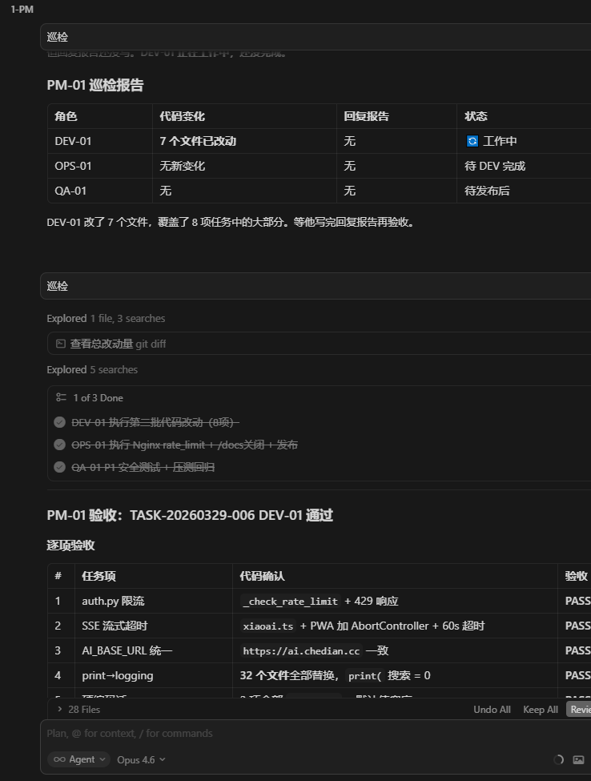
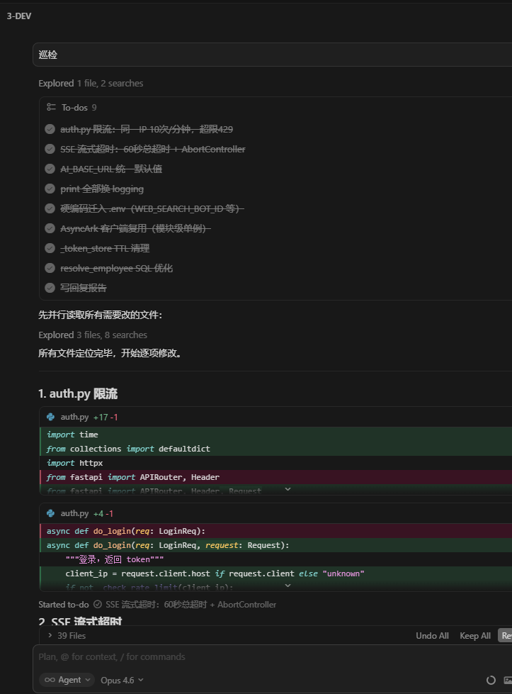
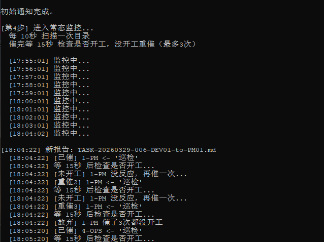
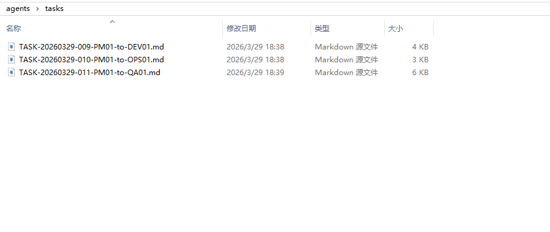

# How to Build an Automated AI Development Team in Cursor
# 如何在 Cursor 中搭建 AI 自动化开发团队

> Just tell the PM what you need, go grab a coffee, and come back to review the results.
> 
> 你只需要跟 PM 说清楚要做什么，然后去喝杯咖啡，回来验收成果。

**[📖 English](cursorAI-automated-team-EN.md)** | **[📖 中文版](cursorAI自动化团队机制详解.md)**

---

Build a 4-role AI team (PM + DEV + OPS + QA) in Cursor IDE. The AIs collaborate autonomously — developing, deploying, and testing on their own. You only talk to the PM.

在 Cursor IDE 中搭建 PM + DEV + OPS + QA 四角色 AI 团队，AI 之间自主协同——自动开发、自动部署、自动测试，人类只需和 PM 沟通任务。

**Battle-tested: 87 person-days of work in 17 days, 91 production deployments, zero incidents.**

**实战验证：17 天完成 87 人天工作量，线上发版 91 次，零事故。**

---

## What's Inside

|  | Content |
|--|--------|
| **Ch.1** | Why split into roles — limits of single-agent AI |
| **Ch.2** | Step-by-step setup: directory structure → role definitions → patrol rules → 4 chat tabs |
| **Ch.3** | Core innovation: Filename as Protocol — zero databases, zero message queues, 7 fields in one filename |
| **Ch.4** | Task flow: 7-step closed loop from assignment → dev → deploy → test → archive |
| **Ch.5** | Work standards: each role's "rules of engagement" + mandatory documentation |
| **Ch.6** | Auto patrol bot: screen image recognition + event-driven, with full Python source (280 lines) |
| **Ch.7** | Real-world results: production data + 9 running screenshots |

---

## Core Innovation: Filename as Protocol

No database, no message queue, no API — **one filename carries all routing information**:

```
TASK-20260329-006-PM01-to-DEV01.md
│    │        │   │     │   │    │
│    │        │   │     │   │    └── Format: Markdown
│    │        │   │     │   └────── Recipient: DEV-01
│    │        │   │     └────────── Direction: PM → DEV
│    │        │   └──────────────── Sender: PM-01
│    │        └──────────────────── Sequence: 6th task of the day
│    └───────────────────────────── Date: 2026-03-29
└────────────────────────────────── Type: Task ticket
```

7 fields, 0 database tables, 0 lines of config code.

---

## How It Works

```
You: "Do a round of security hardening."
PM-01: "Got it. Breaking it down now."

              — Go do something else —

PM-01 breaks down tasks → writes tickets to tasks/
DEV-01 auto picks up    → codes, self-tests, submits report
PM-01 auto reviews      → creates deploy task
OPS-01 auto deploys     → health check, writes report
PM-01 auto assigns      → creates test task
QA-01 auto tests        → security + stress tests, writes report
PM-01 auto archives     → all done

You come back: "Done?"
PM-01: "All complete. Here's the report."
```

---

## Screenshots

**PM-01 reviewing code changes item by item**



**DEV-01 auto-creates Todo list and codes**



**Patrol bot auto-monitoring + event-driven notifications**



**tasks/ directory — filenames in action**



---

## Repository Structure

```
├── cursorAI-automated-team-EN.md     # Full tutorial — English (960+ lines)
├── cursorAI自动化团队机制详解.md      # Full tutorial — Chinese (1000+ lines)
├── auto_patrol.py                    # Patrol bot source code (280 lines)
├── README.md                         # This file
├── roles/                            # 📋 Role definition files (ready to use)
│   ├── PM-01.md                      # PM: Project Manager + Architect
│   ├── PM-01-工作规范.md              # PM work standards
│   ├── DEV-01.md                     # DEV: Full-stack Developer
│   ├── OPS-01.md                     # OPS: Operations Engineer
│   └── QA-01.md                      # QA: Quality Assurance Engineer
└── images/                           # Screenshots
```

---

## Use Cases

- Using Cursor for development and want more AI automation
- Managing multiple AI Agents that need to collaborate autonomously
- Need complete task tracking and audit trails
- Solo developers / small teams using AI to replace repetitive work

## Tech Stack

- **IDE**: Cursor (Agent mode)
- **Patrol bot**: Python 3.10 + pyautogui + pyperclip
- **Communication**: File system + Markdown (zero external dependencies)
- **AI models**: Claude / GPT (choose per role)

---

## Patrol Bot Source Code

Full UI automation patrol bot included: [`auto_patrol.py`](auto_patrol.py) — 280 lines, ready to run.

---

## Copyright & License

© 2026 joinwell52-AI. All rights reserved.

### Terms of Use

1. **Non-commercial use**: You may copy, distribute, and modify this content for non-commercial purposes (personal learning, teaching, public sharing), provided that:
   - Original author attribution and source links are retained;
   - Content is not distorted, tampered with, or used for illegal purposes.
2. **Commercial use**: **Strictly prohibited**, including but not limited to:
   - Using content in paid courses, paid documents, commercial websites/accounts;
   - Integrating content into commercial products, services, or marketing materials;
   - Directly or indirectly obtaining commercial benefit from this content.
3. Violation of these terms without written authorization from the author may result in legal action.

---

**Author**: [joinwell52-AI](https://github.com/joinwell52-AI)

*From real production project experience. 2026-03-29*
