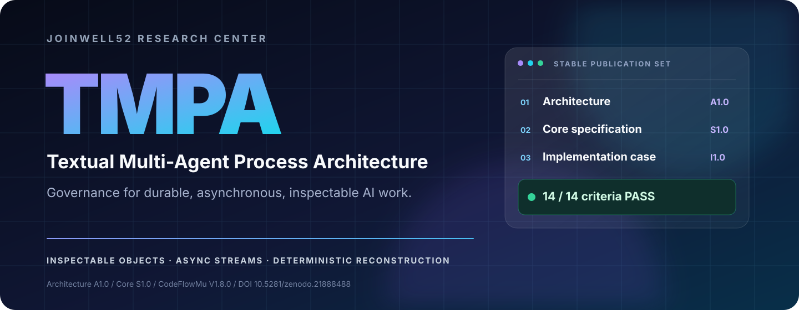

<p align="center">
  
</p>

<p align="center">
  <strong>AI agents can produce results. Production systems must prove who was responsible, what was accepted, and why.</strong>
</p>

<p align="center">
  <a href="https://joinwell52-ai.github.io/CodeFlowMu-open/"><strong>Explore CodeFlowMu Open</strong></a>
  ·
  <a href="https://joinwell52-ai.github.io/FCoP/"><strong>Explore FCoP</strong></a>
  ·
  <a href="https://joinwell52-ai.github.io/joinwell52/"><strong>Explore the research site</strong></a>
  ·
  <a href="./README.zh-CN.md"><strong>简体中文</strong></a>
</p>

<p align="center">
  <a href="https://github.com/joinwell52-AI/joinwell52/stargazers"></a>
  <a href="https://doi.org/10.5281/zenodo.21888488"></a>
  <a href="https://joinwell52-ai.github.io/joinwell52/en/publications/tmpa-core-specification-s1.0"></a>
  <a href="https://joinwell52-ai.github.io/joinwell52/en/publications/implementation-case-i1.0"></a>
</p>

---

# TMPA

**TMPA (Textual Multi-Agent Process Architecture)** is a vendor-neutral governance architecture for long-running work performed by AI agents and humans. It moves durable work facts out of volatile model memory, preserves responsibility across asynchronous execution, and reconstructs lifecycle, authority, conflict, and audit state from inspectable evidence.

This repository is TMPA's public research, specification, executable conformance, and evidence base. [**CodeFlowMu Open**](https://github.com/joinwell52-AI/CodeFlowMu-open) ([site](https://joinwell52-ai.github.io/CodeFlowMu-open/)) is the installable MIT-licensed product: a local four-role development team—**PM / DEV / OPS / QA**—with EVAL observing independently. Its current public release connects to agents through **Cursor SDK only**. [**FCoP**](https://github.com/joinwell52-AI/FCoP) ([site](https://joinwell52-ai.github.io/FCoP/)) is the MIT-licensed file-based behavior-governance protocol used by that team.

> If you are building agents that must survive restarts, handoffs, disputes, review, and real organizational accountability, this repository is for you. **Star it to follow stable specifications, executable examples, and evidence-backed releases.**

## Start here

| I want to… | Best entry point |
|---|---|
| Install the real open-source product | [GitHub](https://github.com/joinwell52-AI/CodeFlowMu-open) · [Product site](https://joinwell52-ai.github.io/CodeFlowMu-open/) — four-role development team, currently Cursor-only |
| Add file-based coordination to agents | [GitHub](https://github.com/joinwell52-AI/FCoP) · [Protocol site](https://joinwell52-ai.github.io/FCoP/) — Python package, MCP server, and protocol |
| Understand the idea in five minutes | [Why TMPA exists](#trace-is-not-governance) |
| Browse the complete project visually | [Open Digital Employee Works →](https://joinwell52-ai.github.io/joinwell52/) |
| Read the stable theory and specification | [Architecture A1.0](https://joinwell52-ai.github.io/joinwell52/en/publications/tmpa-architecture-paper-a1.0) · [Core S1.0](https://joinwell52-ai.github.io/joinwell52/en/publications/tmpa-core-specification-s1.0) |
| Run something now | [Execute the S1.0 Reference Reader](#run-the-reference-reader) |
| Inspect the engineering claim | [Implementation Case I1.0](https://joinwell52-ai.github.io/joinwell52/en/publications/implementation-case-i1.0) · [Evidence package](./docs/public/evidence/tmpa/i1.0/) |
| Cite the work | [Zenodo DOI](https://doi.org/10.5281/zenodo.21888488) · [`CITATION.cff`](./CITATION.cff) |

## Three public repositories, one system

| Repository | Primary job | GitHub | Website |
|---|---|---|---|
| **TMPA / joinwell52** | Theory, specification, conformance, research, and evidence | [Source & Star](https://github.com/joinwell52-AI/joinwell52) | [Digital Employee Works](https://joinwell52-ai.github.io/joinwell52/) |
| **FCoP** | File-based behavior-governance protocol, Python package, and MCP server | [Source & Star](https://github.com/joinwell52-AI/FCoP) | [FCoP site](https://joinwell52-ai.github.io/FCoP/) |
| **CodeFlowMu Open** | Installable four-role development team product | [Source & Star](https://github.com/joinwell52-AI/CodeFlowMu-open) | [Product site](https://joinwell52-ai.github.io/CodeFlowMu-open/) |

Each repository has one clear reason to be discovered and starred: **TMPA explains and specifies; FCoP makes coordination reusable; CodeFlowMu Open turns both into a product people can install.** Product use produces field evidence, protocol improvements, and new questions for the specification.

## Install the open-source product

[CodeFlowMu Open](https://github.com/joinwell52-AI/CodeFlowMu-open) is not a mockup or a documentation demo. It is an installable local application with a [dedicated product site](https://joinwell52-ai.github.io/CodeFlowMu-open/), PC Panel, Mobile PWA, project isolation, approval gates, FCoP work artifacts, and the fixed execution team `PM / DEV / OPS / QA`. `EVAL` observes delivery quality and risk independently.

> **Current provider boundary:** the public product uses **Cursor SDK / Cursor API Key only**. Other agent providers are not included or claimed by the current open release.

```bat
cd /d D:\
git clone https://github.com/joinwell52-AI/CodeFlowMu-open.git
cd CodeFlowMu-open
START-CODEFLOWMU-OPEN.bat
```

<p align="center">
  <a href="https://github.com/joinwell52-AI/CodeFlowMu-open#real-product-screens">
    
  </a>
</p>

<p align="center"><sub>Real product capture · open the product repository for installation and the complete PC/PWA walkthrough.</sub></p>

## Trace is not governance

Agent traces tell you what ran. Production governance must answer a harder set of questions.

| Execution trace | Governance state |
|---|---|
| A tool returned success | Was the result independently accepted? |
| A model said “done” | Is there sufficient completion evidence? |
| A workflow reached its final node | Was the lifecycle transition legal? |
| A log contains an actor name | Did that actor have authority? |
| Events have timestamps | Can conflict and concurrency be reconstructed without inventing a false order? |

TMPA treats work as durable governance objects rather than facts trapped inside a chat, process, or model session.

## The architecture in one view

```text
Architecture Paper A1.0       theory and design direction
            ↓
Core Specification S1.0      normative objects, lifecycle, Reader, C01–C14
            ↓
FCoP                         file-based coordination and evidence profile
            ↓
CodeFlowMu V1.8.0            product Adapter and Governance Reader
            ↓
Implementation Case I1.0     bounded, inspectable engineering evidence
            ↓
Digital Employee apps        governed work in real production contexts
```

The direction matters. The architecture explains the theory; Core defines normative behavior; [FCoP](https://github.com/joinwell52-AI/FCoP) supplies a protocol profile; [CodeFlowMu Open](https://github.com/joinwell52-AI/CodeFlowMu-open) is the public installable product line; the case report states only what the exact-version evidence demonstrates.

### Four connected rules

1. **Text carries durable messages and state.** Work facts remain portable and inspectable outside any model session.
2. **Each writer owns a local serial stream.** One actor cannot silently rewrite another actor's history.
3. **Multiple streams advance asynchronously.** Collaboration preserves partial order and real concurrency.
4. **The Reader reconstructs governance state.** Available evidence becomes lifecycle, responsibility, conflicts, judgments, and an explicit Issue Set.

TMPA Core is storage-neutral. Files, database rows, object-store items, or events may carry the same governance semantics.

## Run the Reference Reader

The repository includes the complete TMPA Core S1.0 machine schemas, fixtures, profiles, author-produced Reference Reader, and C01–C14 runner.

Requirements: **Node.js 20+**.

```bash
git clone https://github.com/joinwell52-AI/joinwell52.git
cd joinwell52
npm ci
npm run demo
npm run tmpa:s1.0:conformance
```

`npm run demo` shows one delivery rejected because the developer reviews its own `done` claim, then accepted after independent QA evidence is added. This is a small TMPA specification demo; the actual installable product is [CodeFlowMu Open](https://github.com/joinwell52-AI/CodeFlowMu-open).

Expected reference result:

```text
PASS 14  ·  PARTIAL 0  ·  NOT RUN 0  ·  FAIL 0
```

This proves the frozen reference paths behave as tested. It is separate from the registered CodeFlowMu product run and is not independent certification. Read the [conformance notes](./research/conformance/tmpa-core-s1.0/README.md) before interpreting the result.

## Stable V1.0 publication set

| Publication | What it answers | Read online | Artifact |
|---|---|---|---|
| **Architecture Paper A1.0** | Why agent work needs a governance-state architecture | [Web](https://joinwell52-ai.github.io/joinwell52/en/publications/tmpa-architecture-paper-a1.0) | [PDF](./docs/public/releases/tmpa/v1.0/artifacts/tmpa-architecture-paper-a1.0-en.pdf) |
| **Core Specification S1.0** | What objects, authority, lifecycle, Reader behavior, and conformance require | [Web](https://joinwell52-ai.github.io/joinwell52/en/publications/tmpa-core-specification-s1.0) | [PDF](./docs/public/releases/tmpa/v1.0/artifacts/tmpa-core-specification-s1.0-en.pdf) |
| **Implementation Case I1.0** | What CodeFlowMu V1.8.0 demonstrated against the exact S1.0 bundle | [Web](https://joinwell52-ai.github.io/joinwell52/en/publications/implementation-case-i1.0) | [PDF](./docs/public/releases/tmpa/v1.0/artifacts/tmpa-implementation-case-i1.0-en.pdf) |

The complete checksummed bilingual dossier, citation metadata, manifest, and release notes live in [`docs/public/releases/tmpa/v1.0/`](./docs/public/releases/tmpa/v1.0/). Permanent archive: [Zenodo 21888488](https://zenodo.org/records/21888488).

## Engineering evidence snapshot

I1.0 evaluates the actual CodeFlowMu V1.8.0 product path—`GovernanceReader.readSync`—against the frozen TMPA Core S1.0 bundle.

| Evidence item | Recorded result |
|---|---:|
| S1.0 criteria | **14 PASS / 0 PARTIAL / 0 NOT RUN / 0 FAIL** |
| Mandatory assertions | **71 / 71 passed and recomputed** |
| CodeFlowMu TMPA Runtime suite | **24 passed / 0 failed** |
| CodeFlowMu Runtime full suite | **1,522 passed / 0 failed / 1 skipped** |
| CodeFlowMu Shell coverage | **791 passed / 0 failed** |
| Locked FCoP reference implementation | **1,210 passed / 2 skipped** |
| Evidence integrity | **889 files covered by the internal SHA-256 manifest** |

Inspect the [exact-version registration](./research/conformance/tmpa-core-s1.0/external-runs/20260811-codeflowmu-v1.8.0/) or download the [locked evidence archive](./docs/public/evidence/tmpa/i1.0/tmpa-i1.0-codeflowmu-v1.8.0-s1.0-evidence-20260811.zip) and its [SHA-256](./docs/public/evidence/tmpa/i1.0/tmpa-i1.0-codeflowmu-v1.8.0-s1.0-evidence-20260811.zip.sha256).

> **Claim boundary:** this is author-run evidence for one exact implementation revision and one exact input bundle. It is not independent certification, universal conformance, proof of semantic truth, or proof that hallucinations have been eliminated.

## Public access and open-source status

Transparency matters more than an attractive label:

| Component | Available in this repository? | Current status |
|---|---:|---|
| TMPA papers, specifications, diagrams, and research | Yes | Publicly readable and citable |
| S1.0 schemas, fixtures, runner, and Reference Reader | Yes | Source-visible and executable |
| CodeFlowMu conformance evidence | Yes | Frozen evidence and exact-version registration |
| [FCoP GitHub](https://github.com/joinwell52-AI/FCoP) · [Site](https://joinwell52-ai.github.io/FCoP/) | Separate repository | MIT-licensed protocol, Python package, and MCP server |
| [CodeFlowMu Open GitHub](https://github.com/joinwell52-AI/CodeFlowMu-open) · [Site](https://joinwell52-ai.github.io/CodeFlowMu-open/) | Separate repository | MIT-licensed installable product; four-role team; Cursor-only today |

The TMPA research content in this repository uses the terms in [`LICENSE.md`](./LICENSE.md). The two software repositories above carry their own MIT licenses. Their licenses and product boundaries are intentionally separate from the TMPA publication license.

## Research and production system

Beyond the stable TMPA line, this repository contains a governed research production environment: source intelligence, Daily/Weekly/Academic/Program runtimes, research skills, publication gates, validators, and the VitePress site.

Featured reading:

- [From SaaS to SaaW: When a Codebase Starts “Developing Itself”](https://joinwell52-ai.github.io/joinwell52/en/industry/2026-08-10-saaw-software-as-an-agent-worker)
- [One Agent Said “Done.” Why Didn't the Team Release It?](https://joinwell52-ai.github.io/joinwell52/en/engineering/2026-08-06-codeflowmu-multi-agent-fact-checking)
- [Digital Employee Architecture V0.2](https://joinwell52-ai.github.io/joinwell52/en/digital-employee/architecture)

These outputs may interpret TMPA or inform future work, but they do not override Core S1.0.

## Repository map

```text
.
├── docs/
│   ├── en/ and zh/                  bilingual research site
│   └── public/
│       ├── spec/tmpa/s1.0/          machine-readable contracts
│       ├── releases/tmpa/v1.0/      checksummed publication dossier
│       └── evidence/tmpa/i1.0/      locked CodeFlowMu evidence
├── research/
│   ├── conformance/tmpa-core-s1.0/  Reference Reader, fixtures, results
│   ├── runtime/                      governed execution records
│   ├── intelligence/                 source registry and research signals
│   └── skills/                       staged research work contracts
├── scripts/                          validation, projection, and site tooling
└── .github/workflows/                validation, scheduling, Pages deployment
```

## Contribute, cite, and follow

- Research and contribution policy: [`CONTRIBUTING.md`](./CONTRIBUTING.md) · [`RESEARCH-GOVERNANCE.md`](./RESEARCH-GOVERNANCE.md)
- Citation metadata: [`CITATION.cff`](./CITATION.cff) · [V1.0 metadata](./docs/public/releases/tmpa/v1.0/metadata/)
- Rights and permitted use: [`LICENSE.md`](./LICENSE.md)
- Questions and proposals: [open an issue](https://github.com/joinwell52-AI/joinwell52/issues)

If this work helps you reason about accountable AI work, [**give the repository a Star**](https://github.com/joinwell52-AI/joinwell52) and share the specific artifact you found useful.

---

<p align="center">
  <strong>Zhu Wei / 朱卫 · joinwell52-AI</strong><br>
  Independent Researcher<br><br>
  <a href="https://joinwell52-ai.github.io/joinwell52/">Digital Employee Works</a>
  ·
  <a href="https://doi.org/10.5281/zenodo.21888488">Zenodo DOI</a>
  ·
  <a href="./README.zh-CN.md">中文 README</a>
</p>
