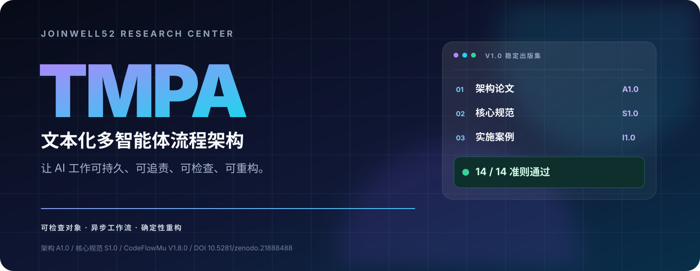
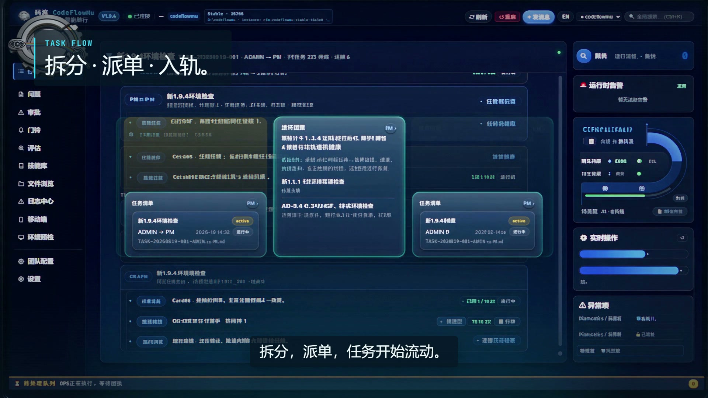

<p align="center">
  
</p>

<p align="center">
  <strong>AI Agent 能产出结果；生产系统还必须证明：谁负责、什么被接受、为什么可以放行。</strong>
</p>

<p align="center">
  <a href="https://github.com/joinwell52-AI/CodeflowMu-Distribution"><strong>CodeFlowMu 应用</strong></a>
  ·
  <a href="https://github.com/joinwell52-AI/CodeflowMu-Distribution/releases"><strong>下载 Windows 预览版</strong></a>
  ·
  <a href="https://joinwell52-ai.github.io/FCoP/"><strong>了解 FCoP</strong></a>
  ·
  <a href="https://joinwell52-ai.github.io/joinwell52/zh/"><strong>进入研究主页</strong></a>
  ·
  <a href="./README.md"><strong>English</strong></a>
</p>

<p align="center">
  <a href="https://github.com/joinwell52-AI/joinwell52/stargazers"></a>
  <a href="https://github.com/joinwell52-AI/joinwell52/releases/tag/tmpa-v1.0"></a>
  <a href="https://doi.org/10.5281/zenodo.21888488"></a>
  <a href="https://doi.org/10.17605/OSF.IO/2JVQD"></a>
  <a href="https://doi.org/10.5281/zenodo.20457285"></a>
  <a href="https://doi.org/10.17605/OSF.IO/92NWM"></a>
  <a href="./CITATION.cff"></a>
  <a href="https://joinwell52-ai.github.io/joinwell52/zh/publications/tmpa-core-specification-s1.0"></a>
  <a href="https://joinwell52-ai.github.io/joinwell52/zh/publications/implementation-case-i1.0"></a>
</p>

## 使用 CodeFlowMu

CodeFlowMu 是本地运行的 PM / DEV / QA / OPS 多角色 AI 开发团队，提供 PC 控制中心与手机 PWA 远程操作入口。**Windows x64 免费预览版现已公开下载。**

**[进入 CodeFlowMu 发版仓库](https://github.com/joinwell52-AI/CodeflowMu-Distribution) · [下载 Windows 版](https://github.com/joinwell52-AI/CodeflowMu-Distribution/releases) · [安装指南](https://github.com/joinwell52-AI/CodeflowMu-Distribution/blob/main/CUSTOMER-INSTALL.md)**

在 Releases 中选择公开发布的版本，下载该版本的 Windows 安装包及 `SHA256SUMS.txt`，按安装指南完成校验与安装。当前提供专有软件预览版；具体要求、已知问题与支持状态以所选 Release 为准。

本仓库继续维护 TMPA 研究、规范与工程证据。CodeFlowMu 的应用、安装与更新统一进入发版仓库；旧版 CodeFlowMu Open 仅保留为历史研究记录。

## 开放科学标准引用凭证

| 成果 | Zenodo DOI | OSF DOI |
|---|---|---|
| **TMPA** | [10.5281/zenodo.21888488](https://doi.org/10.5281/zenodo.21888488) | [10.17605/OSF.IO/2JVQD](https://doi.org/10.17605/OSF.IO/2JVQD) |
| **FCoP** | [10.5281/zenodo.20457285](https://doi.org/10.5281/zenodo.20457285) | [10.17605/OSF.IO/92NWM](https://doi.org/10.17605/OSF.IO/92NWM) |

Zenodo DOI 对应可引用的正式版本档案；OSF Registration 对应不可变、带时间戳的开放科学快照。

## CodeFlowMu 产品介绍

<p align="center">
  <a href="https://joinwell52-ai.github.io/joinwell52/assets/video/codeflowmu-product-intro-zh.mp4">
    
  </a>
</p>

<p align="center">
  <a href="https://joinwell52-ai.github.io/joinwell52/assets/video/codeflowmu-product-teaser-zh.mp4">
    
  </a>
  <a href="https://joinwell52-ai.github.io/joinwell52/assets/video/codeflowmu-product-intro-zh.mp4">
    
  </a>
  <br>
  <sub>真实 PC 与手机录屏 · 中文旁白 · 多 AI 自动协作 · 最终人类审批</sub>
</p>

---

# TMPA

**TMPA（Textual Multi-Agent Process Architecture，文本化多智能体流程架构）**是一套厂商中立的治理架构，用于管理由 AI Agent 与人类共同承担的长周期工作。它把持久工作事实从模型的易失性记忆中剥离出来，在异步执行中保留责任边界，并依据可检查证据重构生命周期、权限、冲突与审计状态。

本仓库是 TMPA 的公开研究、规范、可执行符合性测试与证据基座。[**CodeFlowMu Open**](https://github.com/joinwell52-AI/CodeFlowMu-open)（[历史主页](https://joinwell52-ai.github.io/CodeFlowMu-open/)）是**已冻结的历史开源版本**，于 **2026-08-22** 冻结在 **V1.2.29-open**，用于工程历史、可复现性与研究引用。它不是当前 CodeFlowMu 产品的分发路径。[**FCoP**](https://github.com/joinwell52-AI/FCoP)（[协议主页](https://joinwell52-ai.github.io/FCoP/)）是这一工程谱系中的 MIT 开源文件式行为治理协议。

> 如果你正在构建必须经受重启、交接、争议、复核与真实组织问责的 Agent 系统，这个仓库就是为你准备的。**Star 本仓库，即可持续关注稳定规范、可执行示例与证据化发布。**

## 从这里开始

| 你想做什么 | 最合适的入口 |
|---|---|
| 下载并使用 CodeFlowMu | [应用与文档](https://github.com/joinwell52-AI/CodeflowMu-Distribution) · [Windows 下载](https://github.com/joinwell52-AI/CodeflowMu-Distribution/releases) |
| 查看历史开源实现 | [GitHub](https://github.com/joinwell52-AI/CodeFlowMu-open) · [历史主页](https://joinwell52-ai.github.io/CodeFlowMu-open/)——冻结在 V1.2.29-open；不是当前产品分发路径 |
| 为 Agent 加入文件式协作 | [GitHub](https://github.com/joinwell52-AI/FCoP) · [协议主页](https://joinwell52-ai.github.io/FCoP/)——Python 包、MCP Server 与协议 |
| 五分钟理解核心问题 | [为什么执行轨迹不等于治理](#执行轨迹不等于治理) |
| 以完整视觉方式浏览项目 | [进入 Digital Employee Works →](https://joinwell52-ai.github.io/joinwell52/zh/) |
| 阅读稳定理论与规范 | [架构论文 A1.0](https://joinwell52-ai.github.io/joinwell52/zh/publications/tmpa-architecture-paper-a1.0) · [核心规范 S1.0](https://joinwell52-ai.github.io/joinwell52/zh/publications/tmpa-core-specification-s1.0) |
| 现在就运行 | [执行 S1.0 Reference Reader](#运行-reference-reader) |
| 检查工程主张 | [实施案例 I1.0](https://joinwell52-ai.github.io/joinwell52/zh/publications/implementation-case-i1.0) · [证据包](./docs/public/evidence/tmpa/i1.0/) |
| 引用这项工作 | [TMPA DOI](https://doi.org/10.5281/zenodo.21888488) · [TMPA OSF DOI](https://doi.org/10.17605/OSF.IO/2JVQD) · [FCoP DOI](https://doi.org/10.5281/zenodo.20457285) · [FCoP OSF DOI](https://doi.org/10.17605/OSF.IO/92NWM) · [`CITATION.cff`](./CITATION.cff) |

## 理论、协议、应用与历史记录

| 仓库 | 首要职责 | GitHub | 项目网站 |
|---|---|---|---|
| **TMPA / joinwell52** | 理论、规范、符合性测试、研究与证据 | [源码与 Star](https://github.com/joinwell52-AI/joinwell52) | [Digital Employee Works](https://joinwell52-ai.github.io/joinwell52/zh/) |
| **FCoP** | 文件式行为治理协议、Python 包与 MCP Server | [源码与 Star](https://github.com/joinwell52-AI/FCoP) | [FCoP 主页](https://joinwell52-ai.github.io/FCoP/) |
| **CodeFlowMu Distribution** | 当前 CodeFlowMu 专有软件的公开发版与使用文档 | [应用与文档](https://github.com/joinwell52-AI/CodeflowMu-Distribution) | [Windows 下载](https://github.com/joinwell52-AI/CodeflowMu-Distribution/releases) |
| **CodeFlowMu Open** | 历史开源实现与可复现记录 | [源码与 Star](https://github.com/joinwell52-AI/CodeFlowMu-open) | [历史主页](https://joinwell52-ai.github.io/CodeFlowMu-open/) |

**TMPA 解释并定义治理，FCoP 提供协作协议，CodeFlowMu Distribution 提供可下载的当前应用。** CodeFlowMu Open 仅用于历史研究、工程追溯与引用，不再作为实际应用或安装入口。

## 工程起点：小典 AI

TMPA、FCoP 与 CodeFlowMu 的问题意识，不是先从论文定义出发，而是来自我们开发企业 AI 应用 **小典 AI** 时遇到的真实工程问题：一条线是“谁来开发企业 AI”——单 Agent 难以稳定承担需求、开发、部署与验收，逐步形成 PM / DEV / OPS / QA、TASK / REPORT / ISSUE 和“文件即协议”；另一条线是“企业 AI 如何进入业务”——权限、查询、分析、行动与审计不能都交给一个模型，必须分离职责并保留可复核事实。后来，前一条线演化为 FCoP 与 CodeFlowMu，后一条线进入 TMPA 与数字员工架构；现在二者在“受治理的数字员工生产机”中重新汇合。

> **当前公开边界：**小典 AI 的 [PWA Demo](https://demo.chedian.cc/) 已开放，供读者进行交互体验；源码与生产系统仍不公开。Demo 只是公开体验入口，不代表 TMPA S1.0 符合性、独立验证、生产可用性或“已消除幻觉”的证据。

## 历史 CodeFlowMu Open 实现

[CodeFlowMu Open](https://github.com/joinwell52-AI/CodeFlowMu-open) 于 **2026-08-22** 冻结在 **V1.2.29-open**，仅保留早期实现、工程历史与研究引用。历史代码、界面和运行方式不代表当前应用；相关资料可在旧仓库查阅。

**实际使用 CodeFlowMu，请前往[公开发版仓库](https://github.com/joinwell52-AI/CodeflowMu-Distribution)及 [Windows 下载页](https://github.com/joinwell52-AI/CodeflowMu-Distribution/releases)。**

## 执行轨迹不等于治理

Agent 执行轨迹能说明“运行了什么”，但生产治理必须回答更难的问题。

| 执行轨迹 | 治理状态 |
|---|---|
| 工具返回成功 | 结果是否经过独立验收？ |
| 模型声称“完成” | 完成证据是否充分？ |
| 工作流到达最终节点 | 生命周期迁移是否合法？ |
| 日志里记录了某个 Actor | 该 Actor 当时是否拥有权限？ |
| 事件带有时间戳 | 能否在不虚构全局顺序的前提下重构冲突与并发？ |

TMPA 将工作建模为持久治理对象，而不是把关键事实困在聊天、进程或模型会话里。

## 一张图理解整个体系

```text
TMPA 架构论文 A1.0        理论与设计方向
            ↓
TMPA 核心规范 S1.0        规范对象、生命周期、Reader、C01–C14
            ↓
FCoP                        基于文件的协作与证据 Profile
            ↓
CodeFlowMu V1.8.0           产品 Adapter 与 Governance Reader
            ↓
实施案例 I1.0              有边界、可检查的工程证据
            ↓
数字员工应用                在真实生产语境中承担受治理工作
```

这个方向不能颠倒：架构论文解释理论，Core 定义规范行为，[FCoP](https://github.com/joinwell52-AI/FCoP) 提供协议 Profile，[CodeFlowMu Open](https://github.com/joinwell52-AI/CodeFlowMu-open) 保留历史公开实现；当前 CodeFlowMu 产品线已独立闭源开发。实施案例只报告精确版本证据真正支持的结果。

### 四条相互连接的规则

1. **文本承载持久消息与状态。** 工作事实离开模型会话后仍然可移植、可检查。
2. **每个写入者拥有自己的局部串行流。** 一个主体不能静默改写另一个主体的历史。
3. **多个串行流异步推进。** 协作保留真实的偏序与并发语义。
4. **Reader 重构治理状态。** 将现有证据转化为生命周期、责任、冲突、判断与显式 Issue Set。

TMPA Core 不绑定存储介质；文件、数据库行、对象存储对象或事件都可以承载同一套治理语义。

## 运行 Reference Reader

仓库已经包含完整的 TMPA Core S1.0 机器 Schema、Fixture、Profile、作者提供的 Reference Reader 与 C01–C14 Runner。

环境要求：**Node.js 20+**。

```bash
git clone https://github.com/joinwell52-AI/joinwell52.git
cd joinwell52
npm ci
npm run demo
npm run tmpa:s1.0:conformance
```

`npm run demo` 会展示同一份交付：开发者自审时被拒绝，增加独立 QA 证据后才被接受。这是一个小型 TMPA 规范演示；如需查看历史公开实现，可参考 [CodeFlowMu Open](https://github.com/joinwell52-AI/CodeFlowMu-open)，但它不是当前产品分发路径。

预期参考结果：

```text
PASS 14  ·  PARTIAL 0  ·  NOT RUN 0  ·  FAIL 0
```

这只能证明被冻结的参考路径按测试运行。它与已登记的 CodeFlowMu 产品运行属于两条不同证据轨道，也不构成独立认证。解释结果前请先阅读[符合性测试说明](./research/conformance/tmpa-core-s1.0/README.md)。

## TMPA V1.0 稳定出版集

| 文档 | 它回答什么 | 在线阅读 | 正式工件 |
|---|---|---|---|
| **架构论文 A1.0** | 为什么 Agent 工作需要治理状态架构 | [网页](https://joinwell52-ai.github.io/joinwell52/zh/publications/tmpa-architecture-paper-a1.0) | [PDF](./docs/public/releases/tmpa/v1.0/artifacts/tmpa-architecture-paper-a1.0-zh.pdf) |
| **核心规范 S1.0** | 规范对象、权限、生命周期、Reader 行为与符合性要求是什么 | [网页](https://joinwell52-ai.github.io/joinwell52/zh/publications/tmpa-core-specification-s1.0) | [PDF](./docs/public/releases/tmpa/v1.0/artifacts/tmpa-core-specification-s1.0-zh.pdf) |
| **实施案例 I1.0** | CodeFlowMu V1.8.0 针对精确 S1.0 Bundle 演示了什么 | [网页](https://joinwell52-ai.github.io/joinwell52/zh/publications/implementation-case-i1.0) | [PDF](./docs/public/releases/tmpa/v1.0/artifacts/tmpa-implementation-case-i1.0-zh.pdf) |

带校验和的完整双语出版档案、引用元数据、Manifest 与发行说明位于 [`docs/public/releases/tmpa/v1.0/`](./docs/public/releases/tmpa/v1.0/)。永久归档：[Zenodo 21888488](https://zenodo.org/records/21888488)。

## 工程证据快照

I1.0 使用被冻结的 TMPA Core S1.0 Bundle，评估 CodeFlowMu V1.8.0 的真实产品路径 `GovernanceReader.readSync`。

| 证据项 | 记录结果 |
|---|---:|
| S1.0 符合性准则 | **14 PASS / 0 PARTIAL / 0 NOT RUN / 0 FAIL** |
| 强制断言 | **71 / 71 通过并完成重算** |
| CodeFlowMu TMPA Runtime 测试 | **24 通过 / 0 失败** |
| CodeFlowMu Runtime 完整测试 | **1,522 通过 / 0 失败 / 1 跳过** |
| CodeFlowMu Shell 覆盖 | **791 通过 / 0 失败** |
| 锁定的 FCoP 参考实现 | **1,210 通过 / 2 跳过** |
| 证据完整性 | **内部 SHA-256 Manifest 覆盖 889 个文件** |

可以检查[精确版本登记](./research/conformance/tmpa-core-s1.0/external-runs/20260811-codeflowmu-v1.8.0/)，或下载[锁定证据包](./docs/public/evidence/tmpa/i1.0/tmpa-i1.0-codeflowmu-v1.8.0-s1.0-evidence-20260811.zip)及其 [SHA-256](./docs/public/evidence/tmpa/i1.0/tmpa-i1.0-codeflowmu-v1.8.0-s1.0-evidence-20260811.zip.sha256)。

> **声明边界：**这是针对一个精确实现版本与一个精确输入 Bundle 的作者运行证据，不构成独立认证、普遍符合性、语义真实性证明，也不构成“已经消除幻觉”的证明。

## 公开范围与开源状态

比“开源”标签更重要的是边界透明：

| 组成部分 | 本仓库是否提供 | 当前状态 |
|---|---:|---|
| TMPA 论文、规范、图表与研究内容 | 是 | 公开阅读与引用 |
| S1.0 Schema、Fixture、Runner 与 Reference Reader | 是 | 源码可见、可以运行 |
| CodeFlowMu 符合性证据 | 是 | 冻结证据与精确版本登记 |
| [FCoP GitHub](https://github.com/joinwell52-AI/FCoP) · [主页](https://joinwell52-ai.github.io/FCoP/) | 独立仓库 | MIT 开源协议、Python 包与 MCP Server |
| [CodeFlowMu Open GitHub](https://github.com/joinwell52-AI/CodeFlowMu-open) · [历史主页](https://joinwell52-ai.github.io/CodeFlowMu-open/) | 独立仓库 | MIT 历史开源实现；V1.2.29-open 冻结；用于历史、复现与研究引用 |

当前应用通过 [CodeFlowMu Distribution](https://github.com/joinwell52-AI/CodeflowMu-Distribution) 提供专有软件 Windows 免费预览版；公开下载不代表开放源码或授予开源许可。

本仓库中的 TMPA 研究内容适用 [`LICENSE.md`](./LICENSE.md)；FCoP 与历史 CodeFlowMu Open 版本分别采用各自的 MIT 许可证。这些许可与 TMPA 出版内容许可、当前 CodeFlowMu 产品许可相互独立。

## 研究与生产系统

除稳定 TMPA 文档线之外，本仓库还包含一套受治理的研究生产环境：Research Intelligence、Daily/Weekly/Academic/Program Runtime、Research Skills、出版门禁、校验脚本与 VitePress 网站。

### 推荐文章与外部发布记录

置顶文章可以在外发前登记，外发后直接在同一行补充平台链接。普通外部发布记录从 **2026-08-12** 开始，不回填此前的历史发布；同一文章的中文、英文及各平台链接集中在一行。当前已登记 **8 个外部渠道**：**CSDN、DEV Community、Cursor Forum、OpenAI Developer Community、Codex GitHub Discussions、Zenodo、掘金和 X**。其中 CSDN、DEV 与掘金承载文章外发，X 用于短研究摘要与准确归因，Cursor Forum、OpenAI Developer Community 与 Codex GitHub Discussions 用于技术讨论，Zenodo 用于研究成果存档与发现。标为“技术讨论”的链接是独立问题帖，不代表全文转载。

| # | 标题 | 发布版本 | 一句话 |
|---:|---|---|---|
| 📌 | **从 SaaS 到 SaaW：当代码库开始“自己开发自己”** | [研究主页中文](https://joinwell52-ai.github.io/joinwell52/zh/industry/2026-08-10-saaw-software-as-an-agent-worker) · [Research Center English](https://joinwell52-ai.github.io/joinwell52/en/industry/2026-08-10-saaw-software-as-an-agent-worker) | 从治理、TMPA、FCoP、Agent PC、CodeFlowMu 与 Self-Morphing 推导 SaaW，并以真实生产引擎区分已验证能力与研究前沿。 |
| 01 | **Trace ≠ Governance：从工作事实到 SaaW** | [研究主页中文](https://joinwell52-ai.github.io/joinwell52/zh/industry/2026-08-14-trace-governance-saaw-visual-essay) · [Research Center English](https://joinwell52-ai.github.io/joinwell52/en/industry/2026-08-14-trace-governance-saaw-visual-essay) · [CSDN 中文](https://blog.csdn.net/m0_51507544/article/details/163735963) · [掘金中文](https://juejin.cn/spost/7673436957741105167) · [DEV English](https://dev.to/joinwell52/trace-is-not-governance-from-work-facts-to-saaw-im4) · [Cursor Forum English](https://forum.cursor.com/t/trace-is-not-governance-from-work-facts-to-saaw/168318) | 从 Trace 与 Governance 的分界出发，说明 TMPA、FCoP、CodeFlowMu、元开发运行体与受治理 Self-Morphing 如何形成通向 SaaW 的工程链。 |
| 02 | **一个 Agent 说“完成了”，团队为什么没放行？** | [研究主页中文](https://joinwell52-ai.github.io/joinwell52/zh/engineering/2026-08-06-codeflowmu-multi-agent-fact-checking) · [Research Center English](https://joinwell52-ai.github.io/joinwell52/en/engineering/2026-08-06-codeflowmu-multi-agent-fact-checking) · [CSDN 中文](https://blog.csdn.net/m0_51507544/article/details/163676669) · [掘金中文](https://juejin.cn/post/7672981090315976756) · [DEV English](https://dev.to/joinwell52/one-agent-said-done-why-didnt-the-team-release-it-518j) | 一次工具异常后，PM 没有接受“完成”声明，而是让 DEV、Subexecution、PM 与 QA 依次补齐磁盘、Git、报告和测试证据，最终形成可核验交付。 |
| 03 | **智能体能力正在被封装为技能、插件与契约** | [研究主页中文](https://joinwell52-ai.github.io/joinwell52/zh/engineering/2026-08-02-agent-capability-packaging) · [Research Center English](https://joinwell52-ai.github.io/joinwell52/en/engineering/2026-08-02-agent-capability-packaging) · [CSDN 中文](https://blog.csdn.net/m0_51507544/article/details/163677686) · [DEV English](https://dev.to/joinwell52/open-source-engineering-weekly-002-agent-capability-is-being-packaged-as-skills-plugins-and-1db5) | 可复用智能体能力正在从隐藏提示词转向可检查的技能、插件、接口、工作流节点、事件与最小能力契约。 |
| 04 | **持久化智能体运行时正在成为基础能力** | [研究主页中文](https://joinwell52-ai.github.io/joinwell52/zh/engineering/2026-08-02-durable-agent-runtime) · [Research Center English](https://joinwell52-ai.github.io/joinwell52/en/engineering/2026-08-02-durable-agent-runtime) · [CSDN 中文](https://blog.csdn.net/m0_51507544/article/details/163677784) · [DEV English](https://dev.to/joinwell52/open-source-engineering-weekly-001-durable-agent-runtime-is-becoming-the-baseline-2oim) | LangGraph、OpenHands、CrewAI 与 AutoGen 共同显示，持久状态、中断、恢复、隔离、可观测与明确完成控制正在成为运行时基础能力。 |
| 05 | **优先级不是配置授权** | [研究主页中文](https://joinwell52-ai.github.io/joinwell52/zh/digital-employee/2026-08-25-precedence-not-configuration-authority) · [OpenAI Developer Community · Codex](https://community.openai.com/t/codex-credential-brokering-should-project-config-be-excluded-before-merge/1392475) · [OpenAI Codex 一手提交](https://github.com/openai/codex/commit/fd1bf50410623cb25dec8e172ba8ae3ec679397a) | 从 Codex Credential Broker 的已合并实现与 active/disabled 回归测试出发，区分配置合并优先级与配置参与授权，并限定它尚不能证明通用 Credential Isolation。 |
| 05 | **Agent 说“完成了”，系统为什么不能直接相信？** | [研究主页中文](https://joinwell52-ai.github.io/joinwell52/zh/digital-employee/2026-08-05-universal-verifier-completion-contract) · [Research Center English](https://joinwell52-ai.github.io/joinwell52/en/digital-employee/2026-08-05-universal-verifier-completion-contract) · [CSDN 中文](https://blog.csdn.net/m0_51507544/article/details/163804188) · [掘金中文](https://juejin.cn/post/7674260258123071522) · [DEV English](https://dev.to/joinwell52/completion-claim-accepted-state-a-verification-contract-for-agents-4ef9) · [Cursor Forum English](https://forum.cursor.com/t/should-a-coding-agent-be-allowed-to-mark-its-own-task-complete/168557) | 把 Agent 的最终消息降级为完成声明，以确定性回读、独立验证和明确接受权构成可恢复、可审计的完成契约。 |
| 06 | **在 Cursor 里带一支 AI 开发团队：从需求拆解到测试验收** | [研究主页中文](https://joinwell52-ai.github.io/joinwell52/zh/digital-employee/2026-08-18-cursor-ai-development-team) · [Research Center English](https://joinwell52-ai.github.io/joinwell52/en/digital-employee/2026-08-18-cursor-ai-development-team) · [Cursor Forum English](https://forum.cursor.com/t/running-an-ai-development-team-in-cursor-from-requirement-to-testable-delivery/168756) | 把 Cursor 中的并行 Agent 划分为 PM、DEV、OPS、QA 与 EVAL 责任，并用任务、报告、测试和独立验收证据把多个会话组织成可交付的开发团队。 |
| 07 | **多 Agent 治理为什么可以从文件开始？“万物皆文件”的工程价值** | [研究主页中文](https://joinwell52-ai.github.io/joinwell52/zh/engineering/2026-08-18-files-first-multi-agent-governance) · [Research Center English](https://joinwell52-ai.github.io/joinwell52/en/engineering/2026-08-18-files-first-multi-agent-governance) · [CSDN 中文](https://blog.csdn.net/m0_51507544/article/details/163864881) · [DEV English](https://dev.to/joinwell52/why-multi-agent-governance-can-start-with-files-2d30) | 以 TASK、REPORT、ISSUE、REVIEW、生命周期路径和迁移历史建立共同工作账本，让多 Agent 的任务、责任、状态与证据先成为可见、可检查的事实。 |
| 08 | **文件、路径与事件：FCoP 协作状态机如何实现和测试** | [研究主页中文](https://joinwell52-ai.github.io/joinwell52/zh/engineering/2026-08-18-fcop-file-state-machine) · [Research Center English](https://joinwell52-ai.github.io/joinwell52/en/engineering/2026-08-18-fcop-file-state-machine) · [掘金中文](https://juejin.cn/spost/7675187455232458767) | 从工件身份、路径状态、迁移事件和原子提交顺序解释 FCoP 协作状态机，并用定向生命周期测试说明协议在故障路径中真正保护什么。 |
| 09 | **两万字需求，怎样拆成 AI 团队能落地的施工图？** | [研究主页中文](https://joinwell52-ai.github.io/joinwell52/zh/engineering/2026-08-19-taskbook-to-task-graph) · [Research Center English](https://joinwell52-ai.github.io/joinwell52/en/engineering/2026-08-19-taskbook-to-task-graph) · [CSDN 中文](https://blog.csdn.net/m0_51507544/article/details/163920051) · [Cursor Forum English](https://forum.cursor.com/t/how-do-you-turn-a-20-000-word-requirement-into-a-task-graph-an-agent-team-can-execute/168936) | 把长需求编译成带来源、责任、依赖、验收证据和恢复入口的任务图，再用确定性校验与人类批准控制开工边界。 |
| 10 | **人离开电脑后，怎样继续掌握 AI 团队？** | [研究主页中文](https://joinwell52-ai.github.io/joinwell52/zh/digital-employee/2026-08-19-local-runtime-mobile-control) · [Research Center English](https://joinwell52-ai.github.io/joinwell52/en/digital-employee/2026-08-19-local-runtime-mobile-control) · [掘金中文](https://juejin.cn/spost/7675947280079601715) · [DEV English](https://dev.to/joinwell52/how-do-you-stay-in-control-of-an-ai-team-after-leaving-your-computer-a-two-plane-design-for-local-26nl) | 电脑保留执行和权威事实，手机只提供带版本、可回读的观察与决策入口；弱网、重放和版本变化都由本地服务重新校验。 |
| 11 | **别被“全绿演示”骗了：怎样用故障注入测试 Agent 调度系统？** | [研究主页中文](https://joinwell52-ai.github.io/joinwell52/zh/engineering/2026-08-19-agent-dispatch-fault-injection) · [Research Center English](https://joinwell52-ai.github.io/joinwell52/en/engineering/2026-08-19-agent-dispatch-fault-injection) · [CSDN 中文](https://blog.csdn.net/m0_51507544/article/details/163920440) · [DEV English](https://dev.to/joinwell52/dont-trust-an-all-green-demo-how-fault-injection-exposes-an-unreliable-ai-agent-dispatcher-1663) | 用不可破坏的系统不变量、明确的故障插入点和可检查结果，验证文件提交、事件、派工、测试与恢复边界是否真的可靠。 |
| 12 | **AI Agent 的技能不是工具权限：为什么“会怎么做”和“允许做什么”必须分开？** | [研究主页中文](https://joinwell52-ai.github.io/joinwell52/zh/industry/2026-08-20-skill-vs-tool-authority) · [Research Center English](https://joinwell52-ai.github.io/joinwell52/en/industry/2026-08-20-skill-vs-tool-authority) · [CSDN 中文](https://blog.csdn.net/m0_51507544/article/details/163974508) · [掘金中文](https://juejin.cn/post/7676436966324207616) · [DEV English](https://dev.to/joinwell52/an-ai-agents-skill-is-not-its-permission-3k4) | 把 Skill、角色能力、操作策略、单次批准和系统沙箱分成独立关口，避免把模型学会的方法误当成真实执行权限。 |
| 13 | **切换项目后，Agent 为什么还在改旧目录？一条执行链怎样安全换根** | [研究主页中文](https://joinwell52-ai.github.io/joinwell52/zh/engineering/2026-08-20-project-root-switch) · [Research Center English](https://joinwell52-ai.github.io/joinwell52/en/engineering/2026-08-20-project-root-switch) · [CSDN 中文](https://blog.csdn.net/m0_51507544/article/details/163974856) · [掘金中文](https://juejin.cn/post/7676405390205517839) · [DEV English](https://dev.to/joinwell52/why-is-the-agent-still-editing-the-old-project-10ji) | 将项目根视为整条执行链共同持有的运行身份，通过停止旧副作用、规范化新根、重建消费者和同根复核避免幽灵写入。 |
| 14 | **AI 团队同时交回三份报告，怎样保证验收没有串账？** | [研究主页中文](https://joinwell52-ai.github.io/joinwell52/zh/digital-employee/2026-08-20-report-attribution) · [Research Center English](https://joinwell52-ai.github.io/joinwell52/en/digital-employee/2026-08-20-report-attribution) · [CSDN 中文](https://blog.csdn.net/m0_51507544/article/details/163976469) · [掘金中文](https://juejin.cn/post/7676406157016285224) · [DEV English](https://dev.to/joinwell52/three-agents-returned-three-reports-which-task-did-they-actually-prove-gck) | 让运行身份、机器证据、任务契约和有权的接纳决定共同指向同一次执行，阻断跨项目、跨轮次和旧日志复用造成的串账。 |
| 15 | **多 Agent 团队治理（1/3）：治理模型、文件状态机与工程轨道机** | [研究主页中文](https://joinwell52-ai.github.io/joinwell52/zh/engineering/2026-08-22-codeflowmu-governance-state-rail) · [Research Center English](https://joinwell52-ai.github.io/joinwell52/en/engineering/2026-08-22-codeflowmu-governance-state-rail) · [CSDN 中文](https://blog.csdn.net/m0_51507544/article/details/164025330) · [掘金中文](https://juejin.cn/post/7677408995741237299) · [DEV English](https://dev.to/joinwell52/agent-team-governance-13-governance-file-state-and-the-engineering-rail-1pb8) | TMPA 定治理语义，FCoP 保存状态事实，CodeFlowMu 组织工程执行；三层共同建立可交接、可追责、可恢复的多 Agent 团队责任线。 |
| 16 | **多 Agent 团队治理（2/3）：任务如何领取、执行、审查与完成** | [研究主页中文](https://joinwell52-ai.github.io/joinwell52/zh/engineering/2026-08-22-agent-task-file-state-machine) · [Research Center English](https://joinwell52-ai.github.io/joinwell52/en/engineering/2026-08-22-agent-task-file-state-machine) · [CSDN 中文](https://blog.csdn.net/m0_51507544/article/details/164025502) · [掘金中文](https://juejin.cn/post/7677401397097332782) · [DEV English](https://dev.to/joinwell52/agent-team-governance-23-claim-execute-review-and-complete-a-task-1dfj) | 用稳定任务身份、生命周期路径、迁移事件、独立报告与验收证据说明任务如何可靠穿过领取、执行、审查和完成。 |
| 17 | **多 Agent 团队治理（3/3）：轨道机如何服务自主工作而不越权** | [研究主页中文](https://joinwell52-ai.github.io/joinwell52/zh/digital-employee/2026-08-22-agent-rail-decision-boundary) · [Research Center English](https://joinwell52-ai.github.io/joinwell52/en/digital-employee/2026-08-22-agent-rail-decision-boundary) · [CSDN 中文](https://blog.csdn.net/m0_51507544/article/details/164025531) · [掘金中文](https://juejin.cn/post/7677408078159691826) · [DEV English](https://dev.to/joinwell52/agent-team-governance-33-automation-without-an-unauthorized-manager-42e) | 轨道机负责确定性检查、技术恢复与证据整理，业务裁决仍绑定 PM、ADMIN 或明确受权主体；自动化边界由版本化治理策略控制。 |
| 18 | **Agent 有工具权限，为什么还要为每一次执行重新核对？** | [研究主页中文](https://joinwell52-ai.github.io/joinwell52/zh/digital-employee/2026-08-26-agent-call-time-authorization-receipt) · [Research Center English](https://joinwell52-ai.github.io/joinwell52/en/digital-employee/2026-08-26-agent-call-time-authorization-receipt) · [CSDN 中文](https://blog.csdn.net/m0_51507544/article/details/164116715) · [DEV English](https://dev.to/joinwell52/why-recheck-every-execution-if-the-agent-already-has-tool-access-from-github-mcp-to-a-task-2gjj) | 从一次真实门禁误拦与连续回归数据出发，对照 GitHub MCP 的调用时 scope challenge，说明静态工具能力为什么不能替代当前任务的授权证据。 |
| 19 | **服务在线，不代表任务可以继续：OpenHands 的会话故障与 Agent 恢复边界** | [研究主页中文](https://joinwell52-ai.github.io/joinwell52/zh/digital-employee/2026-08-26-service-health-task-recovery-case) · [Research Center English](https://joinwell52-ai.github.io/joinwell52/en/digital-employee/2026-08-26-service-health-task-recovery-case) · [掘金中文](https://juejin.cn/spost/7678318381180846131) · [DEV English](https://dev.to/joinwell52/a-healthy-service-does-not-mean-the-task-may-continue-an-openhands-liveness-failure-and-agent-2nd7) · [X English](https://x.com/joinwell52/status/2092876650543493148) | 用 OpenHands 会话失活事故和 CodeFlowMu 恢复链区分服务健康、执行活性、任务资格、因果依赖与正式验收。 |
| 20 | **绿勾只代表现在：从 CrewAI 的失败遥测修复看 Agent 的交付边界** | [研究主页中文](https://joinwell52-ai.github.io/joinwell52/zh/digital-employee/2026-08-26-agent-failure-and-delivery-boundary) · [Research Center English](https://joinwell52-ai.github.io/joinwell52/en/digital-employee/2026-08-26-agent-failure-and-delivery-boundary) · [CSDN 中文](https://blog.csdn.net/m0_51507544/article/details/164117541) · [DEV English](https://dev.to/joinwell52/a-green-check-describes-the-present-what-crewais-failure-telemetry-fix-reveals-about-agent-5f98) | 从 CrewAI 失败遥测修复和 CodeFlowMu 报告投影缺陷出发，要求把技术失败、交付证据、当前状态、正式验收与历史分层保存。 |
| 21 | **看见问题，不等于有权裁决：Agent 审计与裁决边界** | [研究主页中文](https://joinwell52-ai.github.io/joinwell52/zh/digital-employee/2026-08-26-observer-audit-without-adjudication) · [Research Center English](https://joinwell52-ai.github.io/joinwell52/en/digital-employee/2026-08-26-observer-audit-without-adjudication) · [掘金中文](https://juejin.cn/spost/7678324462627340298) · [DEV English](https://dev.to/joinwell52/seeing-a-problem-is-not-authority-to-decide-agent-audit-and-adjudication-boundaries-through-the-3i2f) | 从真实 EVAL 投影缺陷出发，对照 Anywhere Agents 的 advisory audit、agent-io scope 与 review loop，说明观察权与裁决权为什么必须分开。 |
| 22 | **取消了 Agent，子进程真的停了吗？** | [研究主页中文](https://joinwell52-ai.github.io/joinwell52/zh/digital-employee/2026-08-27-agent-stop-evidence.html) · [Research Center English](https://joinwell52-ai.github.io/joinwell52/en/digital-employee/2026-08-27-agent-stop-evidence.html) · [DEV English](https://dev.to/joinwell52/you-cancelled-the-agent-did-its-child-processes-actually-stop-3mml) · [掘金中文（审核中）](https://juejin.cn/post/7678915860469006371) | 用 Anywhere Agents 的公开反例与可重跑 Windows 二层探针，区分“取消动作”与“执行树已经停止”的证据边界。 |
| 23 | **从“证据不能串账”到动态诊断** | [研究主页中文](https://joinwell52-ai.github.io/joinwell52/zh/engineering/2026-08-27-review-status-evidence-association.html) · [Research Center English](https://joinwell52-ai.github.io/joinwell52/en/engineering/2026-08-27-review-status-evidence-association.html) · [DEV English](https://dev.to/joinwell52/from-evidence-ownership-to-dynamic-diagnosis-in-a-multi-agent-runtime-5dhn) · [CSDN 中文](https://blog.csdn.net/m0_51507544/article/details/164144376) | 从 10 条历史报告的 `4 / 4 / 2` 对账发现出发，说明 CodeFlowMu V2.0.4 如何实现只读、随生命周期重算的证据关联诊断。 |
| 24 | **一盏绿灯到底在说什么？** | [研究主页中文](https://joinwell52-ai.github.io/joinwell52/zh/digital-employee/2026-08-27-agent-ui-status-projection.html) · [Research Center English](https://joinwell52-ai.github.io/joinwell52/en/digital-employee/2026-08-27-agent-ui-status-projection.html) · [DEV English](https://dev.to/joinwell52/what-does-a-green-agent-status-actually-mean-508p) | 对照 Sutando 的协作者进度反例，要求 Agent 面板把状态来源、对象、时效和证据边界分开呈现。 |
| 25 | **有检查点，不等于可以继续执行** | [研究主页中文](https://joinwell52-ai.github.io/joinwell52/zh/industry/2026-08-25-checkpoint-not-permission-to-resume) · [Research Center English](https://joinwell52-ai.github.io/joinwell52/en/industry/2026-08-25-checkpoint-not-permission-to-resume) · [OpenAI API · 完整研究文章](https://community.openai.com/t/a-checkpoint-is-not-permission-to-resume/1393735) | 从 Session 写入结果不确定的故障出发，分析检查点、权威历史对账与继续执行资格的关系，并保留多 Worker 和外部副作用的边界。 |
| 26 | **审批缓存必须绑定授权身份** | [研究主页中文](https://joinwell52-ai.github.io/joinwell52/zh/engineering/2026-08-28-approval-caches-need-authorization-identity) · [Research Center English](https://joinwell52-ai.github.io/joinwell52/en/engineering/2026-08-28-approval-caches-need-authorization-identity) · [OpenAI 论坛 · Codex · 完整研究文章](https://community.openai.com/t/approval-caches-need-an-authorization-identity/1393740) · [Codex General · 完整研究文章](https://github.com/openai/codex/discussions/41780) | 以 Guardian 已合并实现及并发回归说明审批证据必须绑定授权身份并在消费时复核，明确版本元组与效果点原子性的覆盖边界。 |
| 27 | **CodeFlowMu 工程化实录（一）：响应丢失之后，重试为什么必须先解决持久化幂等边界** | [研究主页中文](https://joinwell52-ai.github.io/joinwell52/zh/engineering/2026-08-28-response-loss-idempotency) · [Research Center English](https://joinwell52-ai.github.io/joinwell52/en/engineering/2026-08-28-response-loss-idempotency) · [CSDN 中文](https://blog.csdn.net/m0_51507544/article/details/164213813) · [掘金中文](https://juejin.cn/post/7679985418771677222) · [DEV English](https://dev.to/joinwell52/the-task-was-created-but-the-response-was-lost-making-agent-retries-idempotent-4n6g) | 从历史响应丢失实验进入 V2.1.2 的稳定提交身份、规范摘要、三阶段回执与恢复合同，以独立 QA 验证重试和八路并发只创建一张 TASK。 |
| 28 | **CodeFlowMu 工程化实录（二）：Session 身份不能靠自报——如何建立可验证的执行证据边界** | [研究主页中文](https://joinwell52-ai.github.io/joinwell52/zh/digital-employee/2026-08-28-skill-session-evidence) · [Research Center English](https://joinwell52-ai.github.io/joinwell52/en/digital-employee/2026-08-28-skill-session-evidence) · [CSDN 中文](https://blog.csdn.net/m0_51507544/article/details/164214279) · [掘金中文](https://juejin.cn/post/7680002145984020489) · [DEV English](https://dev.to/joinwell52/a-session-id-in-a-log-is-not-proof-verifying-agent-skill-invocation-identity-5e47) | 从 59 条缺少会话身份的历史记录出发，说明 SessionStore 核验、伪造声明与合法无会话的区别；调用证据不替代工程结果验收。 |
| 29 | **CodeFlowMu 工程化实录（三）：事件已经发生，谁应该看见什么——Activity 安全投影的边界设计** | [研究主页中文](https://joinwell52-ai.github.io/joinwell52/zh/engineering/2026-08-28-event-consumer-visibility) · [Research Center English](https://joinwell52-ai.github.io/joinwell52/en/engineering/2026-08-28-event-consumer-visibility) · [CSDN 中文](https://blog.csdn.net/m0_51507544/article/details/164214563) · [掘金中文](https://juejin.cn/post/7679986697707044910) · [DEV English](https://dev.to/joinwell52/stop-returning-internal-event-objects-safe-projections-for-agent-runtime-consumers-2ajj) | 用真实查询标记定位消费者出口边界，以服务端递归白名单同时保护原始载荷与必要字段，保留误裁回归、独立 QA 和证据覆盖限制。 |
| 30 | **Agent 中断后，原任务怎样安全接管？别把 recoverable 当成重新执行许可** | [研究主页中文](https://joinwell52-ai.github.io/joinwell52/zh/engineering/2026-09-01-interrupted-task-takeover) · [Research Center English](https://joinwell52-ai.github.io/joinwell52/en/engineering/2026-09-01-interrupted-task-takeover) · [CSDN 中文](https://blog.csdn.net/m0_51507544/article/details/164296372) · [掘金中文](https://juejin.cn/post/7680709250217263131) · [DEV English](https://dev.to/joinwell52/recoverable-does-not-mean-safe-to-retry-an-agent-takeover-experiment-1ko3) | 用固定 V2.1.2 基线的 RA-7/RA-8 区分同 TASK 身份、效果事实和重执行许可；后续合同冻结不等于实现或独立 QA 通过。 |
| 31 | **事实核查、诊断和 EVAL 都有了，为什么中断接管仍缺最后一环？** | [研究主页中文](https://joinwell52-ai.github.io/joinwell52/zh/engineering/2026-09-01-decision-evidence-continuity) · [Research Center English](https://joinwell52-ai.github.io/joinwell52/en/engineering/2026-09-01-decision-evidence-continuity) · [CSDN 中文](https://blog.csdn.net/m0_51507544/article/details/164296583) · [掘金中文](https://juejin.cn/post/7680617982280876042) · [DEV English](https://dev.to/joinwell52/more-logs-do-not-authorize-an-agent-takeover-10pp) | 以 57 项既有测试和受控投影探针建立决定证据连续性的研究边界：历史回执不授权新动作，旁观引用不获得调度权。 |
| 32 | **全球真实数字员工与 SaaW 商业全景报告 2026-1** | [研究主页中文](https://joinwell52-ai.github.io/joinwell52/zh/digital-employee/2026-09-03-saaw-global-digital-employees) · [Research Center English](https://joinwell52-ai.github.io/joinwell52/en/digital-employee/2026-09-03-saaw-global-digital-employees) · [CSDN 中文](https://blog.csdn.net/m0_51507544/article/details/164328012) · [掘金中文](https://juejin.cn/post/7680916426782818314) · [DEV English](https://dev.to/joinwell52/global-real-digital-workers-saaw-commercial-landscape-2026-1-166b) | 从自研小典 AI 与 CodeFlowMu 的工程实践出发，建立数字员工的判定框架，比较全球 55 个产品条目的岗位持续性、工具能力与交付边界。 |
| 33 | **全球真实数字员工与 SaaW 商业全景报告 2026-2** | [研究主页中文](https://joinwell52-ai.github.io/joinwell52/zh/industry/2026-09-03-saaw-models-governance-pricing) · [Research Center English](https://joinwell52-ai.github.io/joinwell52/en/industry/2026-09-03-saaw-models-governance-pricing) · [CSDN 中文](https://blog.csdn.net/m0_51507544/article/details/164328631) · [掘金中文](https://juejin.cn/post/7680909145755516955) · [DEV English](https://dev.to/joinwell52/global-real-digital-workers-saaw-commercial-landscape-2026-2-493f) | 区分模型能力与系统交付可靠性，分析数字员工的证据、权限、恢复、收费结构和岗位准入条件。 |
| 34 | **全球真实数字员工与 SaaW 商业全景报告 2026-3** | [研究主页中文](https://joinwell52-ai.github.io/joinwell52/zh/engineering/2026-09-03-saaw-open-source-protocols-roadmap) · [Research Center English](https://joinwell52-ai.github.io/joinwell52/en/engineering/2026-09-03-saaw-open-source-protocols-roadmap) · [CSDN 中文](https://blog.csdn.net/m0_51507544/article/details/164329419) · [掘金中文](https://juejin.cn/post/7680997831448002606) · [DEV English](https://dev.to/joinwell52/global-real-digital-workers-saaw-commercial-landscape-2026-3-3nc9) | 比较 23 个公开项目与不同协议的职责边界，讨论多智能体岗位协作、本地运行、人类监督及 CodeFlowMu 的产品路线。 |
| 35 | **Cursor 正在成为 Agent 的 iOS 吗？** | [研究主页中文](https://joinwell52-ai.github.io/joinwell52/zh/industry/2026-09-03-cursor-agent-ios) · [Research Center English](https://joinwell52-ai.github.io/joinwell52/en/industry/2026-09-03-cursor-agent-ios) · [Cursor Forum · 原创 Discussions](https://forum.cursor.com/t/is-cursor-becoming-the-ios-for-agents/170531) · [DEV English](https://dev.to/joinwell52/is-cursor-becoming-the-ios-for-agents-124h) · [CSDN 中文](https://blog.csdn.net/m0_51507544/article/details/164365110) · [掘金 中文](https://juejin.cn/post/7681487789833895974) · [知乎 中文](https://zhuanlan.zhihu.com/p/2079194386542473332) | 从 Self-Hosted Machines、长生命周期 Agent 与事件订阅展望 Cursor 的平台方向，区分通用 Agent 平台与企业自己的数字员工。 |
| 36 | **测试结果是空的，为什么还显示“验证通过”？** | [研究主页中文](https://joinwell52-ai.github.io/joinwell52/zh/engineering/2026-09-03-empty-test-results-verified) · [Research Center English](https://joinwell52-ai.github.io/joinwell52/en/engineering/2026-09-03-empty-test-results-verified) · [DEV English](https://dev.to/joinwell52/the-test-results-are-empty-why-does-the-system-still-say-verified-2e04) · [CSDN 中文](https://blog.csdn.net/m0_51507544/article/details/164365303) · [掘金 中文](https://juejin.cn/post/7681462243145793562) | 区分测试结果为空与验证通过，讨论 Agent 验证链中的证据完整性边界。 |
| 37 | **进程还活着，原来的执行者还在吗？** | [研究主页中文](https://joinwell52-ai.github.io/joinwell52/zh/engineering/2026-09-03-process-alive-owner-identity) · [Research Center English](https://joinwell52-ai.github.io/joinwell52/en/engineering/2026-09-03-process-alive-owner-identity) · [DEV English](https://dev.to/joinwell52/the-process-is-alive-is-it-still-the-original-executor-2an8) · [CSDN 中文](https://blog.csdn.net/m0_51507544/article/details/164366411) · [掘金 中文](https://juejin.cn/post/7681330790684917806) | 区分进程存活、执行者身份和有效所有权，讨论中断恢复前应核验的身份事实。 |
| 38 | **批准了这条命令，为什么另一条也能过？一次 Agent 授权摘要实验** | [研究主页中文](https://joinwell52-ai.github.io/joinwell52/zh/engineering/2026-09-04-approval-operation-identity) · [Research Center English](https://joinwell52-ai.github.io/joinwell52/en/engineering/2026-09-04-approval-operation-identity) · [DEV English](https://dev.to/joinwell52/you-approved-one-command-why-did-another-pass-an-experiment-in-agent-authorization-identity-3poh) · [掘金 中文](https://juejin.cn/post/7681580786830983209) · [CSDN 中文（已提交，待审核）](https://blog.csdn.net/m0_51507544/article/details/164377469) | 通过授权摘要实验，检验批准的命令与实际执行动作之间的身份绑定边界。 |
| 39 | **工信部414号文深度解读：从模型供给走向应用交付** | [研究主页中文](https://joinwell52-ai.github.io/joinwell52/zh/industry/2026-09-04-miit-414-ai-application-delivery) · [Research Center English](https://joinwell52-ai.github.io/joinwell52/en/industry/2026-09-04-miit-414-ai-application-delivery) · [DEV English](https://dev.to/joinwell52/miit-document-no-414-explained-from-model-supply-to-application-delivery-37m9) · [掘金 中文](https://juejin.cn/post/7681481330958385215) · [知乎 中文](https://zhuanlan.zhihu.com/p/2079380092044710469) · [CSDN 中文（已提交，待审核）](https://blog.csdn.net/m0_51507544/article/details/164377809) | 解读正文与五个附件如何通过资源池、服务团、场景和评估，推动 AI 应用服务从模型供给走向可持续交付。 |

| 40 | **只发 GET，为什么还是写进去了？从公共 Wiki 到 Agent 工具门禁的效果边界** | [中文](https://joinwell52-ai.github.io/joinwell52/zh/engineering/2026-09-05-get-request-effect-boundary) · [English](https://joinwell52-ai.github.io/joinwell52/en/engineering/2026-09-05-get-request-effect-boundary) · [双语证据](https://joinwell52-ai.github.io/joinwell52/zh/research/evidence/2026-09-05-read-effects-acceptance-order) · [CSDN](https://blog.csdn.net/m0_51507544/article/details/164426919) · [DEV](https://dev.to/joinwell52/it-only-sent-a-get-why-did-it-write-effect-boundaries-in-agent-tool-gates-1bn3) · [掘金](https://juejin.cn/post/7681861285420482606) | 受控实验；保留反例、复跑条件与证据限制。 |
| 41 | **两条指令都保存了，为什么恢复后意思反了？从 Codex 到 Agent 上下文的接受顺序** | [中文](https://joinwell52-ai.github.io/joinwell52/zh/engineering/2026-09-05-acceptance-order-replay) · [English](https://joinwell52-ai.github.io/joinwell52/en/engineering/2026-09-05-acceptance-order-replay) · [双语证据](https://joinwell52-ai.github.io/joinwell52/zh/research/evidence/2026-09-05-read-effects-acceptance-order) · [CSDN](https://blog.csdn.net/m0_51507544/article/details/164426991) · [DEV](https://dev.to/joinwell52/both-instructions-were-saved-why-did-recovery-reverse-their-meaning-5711) · [掘金](https://juejin.cn/post/7681861285420515374) | 受控实验；保留反例、复跑条件与证据限制。 |

补充参考：[数字员工生产机架构 V0.3.1 草案](https://joinwell52-ai.github.io/joinwell52/zh/digital-employee/architecture)。

这些内容可以解释 TMPA 或为后续研究提供输入，但不能覆盖 Core S1.0。

## 仓库结构

```text
.
├── docs/
│   ├── en/ 与 zh/                   双语研究网站
│   └── public/
│       ├── spec/tmpa/s1.0/          机器可读契约
│       ├── releases/tmpa/v1.0/      带校验和的出版档案
│       └── evidence/tmpa/i1.0/      锁定的 CodeFlowMu 证据
├── research/
│   ├── conformance/tmpa-core-s1.0/  Reference Reader、Fixture 与结果
│   ├── runtime/                      受治理的执行记录
│   ├── intelligence/                 来源 Registry 与研究信号
│   └── skills/                       分阶段研究工作契约
├── scripts/                          校验、投影与网站工具
└── .github/workflows/                校验、调度与 Pages 部署
```

## 参与、引用与关注

- 研究与贡献规则：[`CONTRIBUTING.md`](./CONTRIBUTING.md) · [`RESEARCH-GOVERNANCE.md`](./RESEARCH-GOVERNANCE.md)
- 引用元数据：[`CITATION.cff`](./CITATION.cff) · [V1.0 元数据](./docs/public/releases/tmpa/v1.0/metadata/)
- 权利与使用范围：[`LICENSE.md`](./LICENSE.md)
- 问题与建议：[提交 Issue](https://github.com/joinwell52-AI/joinwell52/issues)
- 本地启动、校验与构建：[本地运行说明](./LOCAL-RUN-GUIDE.zh-CN.md)

如果这项工作帮助你理解了可问责的 AI 工作，请[**为仓库点一个 Star**](https://github.com/joinwell52-AI/joinwell52)，并分享对你真正有用的具体工件。

---

<p align="center">
  <strong>朱卫 / Zhu Wei · joinwell52-AI</strong><br>
  <br>
  <a href="https://joinwell52-ai.github.io/joinwell52/zh/">Digital Employee Works</a>
  ·
  <a href="https://doi.org/10.5281/zenodo.21888488">Zenodo DOI</a>
  ·
  <a href="./README.md">English README</a>
</p>
