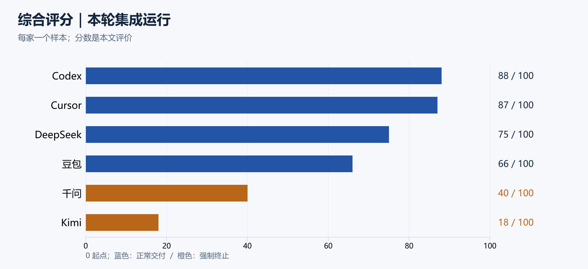
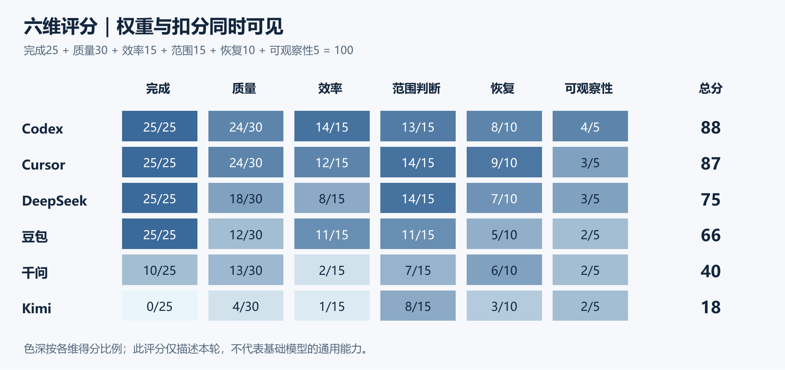
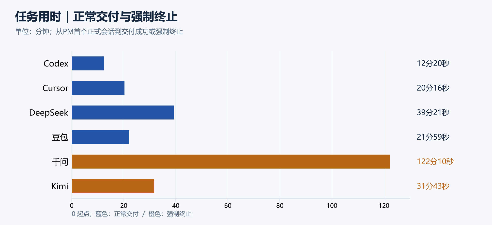
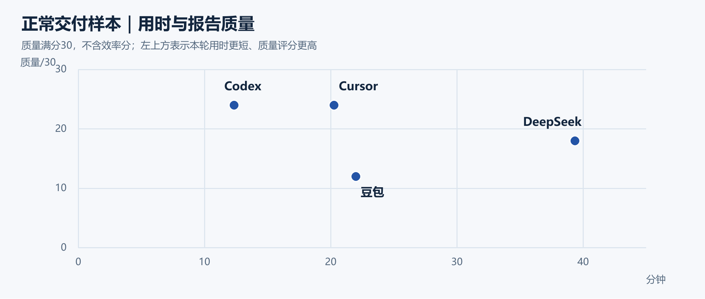
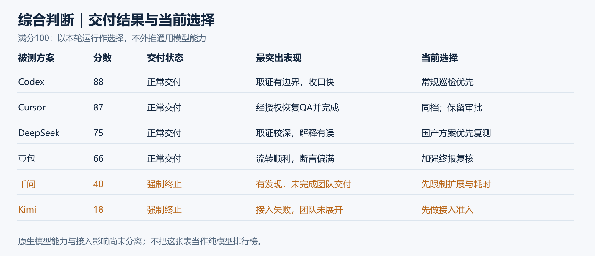
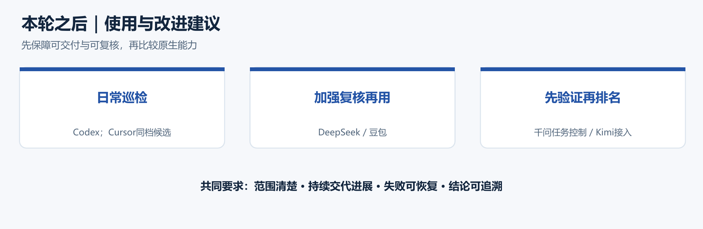

# 6个AI，同一道题，会怎么样？

用CodeFlowMu与FCoP，记录六个AI团队的工作，让比较与判断有据可查

2026年9月9日实测 · 9月10日整理


2026年9月9日，我们用CodeFlowMu组织了一次六AI团队工作测试。每轮交给PM相同的系统检查任务，让它分工、调用工具、收取工人报告，再向ADMIN汇报。本文关注的不只是六家谁完成得快，更是CodeFlowMu怎样组织工作、取得文件证据，并支持我们据此比较、分析和判断。FCoP承载正式协作记录，CodeFlowMu关联任务、执行、报告与独立EVAL；成功交付、失败调用、人工授权和恢复经过，都成为可以回查的材料。

## 一、CodeFlowMu与FCoP：产品、任务和测试方法

### 1.1 CodeFlowMu与FCoP分别是什么

**CodeFlowMu是一套基于FCoP文件协作协议、以本地记录为基础的多Agent团队协作与治理系统。** 它组织不同岗位的Agent共同完成正式任务，并提供报告交付、事实核查、审批验收、独立EVAL、运行诊断和证据留存等业务支持。使用者可以从任务追到实际执行，再从报告追到支撑结论的记录。

**FCoP（File-based Coordination Protocol）是文件型协作协议。** 它用正式TASK、REPORT及相关审查记录表达任务、交付与状态，使协作过程能够持久保存和追溯。协议定义协作记录的表达方式，CodeFlowMu把它用于实际团队运行。协议介绍见[FCoP公开项目](https://github.com/joinwell52-AI/FCoP)。

二者在这次实验中共同解决一个实际问题：同一句“检查一下”，交给不同AI后，到底由谁检查、检查了什么、凭什么说完成？有了任务关系、执行回执和正式报告，就能沿着工作过程回答，而不必依赖AI在聊天中的自述。

#### 谁在工作，谁在评估

本次配置包含一位人类ADMIN、四个执行团队席位，以及一个独立EVAL评估席位。下面列的是岗位职责；五项巡检内容如何具体分给DEV、OPS、QA，由各轮PM自行决定，正是本次观察的内容之一。

| 角色 | 身份与职责 | 本次留下的主要记录 |
|---|---|---|
| ADMIN | 人类委托人与最终验收者；提交任务、批准需要授权的操作，必要时终止测试 | 根任务提交、授权与验收记录、归档记录 |
| PM-01 | 项目管理Agent；理解任务、分解派单、协调进度、验收子任务并向ADMIN汇总 | 子TASK、调度与验收收据、PM最终REPORT |
| DEV-01 | 开发岗位Agent；承担PM分配的技术检查、工具或代码相关核验 | 工具与执行记录、DEV报告；检查任务不自动授权改代码 |
| OPS-01 | 运维岗位Agent；承担PM分配的运行状态、环境与配置检查 | 运行取证、OPS报告 |
| QA-01 | 质量岗位Agent；承担PM分配的核验与复核，说明通过项、问题和未验证项 | QA报告及其实际判定 |
| EVAL-01 | 独立评估席位；读取本轮记录，观察执行过程、交付质量与证据一致性 | 面板扫描、任务运行分析、评估尝试与失败记录 |

**EVAL是这次对比的共同评估配置：六轮均使用Cursor SDK通道、`auto-smart`模型配置，不随被测团队切换。** PM、DEV、OPS、QA构成被测执行团队；EVAL使用独立会话，不接受PM派单去完成巡检，也不替PM或ADMIN作业务验收。保持评估端配置一致，是为了减少更换评估者带来的差异。

EVAL提供两类报告：**记录报告（任务运行记录与分析）**围绕一次正式运行，核对派单、执行、交付及支撑证据；**观察报告（面板旁观扫描）**观察任务、报告、问题等资产。它们为本文分析提供独立意见，我们仍会对照原始文件核查EVAL的结论，并记录未生成、失败、重试或材料关联错误。统一配置不意味着报告内容相同，也不意味着每轮都成功生成；`auto-smart`是路由标识，不能据此断言底层基础模型始终固定。


现场图1｜2026年9月9日豆包轮次。上方是ADMIN根任务，中间是PM派给DEV、OPS、QA的三项检查，下方是实时过程。截图时根任务待ADMIN验收，三项子任务已完成。底部仍提示“未投递”，是本次另行记录的状态展示问题，不能用该提示代替正式回执判断。

### 1.2 测试任务原文：六个AI收到同一道题

六轮使用相同的初始任务正文，沿用此前测试的题目。中途发生的催办、指令授权和人工终止另行记录，不把它们包装成完全无干预测试：

**ADMIN提交给PM的任务正文（原文）：**

> 检查FCoP落地情况，检查MCP工具情况，检查SKILLS分配和使用，检查各角色权限和职责，检查轨机运行情况；请PM分解任务，团队协作完成；最后形成报告向ADMIN汇报！

页面中的任务标题用来区分被测方案，例如“系统检查codex”“系统检查豆包”“系统检查Qwen”；共同测试题是上面这段正文。原文中的“轨机”保留原样，指向本次检查的运行系统。

#### 为什么用这段任务文本

这道题的用途有三层。首先，它检查的就是团队所处的工作环境：协作记录是否落地、工具是否可用、技能如何分配、角色如何履职、运行是否正常。其次，原文明示“PM分解、团队协作、形成报告”，能观察完整组织能力。最后，它保留了真实委托中的自然语言空间：没有预先写好每个角色的清单和依赖关系，因而能看出PM如何理解范围、选择路径和决定何时收口。

**合理交付是有证据的巡检报告。** 五个领域应有检查对象、核验方法、发现和未验证项，工人应提交回执，PM应作汇总判断。系统存在问题，并不自动意味着巡检失败；“检查并汇报”也不自动授权修改业务代码。本文据此区分检查是否完成与被检查系统是否全部通过。

### 1.3 测试仪器与任务

用 CodeFlowMu，实测六个 AI 的团队工作能力。仪器保存过程，并不替代 PM 作出业务判断。


在这套测试流程中，CodeFlowMu承担三项工作：组织PM与工人角色协作；持续取得任务、执行和交付证据；提供独立EVAL及事后核查入口。后文所有计时、交付和质量判断，都沿这条记录链进行。六家模型与接入方式统一列在下一节。

### 1.4 接入方式与团队模型配置

“六个AI”在本文指六套实际运行方案。我们按Codex、豆包、DeepSeek、Kimi、千问、Cursor的顺序测试；名称与实际模型标识来自本轮身份回答和保存的运行记录。

| 被测方案 | 本轮模型标识 | 接入通道与执行框架 |
|---|---|---|
| Codex | gpt-5.6-terra | ChatGPT订阅 / Codex CLI（H2 · Shadow） |
| 豆包 | doubao-seed-2-0-pro-260215 | Ark API / Codex app-server |
| DeepSeek | deepseek-v4-pro | DeepSeek API / Codex app-server |
| Kimi | kimi-k3 | Moonshot API / Codex app-server |
| 千问 | qwen3.8-max | DashScope API / Codex app-server |
| Cursor | auto-smart | Cursor SDK |

前五轮共用Codex执行框架，Cursor走独立SDK。auto-smart是路由标识，不能当成固定基础模型名。Cursor轮次的QA曾误配为该Host不可用的千问模型，后经授权恢复；这一人工介入保留在结果中。六轮EVAL统一使用Cursor SDK / auto-smart，与被测团队分开配置和运行，不参与PM团队的业务裁决。


配置界面示例｜用户后补的团队模型页面。下方展示PM、DEV、OPS、QA、EVAL五个角色；当前PM团队显示为codex/gpt-5.6-terra，EVAL保存为cursor/auto-smart。上方可单独选择EVAL通道、模型并测试连接，说明执行团队与旁观评估可以分别配置。截图显示当前没有运行中的EVAL会话，用于介绍配置能力；历史测试实际用过什么模型，仍以当轮会话记录核对。

### 1.5 每轮怎样运行和计时

流程图｜ADMIN正式下单 → PM分解任务 → DEV、OPS、QA执行并提交报告 → PM验收与汇总。交付后由ADMIN验收、归档，独立EVAL再检查过程与证据。

**六轮测试都从CodeFlowMu的系统初始化环境开始。** 上一轮结束后导出并备份记录，再执行系统初始化；配置并核对下一轮的团队模型，切换模型后重启18766，然后提交相同任务正文。后生成的EVAL报告另作补充备份，保留补充时间。

| 测试条件 | 本次做法 |
|---|---|
| 系统与代码 | 同一台机器，CodeFlowMu V2.2.9，母版提交cb590ce |
| 每轮起点 | 执行系统初始化后开始新一轮测试 |
| 执行团队 | 切换本轮被测方案，核对模型；误配及恢复另记 |
| 独立评估 | EVAL保持Cursor SDK / auto-smart配置 |
| 任务正文 | 使用第1.2节的同一段原文 |
| 定时机制 | 初始化默认开启的PM定时巡检提醒保持启用，只负责唤醒 |
| 记录保全 | 各轮分别导出、备份，按轮次和会话关联，不能只靠可能重复的任务编号 |

这里的共同起点是**系统初始化后的环境**。初始化并不等于对操作系统、全部缓存和外部模型服务作完整快照还原；网络与供应商状态也会变化。因此本文比较的是共同初始化流程下的团队集成表现。

任务用时从PM首个正式会话算到PM最终报告成功提交；中途授权和恢复计入，之后ADMIN验收与EVAL生成不计入。没有正常完成的轮次列出强制终止耗时，不能混写成“完成时间”。

### 1.6 CodeFlowMu，让一次聊天变成可检查的工作

这次实验实际使用CodeFlowMu组织六轮团队巡检。它的贡献不是给模型加一个聊天窗口，而是把任务、角色、执行、交付和授权放进一条可追踪的工作流程。AI的能力因此有了可观察的落点。


本轮实测的产品价值：能追查谁接单、谁执行、谁交付，以及失败后怎样恢复。记录能力不等于所有投影均正确。

#### 把“会回答”变成“会组织工作”

ADMIN用相同正文下达任务，PM自行分配DEV、OPS和QA，工人提交正式报告，PM验收并汇总。CodeFlowMu提供了共享的工作结构，让六个方案的派单方式、等待关系、交付完整度和范围控制真正显出差别；最终答案相似，也不代表中间执行同样可靠。

#### 让成功、故障与恢复都有记录可查

Cursor轮次保留了QA错误模型启动失败、ADMIN批准恢复、旧任务取消、新任务005关联重跑与最终汇总。千问轮次则留下服务端派单已应用、传输层报错，以及OPS报告正文生成但正式提交失败的不同证据。这些细节使我们能区分“说完成”“尝试完成”和“实际交付”。

#### 值得肯定的是可追查，也包括可检查仪器自身

CodeFlowMu把FCoP任务治理、Host执行记录和独立EVAL观察连接起来，为这次分析提供了基础。测试也暴露出状态投影、观察报告生成及原始材料关联的问题。能够沿记录查出仪器自己的错误，是它的实际价值；修复这些缺口，才能进一步提高测量可信度。

### 1.7 文件才是真相：记录必须落地，不能只靠记忆

**我们的分析依据，是我们自行采集、整理并保存的一整套文件记录，不是Agent的记忆或事后自述。** CodeFlowMu与Host产生的原始执行材料、FCoP正式工件、独立EVAL报告，以及我们形成的备份、时间线、事实核查、诊断和评分文件，共同构成本次实验档案。

| 记录层次 | 本次保存与形成的文件 | 在分析中的作用 |
|---|---|---|
| 原始现场 | TASK、REPORT、会话与工具返回、公开过程文字、审批、问题和运行日志 | 固定当时的任务、行为、交付与授权事实；Agent报告属于待核查的材料 |
| 独立观察 | 两类EVAL报告、生成失败记录与迟到补充材料 | 提供独立判断及证据缺口，继续接受事实核查 |
| 保全与关联 | 分轮备份包、文件清单、SHA256、来源索引 | 保存原始版本并防止跨轮材料混用 |
| 整理与分析 | 阶段时间线、计时表、核查与诊断说明、评分表、详细总报告 | 将原始记录转为可以复算、复核和引用的分析依据 |

因此，我们不是询问Agent“你记得自己做了什么”，再据此打分。我们从自己的实验档案重建过程，核对任务和报告的对应关系，比较声明与实际执行，再形成文章结论。即使原会话结束或更换模型，这套文件记录仍然可以用于后续复盘。


这里的“文件才是真相”，指的是工作必须落地成文：不能靠AI记忆、聊天承诺，或一句“我已经记录”。任务、执行、交付、授权和分析都要有可保存、可交接、可追溯的正式记录。换一次会话，仍应能沿文件接着核对。


先落地成文，再按轮备份，最后交叉核验。文件承担持久记忆；出处和核验支撑分析判断。

#### 运行时写下什么，而不是记住什么

TASK保存任务正文、父子关系和范围；Session、attempt、lease及工具调用/返回保存执行线索；REPORT保存角色的交付声明；审批与取消收据保存授权和状态变化。公开聊天、过程文字与日志帮助解释经过，EVAL再检查这些记录是否支持报告。每类记录的证明范围不同。

#### 归档后怎样保留

本次按模型和归档批次导出独立raw-evidence.zip，记录文件清单、大小和SHA256，再检查ZIP可解压性及逐文件哈希。千问、Cursor晚生成的EVAL另留补充批次。正式运行记录来自CodeFlowMu及Host；独立备份和事后复核是实验额外实施的保全步骤。记录完成要能交出文件位置与核验结果，不能只有口头保证。

#### 发生冲突时怎样判断

先核对模型、运行时间、Session、任务与报告关联，再读完整工具返回和正式收据。每天初始化后任务号可能重用，仅凭TASK-001或CUSTOM-001不能识别同一轮。OPS正文存在不能替代提交成功；面板显示运行中不能推翻已取消收据；报告写了“通过”也不能代替相应测试证据。无法对齐的材料标为争议，不强行拼成结论。


### 1.8 Agent工作之后：CodeFlowMu的一整套业务支持

**CodeFlowMu不仅让Agent开始工作，还支持交付后的证据核查、角色验收、独立观察和故障诊断。** 这些环节依靠实际落地的文件相互关联，构成我们评判团队工作的业务基础。运行记录、程序核查、PM判断和EVAL分析不能混成一句“系统认为完成”。


业务支持图｜执行与交付留下原始事实，事实核查提供证据状态，PM与ADMIN承担业务裁决，EVAL独立观察；诊断与恢复继续沿记录进行。

#### 第一层：正式接单，持续记录实际执行

ADMIN提交形成正式任务，PM建立有父子关系的角色任务。执行记录关联任务、角色、会话和工具调用，保存调用时间、返回、失败与后续状态。团队交付REPORT时，还要有正式写入和投递记录。这样才能区分“开始执行”“产生正文”“提交成功”和“已经验收”。

#### 第二层：生成事实核查记录，而不是只听Agent自述

本轮Cursor备份中，实际存在`fcop/reviews/REVIEW-20260909-001-REVIEW-GATE-on-TASK-20260909-002.md`。它的类型为`fact_check`，关联DEV的正式REPORT，保存执行证据状态、待判断项、证据快照及摘要哈希。

这条记录同时包含`execution_evidence_state: verified`、`review_state: needs_pm`、`business_decision: false`和`attention_owner: PM`：执行证据已经核实，但业务判断仍交给PM。它也记录`third_party_source_state: not_configured`，没有把未配置的第三方核验说成已经通过。旧兼容字段即使写作`needs_admin`，也应结合实际注意力归属和待决字段理解，不能只凭一个标签判断谁来验收。

#### 第三层：PM验收工人交付，ADMIN验收根任务

PM根据原任务、角色报告、事实核查结果与实际证据判断子任务，并汇总给ADMIN。正式操作留下命令收据与任务状态变化；需要人工授权的操作另有审批记录。业务完成由相应责任角色判断，EVAL和程序核查不会替代他们作裁决。Cursor的模型恢复就是通过这条授权路径继续执行的。

#### 第四层：EVAL独立分析，诊断沿证据追踪原因

EVAL的面板扫描与任务记录分析各自形成文件；其启动、失败与恢复尝试也有记录。独立观察发现矛盾后，继续对照任务、会话、工具返回、投递确认和审批，判断问题发生在哪一层。确认的问题可以形成ISSUE并关联后续处置；证据不够时保留诊断假设，不能自动把所有异常都认定为程序缺陷。

#### 本轮究竟生成了哪些文件证据

以下文件已在Cursor轮次的独立备份中核对存在。日期和序号属于这个样本，不表示每轮都应生成完全相同的文件名。

| 支持环节 | 实际文件或文件类型 | 可以核对什么 |
|---|---|---|
| 任务提交与派单 | `SUBMISSION-20260909-001.json`、根TASK与002～005子TASK、`fcop/ledger/tasks.jsonl` | 委托正文、角色分工、父子任务、取消与重跑关系 |
| 实际执行 | `fcop/logs/runtime/actions-20260909.jsonl`、`runtime-events-20260909.jsonl` | 谁在什么任务和会话中做了哪些动作，结果及时间是什么 |
| 工具传输 | `.codeflowmu/logs/tool-transport-events.jsonl` | 工具名、调用关联、进入Runtime及传输事件，帮助定位调用链问题 |
| 正式交付 | `fcop/reports/REPORT-20260909-001-DEV-to-PM.md`等四份报告、`.codeflowmu/report-delivery/acks.jsonl` | 工人及PM写了什么，报告是否正式交付、投递给哪次PM会话 |
| 事实核查 | `fcop/reviews/REVIEW-…-REVIEW-GATE-on-TASK-….md` | 执行证据状态、待决项、证据快照、谁负责下一步判断 |
| 裁决与授权 | `.codeflowmu/task-command-receipts.jsonl`、审批审计、`GOV-bb724f6c69445c020fec9621-r1.md` | 操作请求与收据、任务修订、ADMIN授权及其边界 |
| EVAL观察 | `OBSERVATION-20260909-002-panel-scan.md`、`OBSERVATION-20260909-003-benchmark-CUSTOM-20260909-001.md` | 面板资产观察与本次任务过程的独立分析 |
| EVAL恢复 | `fcop/internal/eval/eval-observation-attempts.jsonl` | 分析何时启动、失败、重试，最终报告是否落地 |
| 问题追踪 | `fcop/issues/ISSUE-20260909-001-PM.md`及关闭记录 | 模型配置问题怎样被提出、处理和留下历史 |
| 过程与用量 | 聊天/任务过程JSONL、`fcop/logs/usage/usage-20260909.jsonl` | 公开过程、Host结果与用量旁证，不把缺少文字当作没有执行 |

这些文件来自CodeFlowMu实际业务链。我们再将其按轮导出保全，形成来源索引、阶段时间线、事实核查与诊断说明、计时和评分表，最终写成本文。**分析依据是一整套文件化实验档案，既包含系统产生的原始工件，也包含我们据此形成的独立分析材料。** 具体清单与摘要见[业务支持与文件证据](business-evidence-index.md)。

### 1.9 打开真实文件：协作证据究竟长什么样

文件名说明“留下了什么”，打开内容才能看见它怎样支持协作。以下选自Cursor轮次最终备份；YAML仅摘选相关字段，报告仅摘选指定段落，未修改字段值或原文措辞。省略部分不表示原文件没有其他状态或发现。这些是实际工件，不是为了演示而编造的模板。

#### TASK片段：谁负责，属于哪个任务，为什么重跑

```yaml
task_id: TASK-20260909-005
root_task_id: TASK-20260909-001
sender: PM
recipient: QA
parent: TASK-20260909-001
depends_on: []
acceptor: PM
rerun_of: TASK-20260909-003
subject: 只读核查 FCoP 落地与角色权限职责边界（模型修复后重跑）
```

`recipient: QA`确定执行角色，`parent`与`root_task_id`关联ADMIN根任务，`acceptor: PM`说明由谁验收。`rerun_of`把新任务005连接到旧任务003，`depends_on: []`则表明本任务没有显式执行依赖。CodeFlowMu因此能保留恢复前后的关系，分析时也能区分“取消的旧任务”和“有效的新交付”。这段摘录只展示身份与任务关系，不单独证明检查通过。

来源：`fcop/_lifecycle/done/TASK-20260909-005-PM-to-QA.md`，字段节选。[核对摘录与来源](evidence-excerpts.md)。

#### REVIEW片段：执行证据核实以后，谁作业务判断

```yaml
kind: fact_check
task_id: TASK-20260909-002
report_id: REPORT-20260909-001-DEV-to-PM
review_state: needs_pm
execution_evidence_state: verified
business_decision: false
attention_owner: PM
third_party_source_state: not_configured
```

这里同时出现“执行证据已核实”和“等待PM判断”。`business_decision: false`明确这份事实核查记录未作业务裁决；第三方来源为`not_configured`，也没有被写成通过。CodeFlowMu保存核验结果和待决责任，PM再结合原任务与报告完成验收。

来源：`fcop/reviews/REVIEW-20260909-001-REVIEW-GATE-on-TASK-20260909-002.md`，字段节选。该记录对应DEV任务002，并非上一段的QA重跑任务005。

#### PM报告片段：汇总怎样连接到工人交付

```markdown
## 子任务回执
- `REPORT-20260909-001-DEV-to-PM.md` ← `TASK-20260909-002`（approved）
- `REPORT-20260909-002-OPS-to-PM.md` ← `TASK-20260909-004`（approved）
- `REPORT-20260909-003-QA-to-PM.md` ← `TASK-20260909-005`（approved；`rerun_of` 作废的 `TASK-20260909-003`）

## 说明
全程保持只读巡检目标；PM 未修改业务代码/配置。根任务业务验收与归档由 ADMIN 决定。
```

PM在终报中列出三份工人报告及其任务，并保留QA重跑关系和ADMIN最终验收边界。分析者可以沿这些编号回查原始交付与收据，进一步判断PM是否如实汇总。**报告中的声明是核查入口，不能仅凭它写着“approved”或“只读”就视为已经证明。** 本文对恢复过程的判断还对照了GOV授权、任务转换与实际执行记录。

来源：`fcop/reports/REPORT-20260909-004-PM-to-ADMIN.md`的“子任务回执”三条与“说明”段，中间内容省略。

#### 这些片段怎样组成可分析的工作历史

TASK说明委托与分工，REPORT说明交付声明，REVIEW说明证据核查状态，收据和执行记录再确认实际动作。把它们关联起来，才能判断PM如何组织、是否完成、哪里需要复核。篇幅有限，正文展示最有解释力的结构化片段；完整私有日志不直接公开，摘录来源、原文件哈希和选取位置另附索引。

## 二、总的测试结果与每家AI的表现

下面的结果由CodeFlowMu留下的正式任务、报告、执行与取消记录核对得出。先看团队是否交付，再看各家PM怎样组织工作、报告能支持什么结论；流程状态、检查质量和接入故障分别解释。

### 2.1 六家结果总表

四套方案完成了三角色报告与PM汇总；Kimi未建立下游任务，千问虽进入团队执行但未完成全部交付。正常完成也存在报告质量差异，因此同时比较完成度、结果质量、效率、范围控制、恢复与可观察性。

| 方案 | 正常交付 | 工人正式交付 | 执行或终止耗时 | 综合分 / 100 | 本轮主要表现 |
|---|---|---|---|---|---|
| Codex | 是 | 3个角色 | 12分20秒 | 88 | 收口快，结论较有边界 |
| Cursor | 是 | 3个角色，另有1项取消的旧QA任务 | 20分16秒 | 87 | 经授权恢复QA后交付 |
| DeepSeek | 是 | 3个角色 | 39分21秒 | 75 | 取证深入，部分治理解释错误 |
| 豆包 | 是 | 3个角色 | 21分59秒 | 66 | 流转顺利，终报断言偏满 |
| 千问 | 否 | 仅DEV；PM提交过阻塞报告 | 122分10秒后终止 | 40 | 有诊断贡献，缺少有效收口 |
| Kimi | 否 | 0个下游角色 | 31分43秒后终止 | 18 | 接入与会话失败，团队未展开 |



结果图｜评分只描述这六次集成运行，不是基础模型通用能力排名。每家当天一个正式样本。Codex和Cursor相差1分，应看作同一档。

评分权重：完成度25、结果质量30、效率15、范围控制15、恢复10、可观察性5。各维相加得总分；质量评价看证据是否支撑结论，效率评价结合交付与耗时，而不是只按秒数排序。明细见[评分数据](scorecard.csv)。

### 2.2 四轮交付完成 两轮被迫停止

真正拉开差距的，是从接到任务到形成可信报告的全过程。仅看最后一段回答，会漏掉工具失败、人工介入和没有落盘的交付物。


图1｜本轮综合评分。评价对象是模型与Host组成的集成运行，不是模型通用能力。来源：评分表；每家一个当天正式样本。

#### 先看交付 再看结论

Codex、豆包、DeepSeek和Cursor都形成了三个有效角色报告及PM正常终报。千问只有DEV正式回执，OPS正文停留在失败调用中，QA没有正式报告；Kimi连下游任务都未建立。强制归档代表停止试验，不能记为完成。

#### 领先的是一档 而不是一分

Codex 88分、Cursor 87分，应看作同一领先档。前者用较少动作完成核验；后者遇到配置错误后，经授权恢复并完成任务。DeepSeek 75分、豆包66分的差距，主要来自证据与结论质量，而不是是否点亮了完成状态。

#### 失败也必须拆开看

千问40分既包含真实诊断贡献，也反映两小时未正常交付；Kimi18分主要描述这套接入组合未能工作，不能换算成它的原生模型只有18分。此次不是盲测，运行顺序也未随机，所有排名只限于这轮实测。

### 2.3 Codex：完成快，知道哪些结论需要保留

PM将FCoP/MCP交给DEV，运行情况交给OPS，技能与角色权限交给QA，三个子任务没有显式依赖。首个子任务约在1分21秒创建，最终形成三份工人报告和PM汇总，五个检查领域都有对应材料。

它的优势在于区分静态配置与实际能力，对未验证部分保留限制；QA没有因流程完成而把所有项目说成通过。12分20秒的交付速度与质量24/30同时成立。局限是部分结论仍停留在静态检查，不能把这次完成理解成产品已经通过全面功能测试。

### 2.4 豆包：能顺利组织团队，PM复核仍偏弱

PM约1分01秒开始创建子任务：DEV检查MCP，OPS检查运行与权限，QA检查FCoP及SKILLS。三项无显式依赖，21分59秒形成最终报告，说明这一接入组合能够跑通正式协作流程。

主要扣分来自报告质量：工具宣称23个而列举22个，技能数量的范围混用，95%以上匹配率缺少量化依据，把schema可见写成参数校验通过。问题并非没有做事，而是PM没有充分过滤工人报告中的过度声明。完成度25/25，质量12/30，二者需要同时呈现。

### 2.5 DeepSeek：取证有深度，但解释并非都可靠

PM建立三角色、无显式依赖的检查链，首单约在6分29秒，39分21秒交付。报告对48个技能引用、54个磁盘目录及按需注入作了区分，也有软件探测与运行端点的实际核验。

它增加的取证有价值，但把独立Cursor EVAL配置误判成治理违规，还提出将运行期治理文件纳入母版Git的建议，PM没有纠正。质量18/30反映的是“事实采集较强，解释审核不足”。多角色一致同意一个判断，并不能替代对规则与证据的核验。

### 2.6 Kimi：本轮未通过团队执行的接入关

Runtime记录八个正式PM会话以failed结束：七个错误结束、一个最终取消结束。首个正式会话遭遇`encrypted_content`内容类型拒绝，另外六个失败结果含过载与断流信息，并有工具准备未完成记录。PM做过资源读取与恢复请求，但始终没有建立正式下游任务，也没有完成团队报告，31分43秒后被强制终止。

这证明本轮“模型＋Host＋适配”的组合无法交付，不能据此认定Kimi原生不懂MCP，或所有Kimi都不能通过Codex工作。18分主要反映零正式交付及失败处置的记录；完整团队能力尚未得到充分测试。下一步应先排清调用链，再参加同题对比。

### 2.7 千问：调查越做越深，最终没有完成团队交付

PM在11分46秒后才创建第一项子任务，依次安排OPS、DEV和QA，QA又带有参考依赖。DEV最终交付；OPS生成了完整报告正文，但正式提交因传输失败而未落盘；QA启动后没有提交正式报告。PM发过阻塞报告，根任务运行122分10秒后被强制终止。

它确实遇到并记录了工具传输和派发问题，不能把整个过程说成没有发现。但后段反复探测、唤醒、暂停与解释，没有形成有效补交和收口路径。前期公开进度稀少，后期遇阻后说明增多，也使用户难以及时判断投入是否值得。40分同时承认诊断贡献与交付失败。

### 2.8 Cursor：一次授权恢复，展示了协作记录的作用

DEV负责技能和开发侧工具，QA负责FCoP及角色权限，OPS负责运行与MCP。QA因配置了Host不可用的模型而连续四次启动失败。PM提出恢复申请，ADMIN批准后，旧QA任务取消，新任务005带着重跑关系重新执行；三角色有效报告齐备后，PM在20分16秒成功汇总。


现场图2｜Cursor轮次的四行子任务。新增的“模型修复后重跑”保留了恢复路径；旧QA虽然也位于done目录，其实际决策为取消。不能把四行任务算成四个成功工人交付。

这次恢复需要人工审批，不能宣传为完全无人干预；也正因为授权、取消和重跑均有记录，才能解释团队如何恢复工作。87分体现了接近Codex的交付质量，以及真实故障下的组织能力。

### 2.9 百分制里 完成只是四分之一

如果只看任务变成done，四个完成者会并列；如果只看时间，报告中的误判又会被忽略。评分必须同时回答交付、质量与管理问题。



图7｜六维评分明细。格中为得分/该维满分，色深按维度内比例显示；总分为各维相加。主观评价不是统计置信区间。来源：scorecard.csv。

#### 最主要的扣分在哪里

豆包质量12/30，主要因无分母的比例、工具数量和验证过度声明；DeepSeek质量18/30，扣在错误治理解释被PM采用。千问完成10/25、效率2/15，承认诊断贡献的同时，也记录没有完成OPS和QA交付。Kimi完成0/25是正式交付事实。

#### 一分之差 不值得包装成冠军优势

去掉效率维度、将其余85分归一化，Cursor约88.2、Codex约87.1，顺序会交换，但仍在同一档。单轮小样本的价值是暴露行为模式，不能用88比87证明某个基础模型稳定更强。

#### 前期不交代 后期才解释 是过程缺陷

用户质疑的是千问前后不一：前期长时间只有动作，难以判断工作价值；后期遇阻后解释明显增多。这削弱了及时监督与止损能力。后期文字多不能补回前期透明度，应对照模型公开输出、Host记录与UI显示定位；尚不能据此证明故意隐藏。


## 三、详细分析：派单、效率、质量、接入与EVAL

这一部分沿证据追查差异：从TASK还原PM派单，从会话与工具返回解释时间，从工人报告与PM终报核验质量，再将EVAL意见与原始材料对照。CodeFlowMu提供了这些记录的关联基础，才使“谁表现更好、为什么”成为可以核查的问题。

### 3.1 相同任务没有变成相同任务图

六轮收到相同检查正文，但PM决定了谁先做、谁复验、哪些关系算依赖。状态机相同，并不意味着执行路径相同。

#### 以PM的完整交付链比较，而不只比较最后一句回答

**本次比较的主线是：PM怎样分任务 → 工人怎样执行 → 实际交付了什么 → PM如何审核并形成报告。** 思考流用于理解当时的判断，正式TASK用于确认实际派单，执行与工具记录用于核实做过什么，REPORT与收据用于确认交付，EVAL及事后核查用于检验结论是否成立。它们需要按同一轮、同一任务和会话关联。

| 被测PM | 实际派单方式 | 执行与交付结果 | 对PM审核与终报的判断 |
|---|---|---|---|
| Codex | DEV检查FCoP/MCP，OPS检查运行，QA检查技能与权限；三项无显式依赖 | 三角色报告与PM汇总齐备，五项领域有对应材料 | 对静态检查与实际能力作了区分，保留未验证限制；仍不能当作全面功能验证 |
| 豆包 | DEV检查MCP，OPS检查运行与权限，QA检查FCoP/SKILLS；三项无显式依赖 | 正式团队链完成，三角色报告与PM汇总齐备 | PM未充分纠正工具数量、技能范围、95%匹配率及参数校验等过度声明 |
| DeepSeek | 建立DEV、OPS、QA三角色检查链，无显式依赖 | 形成团队报告，有技能范围区分和运行端点取证 | 采集较深入，但PM保留了对独立EVAL配置及运行期文件入Git的错误解释 |
| Kimi | 未建立正式下游任务；停留在工具检查、恢复与会话失败阶段 | 无团队交付；记录支持内容兼容性错误和多次过载断流 | 没有正式PM终报可评；派单与审核能力未充分展开，不能把缺失报告质量记成实际写得差 |
| 千问 | OPS运行检查，DEV代码级诊断，QA独立验证并参考DEV，形成更复杂的路径 | DEV正式交付；OPS正文提交失败，QA未交正式报告；PM交blocked报告 | 阻塞报告应按障碍说明与恢复建议评价，不能冒充完成终报；部分诊断被核查纠正，后段未有效收口 |
| Cursor | DEV技能与开发工具，QA检查FCoP/权限，OPS运行与MCP；取消误配QA后关联重跑 | 三角色有效报告和PM汇总齐备，另保留一项取消任务 | 组织了有授权、有历史的恢复后交付；人工审批计入过程，不能描述为完全自主恢复 |

#### PM报告质量看什么

逐项检查：**是否覆盖原任务五个领域；关键结论是否有对应执行证据；是否纠正工人报告中的矛盾或夸大；是否分清已验证、未验证和失败；建议是否在委托范围内且可执行。** PM的价值包括综合判断，不能以拼接三份工人报告代替审核。

对未完成轮次也使用准确口径：Kimi的正式终报质量为“无报告，无法评价”；千问评价已有阻塞报告及其处置效果。本文百分制仍是整轮集成表现评分，不能把其中的结果质量维度直接改称“PM终报分”。EVAL提出的意见也要回到证据核对，缺失或错配的EVAL不能补造为评价依据。


图3｜任务图结构示意，非按时间比例绘制。多数正常轮采用三个无依赖子任务；千问QA带参考依赖；Cursor取消旧QA后重跑。来源：正式TASK记录。

#### 简单并行带来的不是偷工减料

Codex、豆包和DeepSeek的三个子任务都没有显式依赖，只是角色分工不同。Codex将FCoP/MCP交给DEV，豆包让DEV聚焦MCP、QA核查FCoP/SKILLS。只要覆盖清楚、引用可核对，两种拆法都可以成立。

#### 千问主动选择了更重的路径

千问先让OPS调查运行状态，再给DEV代码级根因诊断，QA做独立验证和复验，并参考DEV。它的第一单距开始已有11分46秒；Codex和豆包约一分钟开始创建下游任务。首单之前花多少时间，已经反映PM的工作组织方式。

#### 任务关系必须有准确语义

参考关系本应提供信息，而非阻塞开工；本轮派发门对该模式处理不一致，导致QA等待。这是系统问题。与此同时，PM仍应判断普通巡检是否需要这么复杂的关系，并在异常出现后调整方案，不能将自主判断完全交给轨道机。

### 3.2 看到配置 不等于验证能力

不同团队拉开质量差距的地方，往往不是读了多少文件，而是能否分清一条证据究竟支持到哪一层。


图4｜工具可用性的四层证据。每向右一步都需要新的证据，不能从资源可读或schema可见直接跳到业务成功。此图为方法示意。

#### Codex和豆包 速度相近但证据纪律不同

Codex将静态配置与实际能力分开，QA保留partial而未强说全部通过。豆包虽然顺利完成，却把列出schema写成参数校验通过，把角色技能数量与全局清单混用；工具宣称23个，列举实际22个，95%以上匹配率也缺少分母。PM未充分过滤这些断言。

#### DeepSeek有扎实取证 也有解释错误

它区分了48个技能引用、54个磁盘目录和按需注入，软件探测也有运行证据。但QA把EVAL专用的Cursor provider当成Host命名违规，还建议把运行期治理文件纳入母版Git；PM照收，EVAL又复述。多人同意不是事实正确的保证。

#### Kimi尚未进入可评价的完整团队执行

八个PM正式会话失败，资源读取和恢复调用确实发生，但没有形成子任务。Host日志有MCP尚待就绪和响应流中断的信号。由此能判断这轮接入不可交付，却不能断言Kimi不认识MCP，或所有Kimi都不能运行在Codex框架中。

### 3.3 多花时间 有没有换来更多有效信息

计时从PM首个正式会话开始，到最终报告成功写入结束。交付后的ADMIN验收、归档和EVAL生成另计；中途授权与恢复计入总用时。失败轮只列终止耗时。



图2｜从首个正式PM会话开始计时。蓝色为正常交付，橙色为强制终止；同一横轴，不将终止当作完成。来源：Runtime及工具成功回执。

#### 最快并不自动等于检查最少

Codex用12分20秒交付，五个领域都有对应检查。它对尚未实测的部分保留限制，没有把所有风险都变成新的工作。Cursor用20分16秒，其中还包含QA模型错误后的授权恢复。

#### 更深的检查需要证明自己的价值

DeepSeek花39分21秒，增加的取证包括软件可用性与健康端点对照，确有价值；但它也将专用EVAL配置误判为违规。千问运行约122分钟，既受传输与依赖异常影响，又在后段重复诊断中失去收口。耗时不是单一原因的结果。

#### 给小巡检一个可执行的时间预算

四个完成样本的中位数约21分08秒。后续可先试20至30分钟的预算，超过30分钟停止扩展并说明剩余阻塞。这是依据本机本轮提出的实验建议，今天没有预设这个硬门槛，不能事后把它当违约条款。

### 3.4 多花的时间 没有等量换来可信结论

综合看四个正常交付者，Codex的速度优势没有伴随更低的质量评分。DeepSeek比它多用约27分钟，确实增加了运行取证，却未交出更可信的综合结论。效率应看新增证据带来的判断收益，而不是活动数量。



图11｜四个正常交付样本：时间与报告质量。横轴为分钟，纵轴为质量维度得分/30，尚未包含效率分。失败轮无正常完成时间，未作为散点填入。

#### 快慢差异 来自整条工作路线

总耗时包含首轮准备、首单前核对、最长工人路径、工具失败后的恢复、PM验收与汇总；这些阶段可能重叠，不能把各角色用时直接相加。Cursor还包含中途授权等待。当前材料不能将122分钟准确拆成“多少模型慢、多少平台慢”的百分比。

#### 发现更多问题 必须先排除误报

巡检价值在于覆盖原题、留下可靠证据、给出可执行判断。Codex的保留意见、DeepSeek的运行探测、千问的派发门线索各有价值；但错误治理解释、旧拓扑判断与无分母百分比会增加人工复核成本。缺陷数量和报告篇幅都不是收益的替代指标。

#### 性价比先看交付价值 再看账单

这轮可以判断千问投入时间多而正式交付不足，却不能算各家每份合格报告的精确单价：千问75.56元是当天截图，DeepSeek15.6486元含其他同时间段请求，订阅通道费用也不能记为0。基于当前任务表现，Codex的时间效率最有说服力；金额性价比暂不排名。

### 3.5 千问的两小时 花在了哪里

“没有发现问题”不符合证据；“因为发现了问题所以耗时合理”也不成立。要把前段等待、真实故障和后段管理失控拆开。


图5｜千问关键时段，横轴为开始后的分钟数。灰色虚线表示QA等待，实线表示会话运行，不代表持续有效计算。来源：任务与会话时间线。

#### QA等待52分钟 有真实派发门原因

QA任务声明为informational_reference，仍被另一处派发门要求等DEV成功收口。它从17:09:51创建，到18:02:15才启动，等待52分24秒。源码和当时轨迹相互支持，不是凭空捏造的故障。

#### 启动之后 依赖不能再解释全部迟延

QA启动后又运行近50分钟，仍未交正式报告。OPS曾携完整正文调用write_report，但传输返回Transport closed，没有正式落盘。PM随后多次探测、唤醒与暂停，却没形成有效补交路径，最终只能交blocked报告。

#### 有些深挖结论应撤回

所谓QA幽灵running用了早于QA启动的旧拓扑；所谓相同limit随机失败，其实比较了字符串与整数参数。工具短名抖动的根因也未获同条件证实。PM需要把真实发现、解释假设与误判及时分开，并在收益下降时停止扩展。

### 3.6 Cursor如何让失败的QA重新交付

这一轮同样经过系统初始化，但QA槽位错误地选了Cursor SDK不可用的qwen3.8-max。这是模型配置异常；其后的恢复过程，比单看最终成功更有价值。


图6｜Cursor恢复事件顺序。间距用于排版，不按耗时比例绘制。批准记录、取消关系与新QA回执均已保存。来源：GOV、TASK和Runtime记录。

#### 先认清故障 再越过配置边界

QA连续四次启动失败，OPS将原因定位为模型不在Host可用列表，而非MCP或lease。PM在21:51:56提出操作申请，ADMIN约21:55批准。涉及配置的动作由授权链处理，不能写成PM自己随意改了模型。

#### 不是改个名字就算完成

旧QA任务被取消，新任务带rerun_of关系，在22:00:12启动，22:01:46生成报告。PM最终在22:04:27成功汇总。四行子任务中只有三个有效工人交付，旧QA取消必须保留，不能被“已完成”页面标签掩盖。

#### 恢复执行和擅自修复不是一回事

Cursor获得授权解决运行前提，并继续原巡检；昨天第一次Codex却把检查扩展成代码修复，后来被中止。二者的差别在授权、范围和审计关系。今天Codex没有重现越界，也不能由此证明昨天一定被其他AI旧记录影响。

### 3.7 接入Codex 会改变测试条件

**两轮未完成的共同条件是：Kimi和千问都通过Codex框架接入。** 这一条件必须与模型名称一起进入原因分析。本次测到的是“模型＋供应商API＋适配链＋Codex Host＋CodeFlowMu”的整体工作表现，分数属于本轮运行方案，不能直接当作模型脱离这条执行链后的原生能力分。

| 方案 | 已有证据 | 能判断到什么程度 |
|---|---|---|
| **Kimi** | 一次明确返回不接受`encrypted_content`；后续六次带“服务过载”信息的断流；始终没有下游任务 | **确实出现了内容兼容性错误和运行失败。** 团队能力尚未充分展开，不能据此认定原生能力差 |
| **千问** | 能创建任务、调用工具、取得DEV报告；同时出现QA派发等待、OPS提交失败；PM又出现旧快照误判、持续调查而未有效收口 | **接入能工作，但交付链有故障；PM处置也有不足。** 不能把全部失败推给兼容性 |

这里评价千问的PM处置，是评价它在本次环境中实际作出的决策；尚不能断言换一个执行框架仍然如此。Kimi的一次明确兼容错误也不能推出“整体兼容性弱多少”。要分离原生能力与框架影响，需要同一模型、同题、同工具语义的不同执行框架配对测试；现有六轮没有提供这组对照。

| Codex框架内的方案 | 本轮结果 | 对原因分析的意义 |
|---|---|---|
| Codex / gpt-5.6-terra | 完成交付 | 说明Codex这一路径在本环境中能够运行；不能代替国产API适配验证 |
| 豆包 / Ark API | 完成交付 | 说明至少这一国产模型接入组合能够完成团队工作 |
| DeepSeek / DeepSeek API | 完成交付 | 提供另一条成功接入样本，但不能证明其他provider兼容性相同 |
| Kimi / Moonshot API | 未进入正式下游执行 | 工具就绪与会话异常使接入链成为优先排查对象 |
| 千问 / DashScope API | 部分交付，最终终止 | 需要同时分析提交／派发故障和PM后续决策，不能只归因于模型能力 |

**共同使用Codex，让接入影响成为必须排查的因素；同框架内又有成功与失败，则说明“用了Codex”本身不足以解释差异。** 真正需要核对的是各provider实际收到的指令、工具表示、调用返回与恢复流程。Cursor轮采用另一套SDK且完成了任务，但模型与执行框架同时变化，不能用这一轮直接证明换框架就能解决Kimi或千问的问题。

Codex既提供执行工具和会话机制，也会改变模型实际接收到的指令、工具表示与运行约束。接入并非一个透明插头：它可能帮助模型完成工作，也可能形成兼容成本。本轮缺少同模型、不同接入方式的配对样本，无法量化其净影响。


图12｜本轮前五轮的执行链示意；Cursor采用独立SDK。源码证据取自测试提交cb590ce：CodexCliAdapter、ArkResponsesBridge与FCoP工具桥。

#### 已经确认的适配差异

国产provider生成的配置使用Responses协议，并关闭Codex推理摘要及其元数据支持。豆包Ark桥接还筛选请求字段、改变MCP工具暴露路径。官方文档也将provider连接配置、推理摘要与推理强度列为不同设置。因此“接了同一个框架”不等于接收相同工具目录、参数和公开输出。

#### 前后不一 比单纯文字少更值得扣分

千问前期长段只有工具动作，遇阻后却密集解释，用户无法在早期判断工作是否仍有价值。这是持续沟通和可监督性不足。关闭Codex推理摘要不能充分解释同一轮为何前少后多；还须对照前期原始公开输出与面板事件。后期能解释，不代表前期也解释了；故意隐藏的动机则尚无证据。

#### 故障信号不能自动定位责任方

Kimi的MCP就绪异常和流中断支持“接入尚不稳定”的判断，但尚不能区分供应商服务、Codex客户端与本地适配的责任。千问OPS的Transport closed证明那次提交链路失败，也没有独立证明是OpenAI的缺陷。豆包和DeepSeek完成任务，则排除了“国产模型都无法通过Codex工作”的说法。

#### 模型仍须为拿到证据后的判断负责

过度声明、错误解释与持续扩展诊断，不能仅用接入差异解释。该配置关闭摘要并不等于关闭模型思考，也不阻止公开进度说明。应做同模型的Codex与另一经验证执行器配对测试，固定提示、工具语义和预算；网页聊天不是等价对照。

### 3.8 评估器也需要被检查

EVAL统一采用Cursor入口，并不意味着每次输入、实际模型或结论都相同。本轮两类问题尤其影响文章能否作为测试证据发表。


图8｜已发现的证据身份错配示意。后轮记录正文与CUSTOM同名raw包不是同一次执行；本次分析按独立备份重算，没有沿用错配计数。

#### 报告没生成 可能是结构校验而非没工作

已有重放显示，段落提取把子标题也当作父段结束；父标题后直接接子标题，就会被判为空。UI还曾把completed展示成失败原因。Cursor最后一次报告生成成功，只证明那次文本被接受，不意味着程序缺陷已经修好。

#### 相同编号不是同一次运行

DeepSeek和千问的EVAL正文描述本轮，关联raw包却保留早晨Codex的Session、角色路由和报告哈希。初始化后重复使用CUSTOM编号，把不同时间窗拼在一起。统一评审器不能弥补错误输入，coverage=complete也不能代替身份校验。

#### 费用同样要核对分母

DeepSeek导出为168次请求、约1622万tokens、15.6486元，但按小时聚合，含身份聊天等，不能当任务独占账单。千问截图显示当天75.56元，尚无按task隔离明细。订阅通道不能填0元。费用未知应留空，而不是做一张貌似精确的性价比排名。

### 3.9 EVAL到底评了什么？

本次EVAL统一采用Cursor入口，包含两种不同观察：面板扫描检查系统资产与投影，任务记录分析检查某一轮的执行证据和报告。程序采集段、独立分析段必须分开阅读；程序显示“已生成”也不等于独立分析已完成。

#### 源码展示：EVAL怎样从记录生成报告

**以下直接展示测试版本中的真实TypeScript源码。** 四张卡片沿记录报告的生成路径排列，并非完整函数或可单独运行的示例。对应CodeFlowMu测试提交`cb590ce`；观察报告的采集入口不同，但同样使用独立EVAL分析与写回机制。

##### 01 / 启动记录报告的材料采集

这段代码启动任务记录采集程序，并将本次run_id传入。它负责组织运行材料；独立EVAL分析在后面启动。

```typescript
  const child = spawn(
    process.execPath,
    ["packages/evaluator/eval-benchmark-record.cjs", "--project-root", projectRoot, "--run-id", runId],
    { cwd: projectRoot, detached: true, stdio: "ignore" },
  );
```

来源：`codeflowmu-shell/src/eval-benchmark-recording.ts`，第592～596行，提交`cb590ce`。

##### 02 / 为EVAL启动独立分析会话

系统先构建分析提示与技能注入，再把目标报告、分析类型和根任务绑定到EVAL会话。这里展示真正的会话启动调用；本次测试的EVAL配置统一为Cursor / auto-smart。

```typescript
      const handle = await runtime.sessionManager.startSession(
        agentId,
        sessionTaskId,
        {
          text: skillInjection.prompt,
          maxToolRounds: DEFAULT_SESSION_MAX_TOOL_ROUNDS,
          uiLang: readPanelUiLang(getProjectRoot()),
          context: {
            eval_observation: true,
            eval_analysis: true,
            analysis_kind: request.analysisKind,
            analysis_target_path: request.reportPath,
            root_task_id: request.mainTaskId,
            session_kind: "CHAT_BOUND",
          },
        },
      );
```

来源：`codeflowmu-shell/src/web-panel.ts`，第17863～17879行，提交`cb590ce`。

##### 03 / 校验分析内容，未满足格式就返回错误

EVAL输出不会因会话结束就自动算成合格报告。写回函数先校验分析正文；完整函数还检查模型与会话来源、所需技能回执。因此“材料已有”和“分析报告完成”是两种状态。

```typescript
  const contentErrors = validateEvalAssistantText(content, input.analysisKind);
  if (contentErrors.length) {
    throw new Error(`EVAL_ANALYSIS_FORMAT_INVALID: ${contentErrors.join(",")}`);
  }
```

来源：`codeflowmu-shell/src/eval-independent-analysis.ts`，第286～289行，提交`cb590ce`。

##### 04 / 将正文与分析运行证据写回文件

前面的代码将EVAL正文、通道、模型、Session、Run与技能信息加入报告。这四行是最后的落盘动作：先写UTF-8临时文件，再替换目标报告。最终可供后续核查的是保存下来的文件。

```typescript
  const temporary = `${absolute}.analysis-${process.pid}-${Date.now()}.tmp`;
  writeFileSync(temporary, raw, "utf8");
  renameSync(temporary, absolute);
  return absolute;
```

来源：`codeflowmu-shell/src/eval-independent-analysis.ts`，第393～396行，提交`cb590ce`。

**怎样判断报告真正生成？** 记录报告的采集阶段可标为`record_status: collected_pending_eval`、`analysis_status: pending_eval_agent`；独立分析写回后才有`analysis_status: completed`及分析章节。核查时还要确认报告属于本轮，并对照会话、模型与执行记录。代码中有校验，也不代表校验没有缺陷；本次报告生成失败和材料错配的实测分析仍保留在下文。

[查看源码摘录索引](eval-generation-code.md)。本展示没有运行采集、唤醒EVAL或改动产品代码。


风险等级摘自各报告的EVAL独立分析段。高风险可能指证据错配，不能直接换算为模型低分；Kimi缺报告，不等于低风险。

#### Codex与DeepSeek：资产正常仍需审查报告

Codex面板风险低，任务风险中：巡检链完成，但残余风险和验证缺口使任务观察为partial；只读巡检的产品QA为not_applicable。DeepSeek面板确认四项任务、四份报告及空待办基本一致，但其任务记录分析发现冻结材料指向更早的Codex轮次，不能直接作为DeepSeek的执行统计。

#### 豆包与Cursor：EVAL纠正了扫描器的误报

两轮面板均指出：根任务进入ADMIN验收后，PM.todo为空符合视图合同，不能自动判作待办丢失。Cursor的模型故障恢复可从当轮现场记录追查，但其任务分析包仍混入早晨Codex材料；豆包也存在同类错配。因此任务EVAL为高风险、disputed，不等于两轮业务没有交付。

#### 千问与Kimi：失败也要区分证据层次

千问任务EVAL支持业务blocked：DEV交付，OPS正式提交失败，QA未交报告，根任务最终强制终止；同时冻结材料错配又构成disputed。

**Kimi有记录，不能把缺少最终报告写成没有记录。** 归档包内存在17,488字节的`.codeflowmu/eval-recordings/CUSTOM-20260909-001.json`，开始时间为北京时间16:08:52，保存状态为`recording`、`generation_attempts: 0`；此外有任务与聊天思考流、Runtime事件等原始材料。该快照证明记录入口已建立，但没有证明两类最终EVAL报告已生成。本次未取得本轮成功生成的最终报告，不借其他轮报告补齐；Kimi的具体失败结论来自这些原始记录的事后核查。


现场图3｜用户提供的测试现场截图。报告成功落地后，仍需检查其内容和运行身份是否对应。

### 3.10 EVAL不只是附录，也不是最终真理

文章的判断应同时回答两件事：AI有没有完成工作，证明这件事的材料靠不靠谱。EVAL最有价值的作用，是对照原始记录挑战看起来完整的报告；它自身的推断也必须接受复核。


本文100分评价与EVAL风险是不同量尺：前者评价本轮集成工作的表现，后者描述相应观察对象的风险与证据缺口。

#### 为什么Cursor得87分，任务EVAL却是高风险？

87分依据当轮独立备份中的任务链、正式交付和授权恢复；高风险针对任务记录包的身份与原始材料不一致。两者评价对象不同。豆包、DeepSeek、千问和Cursor的任务EVAL均指出不同程度的旧轮材料关联问题，本文不能直接使用这些争议包的计数给当轮评分。

#### 独立复核带来的纠错，比增加问题数量更有用

豆包、Cursor的EVAL用视图合同推翻了“PM.todo为空即故障”的程序推断。千问EVAL区分真实传输失败与永久依赖死锁：有失败证据，不意味着所有阻塞归因都成立。DeepSeek相关分析中，把独立Cursor EVAL入口当作违规的推断也需纠正；统一旁观入口本来就是本次实验安排。

#### 对CodeFlowMu的综合判断

CodeFlowMu已经展示了把多模型团队工作转为可追查实验材料的能力：任务有结构，授权有记录，恢复有历史，旁观者能提出异议。下一步应优先保证跨轮运行身份唯一、冻结材料关联正确、报告生成状态准确。产品的说服力来自可复盘的成功与失败，文章也因此能够给出有依据、可质疑、可修正的评价。


### 3.11 事实核查：报告中的一句话，怎样回到原始记录

**EVAL给出独立观察，事实核查检验每条重要判断的依据。** CodeFlowMu留下执行与工具记录，FCoP承载正式任务和交付工件；EVAL及事后分析再将它们相互对照。这里的事实核查有具体对象和方法，不只是让另一个AI重复读一遍报告。

| 待核查的说法 | 对照什么记录 | 本轮得出的判断 |
|---|---|---|
| “OPS报告已经完成” | 完整工具调用正文、返回状态、正式REPORT与收据 | 千问OPS正文已生成，但提交失败，不能算正式交付 |
| “PM待办为空，任务丢失了” | 根任务状态、ADMIN待验收视图、视图生成合同 | 豆包与Cursor的EVAL纠正了扫描器误报 |
| “当前QA没有会话，却显示运行中” | 拓扑快照时间、QA启动时间、Session记录 | 使用早于启动的快照，不能证明“幽灵running” |
| “这一份raw包就是本轮证据” | 模型身份、时间窗、Session、角色路由与报告哈希 | 多轮同名记录关联到早晨Codex材料，标记为争议 |

核查时先确认“是不是同一轮、同一次执行”，再确认“内容支持到哪一层”。任务号可能在初始化后重用，报告标题可能相同，只有编号一致还不够。工具成功返回也要检查实际含义，不能把传输成功、命令成功与业务交付成功混为一谈。

**这使事实核查成为可以复盘的工作。** 一条结论成立，能够指出支持它的记录；不成立，能够指出冲突在哪里；证据不足，就保留未验证状态。本次原始文件与备份哈希帮助固定读取版本，哈希证明保存的字节一致，业务判断仍须靠内容对照。

本轮未配置可用的第三方事实来源。因此上述结果主要来自本地执行证据核查，不能宣传为已经完成了外部权威数据库或第三方标准的自动认证。产品记录、EVAL核查与本次事后分析，各自的作用需要分清。

### 3.12 诊断：把“卡住了”分解成可处理的问题

**诊断需要解释发生了什么、证据在哪里、下一步应处理哪一层。** CodeFlowMu的任务、会话、工具结果和运行日志，为这种定位提供了入口；FCoP任务关系与正式回执，让诊断能够对应到具体工作，而不是停留在一段聊天印象。

| 诊断对象 | 本轮观察到的事实 | 能得出的结论与下一步 |
|---|---|---|
| 配置与执行前提 | Cursor的QA所选模型不在Host可用范围，连续启动失败 | 经ADMIN授权修复配置、取消旧任务并建立有重跑关系的新任务，最终恢复交付 |
| 工具与提交链路 | 千问OPS提交完整正文后返回Transport closed，没有正式REPORT | 可以确认该次提交失败；应处理可恢复提交，不能把全部责任直接归给模型或供应商 |
| 任务关系与派发 | 千问QA的参考依赖在一处派发门中仍要求等待DEV | 有实际等待原因；QA启动后的长期未交付则要另查，不能继续归因于同一个依赖 |
| 接入与会话 | Kimi发生工具就绪异常和响应流中断，未形成团队任务 | 先验证接入链路，现有证据不足以判断模型原生能力 |
| 观察报告生成 | EVAL材料已收集，但正文提取、校验或状态呈现存在异常 | 分开检查材料生成、独立分析和最终写入，不能只看“completed”字符串 |

诊断能力的价值，不在于把所有异常都升级成缺陷，而在于缩小问题范围并支持恢复。Cursor给出了一个完整实例：发现运行前提错误、申请授权、保存旧任务、关联重跑、重新取得报告。千问则留下了另一种样本：发现了真实问题，却没有有效控制后续诊断范围。这些差异都能沿记录解释。

把EVAL、事实核查和诊断连起来，才能形成完整的质量检查过程：**独立观察提出疑点，事实核查确认依据，诊断定位原因与下一步。** ADMIN继续保留审批和终止权，PM继续承担组织与交付责任。它们共同展示了CodeFlowMu与FCoP如何让AI团队工作可监督、可纠错、可继续。

### 3.13 两轮未完成：停止位置、原因与判断边界

**Kimi未能进入正式团队执行；千问进入团队执行后未能完成交付。** 两轮最终都由ADMIN强制终止，但人工终止是结束方式，前面的失败链才是需要分析的原因。

| 比较项 | Kimi | 千问 |
|---|---|---|
| 停在哪里 | PM未建立正式下游任务，团队协作没有展开 | 已派三角色任务，DEV交付，OPS与QA未完成正式交付 |
| 直接障碍 | 工具就绪异常、响应流中断，八个PM正式会话失败 | QA前段派发等待；OPS报告提交出现Transport closed；QA启动后仍未交报告 |
| PM处置表现 | 做过资源读取和恢复请求，但多次续传没有推进到正式派单 | 持续诊断、探测和催办，未形成有效补交与收口路径，部分推断被事后核查纠正 |
| 可以支持的原因判断 | 本次Kimi、Codex Host与适配链组合未能稳定推进任务 | 实际派发／传输问题与PM恢复、范围控制不足共同影响交付 |
| 尚不能支持的结论 | Kimi原生不懂MCP，或Kimi永远不能接入Codex | 所有时间都在有效深挖，或全部失败都由模型／程序单方造成 |
| 终止用时 | 31分43秒 | 122分10秒 |

#### Kimi：有明确的内容兼容性错误，随后多次过载断流

重新核对原始运行事件后，可以把原因说得更具体：16:15:10，首个正式会话返回`invalid_request_error: responses: unknown content part type: "encrypted_content"`。这是实际错误返回，支持请求内容类型不被接入端接受的判断。16:19:18至16:33:12，另外六个正式会话的失败结果包含`responseStreamDisconnected`及`The engine is currently overloaded, please try again later`。

因此，Runtime记录的八个正式失败会话，应拆成**七个错误结束、一个最终取消结束**；不能将最后一次人工终止也算作供应商错误。四次工具恢复返回`refresh_queued`和`tools_ready:false`，说明排队刷新没有转化为正式协作成功。资源读取与命令确实执行过，但没有下游TASK与正式REPORT。

同样检查Codex、豆包、DeepSeek和千问各自备份内的`sdk.result`，未检出上述两类错误签名。前三者完成交付，千问也进入了派单与部分报告交付；Kimi的不同在于正式团队链建立前反复遭遇会话错误。**统一框架并未保证各provider接受相同内容类型或给出相同运行结果。** 这不表示其他轮没有工具故障，而是具体失败位置不同。

已确认的是内容类型拒绝和带过载信息的断流。哪个组件引入或保留了该内容、过载的实际来源，以及它们与工具准备异常的关系，仍需原始请求及端点日志定位。本轮不能主要归为“Kimi不会拆任务”。逐项时间、原始文件行号、备份批次和哈希见[Kimi失败证据与同框架对比](kimi-failure-evidence.md)。

#### 千问：真实故障解释一部分迟延，不能解释全部失控

QA参考依赖受到派发门限制，造成52分24秒等待，是有证据支持的程序问题；OPS携完整正文提交后遭遇传输失败，也是真实交付障碍。但QA启动后又运行近50分钟仍未交付，前段依赖已不能解释这部分迟延。PM后续调查没有转化为有效补交，还出现旧拓扑误判和不同参数混比。因此，对PM恢复效果与范围控制的批评有过程依据；具体责任占比没有足够证据量化。

**复测应分别验证：** Kimi先验证正式工具可见、可调用并能完成一条最小派单—报告链；千问先验证派发与提交故障的恢复，再用明确的检查范围和时间预算观察能否收口。这些是后续验证方案，不是本次已经完成的修复。

## 四、最终结论：AI表现与CodeFlowMu、FCoP的价值

### 4.1 CodeFlowMu让这次比较有据可查

**这次实验展示的核心价值，是把一次自然语言委托变成可以分工、追踪、审核和交接的团队工作。** CodeFlowMu让使用者看到实际执行并保留管理入口；FCoP让任务、报告与状态落地成文；EVAL让交付结论有机会接受第二次检查。

#### CodeFlowMu取得了什么证据，支持了什么判断

| 系统取得并保留的证据 | 本文由此能够回答的问题 | 实际分析结果 |
|---|---|---|
| 正式TASK、父子关系、角色与依赖字段 | 每家PM究竟怎样分工，是否增加了额外复杂度？ | 区分三角色并行检查、千问参考依赖和Cursor关联重跑 |
| 会话、动作、完整工具返回与时间戳 | Agent实际做过什么，停在哪里，耗时由什么构成？ | 从Kimi记录中查到内容类型拒绝与过载断流，避免只凭PM文字归因 |
| REPORT、投递确认、命令收据与生命周期 | 报告只是写出了正文，还是正式交付并被处理？ | 识别千问OPS正文已生成但提交失败，避免虚计完成度 |
| 工人报告、PM汇总与事实核查记录 | PM是否审查证据、纠正错误，终报结论是否过满？ | 对照出豆包的数量、比例及验证程度问题，区分流程完成与结果可信 |
| GOV授权、取消收据、新旧任务关系 | 故障怎样恢复，是否有人工介入，是否越过授权？ | 重建Cursor模型配置恢复过程，将一次取消与一次有效重跑分开计算 |
| EVAL记录、记录报告与观察报告，以及生成状态 | 独立评估提出了什么，材料是否完整，报告有没有成功落地？ | 保留EVAL异议并核查错配；Kimi虽缺最终报告，仍可利用已存运行记录分析 |

**这些判断之所以能够成立，基础是CodeFlowMu在实际运行中保存了可关联、可检查的证据。** 日志中的错误来自Host或工具返回，协作工件遵循FCoP，CodeFlowMu把它们纳入同一套业务过程；本次再对文件作分轮备份与复核。分析不是凭Agent记忆补写故事，也不是只盯着页面的“完成”标签。

这也解释了为什么系统自身的问题仍应写进文章：相互矛盾的投影、迟到的EVAL和错误材料关联，都可以借助已留存的记录继续核查。**成功有交付依据，失败有追查线索，恢复有授权历史，评价有来源可核。** 这是CodeFlowMu与FCoP在本次测试中实际展现的价值。评分与原因判断由EVAL及后续分析形成，不应把这些结论宣传为系统自动裁决。

对需要多角色协作、希望保留本地工作记录、需要审批和故障复盘的使用者，这套方式有直接价值。换模型后，仍能按同一组问题审视工作：谁接单、谁执行、交付在哪里、遇错怎样恢复。文件承载持续工作的记忆，正式记录让团队协作能够跨越一次聊天会话。

### 4.2 六家方案的综合判断

**这次测试首先展示了CodeFlowMu的业务支持价值：六家不同的工作过程，被放进同一套任务、执行、交付和评估记录体系，因而能够有据地比较。** 本文对AI表现的判断建立在这套系统取得并保留的证据之上；归档备份、交叉核查与评分把这些证据转化为分析结论。

只依据这轮证据，我会优先选Codex承担常规巡检，把Cursor作为有人工审批条件下的同档选择；国产方案中优先复测DeepSeek，其次豆包。千问需要先验证任务控制，Kimi需要先验证接入。这个取舍同时考虑交付、可信度、耗时和干预成本。



图10｜六轮综合判断。评分沿用已公开六维权重；“正常交付”不等于系统检查全部PASS。结论只适用于本轮配置和任务。

#### 领先者的共同点 是有限证据对应有限结论

Codex与Cursor都交付了三角色回执和PM终报，质量均为24/30。Codex在12分20秒内收口，Cursor在20分16秒内完成授权恢复。两者仍有静态验证和措辞不足，但没有把每一个疑点都扩大为持续工作。

#### 完成者之间的差距 主要出现在PM审核

DeepSeek的取证较深入，却将错误的治理解释写入终报；豆包完成流转较快，却保留了数量、比例与验证程度的过度声明。它们证明了能组织团队完成流程，也说明PM仍不能只转述工人报告。

#### 未完成者要分别诊断

千问有真实问题发现，也有范围控制与恢复处置不足；Kimi停在工具接入和会话失败，团队能力尚未充分展开。前者应先约束任务再复测，后者应先排清链路再复测，不能用同一个“模型不中用”解释。

### 4.3 国产方案能做事，稳定交付还要分档

这轮支持的判断是：豆包与DeepSeek已具备在当前框架里分解任务、使用工具、形成团队报告的能力；它没有证明国产模型整体不足，也没有证明它们已能替代需要严格复核的PM。能跑通、报告可信、遇错会恢复，是三道不同门槛。



图13｜面向本场景的下一步选择。属于证据支持的分析建议，不是已经实施的产品修复，也不是一般市场推荐。

#### 谁来做PM 谁先做受约束的检查

当前巡检先用Codex；需要恢复处置且有人审批时，Cursor值得同等考虑。DeepSeek适合进入明确范围、要求逐条引证的复测；豆包适合流程验证，但终报需要独立核对。千问若继续测试，先设时间与范围边界；Kimi先做工具调用和续跑准入，再谈PM排名。

#### CodeFlowMu首先应保证记录与执行一致

优先处理会妨碍派单、回执和复核的环节：参考依赖的门禁语义、失败报告的可恢复提交、跨轮证据身份、EVAL格式判定；再改善底部状态与过程文字显示。仪器已经让故障可追溯，但在这些缺口修好并验证前，不能把它当完全校准的测量系统。

#### 原题有边界 生产委托仍应写清

“检查并汇报”给出了检查目的，没有自动授权代码修复。生产委托可进一步写明只读、允许派单和报告、时间预算、何时停止深挖；这能降低歧义，但不能替代PM判断。研究中应保留原题另做明确边界组，比较提示改善能减少多少偏离。

#### 最终结论

本轮最明显的区别在工作组织、证据审查和及时收口，而接入故障会放大这些差异。模型能力、Host适配与仪器可靠性必须分开改善。保留88、87、75、66、40、18作为这六次运行的综合分数；原生模型能力与接入损耗则标为尚未分离测得，等待配对复测。

### 4.4 可靠的Agent 也要知道何时结束

检查不应以消灭所有缺陷为终点。发现异常、给出可靠证据和下一步建议，就可以完成巡检；修复需要另一份清楚的授权。


图9｜建议的下一轮流程。导出并校验保护旧证据，初始化后核对基线保护新实验；两者解决不同问题。此图为后续实验建议，非今天已执行的全部步骤。

#### 原题保留 另开明确边界的实验线

A线继续用同一原题，观察自然语言理解；B线明确只读、允许正式派单和报告、不授权业务修复、30分钟内力争汇总。不能把两线混在一起宣布模型改善。建议轮换顺序、各重复至少三次，并分别保存两份EVAL与失败草稿。

#### 共同底座相同 运行条件仍会改变

前五轮使用Codex框架，Cursor轮使用Cursor SDK；供应商API、适配器、会话工具目录、任务图、网络和人工介入各不相同。相同Git提交不等于全机器基线。换模型后重启18766，并逐角色核对实际会话，而非只看下拉框。

#### 这轮留下的选择依据

Codex与Cursor最值得继续复测，分别体现快速收口与授权恢复；DeepSeek有深入取证价值，但PM需加强结论复核；豆包能完成流程，质量门槛仍需提高；千问需更明确的范围和时间控制；Kimi应先排清接入故障，再评价完整团队能力。

### 4.5 证据与方法

[EVAL逐轮来源与核验说明](EVAL对照与来源.md)

#### 材料与冻结

六轮按归档批次分别保存正式TASK、REPORT、Session、工具回执、聊天与公开过程文字、审批、问题、日志和EVAL。千问与Cursor还保留迟到的EVAL补充包。先检查ZIP完整性、SHA256与文件清单，再合并分析。

#### 计量与评分

执行用时以首个PM正式会话到正常最终报告成功回执为界；强制终止轮单独标识。综合分数来自六维人工式证据评价，总分100；权重和明细见图7。没有统计置信区间，也不以单次快慢推断模型普遍优势。

#### 实验局限

每家当天一个正式样本；先后顺序固定，供应商链路不同，Cursor发生人工配置恢复。虽然每轮初始化、母版提交相同，但未证明技能、缓存、历史引用、网络与全部配置完全一致。不能把此结果写成纯基础模型能力排名。

#### 检查的参照答案

五个检查领域都需要：检查对象与范围、可复现的证据、结论及未验证部分、角色回执、PM汇总。当前系统事实可形成参考答案，但会随基线变化；不存在一份脱离版本、配置与执行证据的永久标准答案。

#### 进一步阅读与复核

同目录附详细总报告、scorecard.csv、timing.csv、stage-timeline.csv及文章生成脚本。原始备份保存在本机独立证据目录，私人日志不随文章公开。图表由结构化数据和核验时间线生成，概念题图为AI生成，不是现场照片。

#### 配图参考

查看了GitHub上joinwell52-AI/joinwell52的文章配图以及FCoP的多模型文章封面，采用深蓝、青色光线、玻璃材质与空间感。参考图片仅用于风格研究；新题图未用于证明任何测试结果。

[业务支持与文件证据](business-evidence-index.md) · [Kimi失败证据补充核查](kimi-failure-evidence.md)

[详细总报告](六平台系统巡检总报告.md) · [评分明细](scorecard.csv) · [计时明细](timing.csv) · [阶段时间线](stage-timeline.csv)

[GitHub配图目录](https://github.com/joinwell52-AI/joinwell52/tree/main/docs/public/assets/covers) · [FCoP配图参考](https://github.com/joinwell52-AI/FCoP/blob/main/assets/what-five-ai-models-say-about-fcop-cover.png)

本文依据CodeFlowMu在2026年9月9日六轮测试中保存的任务、报告、执行与工具回执、审批和EVAL记录，以及分轮备份后的交叉核查。读者可查看[系统留下的文件证据](business-evidence-index.md)、[真实文件摘录](evidence-excerpts.md)和[EVAL报告来源与核验说明](EVAL对照与来源.md)；更完整的整理分析见[六平台系统巡检总报告](六平台系统巡检总报告.md)。该总报告是依据测试记录编写的分析材料，不是某个PM的终报，也不是系统自动给出的裁决。每家一个正式样本，本文不构成通用模型排行榜。题图为AI生成概念设计，数据图表由保存的指标和时间线绘制。

[接入影响核对与源码依据](接入影响核对.md) · [OpenAI自定义provider文档](https://learn.chatgpt.com/docs/config-file/config-advanced) · [OpenAI推理摘要配置](https://learn.chatgpt.com/docs/config-file/config-reference)

四张界面图均保留用户提供的原始PNG：三张为测试现场，团队模型页面为后补的配置示例。截图来源与哈希已单独保存。

本文及公开附件发布在独立的公开文章仓库，CodeFlowMu实现仓库保持私有。读者无需访问私有仓库，即可阅读中英文正文、数据表、选定证据与源码摘录。完整原始日志、配置和代码树不随文章公开；公开范围与附件入口见[公开来源说明](sources.html)，另有[English全文](en.html)。
