# Six AIs, One Task: What Happened?

Using CodeFlowMu and FCoP to make AI teamwork observable, documented, and open to scrutiny

Runs: September 9, 2026 · Analysis: September 10, 2026


On September 9, 2026, we used CodeFlowMu to give six AI teams the same system-inspection task. Each PM had to divide the work, use tools, collect specialist reports, and report to ADMIN. The central question was not simply which team finished fastest. It was what evidence CodeFlowMu captured, and how that evidence let us compare, diagnose, and judge the work. FCoP provided formal coordination records; CodeFlowMu connected tasks, execution, delivery, approvals, recovery, and independent EVAL analysis. Both successful and failed attempts remained available for review.

## 1. CodeFlowMu, FCoP, and the Test

### 1.1 What CodeFlowMu and FCoP do

**CodeFlowMu is a multi-agent team coordination and governance system built on FCoP, with locally retained work records.** It organizes agents in different jobs and supports formal delivery, evidence checking, approval, independent evaluation, runtime diagnosis, and evidence retention. Users can trace a task to its execution, then trace a report's claims back to supporting records.

**FCoP, the File-based Coordination Protocol, expresses collaboration through formal files.** TASK, REPORT, and related review records represent assignments, deliverables, and decisions in a persistent, inspectable form. CodeFlowMu applies that protocol to operating AI teams. See the [public FCoP project](https://github.com/joinwell52-AI/FCoP).

Together, they address a practical problem: after someone asks an AI team to “check the system,” who actually checked it, what was examined, and what supports the claim that the work is complete? Task relationships, execution receipts, and reports make these questions answerable after the conversation has ended.

#### Who executes, and who evaluates?

The test configuration had one human ADMIN, four execution-team seats, and an independent EVAL seat. The table describes job responsibilities. Each PM decided how to divide the five inspection areas between DEV, OPS, and QA; those differences were part of the test.

| Role | Responsibility | Main evidence |
|---|---|---|
| ADMIN | Human requester and final acceptor; assigns work, authorizes restricted actions, and can terminate a run | Root submission, authorization, acceptance, and archive records |
| PM-01 | Interprets the request, creates assignments, coordinates progress, accepts child work, and reports to ADMIN | Child TASKs, dispatch and acceptance receipts, final PM REPORT |
| DEV-01 | Performs assigned technical, tool, or code-related inspections | Tool/execution records and DEV REPORT; inspection is not automatic authorization to modify code |
| OPS-01 | Checks assigned runtime, environment, and configuration concerns | Runtime evidence and OPS REPORT |
| QA-01 | Performs assigned verification and review, distinguishing supported conclusions from issues and unknowns | QA REPORT and its actual verdict |
| EVAL-01 | Independently examines the run, delivery quality, and evidence consistency | Observation report, run-record analysis, and evaluation-attempt records |

**All six runs used the same EVAL configuration: Cursor SDK / `auto-smart`.** EVAL did not switch with the tested team. PM, DEV, OPS, and QA were the execution team; EVAL ran in its own session, did not perform the team's inspection assignments, and did not make PM or ADMIN acceptance decisions. Holding evaluator configuration constant reduced one source of variation. `auto-smart` is a routing label, however, not proof that the underlying foundation model stayed fixed.

EVAL produces two kinds of report: a **record report**, which analyzes a particular task run and its evidence, and an **observation report**, which examines panel assets such as tasks, reports, and issues. These provide independent opinions, not unquestionable verdicts. We also checked their claims against original records and retained failed generations, retries, and mismatched evidence. Identical evaluator configuration does not imply identical reports or successful generation in every run.

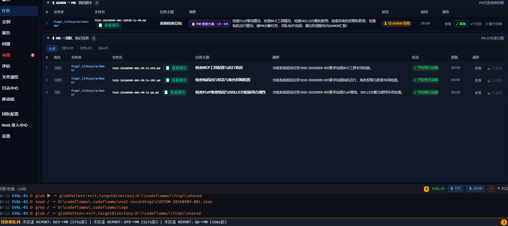

Original screenshot, September 9: the root task awaits ADMIN acceptance while three specialist tasks are complete. The stale “undelivered report” message at the bottom was separately recorded as a display issue. A UI label cannot replace formal delivery receipts. Screenshots preserve the original Chinese interface; the surrounding English text explains the relevant evidence.

### 1.2 The exact task

All six runs received the same initial task body. Reminders, authorizations, and manual termination were recorded separately; this was not presented as an intervention-free experiment.

**Original ADMIN task, preserved verbatim:**

> 检查FCoP落地情况，检查MCP工具情况，检查SKILLS分配和使用，检查各角色权限和职责，检查轨机运行情况；请PM分解任务，团队协作完成；最后形成报告向ADMIN汇报！

**English translation:**

> Check the implementation of FCoP, the MCP tools, the allocation and use of SKILLS, each role's permissions and responsibilities, and runtime operation. PM should decompose the task and have the team complete it collaboratively, then produce a report for ADMIN.

Task titles identified the tested scheme—for example, “system inspection codex,” “system inspection Doubao,” or “system inspection Qwen.” The shared test was the body above. The original wording “轨机” is retained in the source rather than silently edited.

#### Why this task?

First, it inspects the environment the team itself uses: coordination records, available tools, skill allocation, permissions, and runtime health. Second, it explicitly requires decomposition, teamwork, and a final report, exposing organization as well as individual reasoning. Third, it leaves realistic natural-language choices open. We did not preassign every checklist item or dependency, allowing us to observe how each PM chose scope, sequence, and a stopping point.

**A reasonable deliverable is an evidence-backed inspection report.** Each of the five areas needs a scope, a verification method, findings, and any unverified items. Workers should provide formal reports and the PM should form an overall judgment. Finding a system issue does not automatically mean the inspection failed. Conversely, “inspect and report” does not automatically authorize code repair. Inspection completion and product health are separate outcomes.

### 1.3 CodeFlowMu as the test instrument

CodeFlowMu organized the work and retained its evidence. It did not replace the PM's business judgment.

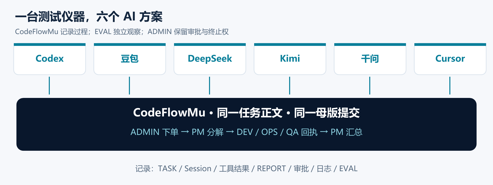

The workflow was ADMIN → PM → DEV/OPS/QA → PM delivery, with independent EVAL examining the records. The instrument had three roles: operate the collaboration, collect evidence of what happened, and support independent review. All timing, completion, and quality comparisons follow that record chain.

### 1.4 Models and integration paths

“Six AIs” means six actual operating schemes. They ran in this order: Codex, Doubao, DeepSeek, Kimi, Qwen, Cursor. Model identifiers came from the identity replies and saved run records.

| Scheme | Model identifier | Provider and execution framework |
|---|---|---|
| Codex | `gpt-5.6-terra` | ChatGPT subscription / Codex CLI (H2 · Shadow) |
| Doubao | `doubao-seed-2-0-pro-260215` | Ark API / Codex app-server |
| DeepSeek | `deepseek-v4-pro` | DeepSeek API / Codex app-server |
| Kimi | `kimi-k3` | Moonshot API / Codex app-server |
| Qwen | `qwen3.8-max` | DashScope API / Codex app-server |
| Cursor | `auto-smart` | Cursor SDK |

The first five used the Codex framework; Cursor used its SDK. The Cursor QA seat initially had a model unavailable through that Host, and recovered after authorization. That intervention remains part of the result. The EVAL configuration stayed Cursor SDK / auto-smart throughout.

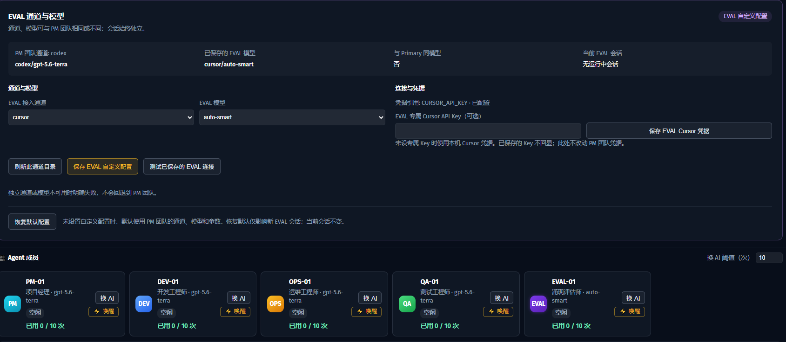

This later-supplied configuration screenshot illustrates the product, rather than proving every historical run's configuration. It shows a Codex/gpt-5.6-terra PM team and a separately configured Cursor/auto-smart EVAL seat. No EVAL session is running in the screenshot. Historical model identity must still be checked against the corresponding run.

### 1.5 Initialization, execution, and timing

**Every run began after CodeFlowMu system initialization.** Records were exported and backed up before initialization for the next run. We configured and checked the next team's model, restarted the service on port 18766 after switching models, and submitted the same task. Late EVAL reports were preserved in supplementary backup batches.

| Condition | Procedure |
|---|---|
| Machine and code | Same machine, CodeFlowMu V2.2.9, commit `cb590ce` |
| Starting point | System initialization before each new run |
| Execution team | Switch and verify the tested configuration; record mistakes and recovery |
| Evaluation | Keep EVAL at Cursor SDK / auto-smart |
| Task | Same original body in section 1.2 |
| Scheduled reminder | Leave the initialization-default PM progress reminder enabled; it wakes the PM but makes no business decision |
| Retention | Separate export and backup by run; correlate sessions as well as possibly reused task IDs |

Initialization is not a full snapshot restore of the OS, every cache, or external model services. Network and provider conditions can change. The result therefore compares integrated teams following a shared initialization procedure, not isolated foundation models under perfectly identical conditions.

Duration runs from the PM's first formal session to successful submission of its normal final report. Authorization and recovery within the run count toward elapsed time. Subsequent ADMIN acceptance and EVAL generation do not. For incomplete runs, we report time to forced termination, not “completion time.”

### 1.6 From a conversation to inspectable work

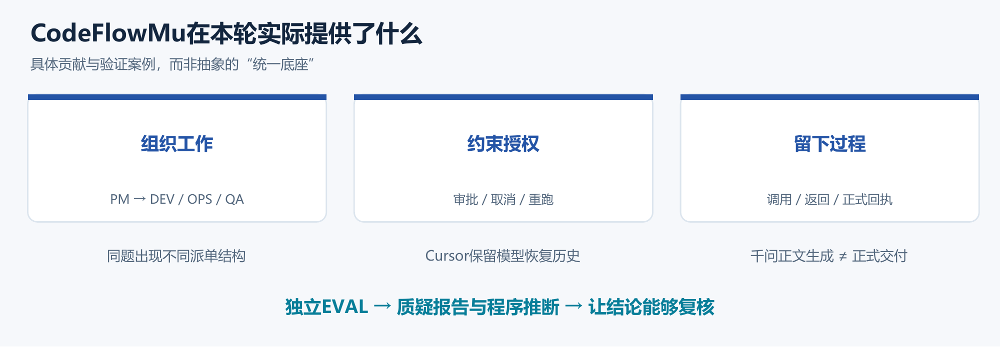

CodeFlowMu placed assignments, execution, delivery, and authorization into a traceable workflow. The PM's organizational choices became observable: how quickly it delegated, which relationships it created, whether reports were complete, and how it handled trouble. Similar final answers need not mean equally reliable work.

The Cursor run retained failed QA launches, ADMIN authorization, cancellation of the old task, the linked rerun, and final delivery. Qwen retained a different sequence: server-side task creation applied despite transport errors, and a complete OPS report body that failed to become a formal report. This distinguishes saying something is done, attempting to deliver it, and actually delivering it.

The same records also revealed instrument defects: stale projections, report-generation problems, and incorrect raw-material associations. That ability to investigate the instrument itself is valuable; it does not mean every projection is already correct.

### 1.7 “Files are the truth” means work must be written down

**Our analysis uses a retained experimental archive, not an agent's memory or retrospective account.** Original CodeFlowMu/Host execution records, FCoP artifacts, independent EVAL reports, and the backups, timelines, checks, and score tables built from them form the evidence base.

| Layer | Retained material | Purpose |
|---|---|---|
| Original run | TASK, REPORT, sessions, tool returns, public progress text, approvals, issues, logs | Preserve assignments, actions, claims, and authorization as observed |
| Independent evaluation | Both EVAL report types, failed generations, late supplements | Supply judgments and gaps that can themselves be checked |
| Preservation | Separate ZIPs, inventories, sizes, SHA256 hashes, source index | Preserve versions and avoid mixing runs |
| Analysis | Stage timeline, timing tables, fact checks, diagnosis, scores, detailed report | Turn retained observations into reviewable conclusions |

We did not ask agents to remember what they had done and then score the recollection. We reconstructed the run, checked task/report links, and compared statements with execution. These files remain useful after sessions end or models change.

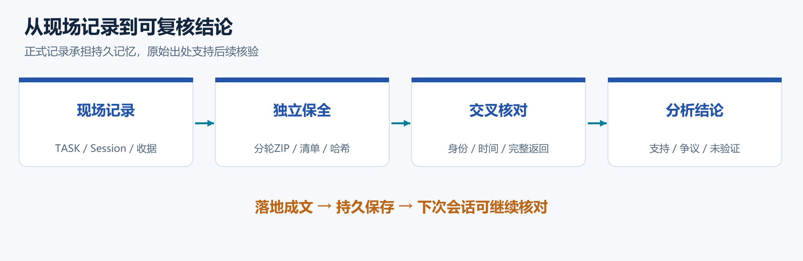

The principle is durable documentation: assignments, actions, approvals, delivery, and analysis must be saved, transferable, and traceable. Files can still contain mistakes. A hash fixes the saved bytes; it does not establish the truth of a business claim.

Each run was exported as a separate `raw-evidence.zip`, with an inventory, sizes, hashes, and ZIP integrity checks. Late Qwen and Cursor EVAL outputs have separate supplements. Runtime evidence comes from CodeFlowMu and its Hosts; independent backup and later review are preservation and analytical steps applied to that evidence.

When records conflict, first align model, time window, Session, task, and report. Initialization can reuse TASK-001 or CUSTOM-001. A shared ID alone does not identify a run. Report text does not prove submission; a “running” display cannot overturn a cancellation receipt; a “pass” claim cannot substitute for the corresponding test.

### 1.8 The business support around agent work

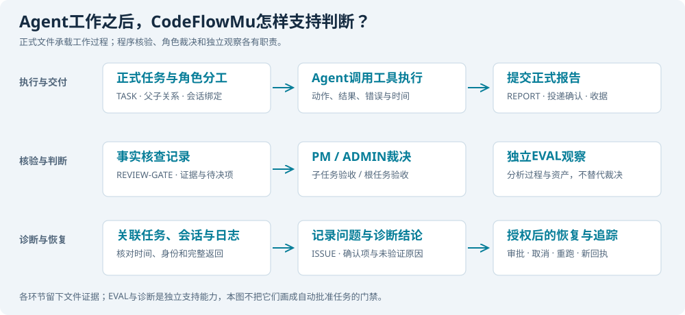

**CodeFlowMu supports what happens after an agent starts working:** evidence checking, acceptance by responsible roles, independent observation, and diagnosis. These are connected by actual files. Execution status, verification, PM judgment, and EVAL analysis should not collapse into one vague “the system says complete.”

First, formal submissions and child tasks identify who is responsible. Execution records connect tasks, roles, sessions, calls, returns, and timestamps. Reports have formal writes and delivery records, separating execution, generated text, submission, and acceptance.

Second, REVIEW-GATE creates fact-check records. In the Cursor archive, a review of DEV task 002 includes `execution_evidence_state: verified`, `review_state: needs_pm`, `business_decision: false`, and `attention_owner: PM`. The evidence had been checked, but business judgment remained with the PM. `third_party_source_state: not_configured` does not pretend an external source was consulted. Compatibility fields must be read alongside the actual decision owner.

Third, PM accepts child work and ADMIN accepts the root task. Commands have receipts and state transitions; restricted actions have authorization records. EVAL and programmatic checks do not replace that responsibility. Cursor's recovery used this authorization path.

Fourth, EVAL records its observations and attempts. Diagnosis follows task, session, tool, delivery, and approval evidence to determine where a failure occurred. Confirmed issues can become ISSUE records; incomplete evidence remains a hypothesis rather than automatically becoming a product defect.

| Support stage | Actual file or file family in the Cursor archive | What can be checked |
|---|---|---|
| Submission and assignments | `SUBMISSION-20260909-001.json`, root/child TASKs, `fcop/ledger/tasks.jsonl` | Request, division of labor, cancellation and rerun relationships |
| Execution | `actions-20260909.jsonl`, `runtime-events-20260909.jsonl` | Actions, sessions, results, and time |
| Tool transport | `.codeflowmu/logs/tool-transport-events.jsonl` | Call identity and transport events |
| Delivery | Four formal REPORTs, `.codeflowmu/report-delivery/acks.jsonl` | Content and delivery to a PM session |
| Fact checking | `REVIEW-…-REVIEW-GATE-on-TASK-….md` | Evidence state, pending decisions, snapshots, responsibility |
| Decisions and authorization | Task-command receipts, approval audit, GOV record | Requests, applied operations, authorization scope |
| EVAL | `OBSERVATION-20260909-002-panel-scan.md`, `…003-benchmark-CUSTOM-20260909-001.md` | Independent asset and run analysis |
| EVAL recovery | `eval-observation-attempts.jsonl` | Starts, failures, retries, and outcomes |
| Issue tracking | `ISSUE-20260909-001-PM.md` and closure records | How the configuration issue was raised and handled |
| Process and usage | Chat/task JSONL, usage JSONL | Public progress, Host results, and usage context |

The [public evidence inventory](business-evidence-index.html) identifies 26 verified files by name, size, and hash. The complete private logs and credentials are not distributed with this article.

### 1.9 What real artifacts look like

These are excerpts from the final Cursor archive, not invented templates. YAML fields and report sections are selected for explanation. Omitted fields may contain additional state and findings.

```yaml
task_id: TASK-20260909-005
root_task_id: TASK-20260909-001
sender: PM
recipient: QA
parent: TASK-20260909-001
depends_on: []
acceptor: PM
rerun_of: TASK-20260909-003
subject: 只读核查 FCoP 落地与角色权限职责边界（模型修复后重跑）
```

`recipient` assigns QA, `parent` and `root_task_id` connect the root task, and `acceptor` assigns PM acceptance. `rerun_of` links new task 005 to old task 003. An empty `depends_on` indicates no explicit execution dependency. The excerpt establishes identity and relationships, not a passing inspection by itself.

```yaml
kind: fact_check
task_id: TASK-20260909-002
report_id: REPORT-20260909-001-DEV-to-PM
review_state: needs_pm
execution_evidence_state: verified
business_decision: false
attention_owner: PM
third_party_source_state: not_configured
```

Verified execution evidence and a pending PM judgment coexist. The review explicitly says it made no business decision. This is how a saved fact check can support acceptance without silently replacing the accepting role.

```markdown
## 子任务回执
- `REPORT-20260909-001-DEV-to-PM.md` ← `TASK-20260909-002`（approved）
- `REPORT-20260909-002-OPS-to-PM.md` ← `TASK-20260909-004`（approved）
- `REPORT-20260909-003-QA-to-PM.md` ← `TASK-20260909-005`（approved；`rerun_of` 作废的 `TASK-20260909-003`）

## 说明
全程保持只读巡检目标；PM 未修改业务代码/配置。根任务业务验收与归档由 ADMIN 决定。
```

The PM lists three worker reports and preserves the QA rerun and ADMIN acceptance boundary. The original report text is Chinese and is intentionally retained as evidence: it says DEV, OPS, and the new QA task were accepted, and final root acceptance and archiving belong to ADMIN. These are claims to check against receipts, approvals, and execution—not proof merely because the report says “approved.” See the [excerpt source index](evidence-excerpts.html).

## 2. Overall Results and Each Team

The results below were checked against formal assignments, reports, execution, and cancellation records captured through CodeFlowMu. We separate completion, inspection quality, and integration failure.

### 2.1 The six results

| Scheme | Normal delivery | Valid worker reports | Elapsed time | Score / 100 | Main observation |
|---|---|---|---|---|---|
| Codex | Yes | Three roles | 12m 20s | 88 | Fast closure with qualified conclusions |
| Cursor | Yes | Three roles, plus one cancelled old QA task | 20m 16s | 87 | Authorized recovery followed by delivery |
| DeepSeek | Yes | Three roles | 39m 21s | 75 | Deeper collection, some incorrect interpretation |
| Doubao | Yes | Three roles | 21m 59s | 66 | Smooth workflow, overconfident report claims |
| Qwen | No | DEV only; PM submitted a blocked report | Terminated after 122m 10s | 40 | Useful diagnosis, ineffective closure |
| Kimi | No | No downstream roles | Terminated after 31m 43s | 18 | Integration/session failure before teamwork |

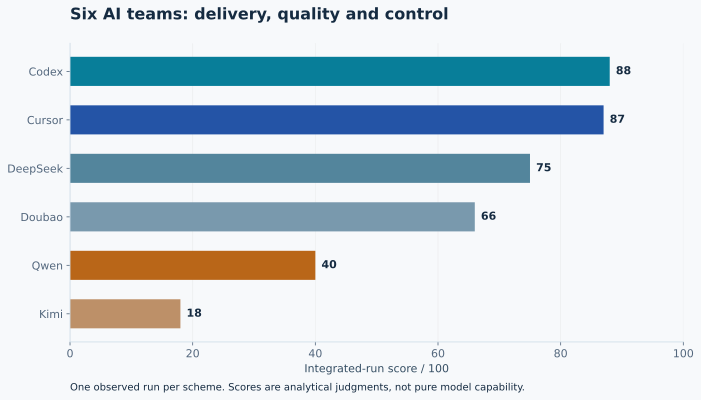

Weights: completion 25, result quality 30, efficiency 15, scope control 15, recovery 10, observability 5. Scores describe these runs, not universal foundation-model ability. Codex and Cursor's one-point difference places them in the same leading group. See the [score data](scorecard.csv).

### 2.2 Completion is more than a final paragraph

Four teams delivered three valid specialist reports and a normal PM final report. Qwen's OPS content remained in a failed submission, QA produced no formal report, and Kimi created no child tasks. Forced archiving stopped a test; it did not complete the assignment.

Codex took fewer actions to reach a qualified conclusion. Cursor showed authorized recovery. DeepSeek's advantage over Doubao was mainly evidence and interpretation quality, not a different final task-state label. Qwen's 40 acknowledges diagnostic work as well as failed delivery; Kimi's 18 describes a non-delivering configuration. Neither score can be read as an intrinsic model score. This was one run per scheme, not a blind or randomized benchmark.

### 2.3 Codex: fast delivery with explicit limits

The PM assigned FCoP/MCP to DEV, runtime to OPS, and skills/permissions to QA, without explicit dependencies. The first child task appeared around 1m 21s after the formal session began. Three worker reports and the PM summary covered all five requested areas.

Its strength was distinguishing static configuration from demonstrated capability and preserving unverified limitations. QA did not turn workflow completion into an unconditional product pass. The 12m 20s duration coexisted with 24/30 result quality. Some verification remained static, so this was not comprehensive functional certification.

### 2.4 Doubao: a smooth chain with weak final review

At about 1m 01s, PM began assigning DEV to MCP, OPS to runtime and permissions, and QA to FCoP/SKILLS. The three tasks had no explicit dependencies. Formal delivery took 21m 59s.

The quality deductions concern unsupported claims: 23 tools claimed but 22 listed, inconsistent skill-count scopes, a greater-than-95% match rate without a denominator, and treating visible schemas as proof of successful parameter validation. PM did not sufficiently filter worker overstatement. Completion 25/25 and quality 12/30 describe different aspects of this same run.

### 2.5 DeepSeek: deeper evidence, imperfect interpretation

PM created three role tasks without explicit dependencies, with the first at roughly 6m 29s and delivery after 39m 21s. Reports distinguished 48 skill references from 54 on-disk directories and on-demand injection. They included software probing and runtime endpoint checks.

However, the team misinterpreted the independently configured Cursor EVAL as a governance violation and recommended committing runtime governance files to the main repository. PM did not correct those interpretations. Quality 18/30 reflects stronger fact collection but insufficient interpretive review. Agreement among several roles does not make a claim true.

### 2.6 Kimi: the team never reached formal downstream work

Runtime recorded eight formal PM sessions ending as failed: seven error endings and a final cancellation. The first formal session received an `encrypted_content` content-type rejection. Six subsequent failure results contained overload and stream-disconnection messages. Tool-preparation records also showed readiness had not been achieved.

PM read resources and requested recovery, but created no formal child tasks or team reports. ADMIN stopped the run after 31m 43s. This establishes that the tested model/Host/adapter combination failed to deliver; it does not establish that Kimi intrinsically cannot use MCP or can never work through Codex. Its teamwork was not adequately exercised.

### 2.7 Qwen: investigation expanded without complete delivery

PM took 11m 46s to create the first child task, then assigned OPS, DEV, and QA, with QA referencing DEV. DEV delivered. OPS generated a complete report body, but its formal submission failed in transport. QA produced no formal report. PM submitted a blocked report and the run was terminated after 122m 10s.

The team encountered genuine transport and dispatch problems. Saying it found nothing would be inaccurate. Yet later probing, waking, pausing, and explanations did not produce effective resubmission or closure. Sparse early progress text and extensive later explanation also made timely supervision difficult. The 40-point result recognizes both diagnostic contributions and failure to deliver.

### 2.8 Cursor: authorized recovery left an inspectable history

DEV covered skills and development-side tools, QA covered FCoP and role permissions, and OPS covered runtime/MCP. QA's unavailable model caused four launch failures. PM requested recovery authorization; ADMIN approved. The old QA task was cancelled and new task 005 ran with a link to the old task. Once all three valid reports were present, PM completed delivery in 20m 16s.

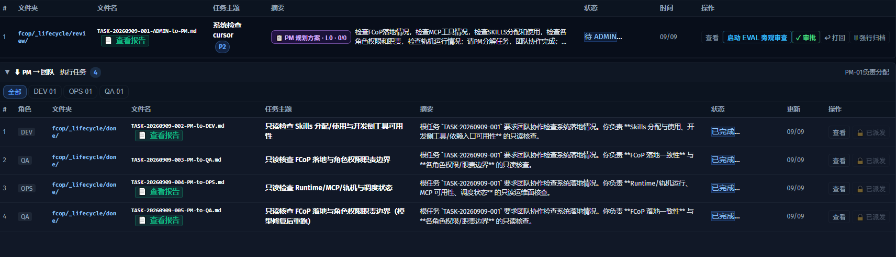

Four visible child-task rows did not mean four successful worker deliveries. Old QA task 003 was cancelled; task 005 supplied the valid QA report. A file in a `done` lifecycle directory must still be interpreted using its actual decision.

This was not fully unattended recovery: human approval was required. The authorization, cancellation, and rerun records are precisely what make the recovery explainable. The score of 87 reflects near-Codex delivery quality and organization under a real configuration problem.

### 2.9 How the score should be read

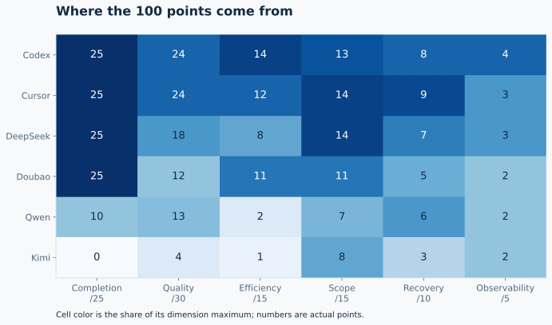

If we judged only a `done` label, four teams would tie. If we judged only duration, unsupported conclusions would disappear. Completion, quality, efficiency, scope, recovery, and observability must be considered together.

Doubao lost quality points for unsupported proportions and overclaiming. DeepSeek lost them for incorrect governance interpretation accepted by PM. Qwen's completion 10/25 and efficiency 2/15 acknowledge partial delivery while recognizing the missing OPS/QA reports. Kimi's completion 0/25 records the absence of formal delivery, not a measured inability to write a good report.

Removing efficiency and normalizing the remaining 85 points gives Cursor about 88.2 and Codex about 87.1. Their order reverses but their grouping does not. A one-point difference in a single-run, judgment-based rubric is not statistically meaningful superiority.

The transparency concern was inconsistent public communication: Qwen had long early stretches of tool activity with little explanation, then much more text when stuck. Later explanation cannot restore the opportunity to supervise and stop earlier. The evidence does not establish an intention to hide activity.

## 3. What the Evidence Lets Us Analyze

This section traces PM assignments through TASKs, time through sessions and returns, quality through worker and PM reports, and EVAL conclusions back to original material. CodeFlowMu's linked records make “what differed, and why?” an inspectable question.

### 3.1 Compare the PM's entire delivery chain

The same task did not produce the same task graph. PM chose who worked first, who reviewed whom, and which relationships counted as dependencies.

| PM | Assignment pattern | Actual delivery | PM review/summary assessment |
|---|---|---|---|
| Codex | DEV: FCoP/MCP; OPS: runtime; QA: skills/permissions; no explicit dependencies | Three role reports and PM summary | Qualified conclusions; static checks not presented as full functional proof |
| Doubao | DEV: MCP; OPS: runtime/permissions; QA: FCoP/SKILLS; no explicit dependencies | Complete team chain | Did not adequately correct counts, scope, proportions, or validation claims |
| DeepSeek | Three-role inspection without explicit dependencies | Team reports with useful runtime collection | Accepted incorrect interpretations of EVAL configuration and runtime files |
| Kimi | No formal child assignment; tool discovery, recovery, and session failures | No team delivery | No final report to assess; organizational capability not sufficiently exercised |
| Qwen | OPS inspection; DEV code-level diagnosis; QA verification referencing DEV | DEV report, failed OPS submission, missing QA report, blocked PM report | Some diagnoses were corrected later; recovery did not yield closure |
| Cursor | Three specialist tasks, followed by cancellation and linked QA rerun | Three valid reports plus retained cancelled task | Authorized recovery is evidenced; human intervention remains part of the result |

**PM report quality means checking** coverage of all five areas, evidence for important claims, correction of worker contradictions, explicit verified/unverified/failure distinctions, and recommendations within the mandate. Concatenating worker reports is not enough.

Kimi's missing final report is “not assessable,” not “a badly written final report.” Qwen's existing blocked report should be judged on obstacle explanation and proposed recovery. The article's result-quality score is a whole-run dimension, not a separately calibrated PM-writing score.

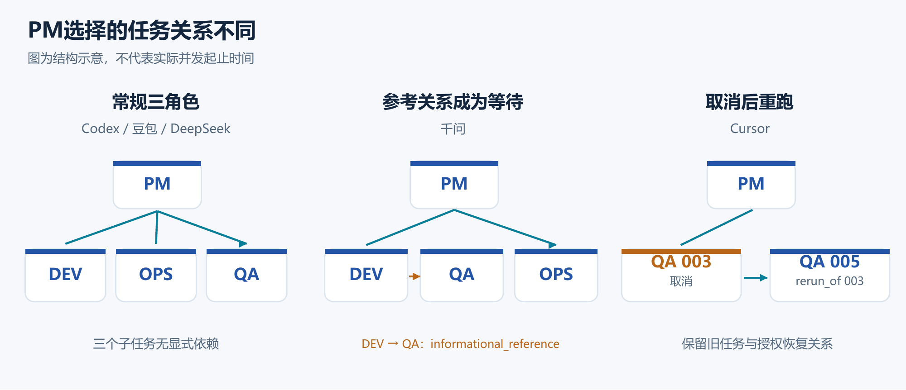

Three independent tasks were not necessarily superficial. Codex and Doubao divided the same scope differently; either can be reasonable when evidence and coverage are clear. Qwen chose a heavier diagnostic route, beginning delegation later and making QA reference DEV. Time before the first assignment is itself an organizational choice.

Reference semantics matter. A reference should supply context without automatically blocking work. This run exposed a dispatch gate that treated that relationship inconsistently. That is a system issue. PM still has to judge whether the added relationship is needed and how to adapt when it obstructs a bounded inspection.

### 3.2 Visible configuration is not demonstrated capability

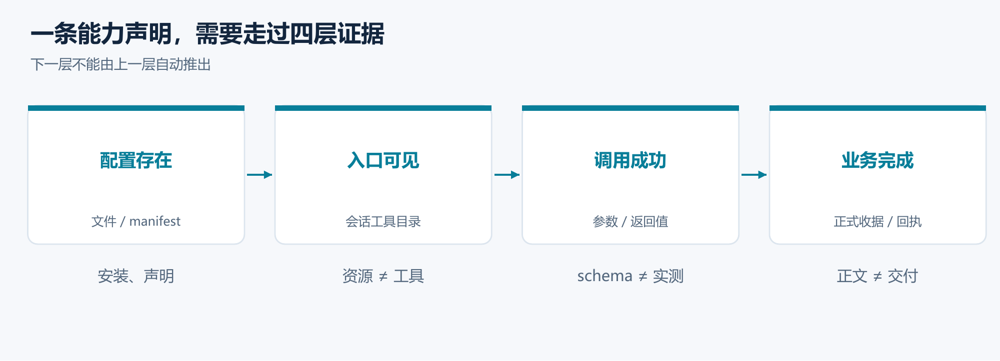

Resource visibility, schema visibility, actual tool execution, and successful business delivery are different levels of evidence. One cannot substitute for the next.

Codex retained limitations and a partial QA conclusion. Doubao treated schema listing as validation and mixed skill scopes. DeepSeek made useful distinctions in its collection but then misread the independent EVAL setup. PM review must test the relationship between each claim and its source, not reward file volume.

Kimi never reached a comparable complete team chain. Its actual resource reads and recovery calls matter, but so do the request rejection and interrupted sessions. The records support failure of this configuration, not a universal inability to understand MCP.

### 3.3 Did longer runs buy more useful evidence?

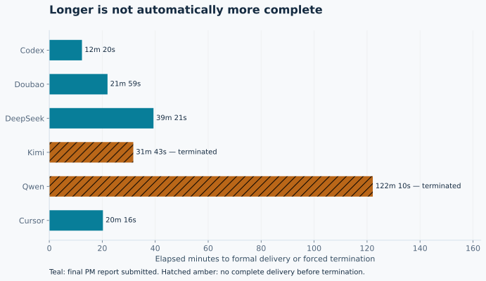

Codex's fastest delivery still had materials corresponding to all five areas. Cursor's 20m 16s included authorized recovery. DeepSeek's additional checks had value, but its report also contained a wrong governance interpretation. Qwen's two hours combined real infrastructure obstacles with ineffective later investigation.

The four completed runs had a median of about 21m 08s. A 20–30 minute budget is a reasonable starting hypothesis for a future bounded inspection on this environment. It was not a limit imposed on these runs, so it cannot be retroactively treated as a contract violation.

### 3.4 Efficiency is evidence value per unit of effort

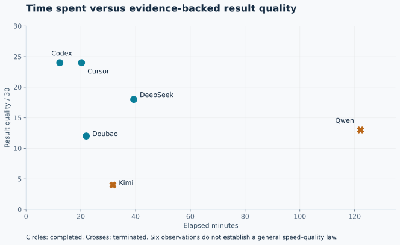

Among completed runs, Codex's speed did not accompany a lower quality score. DeepSeek spent about 27 extra minutes and collected additional runtime evidence, but did not produce a more trustworthy overall conclusion.

Elapsed time includes preparation, pre-delegation checking, the longest worker path, retries, PM review, and summary. Stages overlap; role durations cannot simply be added. Cursor also includes authorization waiting. The evidence does not support a precise allocation such as “X% model delay, Y% platform delay.”

More issue claims must first be screened for false positives. Unsupported proportions, old snapshots, and incorrect governance explanations create review work. Issue counts and report length are not substitutes for useful findings.

Cost comparisons also need boundaries. Qwen's roughly CNY75.56 came from a daily screenshot. DeepSeek's CNY15.6486 export included other requests in its hourly aggregation. Subscription channels do not have zero cost. This evidence supports a time-efficiency assessment, but not a precise cost-per-qualified-report ranking.

### 3.5 Where Qwen's two hours went

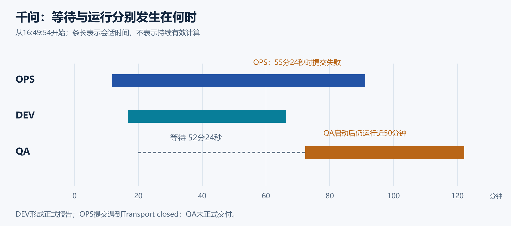

QA was created at 17:09:51 and started at 18:02:15: **52m 24s waiting**. The declared relationship was `informational_reference`, yet a dispatch gate required successful DEV closure. The historical source and runtime trace support this issue.

After QA started, it ran for nearly another 50 minutes without formal delivery. The earlier dependency no longer explains that entire delay. OPS called `write_report` with complete content, but received `Transport closed`; no formal report was saved. PM then probed, woke, and paused repeatedly without an effective resubmission path, ultimately reporting blocked.

Some deeper claims should be withdrawn. The alleged “ghost running QA” used a topology snapshot from before QA started. The allegedly random `limit` failures compared string and integer arguments. The root cause of short-name instability was not demonstrated under equivalent conditions. Genuine issues, hypotheses, and mistaken interpretations must remain separate.

### 3.6 Cursor's recovery was a governed sequence

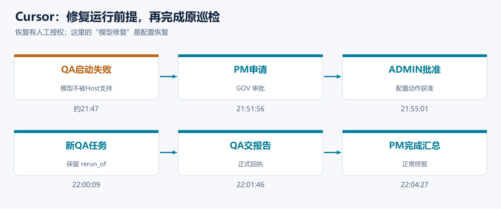

System initialization had occurred, but the QA seat was misconfigured with `qwen3.8-max`, unavailable through Cursor SDK. OPS identified a model-availability problem rather than an MCP or lease failure. PM requested authorization at 21:51:56; ADMIN approved around 21:55.

The old QA task was cancelled. A new task linked by `rerun_of` started at 22:00:12 and produced its report at 22:01:46. PM's successful final submission followed at 22:04:27. These relationships preserve the failed attempt rather than overwriting it as success.

Recovery of an authorized execution prerequisite is different from unauthorized scope expansion. In the September 8 comparison, the first Codex run expanded inspection into code repair and was stopped. That was a separate historical run. The September 9 Codex run did not repeat the behavior; this does not prove the earlier event was caused by another AI's old records.

### 3.7 Does the Codex integration explain failure?

**Both incomplete schemes used the Codex framework.** Integration is therefore part of the causal analysis. The evaluated object is the model, provider API, adapter, Host, and CodeFlowMu working together—not a foundation model in isolation.

| Scheme | Evidence | Supported conclusion |
|---|---|---|
| Kimi | One explicit rejection of `encrypted_content`; six later disconnections carrying an overload message; no downstream tasks | **A content-compatibility error and runtime failures occurred.** Team capability was not sufficiently exercised to infer weak intrinsic ability |
| Qwen | Created tasks, used tools, delivered DEV work; QA dispatch waiting, OPS submission failure, old-snapshot misinterpretation, extended investigation without closure | **Integration could operate, but the delivery chain had faults and PM handling was insufficient.** Compatibility does not explain everything |

Kimi's overload messages are not themselves compatibility errors. Qwen's dispatch gate issue belongs to this system workflow and is not automatically attributable to Codex or Qwen.

Codex, Doubao, and DeepSeek completed through the same overall framework, so “uses Codex” is not sufficient to explain failure. Provider-specific request content, tool representation, returned results, and recovery behavior matter. Cursor's successful SDK run changed both model and framework, so it is not a controlled demonstration that moving Kimi or Qwen to another Host would fix them.

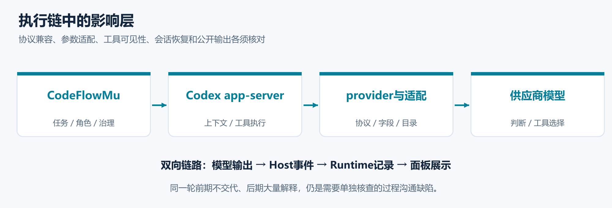

The tested source configured custom providers for Responses and disabled Codex reasoning-summary metadata support. The Doubao Ark bridge also normalized request fields and changed tool exposure. That Ark-specific behavior should not be attributed to every provider. Identical framework names do not guarantee identical effective tool catalogs, requests, or public output.

Disabling a summary does not establish that a model stopped reasoning or could not provide public progress. Qwen's sparse early explanation and later verbosity require comparison of raw assistant output with Host and UI events. The observed inconsistency harms supervision; deliberate concealment is not established.

To separate model ability from integration effects, repeat the same model and task on another verified executor with matched tool semantics and budgets. A website chat is not an equivalent control. These six runs do not quantify an integration penalty.

### 3.8 The evaluator also needs checking

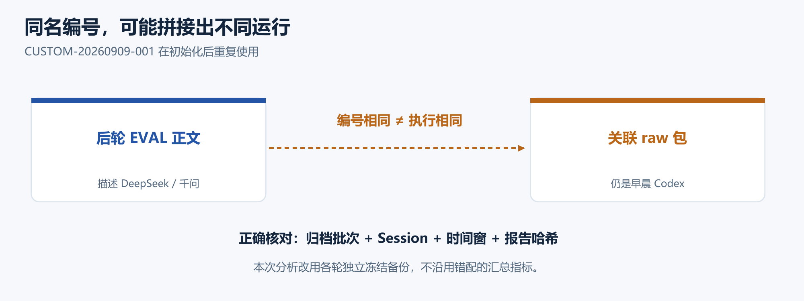

A uniform evaluator cannot compensate for incorrect inputs. Some task-record analyses described the current run but linked to raw packages containing morning Codex sessions, role routes, and report hashes. Initialization reused CUSTOM identifiers, creating a risk of mixing windows. `coverage=complete` did not establish identity correctness. This article used separate run backups rather than copying disputed counts.

There was also a report-generation problem: replay showed section extraction treating child headings as the end of a parent section, making an otherwise populated report appear empty. The UI sometimes displayed `completed` as a failure reason. A later successful Cursor generation proved that one output was accepted, not that the defect had been fixed.

Billing has an analogous identity problem. DeepSeek's export contained 168 requests, about 16.22 million tokens, and CNY15.6486, with hourly aggregation including identity chat. Qwen's daily screenshot showed about CNY75.56 without task-isolated detail. Unknown cost must not be replaced with zero or an invented precise ranking.

### 3.9 EVAL record reports and observation reports

EVAL used Cursor throughout, with two report types: observations of system assets/projections and analysis of a particular task run. Programmatic collection and independent analysis are separate stages. A generated collection record is not automatically a finished EVAL judgment.

##### 01 / Collect the run material

The collector receives the project root and run ID. Collecting material is distinct from completing independent analysis.

```typescript
  const child = spawn(
    process.execPath,
    ["packages/evaluator/eval-benchmark-record.cjs", "--project-root", projectRoot, "--run-id", runId],
    { cwd: projectRoot, detached: true, stdio: "ignore" },
  );
```

Source excerpt: `codeflowmu-shell/src/eval-benchmark-recording.ts, lines 592–596`, test commit `cb590ce35686cb1980e3c89a7d68bd0cfbeb825a`.

##### 02 / Start a separate EVAL session

The target report, analysis kind and root task are bound to an EVAL session. The tested EVAL configuration was Cursor / auto-smart in every run.

```typescript
      const handle = await runtime.sessionManager.startSession(
        agentId,
        sessionTaskId,
        {
          text: skillInjection.prompt,
          maxToolRounds: DEFAULT_SESSION_MAX_TOOL_ROUNDS,
          uiLang: readPanelUiLang(getProjectRoot()),
          context: {
            eval_observation: true,
            eval_analysis: true,
            analysis_kind: request.analysisKind,
            analysis_target_path: request.reportPath,
            root_task_id: request.mainTaskId,
            session_kind: "CHAT_BOUND",
          },
        },
      );
```

Source excerpt: `codeflowmu-shell/src/web-panel.ts, lines 17863–17879`, test commit `cb590ce35686cb1980e3c89a7d68bd0cfbeb825a`.

##### 03 / Validate the analysis before accepting it

A completed session does not automatically constitute a valid report. This excerpt rejects malformed analysis; the surrounding function also checks provenance and required skill receipts.

```typescript
  const contentErrors = validateEvalAssistantText(content, input.analysisKind);
  if (contentErrors.length) {
    throw new Error(`EVAL_ANALYSIS_FORMAT_INVALID: ${contentErrors.join(",")}`);
  }
```

Source excerpt: `codeflowmu-shell/src/eval-independent-analysis.ts, lines 286–289`, test commit `cb590ce35686cb1980e3c89a7d68bd0cfbeb825a`.

##### 04 / Persist the report as UTF-8

After analysis and provenance are assembled, a temporary UTF-8 file replaces the target report. This code explains the mechanism; it does not prove that any particular run passed the checks.

```typescript
  const temporary = `${absolute}.analysis-${process.pid}-${Date.now()}.tmp`;
  writeFileSync(temporary, raw, "utf8");
  renameSync(temporary, absolute);
  return absolute;
```

Source excerpt: `codeflowmu-shell/src/eval-independent-analysis.ts, lines 393–396`, test commit `cb590ce35686cb1980e3c89a7d68bd0cfbeb825a`.

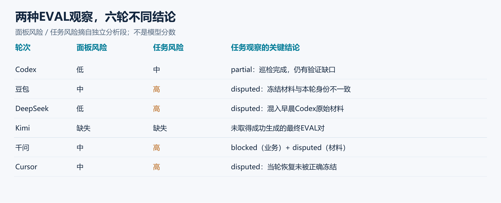

The risk labels below come from independent analysis sections. High risk can concern evidence identity rather than poor team delivery; absent reports do not mean low risk.

| Scheme | Panel observation | Task-record analysis | Interpretation |
|---|---|---|---|
| Codex | Low | Medium | Completed inspection with remaining evidence gaps; partial observation, not unconditional product pass |
| Doubao | Medium | High | Current delivery existed, but frozen materials were disputed |
| DeepSeek | Low | High | Task/report inventory broadly consistent; raw package identity disputed |
| Kimi | Final report not obtained | Final report not obtained | Underlying recording and execution evidence still exist |
| Qwen | Medium | High | Business blocked and frozen-material identity disputed |
| Cursor | Medium | High | Live recovery traceable, but linked task-record materials disputed |

Doubao and Cursor EVAL analyses corrected a scanner's false alarm: after the root task moved to ADMIN acceptance, an empty PM todo view could be correct. The completed run must not be labelled missing solely from that projection.

**Kimi had records even without a completed final EVAL pair.** Its archive contains a 17,488-byte `.codeflowmu/eval-recordings/CUSTOM-20260909-001.json`, begun at 16:08:52 Beijing time, with `state: recording` and `generation_attempts: 0` in that snapshot. Task/chat process files and Runtime events are also preserved. This establishes a recording entry, not successful final report generation. We did not fill the gap using another run's reports.

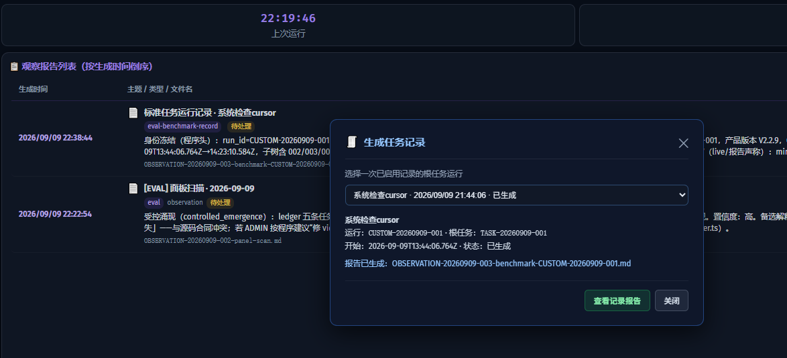

The screenshot shows a successful later Cursor report. Saving a report is one check; matching its content and identity to the run is another.

### 3.10 EVAL is useful, but not the final truth

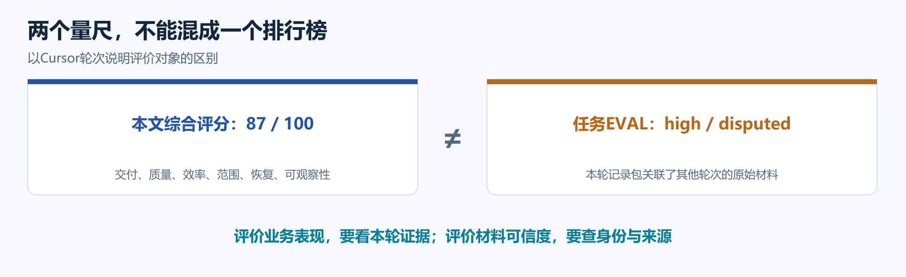

The article asks both whether the team delivered and whether its evidence is reliable. EVAL is valuable because it can challenge a convincing report. Its own claims also need review.

Cursor's score of 87 and high task-record risk are not contradictory measures of the same thing. The score uses the corresponding independent run backup and recovery chain. The risk addresses the associated record package's identity problem. We did not use disputed raw counts as if they belonged to the current run.

EVAL's corrections were often more useful than adding issues: it rejected “empty PM todo means lost work,” and distinguished actual Qwen transport failure from an asserted permanent dependency deadlock. DeepSeek's claim that the independent Cursor EVAL was a violation also needed correction: that configuration was intentional.

CodeFlowMu's product value is that successful delivery, authorized recovery, disagreement, and defects can all be investigated from retained records. Reliable run identity, correct freezing, and truthful generation states are priorities for improvement.

### 3.11 Fact checking: return a claim to its source

| Claim | Evidence compared | Finding |
|---|---|---|
| “OPS finished the report” | Complete call body, returned status, formal file and receipt | Qwen generated the body but failed submission |
| “PM todo is empty, so work was lost” | Root state, ADMIN acceptance view, projection contract | EVAL corrected the scanner's inference |
| “QA is running but has no session” | Snapshot time, QA launch time, session record | A pre-launch snapshot cannot prove ghost execution |
| “This raw package belongs to this run” | Model, time window, Session, routes, hashes | Several same-named packages contained earlier Codex material |

Identify the same run and attempt before asking what a record proves. Successful transport, successful command execution, and successful business delivery are different outcomes. Missing evidence remains unknown; conflicting evidence remains disputed until resolved.

No usable external third-party fact source was configured in this test. These checks relied on local execution evidence. They are not an external database certification or an automatic endorsement from a standards authority.

### 3.12 Diagnosis: make “stuck” a specific problem

Diagnosis should explain what happened, where the evidence is, and which layer needs investigation next. CodeFlowMu linked tasks, sessions, tool results, and logs to formal work, rather than leaving diagnosis as a conversational impression.

| Layer | Observed fact | Diagnostic implication |
|---|---|---|
| Configuration | Cursor QA used an unavailable model | Authorized correction, cancellation, and a linked rerun restored delivery |
| Submission | Qwen OPS returned `Transport closed` after sending complete content | Confirmed submission failure; inspect recoverable delivery rather than blame only the model |
| Dispatch | Qwen QA's reference relationship still waited for DEV at one gate | Explains initial waiting, not all later non-delivery |
| Integration/session | Kimi content rejection and interrupted sessions | Validate the request and endpoint path before judging full team ability |
| EVAL output | Material collected but extraction, validation, or UI status problematic | Separate collection, analysis, and final file write |

Useful diagnosis narrows the problem and supports recovery. Cursor supplied an end-to-end recovery example. Qwen supplied a case where actual issues were found but diagnostic scope was not controlled. Independent evaluation raises questions, fact checking tests their basis, and diagnosis identifies causes and possible next steps. PM and ADMIN retain responsibility for decisions.

### 3.13 The two incomplete runs, with precise evidence

Kimi did not establish downstream teamwork. Qwen established it but failed to finish delivery. ADMIN termination was the ending action, not the sole explanation for what preceded it.

For Kimi, the archived Runtime file contains an explicit error at **16:15:10**: `invalid_request_error: responses: unknown content part type: "encrypted_content"`. Six later failure results, from **16:19:18 to 16:33:12**, contain `responseStreamDisconnected` and `The engine is currently overloaded, please try again later`.

The eight formal failed endings consist of seven error endings and one final cancellation. Four recovery calls returned `refresh_queued` with `tools_ready:false`. Resources and commands were used, but no formal child TASK or REPORT resulted. In the corresponding archived `sdk.result` records for Codex, Doubao, DeepSeek, and Qwen, these two specific signatures were not found. That comparison does not imply their tool paths were fault-free.

The content rejection is direct compatibility evidence. The overload text is a returned service signal, not an independent measurement of actual server load. We still cannot identify which component introduced or retained the unsupported content, the precise origin of the overload message, or whether the tool-readiness issue shares the same cause. See the [timestamped source evidence](kimi-failure-evidence.html).

For Qwen, the reference dependency's gate explains 52m 24s of waiting, and OPS transport failure explains a real delivery obstacle. QA then ran nearly 50 minutes without a formal report. Continued investigation included old-snapshot and argument-comparison mistakes. These support criticism of PM recovery and scope control, but do not quantify the share of blame attributable to each component.

Future validation should differ: Kimi first needs a minimal formal tool-discovery, child-task, and report chain; Qwen needs validated dispatch/submission recovery followed by a bounded inspection. These are proposed checks, not fixes already completed.

## 4. Conclusions: What CodeFlowMu Made Possible

### 4.1 The system made the comparison evidence-based

**The demonstrated value is turning a natural-language request into teamwork that can be assigned, tracked, checked, and handed over.** CodeFlowMu supplied operational visibility and management controls. FCoP made assignments and deliverables persistent. EVAL provided another opportunity to challenge conclusions.

| Retained system evidence | Question it answers | Result in this test |
|---|---|---|
| TASKs and relationships | How did PM divide the work? | Distinguished parallel inspection, reference dependencies, and linked reruns |
| Sessions, returns, timestamps | What actually ran, and where did it fail? | Identified Kimi's content rejection and overload/disconnection sequence |
| REPORTs and receipts | Was content actually delivered? | Avoided counting Qwen OPS text as formal delivery |
| Worker reports, PM summary, reviews | Did PM correct unsupported claims? | Exposed Doubao's count/proportion/validation problems |
| Approvals, cancellation, reruns | How was recovery authorized and executed? | Reconstructed Cursor's recovery without erasing the failed QA attempt |
| EVAL records, reports, status | What was independently assessed, and what was missing? | Preserved disputes and allowed Kimi diagnosis from underlying records |

These judgments depend on evidence captured and retained during CodeFlowMu operation. Host/tool errors are recorded as returned; FCoP artifacts express formal collaboration; CodeFlowMu connects them to the business workflow. The exported backups and subsequent checks then turn records into analysis. This is not a story reconstructed from agent memory or from a green status label.

System defects remain in the article because the same records make them inspectable. Success has delivery evidence; failure has diagnostic traces; recovery has an authorization history; evaluation has sources. Scores and diagnoses are EVAL and analytical judgments, not automatic business decisions made by the system.

### 4.2 What the six schemes suggest

For this inspection, Codex is the first choice for routine execution; Cursor belongs in the same group where authorized intervention is available. Among the domestic-provider configurations, DeepSeek is the first candidate for further testing, followed by Doubao. Qwen needs bounded task-control testing; Kimi needs integration validation first.

Codex and Cursor both scored 24/30 for result quality. Their advantage was keeping conclusions proportionate to evidence while reaching delivery. DeepSeek and Doubao showed they could organize the workflow, but PM review did not consistently filter incorrect interpretation or overstatement. Qwen and Kimi require different diagnoses rather than a shared “bad model” label.

### 4.3 Capability, reliable delivery, and review are separate thresholds

Doubao and DeepSeek demonstrated task decomposition, tool use, and formal team reporting through this framework. That does not establish that every domestic model is ready for an unsupervised PM role, nor does the failed pair prove that domestic models lack the underlying ability. Running successfully, reporting truthfully, and recovering effectively are distinct thresholds.

CodeFlowMu improvements should prioritize reference-dependency semantics, recoverable report submission, cross-run identity, and EVAL format handling, followed by stale display and progress-text issues. Traceability has been demonstrated; perfect calibration has not.

The original “inspect and report” wording did not authorize code repair. Production requests can further specify read-only scope, permitted formal assignments/reports, a budget, and when to stop investigating. Clearer language reduces ambiguity but does not replace PM judgment. A separate bounded-text test should not be mixed with the original wording and presented as an unexplained model improvement.

The scores remain 88, 87, 75, 66, 40, and 18 for these integrated runs. Foundation-model ability and integration loss were not separately measured.

### 4.4 A reliable team also knows when to stop

Inspection does not need to eliminate every defect. Reliable findings, supporting evidence, and sensible next steps can complete the assignment; repair needs its own authorization.

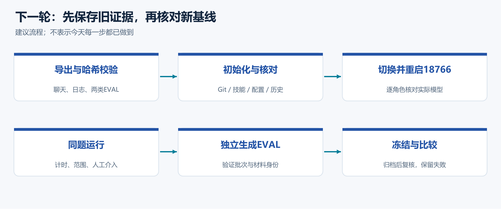

A future A/B protocol could retain the original task in one arm and explicitly bound read-only work and time in the other. Rotate the order, repeat each scheme at least three times, and preserve both EVAL reports and failed drafts. Exporting/checking old evidence and verifying the initialized next environment solve different problems.

A common Git commit is not a full machine snapshot. Provider, adapter, effective tool catalog, network, task graph, and interventions still differ. Verify actual role sessions after configuration changes, not merely dropdown labels.

### 4.5 Methods, sources, and limits

Evidence was retained by run and archive batch: TASKs, REPORTs, sessions, tool receipts, chat and public progress, approvals, issues, logs, and EVAL. Qwen and Cursor have late supplements. ZIP integrity, file lists, and hashes were checked before comparison. Complete private logs are not published here.

Timing ends at successful formal final-report submission; termination is separately labelled. The 100-point rubric is a transparent judgment-based assessment with six weights, not a statistical confidence interval. One formal sample per scheme, fixed order, different provider paths, and Cursor's intervention limit generalization. Initialization was shared, but every cache, skill, historical reference, and external condition was not proven identical.

A reference answer for the inspection should cover all five areas with scope, reproducible evidence, conclusions, unknowns, worker receipts, and a PM summary. It must be tied to the actual version and configuration, not a permanent answer independent of system state.

The public package contains the article, figures, selected evidence, scoring/timing data, and source explanations. The concept cover is AI-generated, not a scene photograph. Screenshots are original evidence; diagrams explain mechanisms and are not substitutes for execution. English quantitative charts accompany the complete English analysis. Original screenshots, mechanism diagrams and literal report excerpts retain Chinese source labels, with English explanations in the surrounding text. Supporting source documents are labelled by language in the public source guide.

[Public source guide](sources.en.html) · [Evidence inventory (Chinese)](business-evidence-index.html) · [Actual excerpts](evidence-excerpts.html) · [EVAL source and checks](EVAL对照与来源.html) · [Kimi error evidence](kimi-failure-evidence.html) · [EVAL code excerpts](eval-generation-code.html) · [Scores](scorecard.csv) · [Timing](timing.csv) · [Stage timeline](stage-timeline.csv)

This public article and its supporting files are published separately from the private CodeFlowMu source repository. No access to the private repository is required to read the article or the disclosed evidence excerpts.
