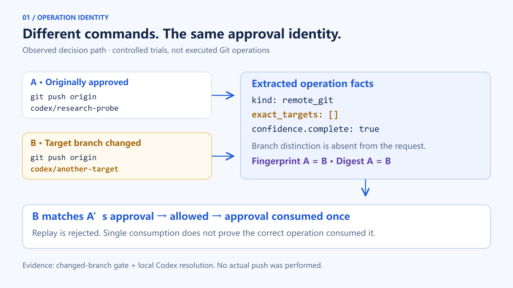
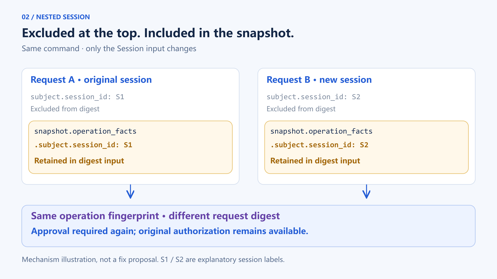

# You Approved One Command. Why Did Another Pass? An Experiment in Agent Authorization Identity

[](assets/approval-identity-cover-v2.png)

We first created an approval for this command:

```text
git push origin codex/research-probe
```

Then we kept the project, task, agent, and session unchanged, but changed the target branch:

```text
git push origin codex/another-target
```

The second command passed the approval decision. The first command's authorization was marked as consumed.

Another experiment produced the opposite surprise. We left the command unchanged and replaced only the session with the wake session registered in the approval record. The system requested approval again.

**An operation change that should have mattered did not. A session transition the system intended to support changed the match instead.**

This was an isolated, controlled experiment, not a production push incident. Neither command actually ran. The decision code and approval persistence, however, were real product implementations.

## 1. Why investigate this boundary?

CodeFlowMu is a local multi-Agent collaboration system we are developing. Its FCoP file protocol preserves formal tasks and collaboration records, so a task's identity does not depend on one Agent session remaining alive. The runtime must answer a separate question: when an Agent requests an operation that requires approval, what exactly does that approval cover?

Recovery makes the question difficult. An original session may stop and another may take over. The approval record and task files remain. Their existence cannot automatically authorize execution, but irrelevant context changes should not accidentally destroy a recognizable operation identity either.

Recent Codex changes prompted this investigation. Codex is OpenAI's coding agent; Guardian is part of its tool-safety review machinery. [PR #42588](https://github.com/openai/codex/pull/42588), merged on September 3, checks the producer compatibility of compaction checkpoints in a specific context mode. Missing or incompatible provenance requires synchronous review rather than allowing a fast decision that omits the checkpoint. [PR #42579](https://github.com/openai/codex/pull/42579) retains host-verified user answers and restricts fast approval when the evidence is incomplete.

Those changes concern **whether evidence is usable for a current Codex review**. They do not establish the Git digest defect in this article, nor suggest that CodeFlowMu should build another Guardian. We extracted a narrower question:

**Why does this existing approval apply to this particular call?**

An `approved` field alone cannot answer it.

## 2. Approval protections already existed

We fixed the source at `fdadbed489129455437f25202a03bae6e0c2e822`, the V2.2.8-related baseline used in this study. Subsequent changes to main do not change this experiment's claims.

First, we reran four existing suites covering operation approvals, parent/child task identity, evidence association, and credential redaction. Both runs produced **31 passes, no failures, and no skips**. That means 31 tests repeated twice—not 62 independent scenarios, and not full-product acceptance.

The approval tests already demonstrated useful protections: a changed request target is rejected, an approval is consumed once, some recovery calls can read existing records, and manually constructed requests support Session continuation.

We therefore did not conclude that the system lacked approval or needed idempotency added from scratch. The next question was whether **requests constructed by the actual tool entry point preserve the identity information those tests assume**.

Our probe passed through the real Native approval gate, created a pending record, and approved it through the service. A separate Node process then read that record and requested consumption. Calls that passed were retried from another process. This ruled out an explanation based solely on in-memory approval state; it was not a power-loss test.

Eleven inputs were tested twice, with consistent outcomes:

| Change relative to the approved request | Actual gate result | Authorization record |
|---|---|---|
| Same session and operation | Allowed; replay reported already consumed | consumed |
| Only use the registered wake session | Approval required again | available |
| Use another nonempty session | Approval required again | available |
| Omit the session | Approval required again | available |
| Change Agent | Approval required again | available |
| Change TASK | Approval required again | available |
| Change thread | Approval required again | available |
| Change project | Approval required again | available |
| Same session, change only the push branch | **Allowed; replay reported already consumed** | **consumed** |
| Change the source channel | Approval required again | available |
| Cancel while pending, without approval | Approval required again | invalid |

Whether different source channels should be equivalent needs its own contract; we do not classify that row as a defect. The session rows also do not prove that a real successor had satisfied every takeover requirement. The experiment changed the session input and registered a corresponding wake session.

The two opposing results warranted investigation: a branch change was accepted, while a session-only change failed to match. The complete probe retained both expectation violations, twice each, and exited with an assertion failure. We did not turn it into an all-green report. The [companion evidence guide](evidence/README.en.md) maps the individual observations.

## 3. The hash did not collide. The operation information disappeared first

The approval pipeline has several distinct responsibilities:

```text
Tool name and arguments
→ Adapter extracts operation facts
→ Construct operation fingerprint and approval request
→ Compute request digest
→ Match an approved record
→ Consume once
```

The operation fingerprint identifies the extracted facts. The request digest binds the approval request. Neither is inherently a substitute for the original command.

In the tested implementation, the shell adapter recognizes `git push` as a remote Git write, so the initial call requires approval. That risk classification works.

But it does not preserve the remote, branch references, or force/delete distinctions in these commands as corresponding operation identity information. The probe's target arrays are empty while completeness remains true. The approval request does not restore those distinctions from the original command.

“Both are remote Git writes” consequently becomes “both are the same approved operation.”

[](assets/operation-collapse.en.png)

*Figure 1. Command distinctions disappear before hashing. Source: fixed-baseline field comparisons, approval gate and local Codex resolution observations; no actual push was performed. Click the image for full resolution.*

We compared seven inputs field by field, twice each:

| Change | Operation fingerprint | Request digest |
|---|---|---|
| Identical request | Same | Same |
| Different branch | Same | Same |
| Different remote | Same | Same |
| Add `--force` | Same | Same |
| Change to `--delete` | Same | Same |
| Different Session only | Same | **Different** |
| Different TASK | Different | Different |

This is not a cryptographic collision in SHA-256. After adaptation, the four operation-changing variants produce approval requests with no field differences. **Different inputs were reduced to the same object before hashing. The hash faithfully produced the same value for that same object.**

The TASK negative control matters: the function is not returning a constant for everything. Specific semantic distinctions are missing from its input.

We also called the actual local resolution function for Codex native approval requests. The original command and the changed-branch command were each tested twice. All four decisions allowed the call and consumed the approval. That reaches the product's Codex approval-resolution entry point, but we did not start a Codex app-server, send a real approval response, or execute a push.

The distinction is important: **remote, force, and delete changes were verified at the digest-equality boundary; the branch change was additionally verified at approval consumption.** These are not reports of those operations executing.

This also explains why single consumption cannot protect the boundary by itself. It answers “Has this approval been used?” rather than “Is the operation using it the one that was approved?”

## 4. Session was excluded at the top level—and returned through the snapshot

The opposite anomaly came from another field.

The lower-level `computeOperationDigest` explicitly excludes `subject.session_id` at the top of the request. This is consistent with the existing continuation test: an otherwise matching operation need not always complete in its original session.

The real request builder also embeds the complete operation facts in a snapshot. Changing only the Session produces two differences:

```text
subject.session_id
snapshot.operation_facts.subject.session_id
```

The digest function excludes the first, but not the second.

[](assets/nested-session.en.png)

*Figure 2. With the command unchanged, nested Session data can change the request digest. Source: actual request comparisons and an in-memory counterfactual. S1/S2 are explanatory labels, not real session IDs or a proposal to remove all session bindings. Click the image for full resolution.*

As a result, the operation fingerprint stays the same while the request digest changes. The consumption service cannot select the original approval by digest, before it reaches subsequent identity checks. Even with the new wake session recorded, that authorization remains available.

An in-memory counterfactual isolated the cause: remove only the nested Session field from both request snapshots and call the original digest function. The old and new session requests then have equal digests. We did not change the product or execute the transformed requests.

This is not a recommendation to recursively delete every `session_id`. Some operations legitimately depend on scratch-directory ownership, the current executor, or session-bound permissions. Those protections cannot simply disappear.

The necessary distinction is between **fields that define the operation, fields that document this run, and fields that must be revalidated at execution time**.

The test discrepancy now makes sense. The lower-level unit test constructs a simpler approval request. The real entry point adds a facts snapshot containing the Session. Both tests may be described as “same operation, new session,” but their request shapes are different.

## 5. Authorization identity needs mutation tests in both directions

These two observations should not receive unrelated quick fixes called “include more fields” and “include fewer fields.”

Hashing everything is not automatically safe: it can mix incidental execution context into operation identity. Coarse classification is insufficient too: it can make different operations share an approval scope.

For execution paths that require exact approval, we suggest taking three questions into engineering review before choosing a refactoring scope.

**First, a semantic operation change must invalidate the approval match.** For Git, “still a push” is not enough. Relevant distinctions include the target repository or remote, references, update mode, and other conditions that the approval requires to remain fixed. A digest cannot recover information lost before canonicalization.

**Second, permitted execution-context changes must not accidentally change operation identity.** This does not authorize a new Session automatically. After matching the operation, the system must still verify the current caller, authorization state, and applicable scope. An old receipt is not a new execution grant.

**Third, test between the real request producer and consumer.** Do not only handcraft an ideal CapabilityRequest and establish that consumption works. Feed original tool arguments through the actual adapter and inspect what the system approves and later matches.

A small useful test set includes the original-operation control, changed target, changed mode, permitted context continuation, changed TASK or executor, cancellation, and repeated consumption. The two key mutation directions have opposing expectations: differences that matter must break the match; permitted continuity should preserve identity while retaining current-authority checks.

This research also examined a separate identity question: could two tasks with identical text but different task IDs substitute for one another as a dependency? Six parent/dependency cases, each repeated twice, behaved as expected under existing FCoP checks. That positive result bounds the proposed work: **the demonstrated gap is in operation authorization identity, not evidence that the entire task identity system needs replacing**.

## 6. What this conclusion does—and does not—establish

We have no production incident population or failure-rate estimate. These numbers come from controlled experiments on a fixed commit. Existing tests, field comparisons, and approval-entry observations are different sets; adding them does not produce a system reliability percentage.

We confirmed two local gaps: loss of concrete operation distinctions in the tested shell Git path, and nested Session data breaking the intended continuation match in real requests. We did not demonstrate anonymous exploitation, actual remote damage, equivalent behavior in every tool, or inevitable occurrence during a complete recovery workflow. The Guardian changes are a methodological comparison, not independently rerun upstream experiments.

The current status is **research complete; engineering review recommended**. This article announces neither a fix, a frozen implementation contract, nor development authorization. The [evidence package](evidence/README.en.md) supplies de-identified observations, claim mappings, and a reader/checker. The checker validates recorded evidence; it does not rerun the product or constitute independent QA. Complete raw fixtures and the product-source execution environment remain local research materials and are not distributed with this draft; the package is not a self-contained environment for reproducing product behavior.

The final question is simple:

**Using an approval only once is not enough. The system must first establish that the operation consuming it is the one that was approved.**
