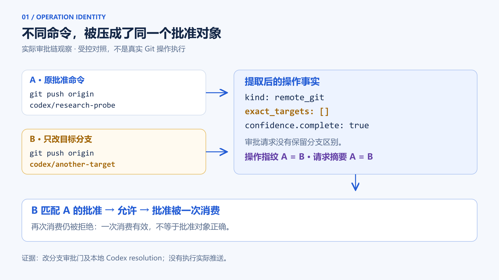
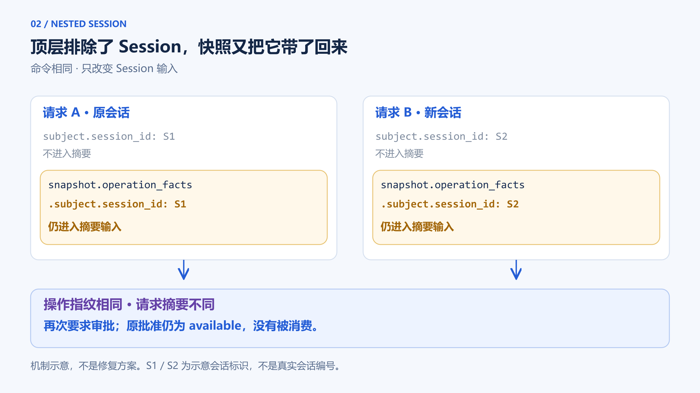

# 批准了这条命令，为什么另一条也能过？一次 Agent 授权摘要实验

[](assets/approval-identity-cover-v2.png)

我们先为一条命令建立批准记录：

```text
git push origin codex/research-probe
```

随后保持项目、任务、执行者和会话不变，只换了目标分支：

```text
git push origin codex/another-target
```

第二条命令通过了审批判断，第一条命令的批准记录被标为已消费。

另一组实验更反常：命令没有变，只把会话换成批准记录中登记的唤醒会话，系统却再次要求审批。

**该区分的动作没有区分；本来希望支持的会话续接，反而改变了匹配结果。**

这是一次隔离的受控实验，不是线上推送事故。两条命令都没有真正执行。但决定“是否允许”的代码和批准记录持久化，使用的是真实产品实现。

## 1. 我们为什么查这一层

CodeFlowMu 是我们在开发的本地多 Agent 协作系统。它用 FCoP 文件协议保存正式任务及协作记录，任务身份不依赖某一个 Agent 会话持续存活。运行时还要处理另一个问题：Agent 请求一个需要批准的操作时，批准究竟对应什么？

恢复场景让这个问题变得尖锐。原会话可能中断，新会话可能接替；审批记录还在，任务文件也还在。系统既不能把“记录存在”直接当成执行许可，也不应因为无关的上下文变化，丢失原本可以识别的动作。

这一轮研究受到 Codex 近期变更的启发。Codex 是 OpenAI 的编码 Agent，Guardian 是其工具安全审核机制的一部分。9 月 3 日合并的 [PR #42588](https://github.com/openai/codex/pull/42588) 在特定上下文模式下检查压缩记录的生产者兼容信息；缺失或不兼容时，不能靠省略该记录继续快速批准，而应进入同步审核。另一项 [PR #42579](https://github.com/openai/codex/pull/42579) 保留经 Host 核验的用户问答，并在证据不完整时限制快速批准。

它们处理的是 **Codex 审核证据能否被当前判断使用**，不是本文的 Git 操作摘要缺口，也不意味着 CodeFlowMu 应再造一个 Guardian。我们从中提取的问题更窄：

**一份真实存在的批准记录，为什么适用于眼前这一次调用？**

要回答它，不能只看记录有没有 `approved`。

## 2. 系统并不是没有审批保护

我们把源码固定在 `fdadbed489129455437f25202a03bae6e0c2e822`，即本次研究采用的 V2.2.8 相关基线，不随之后的 main 漂移。

先复跑四组既有测试，覆盖操作批准、任务父子身份、证据关联和凭证脱敏。两轮都是 **31 项通过、0 失败、0 跳过**。这是 31 项测试重复两次，不是 62 个独立场景，也不是全量产品验收。

操作批准测试已经验证了有价值的保护：改变请求目标会被拒绝，批准只消费一次，某些恢复调用可以读取原有记录，手工构造的请求也能支持 Session 续接。

因此，我们没有直接下结论“缺少审批”或“应该增加幂等”。接下来要检查的是：**实际工具入口构造出来的请求，是否仍具有这些测试假定的身份信息？**

探针先经过真实 Native 审批门，生成待批准记录，再由服务建立批准。随后另起 Node 进程重读记录并请求消费；能通过的调用再由另一个进程尝试重复消费。这里的跨进程是为了排除“只靠内存记住批准”的解释，不是掉电恢复测试。

11 种输入分别重复两轮，结果一致：

| 相对已批准请求的变化 | 真实审批门的结果 | 批准记录 |
|---|---|---|
| 同会话、同动作 | 允许；再次请求报已消费 | consumed |
| 只换成登记的唤醒会话 | 再次要求审批 | available |
| 换成另一个非空会话 | 再次要求审批 | available |
| 不提供会话 | 再次要求审批 | available |
| 改 Agent | 再次要求审批 | available |
| 改 TASK | 再次要求审批 | available |
| 改 thread | 再次要求审批 | available |
| 改 project | 再次要求审批 | available |
| 同会话，只改 push 分支 | **允许；再次请求报已消费** | **consumed** |
| 改调用来源渠道 | 再次要求审批 | available |
| 待审批阶段取消，不予批准 | 再次要求审批 | invalid |

来源渠道改变是否应被视为等价，需要单独定义，本文不把那一行直接判错。会话行也不能证明真实 successor 已满足全部接管资格；本实验只改变会话输入，并登记对应的唤醒会话。

最值得追查的是两个反向结果：改分支被接受，只换会话却失配。完整探针保留了这两类预期偏离，每类两次，最终以断言失败退出。没有把它改成一个漂亮的全绿报告。逐轮记录见[配套证据说明](evidence/README.zh.md)。

## 3. 哈希没有撞，动作信息先丢了

这条审批链有几个不同职责：

```text
工具名与参数
→ 适配器提取操作事实
→ 生成操作指纹和审批请求
→ 计算请求摘要
→ 匹配已批准记录
→ 一次消费
```

操作指纹用于标识提取后的操作事实；请求摘要则绑定审批请求。两者都不是原始命令的天然替身。

在受测实现中，shell 适配器能识别 `git push` 属于远端 Git 写操作，因此首次调用会进入审批。这一层做对了风险分类。

但它没有把上述命令的 remote、分支引用及 force/delete 区别保留为相应的操作身份信息。探针中的目标数组是空的，完整性标记却仍为 true；后续审批请求也没有补回原始命令中的这些区别。

于是“都属于远端 Git 写操作”，在后面变成了“是同一个获准操作”。

[](assets/operation-collapse.zh.png)

*图 1：原始命令的差异在摘要计算前已丢失。来源：本次固定基线的字段差分、审批门及本地 Codex resolution 观察；未执行真实推送。点击图片查看高清原图。*

我们继续做七组字段差分，每组重复两轮：

| 变化 | 操作指纹 | 请求摘要 |
|---|---|---|
| 原样请求 | 相同 | 相同 |
| 改目标分支 | 相同 | 相同 |
| 改 remote | 相同 | 相同 |
| 加 `--force` | 相同 | 相同 |
| 改成 `--delete` | 相同 | 相同 |
| 只换 Session | 相同 | **不同** |
| 改 TASK | 不同 | 不同 |

这里不是找到了 SHA-256 的密码学碰撞。前四种动作变化经过适配以后，生成的审批 request 已经没有字段差异。**不同输入先被压成相同对象，哈希只是忠实地给相同对象生成相同值。**

改 TASK 的负对照很重要：不是函数对所有输入都返回常量，而是某些关键语义没有进入它。

我们还直接调用了实际 Codex 原生审批请求对应的本地 resolution 函数。原命令和改分支两种情况各重复两轮，均得到允许结果，批准被消费。它把观察推进到了产品的 Codex 审批解析入口，但没有启动 Codex app-server，也没有发送真实批准响应或执行推送。

需要严格区分：**改 remote、force、delete 验证到了摘要相同；改分支进一步验证到了批准消费。** 不能把前者全部写成已经执行了相应操作。

这也解释了为什么“一次消费”不能独自守住这条边界。它回答的是“这份批准有没有用过”，不是“用它的动作是不是批准的那个”。

## 4. Session 从顶层排除了，又从快照里回来了

反方向的异常发生在另一个字段上。

底层 `computeOperationDigest` 明确排除了请求顶层的 `subject.session_id`。这与既有 Session 续接测试相符：相同操作不一定必须由原会话完成。

实际请求构造却同时把完整的操作事实放进了快照。只换 Session 时，请求出现两个差异：

```text
subject.session_id
snapshot.operation_facts.subject.session_id
```

第一处被摘要函数排除了，第二处没有。

[](assets/nested-session.zh.png)

*图 2：命令不变时，嵌套 Session 仍可改变请求摘要。来源：本次真实请求差分与内存反事实检查；S1/S2 是示意标识，不是实际会话编号，也不是删除全部会话绑定的修复建议。点击图片查看高清原图。*

结果是：操作指纹保持不变，请求摘要却发生变化。消费服务还没走到后面的身份条件核验，就无法按摘要选中那份原批准。批准记录虽然登记了新的唤醒会话，仍停留在 available。

我们做了一个内存中的反事实检查：仅从两份请求快照移除第二份 Session 字段，再调用原摘要函数。原会话与新会话的摘要这时才相同。这个检查用于定位差异来源，没有修改产品，也没有把处理后的请求拿去执行。

它更不是“递归删除所有 session_id”的修复建议。有些操作对临时目录归属、当前执行者或会话权限确实敏感，那些绑定不能顺手删掉。

真正需要区分的是：**哪些字段定义动作，哪些字段记录这次运行，又有哪些字段必须在当前执行时重新核验。**

测试落差也由此清楚了。底层单测构造了一份较简洁的审批请求；真实入口多带了一份包含 Session 的事实快照。两者都叫“同动作换会话”，输入形状却不是同一个。

## 5. 授权身份需要经得住两个方向的变异

这两个现象不应该分别用“多加字段”和“少加字段”草率修补。

全量哈希并不自动安全：它可能把运行噪声带进动作身份。粗粒度分类也不够：它可能让不同动作共享批准范围。

对需要精确批准的执行入口，我们建议把以下问题带进工程评审，而不是先决定重构规模：

**第一，改变动作含义时，批准匹配必须失效。** 对 Git，这不仅是“还是不是 push”，还涉及目标仓库或 remote、引用与更新模式，以及该批准要求固定的其他条件。规范化之前丢失的信息，不能指望摘要补回来。

**第二，允许变化的运行上下文，不能偶然改变动作身份。** 这不意味着新 Session 自动有权执行。动作匹配成立以后，仍要核验当前调用者、授权状态和适用范围；一份旧 receipt 不是新的执行许可。

**第三，要在真实请求生产者与消费者之间测。** 不只手写一份理想 CapabilityRequest，再证明消费函数正确。把原始工具参数交给实际适配器，观察它最终批准和匹配的对象是什么。

一个小而有用的测试组合是：原动作正对照、改变目标、改变模式、允许的上下文续接、改变 TASK/执行者、取消批准、重复消费。两类关键变异的预期方向相反：该失配的必须失配；允许保持身份的，应当稳定，同时保留当前授权复核。

本轮研究还检查了另一种身份问题：两份正文完全相同、task_id 不同的任务，子任务是否会把错误的那个当作依赖。六种父子/依赖情况重复两轮，现有 FCoP 检查符合预期。这个通过结果限定了改造范围：**现在有证据需要收紧的是操作授权身份，不是把整个任务身份体系推倒重来。**

## 6. 这份结论到哪里为止

本文没有线上事故样本，也没有故障频率统计。数字来自固定提交上的受控实验；既有测试、字段比较、审批入口观察是不同集合，不能相加成一个“系统可靠率”。

我们确认了两项局部缺口：受测 shell Git 路径丢失具体动作差异，以及真实请求中的嵌套 Session 破坏预期续接匹配。未证明匿名攻击、真实远端损失、所有工具同样受影响，或一次完整恢复调度必然触发这些现象。上游 Guardian 变更只作方法对照，未在本轮独立复跑。

当前状态是**研究完成、建议进入工程评审**。本文不宣布修复、合同冻结或开发授权。配套[证据包](evidence/README.zh.md)提供去标识逐轮观察、主张映射与读取校验器；校验器检查记录一致性，不冒充重新运行产品或独立 QA。完整原始夹具及产品源码复跑环境仍是本地研究材料，未随此稿发布；不能把附包称为读者可直接执行的完整产品复现环境。

最终留下的问题很简单：

**一份批准只用了一次，还不够。系统必须先证明：用掉它的，正是被批准的那个动作。**
