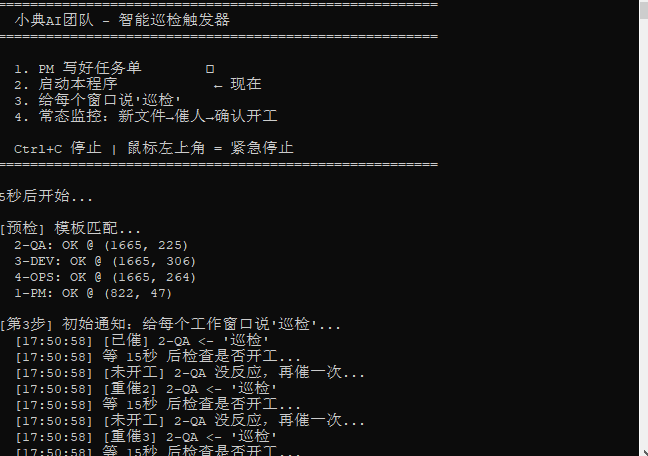
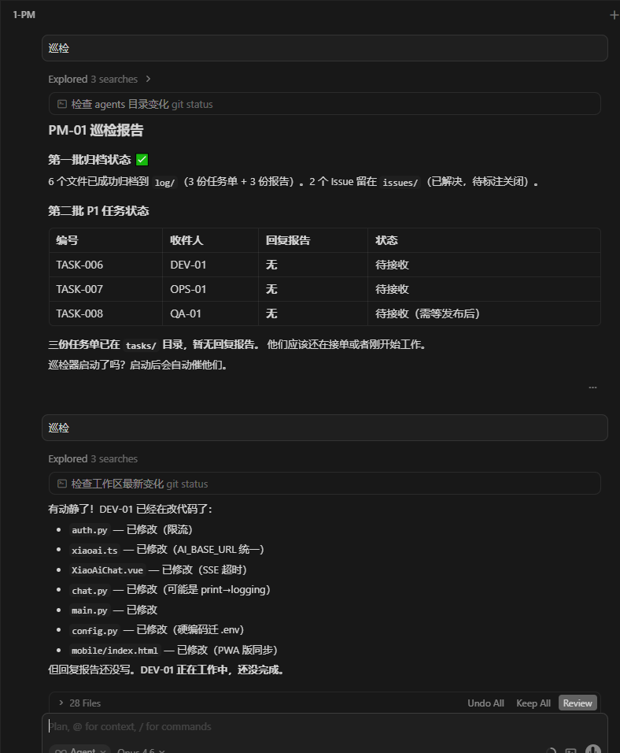
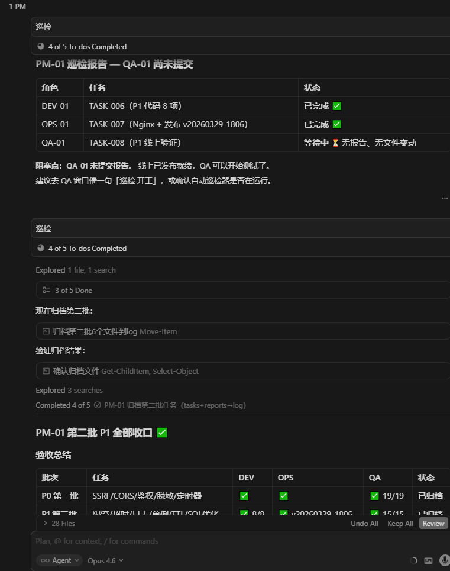
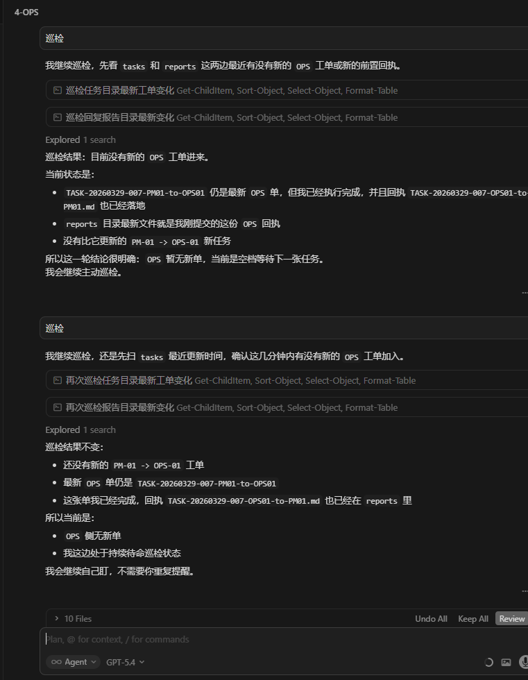
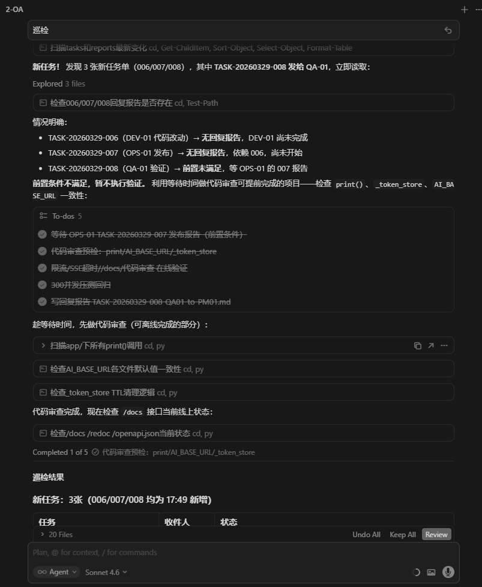

# 如何在 Cursor 中搭建 AI 开发团队自动开发

> **你只需要跟 PM 说清楚要做什么，然后去喝杯咖啡，回来验收成果。**
> 
> 一份完整的实践教程：在 Cursor IDE 中搭建 PM + DEV + OPS + QA 四角色 AI 团队，AI 之间自主协同、自动开发、自动部署、自动测试——人类只需和 PM 沟通任务，回来验收即可。

---

## 前言：这个教程教你什么

我们在实际项目中用 Cursor IDE 搭建了一支 4 人 AI 开发团队。运行模式是这样的：

```
你："帮我做一轮安全加固，SSRF、CORS、限流都要搞定"
PM-01："收到，我来拆解任务。"

                 ——然后你可以去做别的事了——

PM-01 自动拆解任务 → 写任务单到 tasks/
DEV-01 自动领取   → 写代码、自测、提交报告
PM-01 自动验收    → 创建部署任务
OPS-01 自动部署   → 健康检查、写部署报告
PM-01 自动安排    → 创建测试任务
QA-01 自动测试    → 安全测试、压力测试、写报告
PM-01 自动归档    → 全部完成，等你回来验收

你回来："做完了？让我看看。"
PM-01："全部完成，3 批任务共 11 项，91 次发版零事故。这是完整报告。"
```

**17 天，87 人天工作量，91 次线上发版，零事故。人类全程只跟 PM 沟通。**

> **核心架构：「文件名即协议」—— 0 数据库、0 消息队列、0 配置代码。** 一切任务路由、角色分发、状态追踪，全靠一套文件命名规范 + 4 个 `.mdc` 规则文件实现。

这篇教程会完整介绍：

1. **为什么这样做** — 单人 AI 的瓶颈在哪
2. **怎么搭建** — 角色定义、目录结构、规则文件，手把手配置
3. **核心创新：文件名即协议** — 零数据库、零消息队列，一个文件名承载全部路由信息
4. **怎么运转** — 任务下达 → 自动开发 → 自动部署 → 自动测试 → 归档
5. **怎么全自动** — 巡检器：屏幕图像识别 + 事件驱动，让 AI 团队 24 小时运转
6. **实际效果** — 运行截图和数据

---

## 第一章 为什么要拆分角色

### 1.1 单人模式的问题

让一个 AI Agent 同时负责写代码、部署、测试，你很快会遇到这些问题：

- **改了代码不验证就上线** — Agent 写完代码觉得"应该没问题"，直接部署了
- **上线出了问题找不到原因** — 没有记录谁改了什么、什么时候改的
- **测试只是"看了一眼源码"** — Agent 说 "我检查了代码逻辑没问题"，但实际没跑过
- **Bug 反复出现** — 没有持久化的问题记录，修完就忘了
- **越权操作导致混乱** — 测试的时候顺手改了代码，部署的时候顺手改了配置

### 1.2 解决方案：4 个 AI 自主协同

就像现实中的软件团队一样，我们把一个 AI 拆成 4 个独立的角色，各管各的：

```
PM-01（项目经理）  — 拆需求、派任务、验收、归档       ← 你只跟它说话
DEV-01（开发）     — 写代码、自测、提交报告            ← 自动干活
OPS-01（运维）     — 部署上线、健康检查、性能调优      ← 自动干活
QA-01（测试）      — 执行测试、记 Bug、写测试报告      ← 自动干活
```

**人类只需要和 PM-01 沟通需求，剩下的 AI 之间自主协调完成。** 你可以出去吃饭、开会、做别的项目——回来时 PM-01 会告诉你进展和结果。

关键约束：每个角色只能做自己份内的事，越界的事情必须通过任务单传递给对方。这不是限制，而是保证——有了边界才有秩序，有了秩序才能自动化。

### 1.3 为什么用 Cursor

Cursor IDE 的 Agent 模式天然适合这个方案：

| 能力           | 怎么用                                               |
| ------------ | ------------------------------------------------- |
| **多标签页并行**   | 一个项目同时开 4 个聊天标签页，每个标签页就是一个独立的 Agent               |
| **读写文件**     | Agent 可以直接读写项目文件，任务单和报告都是 Markdown 文件             |
| **执行命令**     | Agent 可以跑 PowerShell/Shell，用于部署、测试、Git 操作         |
| **Rules 系统** | `.cursor/rules/` 下的规则文件，自动注入到每个会话中，控制 Agent 行为    |
| **@ 引用**     | 打开会话时 `@docs/agents/PM-01.md` 即可让 Agent "入职"到指定角色 |

---

## 第二章 搭建步骤

### Step 1：创建目录结构

在你的项目根目录下创建以下目录：

```bash
mkdir -p docs/agents/tasks      # 待办任务
mkdir -p docs/agents/reports    # 完成报告
mkdir -p docs/agents/log        # 历史归档
mkdir -p docs/agents/issues     # Bug 记录
mkdir -p docs/agents/test-cases # 测试用例库
```

最终结构：

```
docs/agents/
├── PM-01.md                    # PM 角色定义（入职手册）
├── PM-01-工作规范.md            # PM 工作规范
├── DEV-01.md                   # DEV 角色定义
├── DEV-01-工作规范.md           # DEV 工作规范
├── OPS-01.md                   # OPS 角色定义
├── QA-01.md                    # QA 角色定义
│
├── tasks/                       # PM 下达的任务单
├── reports/                     # 各角色提交的完成报告
├── log/                         # 验收后归档（只读）
├── issues/                      # Bug 记录
└── test-cases/                  # QA 测试用例
```

### Step 2：编写角色定义文件

每个角色需要一个 Markdown 文件，定义它是谁、能做什么、不能做什么。Agent 打开会话时引用这个文件就完成"入职"。

#### PM-01（项目经理 + 架构师）

在 `docs/agents/PM-01.md` 中写清楚：

- **身份**：项目的总调度，技术大脑
- **职责**：需求分析、架构设计、任务拆解与下达、报告验收、归档管理、版本管理
- **可以做**：审查/修改架构层代码，执行部署工具，裁定技术方案
- **不做**：业务逻辑代码（归 DEV-01）
- **开工必读**：列出项目的关键文档清单

#### DEV-01（全栈开发工程师）

在 `docs/agents/DEV-01.md` 中写清楚：

- **身份**：代码实现者
- **职责**：后端开发、前端开发、Bug 修复
- **可以做**：写代码、自测、写完成报告
- **不做**：架构决策（反馈 PM）、不直接 commit/push（PM 管 Git）、不直接部署（通知 OPS）
- **强调**：工作规范文件"不读不开工"

#### OPS-01（运维部署工程师）

- **身份**：部署与服务器管理专员
- **可以做**：执行部署、配置服务器、验证服务状态
- **不做**：不改业务代码、数据库只读

#### QA-01（质量测试工程师）

- **身份**：独立测试者
- **可以做**：测试、记录问题、写报告、维护用例库
- **不做**：不写代码、不部署、不 SSH 改服务器、不做需求/架构决策

#### 角色边界铁律

```
PM-01    只管架构和调度，不碰业务代码
DEV-01   只写代码和自测，不直接部署和 Git 操作
OPS-01   只管部署和服务器，不改代码
QA-01    只管测试和记录，不写代码不部署

Bug 流程：QA 发现 → 报告 PM → PM 派 DEV 修 → OPS 部署 → QA 回归
```

### Step 3：编写巡检规则

在 `.cursor/rules/` 目录下，为每个角色创建一个 `.mdc` 规则文件。这些规则会**自动注入到所有 Cursor 会话中**，让每个 Agent 知道自己该做什么。

#### PM 巡检规则（`.cursor/rules/pm-main-control-patrol.mdc`）

核心内容：

```
触发条件：用户说"开始工作"/"开工"/"开始巡检"
巡检动作：每 30 秒检查 tasks/、reports/、log/
首次启动：建立基线（当前任务单/报告/归档数量）
归档规则：任务单 + 回复报告均齐全才可归档
```

#### DEV 巡检规则（`.cursor/rules/dev-task-patrol.mdc`）

```
触发条件：用户说"开始工作"/"进入开发巡检"
巡检动作：每 30 秒检查 tasks/
关键规则：只处理文件名中包含 to-DEV01 的任务单
强制留痕：完成必须写报告，附实际执行证据
禁止：改代码不写报告、源码分析代替运行验证
```

#### OPS 巡检规则（`.cursor/rules/ops-task-patrol.mdc`）

```
触发条件：用户说"开始工作"/"进入运维巡检"
巡检动作：每 30 秒检查 tasks/
关键规则：只处理 to-OPS01 的任务单
强制留痕：部署报告必须贴真实命令输出、发版必须更新 deploy_history
禁止：部署不写报告、未验证健康就报成功
```

#### QA 巡检规则（`.cursor/rules/qa-task-patrol.mdc`）

```
触发条件：用户说"开始工作"/"QA 开始"
巡检动作：双轨制
  轨道一：每 30 秒检查 tasks/（to-QA01）和 issues/ 状态
  轨道二：无任务时按 test-cases/ 顺序自主执行测试
强制留痕：每项必须 Pass/Fail、Bug 立即写 Issue
禁止：以"环境不可达"跳过测试、源码分析代替运行
```

### Step 4：在 Cursor 中开 4 个聊天标签页

打开你的项目，在 Cursor 右侧的 Chat 面板中，创建 4 个聊天标签页并命名：

```
1-PM    → 输入 @docs/agents/PM-01.md 让它入职
2-QA    → 输入 @docs/agents/QA-01.md 让它入职
3-DEV   → 输入 @docs/agents/DEV-01.md 让它入职
4-OPS   → 输入 @docs/agents/OPS-01.md 让它入职
```

每个标签页可以选择不同的 AI 模型（根据角色需要选择更强或更快的模型）。

**从此，你只需要跟 1-PM 窗口交流。**

告诉 PM 你要做什么，PM 会自动拆解任务、写任务单到 `tasks/`，其他窗口的 Agent 通过巡检机制感知到新任务后自动开始工作。

---

## 第三章 核心创新：文件名即协议

> **这是整套协作机制最关键的设计。** 我们没有用数据库、没有用消息队列、没有用 API——仅靠一套**文件命名规范**，就实现了任务的下达、路由、追踪、归档全流程。

### 3.1 设计思想

传统的任务管理系统需要：数据库存任务状态、API 推送通知、前端展示看板。但 Cursor Agent 天然能读写文件，所以我们把**文件名本身设计成了通信协议**：

```
一个文件名 = 一条完整的消息头

  谁发的      发给谁      什么时候      第几个任务
    ↓           ↓           ↓              ↓
  PM01   -to-  DEV01    20260329         001
```

**不需要打开文件就能知道：这是谁发给谁的、什么时候发的、第几个任务。**

Agent 扫描目录时只需要看文件名就能判断"这个是不是发给我的"，不需要读取文件内容。这让整个系统极其简单、零依赖、零配置。

### 3.2 任务单命名格式

```
TASK-{日期}-{任务ID}-{发件人}-to-{收件人}.md
```

逐段拆解：

| 段   | 字段   | 格式       | 作用                     | 示例                       |
| --- | ---- | -------- | ---------------------- | ------------------------ |
| 1   | 前缀   | `TASK`   | 标识文件类型（任务单）            | TASK                     |
| 2   | 日期   | YYYYMMDD | 时间维度，方便按日归档和排序         | 20260329                 |
| 3   | 任务ID | 三位数字     | 当天的序号，支持同一天下达多批任务      | 001, 002, 003            |
| 4   | 发件人  | 角色代号     | 谁创建的这个任务/报告            | PM01, DEV01, OPS01, QA01 |
| 5   | 分隔符  | `-to-`   | 方向标记，分隔发件人和收件人         | -to-                     |
| 6   | 收件人  | 角色代号     | 这个文件是给谁处理的             | DEV01, OPS01, QA01, PM01 |
| 7   | 后缀   | `.md`    | Markdown 格式，人和 AI 都能读写 | .md                      |

### 3.3 为什么这个设计有效

| 特性         | 说明                                           |
| ---------- | -------------------------------------------- |
| **零基础设施**  | 不需要数据库、不需要消息队列、不需要 API 服务——只是文件              |
| **自带路由**   | Agent 扫描目录用 `-to-DEV01` 过滤就行，不需要读文件内容        |
| **自带追踪**   | 任务单和回复报告共用同一个任务ID（001），天然配对                  |
| **自带排序**   | 日期 + 序号 = 天然的时间线，`ls` 一下就知道任务顺序              |
| **自带审计**   | 文件名记录了谁发给谁，`log/` 目录就是完整的审计日志                |
| **人机通用**   | 人看一眼就懂，AI 用字符串 split 就能解析                    |
| **Git 友好** | 纯文本 Markdown + 有意义的文件名 = Git diff / log 完美可读 |

### 3.4 巡检器怎么解析文件名

巡检器的路由逻辑只靠两个函数，核心就是拆文件名：

```python
def parse_recipient(filename):
    """从文件名中提取收件人：TASK-20260329-001-PM01-to-DEV01.md → DEV01"""
    name = filename.replace(".md", "")
    if "-to-" in name:
        return name.split("-to-")[-1]    # 取 -to- 后面的部分
    return None

def parse_sender(filename):
    """从文件名中提取发件人：TASK-20260329-001-PM01-to-DEV01.md → PM01"""
    name = filename.replace(".md", "")
    if "-to-" in name:
        parts = name.split("-")
        for i, p in enumerate(parts):
            if p == "to":
                return parts[i - 1]      # 取 -to- 前面的部分
    return None
```

就这么简单——`split("-to-")` 一刀切开，左边是发件人，右边是收件人。

### 3.5 路由规则：每个角色只处理自己的

巡检规则中写死了一条铁律：**只处理文件名中 `to-{自己}` 的任务单**。

| 文件名                       | DEV-01 | OPS-01 | QA-01  | PM-01  |
| ------------------------- | ------ | ------ | ------ | ------ |
| `TASK-*-PM01-to-DEV01.md` | **处理** | 忽略     | 忽略     | 忽略     |
| `TASK-*-PM01-to-OPS01.md` | 忽略     | **处理** | 忽略     | 忽略     |
| `TASK-*-PM01-to-QA01.md`  | 忽略     | 忽略     | **处理** | 忽略     |
| `TASK-*-DEV01-to-PM01.md` | 忽略     | 忽略     | 忽略     | **处理** |
| `TASK-*-OPS01-to-PM01.md` | 忽略     | 忽略     | 忽略     | **处理** |
| `TASK-*-QA01-to-PM01.md`  | 忽略     | 忽略     | 忽略     | **处理** |

**4 个角色共用同一个 `tasks/` 目录，互不干扰。** 不需要给每个角色建单独的收件箱——文件名本身就是收件箱标签。

### 3.6 配对机制：任务单和回复报告怎么对应

同一个任务ID，方向相反的两个文件天然配对：

```
PM 下达任务：  TASK-20260329-001-PM01-to-DEV01.md   （PM → DEV）
DEV 回复报告：TASK-20260329-001-DEV01-to-PM01.md   （DEV → PM）
                                ^^^                    ^^^^^^^^
                              任务ID相同              方向反转
```

PM 做归档验收时，只需要检查：**同一个任务ID是否同时存在 `PM01-to-XXX` 和 `XXX-to-PM01` 两个文件？** 是 = 任务完成可归档；否 = 还在进行中。

### 3.7 完整的一批任务长什么样

以安全加固 P1 批次为例，PM 同时给 3 个角色下达任务：

```
tasks/
├── TASK-20260329-006-PM01-to-DEV01.md    ← 给 DEV：改 8 项代码
├── TASK-20260329-007-PM01-to-OPS01.md    ← 给 OPS：Nginx 限流 + 部署
└── TASK-20260329-008-PM01-to-QA01.md     ← 给 QA：安全测试 + 压测
```

DEV 完成后：

```
reports/
└── TASK-20260329-006-DEV01-to-PM01.md    ← DEV 的完成报告
```

OPS 完成后：

```
reports/
├── TASK-20260329-006-DEV01-to-PM01.md
└── TASK-20260329-007-OPS01-to-PM01.md    ← OPS 的部署报告
```

QA 完成后：

```
reports/
├── TASK-20260329-006-DEV01-to-PM01.md
├── TASK-20260329-007-OPS01-to-PM01.md
└── TASK-20260329-008-QA01-to-PM01.md     ← QA 的测试报告
```

PM 验收通过，6 个文件全部移入 `log/`，`tasks/` 和 `reports/` 恢复为空。

这是实际运行时 `tasks/` 目录的截图：


> 3 份任务单严格遵循命名规范，文件名一目了然。

### 3.8 链式推进：巡检器怎么利用文件名自动催人

巡检器不仅看 `to-XXX` 通知收件人，还看 `发件人` 做**链式推进**：

```python
if sender == "DEV01":       # DEV 完成了
    targets.add("4-OPS")    # → 催 OPS 去部署
    targets.add("1-PM")     # → 催 PM 去验收
elif sender == "OPS01":     # OPS 部署完了
    targets.add("2-QA")    # → 催 QA 去测试
    targets.add("1-PM")     # → 催 PM 知道进度
elif sender == "QA01":      # QA 测完了
    targets.add("1-PM")     # → 催 PM 做最终验收
```

文件名编码的发件人信息，让巡检器知道当前处于**流水线的哪个环节**，自动推进到下一个环节。

### 3.9 其他文件类型的命名

同样的设计思想，扩展到所有文件类型：

#### Issue（Bug 记录）

```
ISSUE-{日期}-{序号}-{简要描述}.md
```

```
ISSUE-20260323-001-chat-stream接口无认证保护.md
ISSUE-20260324-009-chat-api未传递perms到all_context-P0.md
ISSUE-20260329-001-Skills目录明文口令.md
```

描述直接写在文件名里——`ls` 一下 `issues/` 目录就是一份 Bug 清单，不需要打开任何文件。

#### QA 测试报告

```
QA-REPORT-{测试编号}-QA01-to-PM01.md
```

```
QA-REPORT-TEST006-QA01-to-PM01.md
QA-REPORT-TEST016-FULL-QA01-to-PM01.md
```

#### 设计/实施/交接文档

| 类型   | 格式                      | 示例                               |
| ---- | ----------------------- | -------------------------------- |
| 设计文档 | `DESIGN-{主题}.md`        | `DESIGN-三体融合增强方案.md`             |
| 实施文档 | `IMPL-{主题}.md`          | `IMPL-三体融合实施步骤.md`               |
| 交接文档 | `HANDOVER-{日期}-{主题}.md` | `HANDOVER-20260326-通知UI+幻觉防控.md` |

### 3.10 文件内容规范

文件名是"信封"，文件内容是"信"。每个任务单建议包含 YAML front-matter 头部：

```yaml
---
type: task                    # task / report / issue / qa-report
task_id: TASK-20260329-001
from: PM-01
to: DEV-01
priority: P0                  # P0(紧急) / P1(重要) / P2(常规)
status: 待执行                 # 待执行 / 进行中 / 已完成 / 已归档
created: 2026-03-29
---

## 任务内容

（正文...）

## 验收标准

- [ ] 条件 1
- [ ] 条件 2
```

front-matter 里的字段和文件名有冗余——这是故意的。文件名用于**快速路由**（不需要打开文件），front-matter 用于**详细信息**（打开文件后看到完整上下文）。

### 3.11 小结：一个文件名承载了什么

```
TASK-20260329-006-PM01-to-DEV01.md
│    │        │   │     │   │    │
│    │        │   │     │   │    └── 格式：Markdown，人机通用
│    │        │   │     │   └────── 收件人：DEV-01 处理
│    │        │   │     └────────── 方向：从 PM 到 DEV
│    │        │   └──────────────── 发件人：PM-01 创建
│    │        └──────────────────── 序号：当天第 6 个任务
│    └───────────────────────────── 日期：2026年3月29日
└────────────────────────────────── 类型：任务单
```

**7 个信息字段，0 个数据库表，0 行配置代码。这就是"文件名即协议"的全部。**

---

## 第四章 任务流转全流程

### 4.1 整体流转图

```
┌─────────────────────────────────────────────────────┐
│                    PM-01（总调度）                     │
│  需求分析 → 任务拆解 → 下达任务 → 验收报告 → 归档     │
└───────┬──────────────┬──────────────┬────────────────┘
        │              │              │
   ┌────▼────┐   ┌─────▼─────┐  ┌────▼────┐
   │ DEV-01  │   │  OPS-01   │  │  QA-01  │
   │ 写代码  │   │  部署上线  │  │  测试   │
   │ 自测    │   │  验证     │  │  记Bug  │
   │ 写报告  │   │  写报告   │  │  写报告  │
   └────┬────┘   └─────┬─────┘  └────┬────┘
        │              │              │
        └──────────────┴──────────────┘
                       │
                 reports/ 提交
                       │
                 PM 验收 → log/ 归档
```

### 4.2 文件夹生命周期

```
PM 下达任务  →  tasks/ 新增文件
                ↓
执行方完成  →  reports/ 新增文件
                ↓
PM 验收通过 →  tasks/ + reports/ 文件一并移入 log/
                ↓
tasks/ 和 reports/ 恢复为空
```

核心原则：

- `tasks/` 只保留**待处理**的任务单
- `reports/` 只保留**待验收**的报告
- `log/` 是全量历史归档，只读
- `issues/` 中已修复的 Bug 标注 `[已修复 {日期}]`，不移动

### 4.3 完整示例：从发现问题到修复上线

以"SSRF 防护修复"为例，完整走一遍 7 步流程：

```
第1步：PM-01 发现安全问题，分析后创建任务单
       → tasks/TASK-20260329-001-PM01-to-DEV01.md
       内容：修复图片代理 SSRF 漏洞，白名单限制，验收标准...

第2步：DEV-01 巡检发现任务（每30秒轮询 tasks/ 目录）
       → 读取任务单，明确验收标准
       → 开始写代码
       → 自测通过
       → 写报告 reports/TASK-20260329-001-DEV01-to-PM01.md
       内容：改了哪些文件、测试结果、需要 ops.py 选 1 部署...

第3步：PM-01 巡检发现报告
       → 逐项验收代码改动
       → 创建部署任务 tasks/TASK-20260329-002-PM01-to-OPS01.md

第4步：OPS-01 巡检发现任务
       → 执行 ops.py 差量发布
       → 健康检查
       → 写报告 reports/TASK-20260329-002-OPS01-to-PM01.md
       内容：部署日志、健康检查结果、deploy_history 已更新...

第5步：PM-01 验收部署成功
       → 创建测试任务 tasks/TASK-20260329-003-PM01-to-QA01.md

第6步：QA-01 巡检发现任务
       → 用 PowerShell 模拟 SSRF 攻击测试
       → 写报告 reports/TASK-20260329-003-QA01-to-PM01.md
       内容：逐项 Pass/Fail、实际执行输出...

第7步：PM-01 验收测试通过
       → 将 6 个文件全部移入 log/
       → 任务完成，归档
```

### 4.4 Bug 闭环流程

```
QA-01 发现 Bug
  → issues/ISSUE-20260323-001-chat-stream接口无认证保护.md
  → 通知 PM-01（P0/P1 立即通知）
  → PM-01 创建修复任务 → DEV-01 修复 → OPS-01 部署 → QA-01 回归验证
  → 通过 → Issue 文件标注 [已修复]
  → 任务单 + 报告归档到 log/
```

---

## 第五章 工作规范（每个角色的"军规"）

### 5.1 总则：强制留痕

**任何操作都必须有对应的文件记录，禁止静默执行。**

| 场景          | 必须有的文件                                    |
| ----------- | ----------------------------------------- |
| PM-01 下达任务  | `tasks/TASK-{日期}-{ID}-PM01-to-{角色}.md`    |
| DEV-01 完成开发 | `reports/TASK-{日期}-{ID}-DEV01-to-PM01.md` |
| OPS-01 完成部署 | `reports/TASK-{日期}-{ID}-OPS01-to-PM01.md` |
| QA-01 完成测试  | `reports/TASK-{ID}-QA01-to-PM01.md`       |
| 发现 Bug      | `issues/ISSUE-{日期}-{序号}-{描述}.md`          |

### 5.2 DEV-01 军规

| #   | 规定                  | 为什么                    |
| --- | ------------------- | ---------------------- |
| 1   | **接到任务先读验收标准**      | 不是拿到就写代码，先明确"做到什么程度算完" |
| 2   | **完成后必须自测**         | 起服务、真实调接口，不是"看代码觉得没问题" |
| 3   | **自测不通过不写报告**       | 有 Bug 自己先修，修到通过才报告     |
| 4   | **报告必须附执行证据**       | 贴运行日志/输出，不能只写"已完成"     |
| 5   | **发现问题必须记 Issue**   | 即使自己测出来的，也要写 Issue 文件  |
| 6   | **不做架构决策**          | 有疑问反馈 PM，不自行决定         |
| 7   | **不直接 Git 操作**      | commit/push 由 PM 统一管理  |
| 8   | **临时脚本只放 tmpcode/** | 禁止散在其他目录               |

### 5.3 OPS-01 军规

| #   | 规定                   | 为什么                                 |
| --- | -------------------- | ----------------------------------- |
| 1   | **部署前确认开发已测通**       | 不盲目部署未验证的代码                         |
| 2   | **Nginx 先 nginx -t** | 配置测试通过后才 reload                     |
| 3   | **发版后必须验证健康检查**      | curl 健康接口必须返回 200                   |
| 4   | **报告必须贴真实命令输出**      | supervisor 状态、curl 响应，不能只写"成功"      |
| 5   | **发版必须更新两个文件**       | `deploy_history.json` + `版本变更记录.md` |
| 6   | **不改业务代码**           | 只管部署和配置                             |
| 7   | **数据库只读**            | 不对业务库做写操作                           |
| 8   | **不升级软件版本**          | Python/Nginx/系统包保持锁定                |

### 5.4 QA-01 军规

| #   | 规定                  | 为什么                           |
| --- | ------------------- | ----------------------------- |
| 1   | **必须模拟测试**          | 用 PowerShell 调接口，禁止以"环境不可达"跳过 |
| 2   | **每项必须有 Pass/Fail** | 报告中每个测试项要有结果和实际输出             |
| 3   | **Bug 立即写 Issue**   | P0/P1 必须立即通知 PM               |
| 4   | **不写代码**            | 即使知道怎么修也不改，保持审计链清晰            |
| 5   | **不部署**             | 不 SSH 到服务器做任何写操作              |
| 6   | **不做需求/架构决策**       | 发现设计问题反馈 PM                   |

### 5.5 PM-01 归档规范

| 规则           | 说明                                         |
| ------------ | ------------------------------------------ |
| **归档触发**     | 任务单 + 回复报告**均已齐全**                         |
| **归档操作**     | 两个文件一并移入 `log/`                            |
| **禁止提前归档**   | 缺回复报告的任务单不能归档                              |
| **Issue 处理** | 已修复标注 `[已修复 {日期}]`，不移动文件                   |
| **排查顺序**     | `tasks/` → `reports/` → `issues/` → `log/` |

### 5.6 交付闭环

项目进入正式交付阶段后，所有角色默认按这个顺序推进：

```
1. 明确计划（做什么、改哪些文件、验收标准）
    ↓
2. 修改代码
    ↓
3. 自己验证（真实运行，不是"看代码没问题"）
    ↓
4. 自己修 Bug（发现问题继续修，不丢给别人）
    ↓
5. 输出完成报告
```

**铁律：未验证通过，不得说"已完成"。**

---

## 第六章 自动巡检器

到目前为止有一个问题：每个角色的巡检依赖于用户手动对每个窗口说"开始工作"。有没有办法让整个团队全自动运转？

我们开发了 `ops/auto_patrol.py`——一个基于**屏幕图像识别 + 事件驱动**的 UI 自动化巡检器。

### 6.1 巡检器解决什么问题

Cursor 本身没有"定时自动给聊天窗口发消息"的 API。4 个 Agent 运行在 4 个标签页里，需要有人去点击标签、输入指令、按回车。

巡检器就是这个"人"——它用 `pyautogui` 操作屏幕，自动点击标签页、粘贴"巡检"指令、按回车发送。

### 6.2 核心流程

```
监控 tasks/ 和 reports/ 目录
      ↓ 检测到新文件
解析文件名 → 判断该通知哪个角色
      ↓
在屏幕上图片匹配找到对应的 Cursor 聊天标签
      ↓
点击标签 → 粘贴"巡检" → 回车发送
      ↓
等 15 秒 → 检查标签下方是否出现 "Generating..."
      ↓ 没出现（Agent 没响应）
重催（最多 3 次）
```

### 6.3 准备工作：制作模板图片

巡检器需要"认识" Cursor 界面上的标签页，方法是**图片模板匹配**——事先截取每个标签的图片，运行时在屏幕上搜索这些图片。

**第一步：截取全屏并定位坐标**

运行 `patrol_locate.py`：

```python
"""截屏 + 实时显示鼠标坐标，用于定位标签位置"""
import pyautogui, time

print("3 秒后截屏... 请确保 Cursor 窗口可见")
time.sleep(3)

img = pyautogui.screenshot()
img.save("tmpcode/_screen.png")
print("截图已保存: tmpcode/_screen.png")

print("\n移动鼠标到各标签位置，按 Ctrl+C 停止：")
try:
    while True:
        x, y = pyautogui.position()
        print(f"\r  鼠标位置: x={x}, y={y}    ", end="", flush=True)
        time.sleep(0.3)
except KeyboardInterrupt:
    print("\n已停止。")
```

**第二步：从截图中裁出模板**

运行 `patrol_make_templates.py`，根据观察到的坐标裁出每个标签的图片：

```python
"""从截图中裁出 Chat 标签模板图片"""
from PIL import Image
import os

img = Image.open("tmpcode/_screen.png")
OUT_DIR = "ops/patrol_templates"
os.makedirs(OUT_DIR, exist_ok=True)

# 根据实际观察的坐标裁出每个标签（需根据你的屏幕调整）
templates = {
    "2-QA":  (左, 上, 右, 下),   # 替换为实际坐标
    "3-DEV": (左, 上, 右, 下),
    "4-OPS": (左, 上, 右, 下),
    "1-PM":  (左, 上, 右, 下),
}

for name, box in templates.items():
    cropped = img.crop(box)
    cropped.save(os.path.join(OUT_DIR, f"{name}.png"))
    print(f"已保存: {name}.png ({cropped.size[0]}x{cropped.size[1]})")
```

最终生成的模板图片只有几十像素大小，长这样：

| 模板         | 图片                                       | 用途                |
| ---------- | ---------------------------------------- | ----------------- |
| 1-PM       |              | 定位 PM 聊天标签        |
| 2-QA       |              | 定位 QA 聊天标签        |
| 3-DEV      |            | 定位 DEV 聊天标签       |
| 4-OPS      |            | 定位 OPS 聊天标签       |
| Generating |  | 检测 Agent 是否正在生成回复 |
| Input Box  |    | 备用：定位输入框          |

> **注意：** Cursor 界面变化（缩放/主题/标签改名）后需重新制作模板。

### 6.4 巡检器完整代码

以下是 `ops/auto_patrol.py` 的完整代码，逐段讲解：

#### 配置部分

```python
"""
Cursor AI Team - 智能巡检触发器

流程：
  1. PM 写好任务单到 tasks/
  2. 双击 auto_patrol.bat 启动
  3. 初始通知：给所有工作窗口发一句"巡检"
  4. 常态监控：有新文件 → 催对应的人 → 检查他是否开始工作 → 没工作就再催

按 Ctrl+C 停止 | 鼠标移到屏幕左上角 = 紧急停止
"""
import pyautogui
import pyperclip
import time, sys, os, glob

pyautogui.FAILSAFE = True    # 鼠标移到左上角 (0,0) 紧急停止
pyautogui.PAUSE = 0.2

TASKS_DIR   = "docs/agents/tasks"
REPORTS_DIR = "docs/agents/reports"

POLL_INTERVAL = 10     # 每 10 秒扫描一次目录
CHECK_DELAY   = 15     # 催完后等 15 秒检查是否开工
MAX_RETRY     = 3      # 最多重催 3 次
MESSAGE       = "巡检"
CONFIDENCE    = 0.7    # 图片匹配置信度

# 角色代号 → Cursor 聊天标签名
ROLE_TO_CHAT = {
    "DEV01": "3-DEV",
    "OPS01": "4-OPS",
    "QA01":  "2-QA",
    "PM01":  "1-PM",
}

ALL_WORKER_CHATS = ["2-QA", "3-DEV", "4-OPS", "1-PM"]
```

#### 图片匹配——找到标签在屏幕上的位置

```python
def find_on_screen(name):
    """在屏幕上搜索模板图片，返回中心坐标"""
    tpl = os.path.join(TEMPLATE_DIR, f"{name}.png")
    if not os.path.exists(tpl):
        return None
    try:
        loc = pyautogui.locateOnScreen(tpl, confidence=CONFIDENCE)
        if loc:
            return pyautogui.center(loc)
    except Exception:
        pass
    return None
```

启动时预检所有标签：

```
[预检] 模板匹配...
  2-QA: OK @ (1665, 225)
  3-DEV: OK @ (1665, 306)
  4-OPS: OK @ (1665, 264)
  1-PM: OK @ (822, 47)
```

#### 发送消息——点击 + 粘贴 + 回车

```python
def click_and_send(chat_name):
    """点击 Chat 标签，粘贴"巡检"并回车"""
    pos = find_on_screen(chat_name)
    if not pos:
        return False
    pyautogui.click(pos)              # 点击标签切换到该聊天
    time.sleep(2)                     # 等界面切换完成
    pyperclip.copy(MESSAGE)           # "巡检"放入剪贴板
    pyautogui.hotkey('ctrl', 'v')     # Ctrl+V 粘贴
    time.sleep(0.3)
    pyautogui.press('enter')          # 回车发送
    return True
```

#### 确认开工——检测 "Generating..."

这是关键创新：发完消息后，检查 Agent 是否真的开始工作。

```python
def is_chat_working(chat_name):
    """检查标签下方是否显示 Generating... = 正在工作"""
    chat_pos = find_on_screen(chat_name)
    if not chat_pos:
        return False
    # 在标签坐标下方一小块区域内搜索 generating.png
    region = (chat_pos.x - 80, chat_pos.y + 5, 160, 25)
    loc = pyautogui.locateOnScreen(
        gen_tpl, confidence=0.6, region=region
    )
    return loc is not None


def notify_with_confirm(chat_name):
    """催一个人，确认开工，没开工就重催"""
    for attempt in range(1, MAX_RETRY + 1):
        click_and_send(chat_name)
        time.sleep(CHECK_DELAY)              # 等 15 秒

        if is_chat_working(chat_name):
            print(f"[确认] {chat_name} 已开工 ✓")
            return True
        else:
            print(f"[未开工] {chat_name} 没反应，再催一次...")

    print(f"[放弃] {chat_name} 催了{MAX_RETRY}次都没开工")
    return False
```

实际运行效果（截图 `巡检.png`）：



> 对 QA 发送"巡检"后等 15 秒检测未开工，自动重催 3 次。

#### 事件驱动监控——只在有新文件时才催

```python
def monitor_loop():
    known_tasks = scan_files(TASKS_DIR)
    known_reports = scan_files(REPORTS_DIR)

    while True:
        time.sleep(POLL_INTERVAL)

        current_tasks = scan_files(TASKS_DIR)
        current_reports = scan_files(REPORTS_DIR)

        new_tasks = current_tasks - known_tasks       # 集合差 = 新增文件
        new_reports = current_reports - known_reports

        if new_tasks or new_reports:
            targets = decide_notify_targets(new_tasks, new_reports)
            for chat_name in sorted(targets):
                notify_with_confirm(chat_name)
            known_tasks = current_tasks
            known_reports = current_reports
        else:
            # 每分钟输出一次心跳
            print(f"[{timestamp}] 监控中...")
```

实际运行效果（截图 `巡检1.png`）——长时间安静后检测到新报告，立即催 PM：


> 18:04:22 检测到 `TASK-20260329-006-DEV01-to-PM01.md`，立即催 PM 处理。

#### 智能路由——解析文件名决定通知谁

```python
def decide_notify_targets(new_tasks, new_reports):
    targets = set()

    for f in new_tasks:
        # 新任务单 → 通知收件人
        recipient = parse_recipient(f)     # 从 -to-XXX 解析
        if recipient in ROLE_TO_CHAT:
            targets.add(ROLE_TO_CHAT[recipient])

    for f in new_reports:
        # 新报告 → 通知收件人（通常是 PM）
        recipient = parse_recipient(f)
        if recipient in ROLE_TO_CHAT:
            targets.add(ROLE_TO_CHAT[recipient])

        # 链式通知：DEV 完成 → 催 OPS + PM
        sender = parse_sender(f)
        if sender == "DEV01":
            targets.add("4-OPS")     # OPS 准备部署
            targets.add("1-PM")      # PM 准备验收
        elif sender == "OPS01":
            targets.add("2-QA")     # QA 准备测试
            targets.add("1-PM")
        elif sender == "QA01":
            targets.add("1-PM")     # PM 最终验收

    return targets
```

这实现了**链式自动推进**：

```
DEV 写完代码 → 自动催 OPS 部署
OPS 部署完   → 自动催 QA 测试
QA 测完      → 自动催 PM 验收归档
```

### 6.5 启动方式

创建 `auto_patrol.bat`，双击即可启动：

```batch
@echo off
chcp 65001 >nul
title AI Team Patrol
py -3.10 "%~dp0auto_patrol.py"
pause
```

启动后的控制台界面：

```
=======================================================
  Cursor AI Team - 智能巡检触发器
=======================================================

  1. PM 写好任务单        ✓
  2. 启动本程序            ← 现在
  3. 给每个窗口说'巡检'
  4. 常态监控：新文件→催人→确认开工

  Ctrl+C 停止 | 鼠标左上角 = 紧急停止
=======================================================
```

### 6.6 安全机制

- **pyautogui.FAILSAFE = True**：鼠标移到屏幕左上角 (0,0) 立即停止，防止失控
- **Ctrl+C** 随时终止
- 每次操作间有 sleep 等待，避免操作过快

### 6.7 依赖安装

```bash
pip install pyautogui pyperclip Pillow opencv-python
```

`opencv-python` 用于 `pyautogui.locateOnScreen()` 的 `confidence` 参数（模糊匹配）。

### 6.8 完整源代码（可直接复制使用）

以下是 `ops/auto_patrol.py` 的完整源代码（280 行），没有任何敏感信息，可以直接复制到你的项目中：

```python
"""
智能巡检触发器 — Cursor AI 团队自动调度

流程：
  1. PM 写好任务单到 tasks/
  2. 双击 auto_patrol.bat 启动
  3. 初始通知：给所有工作窗口发一句"巡检"
  4. 常态监控：有新文件 → 催对应的人 → 检查他是否开始工作 → 没工作就再催

按 Ctrl+C 停止 | 鼠标移到屏幕左上角 = 紧急停止
"""
import pyautogui
import pyperclip
import time
import sys
import os
import glob

sys.stdout.reconfigure(encoding='utf-8')

pyautogui.FAILSAFE = True
pyautogui.PAUSE = 0.2

SCRIPT_DIR = os.path.dirname(os.path.abspath(__file__))
TEMPLATE_DIR = os.path.join(SCRIPT_DIR, "patrol_templates")
PROJECT_DIR = os.path.dirname(SCRIPT_DIR)

TASKS_DIR = os.path.join(PROJECT_DIR, "docs", "agents", "tasks")
REPORTS_DIR = os.path.join(PROJECT_DIR, "docs", "agents", "reports")

POLL_INTERVAL = 10       # 扫描目录间隔（秒）
CHECK_DELAY = 15         # 催完后等多久去检查是否开工（秒）
MAX_RETRY = 3            # 最多重催几次
MESSAGE = "巡检"
CONFIDENCE = 0.7

# ========== 按你的 Cursor 标签页名称修改 ==========
ROLE_TO_CHAT = {
    "DEV01": "3-DEV",
    "OPS01": "4-OPS",
    "QA01":  "2-QA",
    "PM01":  "1-PM",
}

ALL_WORKER_CHATS = ["2-QA", "3-DEV", "4-OPS", "1-PM"]
# ================================================


def find_on_screen(name):
    """在屏幕上搜索模板图片，返回中心坐标"""
    tpl = os.path.join(TEMPLATE_DIR, f"{name}.png")
    if not os.path.exists(tpl):
        return None
    try:
        loc = pyautogui.locateOnScreen(tpl, confidence=CONFIDENCE)
        if loc:
            return pyautogui.center(loc)
    except Exception:
        pass
    return None


def is_chat_working(chat_name):
    """检查 Chat 标签下方是否显示 Generating... = 正在工作"""
    chat_pos = find_on_screen(chat_name)
    if not chat_pos:
        return False

    gen_tpl = os.path.join(TEMPLATE_DIR, "generating.png")
    if not os.path.exists(gen_tpl):
        return False

    try:
        region = (
            chat_pos.x - 80,
            chat_pos.y + 5,
            160,
            25,
        )
        loc = pyautogui.locateOnScreen(gen_tpl, confidence=0.6, region=region)
        return loc is not None
    except Exception:
        return False


def click_and_send(chat_name):
    """点击 Chat 标签，粘贴消息并回车"""
    pos = find_on_screen(chat_name)
    if not pos:
        return False

    pyautogui.click(pos)
    time.sleep(2)

    pyperclip.copy(MESSAGE)
    pyautogui.hotkey('ctrl', 'v')
    time.sleep(0.3)
    pyautogui.press('enter')
    time.sleep(0.5)
    return True


def notify_with_confirm(chat_name):
    """催一个人，然后确认他是否开始工作，没工作就再催"""
    ts = time.strftime("%H:%M:%S")

    for attempt in range(1, MAX_RETRY + 1):
        sent = click_and_send(chat_name)
        if not sent:
            print(f"  [{ts}] [失败] {chat_name} 屏幕上未找到")
            return False

        if attempt == 1:
            print(f"  [{ts}] [已催] {chat_name} <- '{MESSAGE}'")
        else:
            print(f"  [{ts}] [重催{attempt}] {chat_name} <- '{MESSAGE}'")

        print(f"  [{ts}] 等 {CHECK_DELAY}秒 后检查是否开工...")
        time.sleep(CHECK_DELAY)

        if is_chat_working(chat_name):
            print(f"  [{ts}] [确认] {chat_name} 已开工 ✓")
            return True
        else:
            if attempt < MAX_RETRY:
                print(f"  [{ts}] [未开工] {chat_name} 没反应，再催一次...")
            else:
                print(f"  [{ts}] [放弃] {chat_name} 催了{MAX_RETRY}次都没开工")

    return False


def scan_files(directory):
    """扫描目录下的所有 .md 文件，返回文件名集合"""
    pattern = os.path.join(directory, "*.md")
    return set(os.path.basename(f) for f in glob.glob(pattern))


def parse_recipient(filename):
    """从文件名中提取收件人：TASK-*-to-DEV01.md → DEV01"""
    name = filename.replace(".md", "")
    if "-to-" in name:
        return name.split("-to-")[-1]
    return None


def parse_sender(filename):
    """从文件名中提取发件人：TASK-*-DEV01-to-*.md → DEV01"""
    name = filename.replace(".md", "")
    if "-to-" in name:
        parts = name.split("-")
        for i, p in enumerate(parts):
            if p == "to":
                return parts[i - 1] if i > 0 else None
    return None


def decide_notify_targets(new_tasks, new_reports):
    """根据新文件的文件名，决定该通知哪些角色"""
    targets = set()

    for f in new_tasks:
        recipient = parse_recipient(f)
        if recipient and recipient in ROLE_TO_CHAT:
            targets.add(ROLE_TO_CHAT[recipient])

    for f in new_reports:
        recipient = parse_recipient(f)
        if recipient and recipient in ROLE_TO_CHAT:
            targets.add(ROLE_TO_CHAT[recipient])

        # 链式推进
        sender = parse_sender(f)
        if sender == "DEV01":
            targets.add("4-OPS")
            targets.add("1-PM")
        elif sender == "OPS01":
            targets.add("2-QA")
            targets.add("1-PM")
        elif sender == "QA01":
            targets.add("1-PM")

    return targets


def initial_round():
    """启动后给所有窗口发一轮巡检"""
    print("\n[第3步] 初始通知：给每个工作窗口说'巡检'...")

    for chat_name in ALL_WORKER_CHATS:
        notify_with_confirm(chat_name)
        time.sleep(2)

    print("\n初始通知完成。")


def monitor_loop():
    """常态监控：事件驱动，有新文件才催人"""
    print("\n[第4步] 进入常态监控...")
    print(f"  每 {POLL_INTERVAL}秒 扫描一次目录")
    print(f"  催完等 {CHECK_DELAY}秒 检查是否开工，没开工重催（最多{MAX_RETRY}次）")
    print()

    known_tasks = scan_files(TASKS_DIR)
    known_reports = scan_files(REPORTS_DIR)
    last_heartbeat = 0

    while True:
        try:
            time.sleep(POLL_INTERVAL)
            ts = time.strftime("%H:%M:%S")

            current_tasks = scan_files(TASKS_DIR)
            current_reports = scan_files(REPORTS_DIR)

            new_tasks = current_tasks - known_tasks
            new_reports = current_reports - known_reports

            if new_tasks or new_reports:
                for f in new_tasks:
                    print(f"\n[{ts}] 新任务: {f}")
                for f in new_reports:
                    print(f"\n[{ts}] 新报告: {f}")

                targets = decide_notify_targets(new_tasks, new_reports)

                for chat_name in sorted(targets):
                    notify_with_confirm(chat_name)
                    time.sleep(2)

                known_tasks = current_tasks
                known_reports = current_reports
            else:
                now = int(time.time())
                if now - last_heartbeat >= 60:
                    print(f"  [{ts}] 监控中...")
                    last_heartbeat = now

        except KeyboardInterrupt:
            print("\n\n巡检器已停止。")
            sys.exit(0)


def main():
    print("=" * 55)
    print("  Cursor AI 团队 - 智能巡检触发器")
    print("=" * 55)
    print()
    print("  1. PM 写好任务单        ✓")
    print("  2. 启动本程序            ← 现在")
    print("  3. 给每个窗口说'巡检'")
    print("  4. 常态监控：新文件→催人→确认开工")
    print()
    print("  Ctrl+C 停止 | 鼠标左上角 = 紧急停止")
    print("=" * 55)

    print(f"\n5秒后开始...")
    time.sleep(5)

    # 预检：确认模板图片能匹配到屏幕上的标签
    print("\n[预检] 模板匹配...")
    ok = 0
    for name in ALL_WORKER_CHATS:
        pos = find_on_screen(name)
        if pos:
            print(f"  {name}: OK @ ({pos.x}, {pos.y})")
            ok += 1
        else:
            print(f"  {name}: 未找到！")

    if ok == 0:
        print("\n模板全部未找到，请确保 Cursor 右侧面板可见。")
        input("按回车重试...")
        return main()

    initial_round()
    monitor_loop()


if __name__ == "__main__":
    main()
```

> 使用前需要根据你的 Cursor 标签页名称修改 `ROLE_TO_CHAT` 和 `ALL_WORKER_CHATS`，并按 6.3 节的方法制作模板图片。

---

## 第七章 实际运行效果

### 7.1 产出数据

| 指标        | 数值                      |
| --------- | ----------------------- |
| 项目周期      | 17 天                    |
| 任务文档总量    | **336 个**（全部归档在 `log/`） |
| 已知 Issues | **21 个**                |
| 测试用例库     | **6 套**                 |
| 测试报告      | **14 份**                |
| 线上发版      | **91 次**（零事故）           |
| 等效人工天数    | **87 天**                |

### 7.2 这套机制解决了什么

| 问题         | 怎么解决的                      |
| ---------- | -------------------------- |
| "改了什么不知道"  | 每次改动都有任务单 + 完成报告           |
| "部署了没验证"   | OPS 报告必须贴健康检查输出            |
| "测试只看源码"   | QA 必须 PowerShell 调接口，贴执行输出 |
| "Bug 反复出现" | Issue 文件持久记录，只标注不删除        |
| "谁干的找不到"   | 文件名自带发件人和收件人               |
| "任务丢了没人跟"  | 巡检器事件驱动自动催人                |
| "越权导致混乱"   | QA 不能写代码、DEV 不能部署          |

### 7.3 实际运行截图

---

**PM-01：巡检报告——任务下达与进度追踪**



> P0 已归档，P1 三份任务单刚下达到 tasks/，PM 检测到 DEV-01 已在改代码。

---

**PM-01：逐项验收——代码改动审查**


> 逐项检查 auth.py 限流、SSE 超时、print→logging 替换，全部 PASS。

---

**PM-01：批次收口——归档**



> DEV 完成、OPS 完成、QA 等待中。PM 执行 tasks + reports → log 归档。

---

**DEV-01：接到任务——自动列 Todo 逐项改代码**


> 收到 P1 任务后列出 9 项 Todo，正在逐项修改，代码 diff 实时可见。

---

**OPS-01：完成部署后持续待命**



> 已完成部署并提交回执，当前无新单，持续巡检待命。

---

**QA-01：智能等待——先做代码审查**



> 收到 3 张任务单，分析前置条件不满足，利用等待时间先做代码审查。

---

## 总结：让 AI 团队替你干活

这套方案的核心价值是：**你只需要和 PM 说一句话，AI 团队自动把事情做完。**

搭建的 5 个关键：

1. **职责分离** — 4 个角色各管各的，通过文件传递任务，互不越权
2. **文件名即协议** — 一个文件名编码 7 个信息字段，零数据库、零消息队列、零配置
3. **规则即行为** — `.cursor/rules/` 控制每个 Agent 的行为边界和自动巡检
4. **巡检器即调度** — `auto_patrol.py` 屏幕识别 + 事件驱动，实现全自动链式推进
5. **强制留痕** — 一切操作都有 Markdown 记录，全量可追溯

**最终效果：**

- 你跟 PM 说"做安全加固"
- PM 自动拆任务 → DEV 自动写代码 → OPS 自动部署 → QA 自动测试 → PM 自动归档
- 你回来看报告，验收成果

你可以根据自己的项目调整角色数量（小项目用 PM + DEV 两个角色就够），但核心机制——**文件名即协议 + 巡检自动化 + 强制留痕**——是通用的。

---

## 附录 A：什么是 .mdc 文件

`.mdc`（Markdown Configuration）是 Cursor 新版 Project Rules 的核心文件格式，用来给 AI 定义项目级、目录级、文件级的代码规范、上下文约束与行为指令，比旧版 `.cursorrules` 更灵活、可维护。

**文件结构：**

```
---
description: 一句话描述这条规则的用途
alwaysApply: true          # true = 自动注入所有会话；false = 按需引用
---

# 规则标题

（下面就是标准 Markdown 内容，写清楚 AI 该做什么、不该做什么）
```

**关键特性：**

| 特性 | 说明 |
|------|------|
| 存放位置 | 项目根目录 `.cursor/rules/` 下 |
| 自动加载 | `alwaysApply: true` 的规则会注入到该项目的**每一个** Agent 会话 |
| 格式 | YAML frontmatter + Markdown 正文，任何文本编辑器都能创建 |
| 作用 | 控制 Agent 的行为边界、工作流程、触发条件、禁止事项 |

**在本方案中的角色：** 4 个巡检规则文件就是 `.mdc` 格式，它们让每个 Agent 窗口自动获得"开工后每 30 秒扫目录"的行为——不需要写任何代码，不需要配置任何服务，只需要一个文本文件。

> 采用 **"文件名即协议"** 极简架构，**0 数据库、0 消息队列、0 配置代码**——一切协作逻辑都写在 `.mdc` 规则和 Markdown 文件名里。

---

## 附录 B：4 个巡检规则文件

本仓库 `rules/` 目录下提供了 4 个完整的 `.mdc` 巡检规则文件，可以直接复制到你的项目 `.cursor/rules/` 目录下使用：

| 文件 | 角色 | 说明 |
|------|------|------|
| `pm-main-control-patrol.mdc` | PM-01 | 主控巡检：任务下达、验收、归档 |
| `dev-task-patrol.mdc` | DEV-01 | 开发巡检：只处理 to-DEV01 任务 |
| `ops-task-patrol.mdc` | OPS-01 | 运维巡检：只处理 to-OPS01 任务 |
| `qa-task-patrol.mdc` | QA-01 | 测试巡检：双轨制（任务接收 + 自主测试） |

**使用方法：**

```bash
# 在你的项目根目录下创建 rules 目录
mkdir -p .cursor/rules

# 将 4 个文件复制进去
cp rules/*.mdc .cursor/rules/
```

复制后 Cursor 会自动加载这些规则。每个 Agent 会话启动时，规则自动注入上下文——你只需要对 Agent 说一句"开工"，巡检就启动了。

> **注意：** QA 规则中的测试账号、测试地址、API 地址需要替换为你自己项目的配置。

---

*joinwell52-AI | 2026-03-29 | Cursor AI Team*


