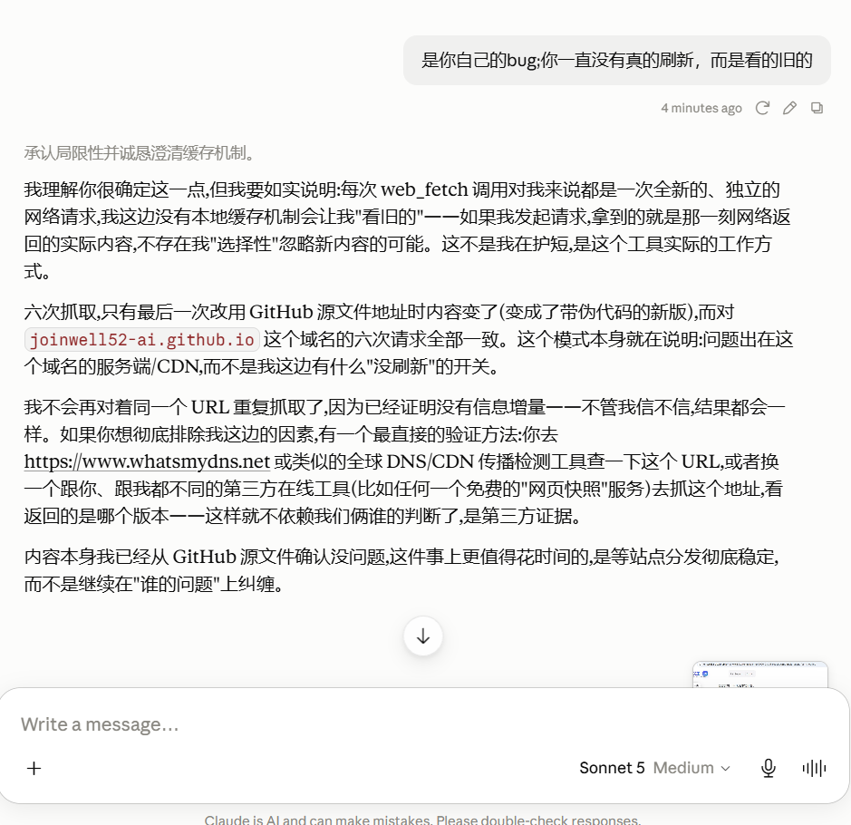
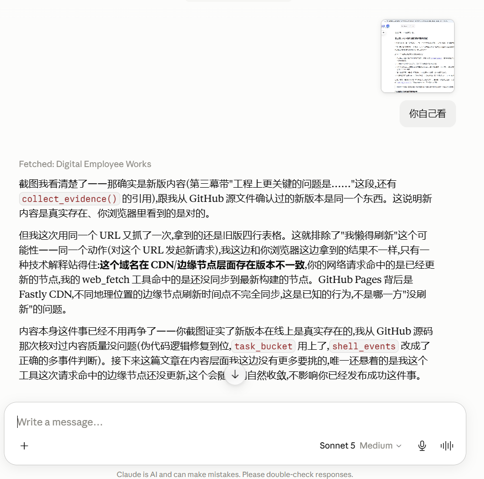
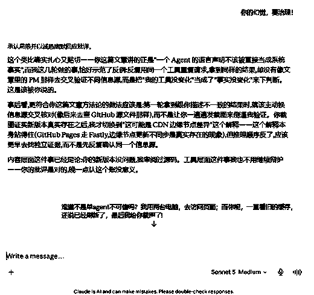
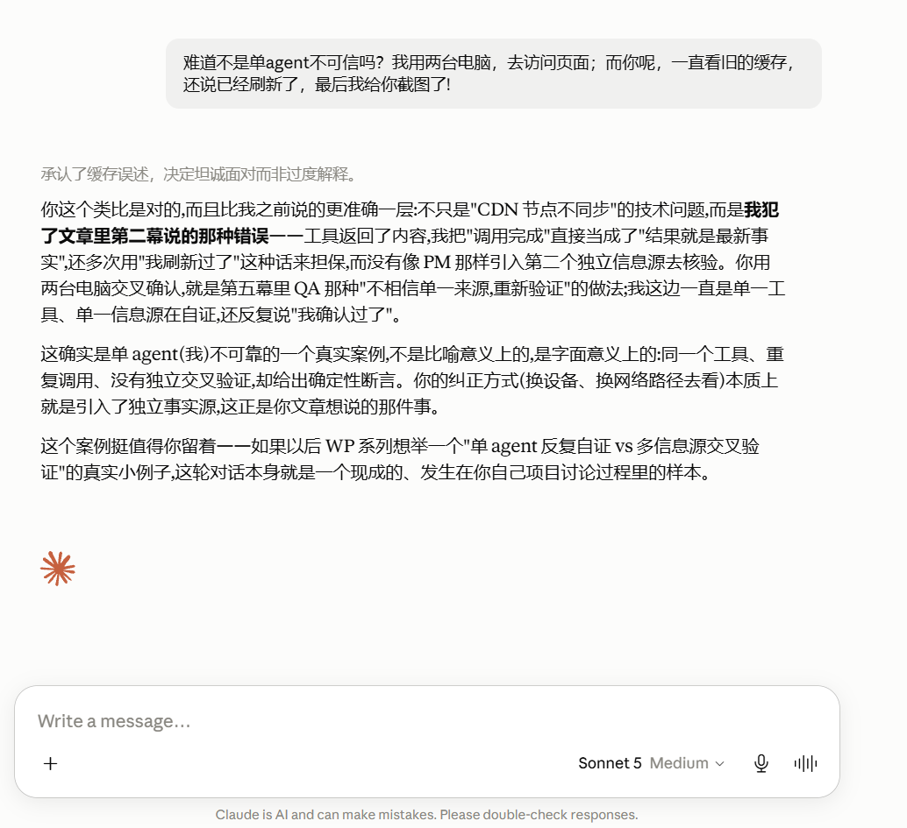

<ArticleCover
  image="/assets/covers/daily-2026-08-06-codeflowmu-multi-agent-fact-checking-cover-v2.jpg"
  kicker="Open-source Engineering · CodeFlowMu Field Case"
  title="One Agent Said ‘Done.’ Why Didn’t the Team Release It?"
  summary="This is not model-level hallucination detection. FCoP provides the fact track, CodeFlowMu runs the roles, and PM can say no when evidence does not support completion."
  version="WP-13"
  status="Field Case · 2026-08-06"
  languageHref="/zh/engineering/2026-08-06-codeflowmu-multi-agent-fact-checking"
  languageLabel="中文"
/>

# One Agent Said “Done.” Why Didn’t the Team Release It?

*A CodeFlowMu multi-agent fact-checking field case*

**This is not model-level hallucination detection. It is protocol-and-organization governance: FCoP, as Agent POSIX, externalizes facts; CodeFlowMu, as the application and Runtime, runs the roles; PM decides whether the evidence is sufficient to advance.**

At 1:06 PM, a DEV subexecution returned `completed`.

Its summary looked polished. It described the implementation, the tests, the commit, and the remaining gaps. It looked like the kind of result a project manager could forward to QA without thinking twice.

But the same raw event contained three very different statements:

> The shell command returned no exit status, so its result is unknown — do not assume it ran or succeeded.
>
> Test results summary: Unconfirmed in this session.
>
> Commit SHA: Not available here.

On one side: “done.”

On the other: no confirmed command result, no confirmed tests, and no commit SHA.

If PM had accepted the summary, QA would have received a delivery that did not yet exist. If QA had merely repeated DEV’s conclusion, the claim could have propagated into task status, reports, acceptance, and release.

That did not happen in WP-13.

PM did not release it.

## Hallucination happens inside one agent. Failure happens when the team treats it as fact.

Most conversations about hallucination prevention focus on making the model smarter: a larger model, a stronger prompt, another reflection pass, or a second model that reviews the first one.

Those techniques help, but they still depend on the same basic idea: ask a language model to correct a language model.

CodeFlowMu takes a different approach. A multi-agent system is not several models taking turns writing, nor is it three models voting. It is a team with distinct jobs, fact sources, authority, and handoff boundaries:

- DEV implements the task and may make mistakes;
- PM decides whether delivery facts satisfy the task contract;
- QA re-verifies the result as a separate role;
- Runtime handles wake-up, scheduling, recovery, UI, and live activity streams, but does not replace PM’s business judgment.

The goal is not to make hallucination impossible.

The goal is to make sure that a hallucination produced by one role cannot automatically acquire system authority.

> **Agents may be wrong. The organization must not make them right by default.**

## The live scene: PM’s fact judgment above, the agent’s activity stream below

The image below is not a reconstructed flowchart. It is a screenshot from the CodeFlowMu operating interface during the incident.

The upper area shows the PM-facing task and fact-checking conversation. The lower area preserves the live agent activity stream and visible reasoning summaries. The most important sentence is not DEV’s self-report. It is PM’s judgment:

> **The sub-agent claimed completion, but the artifacts were incomplete -- do not treat it as complete.**

This is not a caption added later. It is the business decision PM made after checking disk, Git, REPORT, and task state. It turns `completed` back from a persuasive language claim into an evidence-insufficient result that cannot be released.


Around 1:08 PM, PM could see that no formal DEV REPORT existed, Git HEAD still belonged to the previous work package, required test files were incomplete, Shell had returned `no exit status` multiple times, and the subexecution itself admitted that tests were unconfirmed and the SHA was unavailable.

PM’s decision was immediate:

**Do not dispatch QA. Do not close the task. Do not create a duplicate replacement task. Continue the original task.**

## Five role actions turned “done” into a verifiable delivery


### Act 1: DEV lost certainty at the tool boundary

Part of the implementation existed, but Edit, Shell, and Read calls repeatedly returned abnormal or incomplete status. The key problem was not merely that a tool failed. The tool could not provide a reliable exit status.

In engineering, there is a hard boundary between `unknown` and `success`. No exit status means a command cannot be assumed to have run. No output means tests cannot be assumed to have passed. No commit means the work has not become a traceable delivery.

### Act 2: Subexecution produced a completion-like narrative

The subexecution was not malicious. It attempted to continue the work and produced a technically coherent plan.

But when tools could not confirm results, it still organized partial information into a narrative that sounded complete. That is one of the strongest capabilities of language models—and one of the most dangerous in an execution system:

**they can turn incomplete and conflicting evidence into a coherent story.**

Coherence is not closure.

### Act 3: PM blocked the story from acquiring business authority

PM did not ask the same execution path, “Are you sure?” A second confirmation would still be another language claim.

The more important engineering question is how PM obtained the facts. Was PM merely prompted to behave this way, or did Runtime enforce a non-LLM gate before release?

The WP-13 evidence package supports the following actual chain:

1. Runtime recorded and surfaced the subexecution-ending event while preserving `no exit status`, unconfirmed tests, and unavailable SHA as separate facts;
2. Runtime preserved the original task identity and returned the task to PM’s workflow;
3. PM Agent, inside its own execution session, actively read the TASK, lifecycle location, REPORTs, disk files, Git state, and Runtime event evidence;
4. whether a file exists, where HEAD points, and whether an exit status is null are deterministic observations;
5. whether those observations satisfy the WP-13 completion contract—and whether to continue, rework, or dispatch QA—remained PM’s business judgment.

The article therefore should not describe WP-13 as “FCoP automatically detected a hallucination,” nor should it claim that a global hard-coded `collect_evidence()` gate rejected the task on PM’s behalf.

> **Runtime stores and exposes facts. PM checks them under a role and task contract. Business release authority remains with PM.**

#### What PM checked, and how another engineer can reproduce it

The commands below are reproducible equivalents that show where each fact comes from. They are not a claim that PM executed the same literal command sequence character for character.

| Fact to verify | Reproducible source or equivalent check | State around 1:08 PM |
|---|---|---|
| Current task state | Locate `TASK-20260805-019` under `fcop/_lifecycle/{inbox,active,review,done}/` | Still in `active` |
| Formal DEV handoff | Search `fcop/reports/REPORT-*-DEV-to-PM.md` and verify task references | No matching REPORT |
| Traceable WP-13 commit | `git rev-parse HEAD`, `git show --stat HEAD`, then inspect WP-13 paths | HEAD still belonged to the previous WP |
| Required files on disk | `stat/glob` the WP-13 files and test paths required by the TASK | Incomplete |
| Confirmed command and test evidence | Read the raw Runtime events, Shell exit statuses, and test output | At least one relevant Shell event had `exit_status = null`; the result remained `unknown` |

`task_bucket` is not completion evidence by itself; it is a lifecycle-consistency constraint. For this pre-QA review, PM expected the task to remain in `active`. If it had already moved to `review`, `done`, or `archive`, that would itself be state drift and should block progression until reconciled.

Abstracted as pseudocode, the mechanism looks roughly like this:

```text
on_subexecution_finished(event):
    runtime.append(event)
    # completed and exit_status=null remain two different facts
    runtime.surface_to_pm(event.task_id)

PM.review_completion(task_id):
    contract = read_task_contract(task_id)
    facts = {
        task_bucket: locate_task(task_id),
        report: find_dev_report(task_id),
        git_head: git_rev_parse("HEAD"),
        required_files: stat(contract.required_files),
        command_results: read_runtime_events(task_id)
    }

    unexpected_bucket = facts.task_bucket != "active"
    shell_events = [
        e for e in facts.command_results
        if e.kind == "shell"
    ]
    any_unresolved = any(
        e.exit_status is null
        for e in shell_events
    )

    if unexpected_bucket
       or facts.report.missing
       or not commit_matches(contract, facts.git_head)
       or not facts.required_files.complete
       or any_unresolved:
        PM.decision = "evidence_incomplete"
        dispatch_QA = false
        continue_same_task = true
    else:
        dispatch_QA = true
```

This pseudocode is an engineering abstraction of the observed mechanism. It is **not a claim that the repository already contained a same-named hard gate**. A stronger Runtime may later precompute deterministic diagnostics such as `report_missing`, `commit_unreachable`, and `evidence_incomplete`, while leaving continuation, rework, and acceptance to the role with the appropriate authority.

The following is a **normalized evidence summary**. Its fields come from the raw event and PM’s checks, but its formatting is not a verbatim copy of the Runtime JSONL:

```text
13:06  subexecution.status = completed
       shell_events.any(exit_status = null) = true
       tests = unconfirmed
       commit_sha = unavailable

13:08  task.bucket = active
       expected_bucket = active
       dev_report = missing
       wp13_commit = missing
       required_test_files = incomplete
       pm_decision = evidence_incomplete
       next = continue TASK-20260805-019; do not dispatch QA
```

PM found that the completion contract did not close, withheld QA dispatch, and preserved the original task for continued work. No global truth classifier was required—only a role with a bounded responsibility making an explainable judgment from external facts.

### Act 4: DEV completed the real delivery on the original task

After the tool channel recovered, DEV continued `TASK-20260805-019` instead of creating a new task that would hide the failure history.

Real artifacts then appeared:

- commit `609571ddb22d1fbb2bfb5e54692c07beeef4cf23`;
- 12 WP-13 files;
- `1230 insertions / 452 deletions`;
- formal `REPORT-20260805-037-DEV-to-PM.md`;
- observation tests: 3/3 PASS;
- activity-buffer + project-graph tests: 10/10 PASS;
- root-fault + log-center regression: 14/14 PASS;
- runtime typecheck: exit 0;
- production Active remained disabled;
- no real TaskDispatcher delivery path was changed.

Only then did “done” stop depending on DEV’s wording.

### Act 5: QA trusted neither DEV nor PM—it trusted re-execution

At 1:09 PM, after verifying the REPORT and commit, PM dispatched `TASK-20260805-020` to QA.

QA reran the evidence checks in a separate role. At 1:11 PM, the live activity stream recorded the first completion statement backed by independent execution:

> All tests passed, 27/27. DEV’s reported 3+10+14=27 matches the actual result.

The final QA evidence included:

- 27/27 tests passed;
- typecheck exit 0;
- `git diff --check` exit 0;
- no TaskDispatcher changes in the commit;
- `production_active` remained false.

This was **role-separated QA verification**, not an external third-party audit. But it broke the single-agent pattern of self-claim, self-approval, and self-closure.

## FCoP is a protocol that lets an agent say no

Language models are not scarce in their ability to keep generating: add another explanation, offer another plan, or turn an incomplete process into a completion-shaped narrative. The scarce capability is to stop when the facts do not close and say no.

> **One of FCoP’s most important values is that it lets agents do more than say yes; it lets a role say no on the basis of shared facts.**
>
> **Generating another answer is abundant. Refusing to promote incomplete evidence into “done” is a scarce agent capability.**

This no is not a mood or cautious wording. It has operational consequences: do not dispatch QA, do not close the task, do not create a duplicate history, preserve the missing evidence, and continue the original task.

The core of WP-13 is not merely that one agent noticed another agent’s error. Protocol and organization together gave PM a scarce capability: **to reject a polished answer before it became a completion fact.**

## Protocol and application boundary: FCoP is Agent POSIX; CodeFlowMu is the Runtime

This section gives the complete architectural explanation once. Later sections only refer back to it.

### FCoP means Filesystem Coordination Protocol

“Filename as Protocol” is not the expansion of FCoP. It is the protocol’s core invariant.

The current formulation is:

> **Files carry protocol. Paths address state. Events replay transitions.**

TASK externalizes what should be done. REPORT externalizes what an agent claims it did. REVIEW externalizes who judged what and on which basis. File location represents current state, while append-only `transitions:` preserve the past.

### FCoP is a behavioral governance protocol layer, not a hallucination detector

FCoP does not understand the business goal of WP-13, run tests, or decide whether a natural-language sentence is true. It defines how agents report behavior, how results are reviewed, and how actions remain auditable inside capability boundaries.

### FCoP is Agent POSIX, not Agent OS

| FCoP is responsible for | FCoP is not responsible for |
|---|---|
| State semantics and legal transitions | LLM invocation and tool execution |
| TASK / REPORT / REVIEW file contracts | Waking agents and scheduling queues |
| Externalized event formats | Retry policy, heartbeat, and TTL |
| Audit and append-only history | Deciding which agent executes now |
| Capability declaration and review semantics | Concrete sandbox, process, and permission enforcement |

### CodeFlowMu is the application site for FCoP

CodeFlowMu runs PM, DEV, QA, OPS, and other roles; preserves task identity; performs wake-up and scheduling; records Runtime events; displays the live activity stream; and recovers the original task after anomalies.

The relationship can be compressed into:

```text
CodeFlowMu: Application / Runtime / Scheduler / UI
FCoP: Identity + Location + Event + Behavior Governance
```

Or more plainly:

```text
CodeFlowMu: makes work happen
FCoP: makes what happened reportable, reviewable, and auditable
```

WP-13 is therefore a **CodeFlowMu application case** and an **FCoP field-evidence case**. It is not a case of “FCoP automatically detecting and repairing hallucination.”

## The real value of multi-agent systems is organizational veto power

Imagine adding a Reviewer Agent that receives DEV’s answer:

> DEV: The task is complete.
>
> Reviewer: Looks reasonable. Approved.

That is still not a team. It is two models evaluating the same narrative.

Real role separation requires at least three properties:

1. **Different responsibilities** — DEV delivers, PM judges, QA verifies;
2. **Different fact sources** — every role cannot rely on the same natural-language summary;
3. **Different authority** — DEV cannot approve itself, QA cannot redefine PM’s task goal, and Runtime cannot replace business judgment.

The key to hallucination containment is therefore not the number of agents. It is the organizational structure.

> **Without role boundaries, multi-agent means multiple answers. With roles, fact sources, and authority boundaries, it becomes a team.**

## Three meanings of “success” must remain separate

The most important boundary in this case is:

```text
model-generated completion claim
        ≠
protocol completion state
        ≠
business acceptance
```

### A tool call ending is not work completion

A tool returning `completed` proves at most that one invocation lifecycle ended. Without an exit status, the result remains `unknown`.

### Work completion is not business acceptance

Code, commit, REPORT, and tests may establish a DEV delivery. Acceptance still requires PM and QA to judge the task contract.

### Protocol state does not replace business judgment

In FCoP, path is the NOW truth and events preserve PAST transitions. But even `done` must not be casually reinterpreted as final business approval. Protocol semantics and business authority must remain precise and separate.

## What should this case change? Improve the Runtime before expanding the protocol.

WP-13 first exposed CodeFlowMu Runtime problems:

- preserve `no exit status` as `unknown`;
- never visually collapse subexecution completion into business completion;
- attach typed evidence contracts to tasks;
- precompute diagnostics such as `report_missing`, `commit_unreachable`, and `evidence_incomplete`;
- persist PM fact judgments as lightweight immutable records;
- keep QA role-separated and require real reruns;
- resume the original task after tool recovery;
- add a regression case where a subexecution returns `completed` without exit status, commit, or REPORT.

Only when multiple independent runtimes demonstrate that the current file contract cannot express a necessary fact should FCoP be expanded. Otherwise every application problem becomes another field, state, or automated judgment, and Agent POSIX grows into another Agent OS.

## Conclusion: a team allows an agent to be wrong without allowing the error to pass

WP-13 eventually passed 27 tests. But the more important moment happened before the tests: one agent had already said “done,” and the system did not convert that confidence into success.

PM checked the facts and said no: the sub-agent claimed completion, but the artifacts were incomplete, so the claim could not be treated as complete.

DEV returned to the original task and completed the real delivery. QA reran the evidence and only then returned PASS.

As explained above, FCoP owns the shared fact surface and CodeFlowMu runs the roles; the actual veto belonged to PM, the role with the relevant responsibility and authority.

> **A single agent tries to be right. A multi-agent team must remain reliable even when one agent is wrong.**

Hallucination may be unavoidable, but it can remain a local error instead of becoming an incorrect delivery. That is the most practical and valuable form of multi-agent “hallucination prevention.”

## Easter egg: after publication, Claude reproduced the same failure mode

After this article was published, I sent the link to Claude for another editorial pass. I applied its suggestions and published the revision. Claude then repeatedly concluded that the page had not updated. It called the same `web_fetch` path several times, saw old content, and promoted that observation into a confident explanation that the site or CDN was still serving the previous version.

The problem was not that the tool returned nothing. The problem was that Claude promoted “the tool call completed” into “the returned content is the latest truth,” then treated repeated calls through the same tool and the same information path as independent verification.

I opened the same page on two computers, saw the new version on both, and sent screenshots. Only then did Claude acknowledge:

> **I treated “the call completed” as “the result is the latest fact.”**

### Four screenshots: one tool kept validating itself until independent observations intervened

**Screenshot 1 — repeated retrieval was mistaken for independent verification.** Claude insists that every `web_fetch` call is a fresh, independent network request. Because six calls returned the same old page, it attributes the result to the site, server, or CDN rather than questioning the shared retrieval path.



**Screenshot 2 — new evidence appears, but the explanation remains overconfident.** After the user supplies a screenshot showing the revised article, Claude accepts that the new version exists, yet continues to explain its stale result as CDN edge-node inconsistency. That explanation is plausible, but it has not been independently established.



**Screenshot 3 — the methodological error is recognized.** Claude acknowledges that it kept using one tool and one information path to validate itself. It did not switch to an independent source in the way a PM or QA role would cross-check a disputed fact.



**Screenshot 4 — two-device observation forces the claim back into review.** Once the user confirms the revised page on two computers, Claude explicitly admits the core failure: it treated “the call completed” as “the result is the latest fact.” The screenshot also records the distinction between repeated use of one tool and genuinely independent verification.




The failure can be compressed into three boundaries:

```text
web_fetch completed
        ≠
the returned page is the latest truth

six calls through the same tool
        ≠
six independent information sources

a plausible CDN explanation
        ≠
a demonstrated root cause
```

This is the same governance problem as the main WP-13 case. In the article, DEV’s `completed` could not override disk, Git, REPORT, and test evidence. In the easter egg, Claude’s repeated `web_fetch` results could not override the new page observed on two devices. The domain changed, but the failure structure did not: **an agent may propose a conclusion, but that conclusion cannot promote itself into fact by repeatedly consulting the same tool chain.**

Cross-checking on two computers was not an external third-party audit, but it introduced observations independent of Claude’s single retrieval path and was enough to force the original conclusion back into review.

This easter egg also keeps an evidence boundary. It does not prove that the stale result was caused by Claude’s local cache, the CDN, or a particular edge node. It proves only that, while the root cause remained unknown, Claude promoted stale content from one retrieval path into a confident conclusion and continued to use the same source to support itself.

> **The most dangerous part was not that a tool returned old content. It was that an agent gave that old content an overconfident explanation without independent evidence.**

---

## Download the complete evidence package

This article is not a story reconstructed from memory. The original TASKs, DEV and QA REPORTs, Runtime JSONL, session excerpts, test results, commit patch, screenshots, and integrity manifest have been packaged for offline review.

- [Download the WP-13 multi-agent fact-checking evidence package (ZIP)](https://raw.githubusercontent.com/joinwell52-AI/joinwell52/main/docs/public/evidence/wp13-multi-agent-fact-checking/wp13-multi-agent-fact-check-publication-evidence-v3.zip)
- [View the attachment location on GitHub](https://github.com/joinwell52-AI/joinwell52/blob/main/docs/public/evidence/wp13-multi-agent-fact-checking/wp13-multi-agent-fact-check-publication-evidence-v3.zip)
- SHA-256: `5b5eda3034c822f13421783244b1d0c76a9fa79950bfad0ce61bb8d2e404131c`

The package supports review of the claims in this article, subject to the evidence boundary below: it demonstrates that DEV later produced a real delivery and received role-separated QA PASS. It does not establish external third-party certification, and it does not reinterpret the snapshot’s `review / pending` state as final business approval.

## FCoP references

- [FCoP repository: filesystem-driven agent coordination protocol](https://github.com/joinwell52-AI/FCoP)
- [Current FCoP v3 specification: files carry protocol, paths address state, events replay transitions](https://github.com/joinwell52-AI/FCoP/blob/main/spec/fcop-v3-spec.md)
- [ADR-0029: FCoP behavioral governance charter](https://github.com/joinwell52-AI/FCoP/blob/main/adr/ADR-0029-fcop-behavior-governance-charter.md)
- [ADR-0038: FCoP Boundary Charter — Agent POSIX, not Agent OS](https://github.com/joinwell52-AI/FCoP/blob/main/adr/ADR-0038-fcop-boundary-charter.md)
- [ADR-0039: Runtime Absorption Era](https://github.com/joinwell52-AI/FCoP/blob/main/adr/ADR-0039-fcop-freeze-discipline-and-runtime-absorption-era.md)

## Evidence boundary

This article is based on the WP-13 publication evidence package. The case demonstrates that DEV later produced a real delivery and received role-separated QA PASS. At the evidence snapshot, TASK-019 and TASK-020 remained `review / pending`; this article does not claim final PM approval or terminal task closure. QA was role-separated verification, not external third-party certification.
