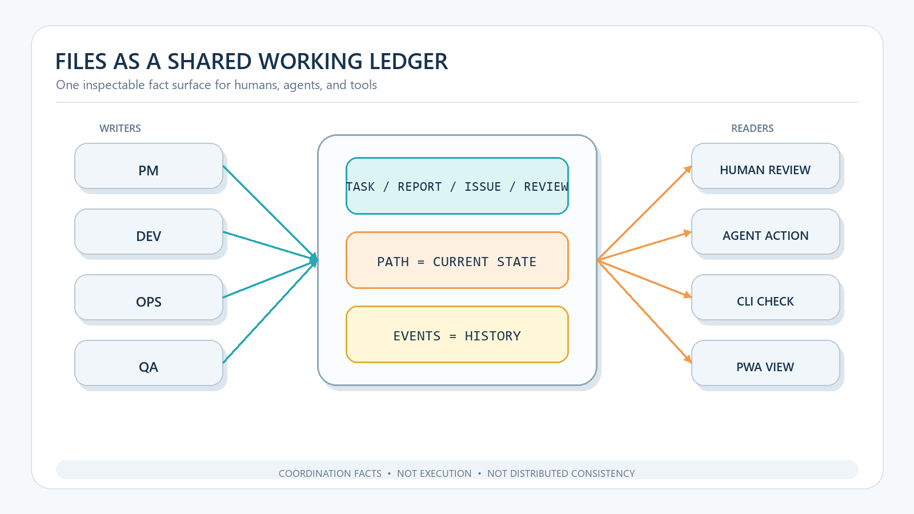

# Why Multi-Agent Governance Can Start with Files


> Files are not a bargain-bin substitute for queues, databases, or workflow engines. Their first governance value is simpler: they can create a work ledger that both humans and agents can read, inspect, copy, and recover.

**Series map:** this article explains why files are a useful starting point. Continue with [the state-machine implementation](/en/engineering/2026-08-18-fcop-file-state-machine), then [the Cursor operating guide](/en/digital-employee/2026-08-18-cursor-ai-development-team). The three pieces cover governance value, protocol mechanics, and accepted delivery.

Imagine four agents working in four conversations. One changes code, one writes tests, one checks the runtime, and one reviews the result. Two hours later, every window says “done,” yet the person in charge still cannot answer basic questions. Which task version was authoritative? Who changed the scope? Which test report belongs to which implementation? Did the reason for rejection make it into the rework request?

The missing component is not a smarter model. It is shared operational truth.

For a local-first, single-machine agent system with low or moderate concurrency, that truth can begin as files. Tasks, reports, issues, and review decisions become explicit artifacts. Directory location represents current lifecycle state. Append-only events preserve how the state changed. FCoP summarizes the model as: **files carry the protocol, paths address state, and events record history.**

This is not an argument that files should replace every other system. It is an ordering principle: make the work visible and inspectable before adding a more elaborate control plane.

## What the Unix lesson actually says

The useful lesson in Ritchie and Thompson’s [The UNIX Time-Sharing System](https://pdos.csail.mit.edu/6.828/2014/readings/ritchie78unix.pdf) is more precise than the slogan “everything is a file.” Unix organized objects in a hierarchical namespace, made ordinary files, devices, and inter-process I/O accessible through largely compatible interfaces, and enabled small programs to compose through standard input, output, and pipes.

Three design ideas transfer well to agent governance.

First, a common interface reduces integration cost. A human can open a task in an editor, an agent can parse its front matter, a CLI can scan the directory, and a web view can index it. They do not need the same SDK to understand the work.

Second, names and locations can carry stable meaning. Directories such as `inbox/`, `active/`, `review/`, and `done/` form a state surface that programs and people can both inspect.

Third, complicated behavior can be split into small, composable tools. Creation, validation, transition, review, and archival can evolve independently if they honor the same artifact contract.

The original paper also prevents an overclaim. Unix still needed processes, pipes, permissions, and internal interlocks. Concurrent writes could corrupt file content. In this article, “everything is a file” therefore means **externalize coordination facts through open, readable artifacts where practical**. It does not mean that the filesystem automatically solves concurrency, durability, or distributed consistency.

## Files as a practical blackboard

H. Penny Nii’s classic article on [the blackboard model](https://ojs.aaai.org/aimagazine/index.php/aimagazine/article/view/537) describes systems in which multiple knowledge sources contribute intermediate results to a shared problem-solving structure. No individual knowledge source has to keep the entire truth in private memory; coordination happens through a common work surface.

A directory can implement such a surface, but a directory is not automatically a blackboard. It becomes useful for governance only when:

1. every artifact has a defined identity;
2. the current state has one authoritative location;
3. transitions leave ordered evidence;
4. roles have explicit permissions and responsibilities; and
5. completion depends on verifiable evidence, not an agent’s assertion.

That distinction separates a chat archive from a work ledger. Chat is organized by who spoke when. A work ledger is organized by the work object, its owner, its evidence, and its decisions.



*Figure 1: File-based governance first creates a shared fact surface. It coordinates tasks, state, and evidence; it does not replace execution or distributed consistency.*

## Four facts a minimal ledger should preserve

FCoP uses four IPC envelopes to keep different claims separate:

| Artifact | Question it answers | Minimum useful content |
| --- | --- | --- |
| `TASK` | Who is expected to deliver what? | sender, recipient, priority, parent, scope, acceptance criteria |
| `REPORT` | What did the worker actually do? | task reference, changes, tests, evidence paths, remaining risks |
| `ISSUE` | What is blocking the work? | symptom, impact, attempted actions, required decision |
| `REVIEW` | Who made what judgment on which evidence? | subject, reviewer, verdict, rationale, next action |

Paths then express current state. A task enters `_lifecycle/inbox`, moves to `active`, may be submitted to `review`, reaches `done`, and is eventually archived. Events record each transition with time, source, destination, actor, and tool.

These layers are deliberately non-interchangeable:

- file content says what the artifact is;
- path says where it is now;
- event history says how it got there.

> **A `status: done` field is not lifecycle state. Path is the authoritative present; compressing location and transition history into one field destroys the review trail.**

Collapsing them into a mutable `status: done` field makes it impossible to tell whether work passed review or a worker merely announced completion.

## Inspectability changes the quality of rework

The FCoP repository contains a small [Tetris dogfood evidence set](https://github.com/joinwell52-AI/FCoP/tree/a859e6747fe6e5e2d686e0114c77774726d7f748/docs/tutorials/assets/tetris-en/evidence). In one trace, a task was underspecified. The implementer guessed instead of using the available issue path, and the defect appeared in the guessed area. The review rejected the result, and an administrator produced a sharper rework task.

One example cannot establish a defect-rate improvement or prove production-scale performance. It supports a narrower conclusion: when task, report, review, and rework artifacts remain separate, a failure does not collapse into a vague memory. A maintainer can locate where ambiguity entered, whether the worker escalated it, and whether the review became an actionable next task.

The ledger does not eliminate mistakes. It makes them attributable, discussable, and convertible into the next decision.

## When starting with files is sensible

A file-backed ledger is a strong starting point when:

- work happens on one machine or in a clearly bounded shared workspace;
- human readability matters more than millisecond latency;
- artifacts should fit Git, backups, and ordinary file tools;
- people need to inspect and approve agent work directly; and
- the protocol is still evolving faster than a control-plane implementation.

Pressure to add a stronger runtime or index appears when:

- many machines compete for the same tasks;
- the system requires strict transactions, granular authorization, or complex queries;
- retries, leases, timeouts, and throughput guarantees become central;
- network-filesystem semantics are not good enough; or
- directory scans and manual discovery become operational bottlenecks.

The useful separation is between an **artifact plane**, which preserves readable evidence, and an **execution plane**, which owns scheduling, isolation, retries, and scale. They can begin in one local directory and later evolve into distinct components.

## A minimum structure you can build today

Start with one real project using the following **generic ledger layout**. This is not a literal copy of FCoP v3: current FCoP keeps lifecycle history in the TASK front matter as `transitions:`, while the example uses a separate `events/` directory to show another valid storage choice.

```text
work/
  _lifecycle/
    inbox/
    active/
    review/
    done/
    archive/
  reports/
  issues/
  reviews/
  events/
```

Then ask seven questions:

1. Does each unit of work have a unique identity and recipient?
2. Can a human find the authoritative version in under a minute?
3. Does “done” point to tests, a diff, or other environmental evidence?
4. Is the worker’s report separate from the reviewer’s judgment?
5. Does a rejection create a traceable next action?
6. Do transitions retain their time, actor, source, and destination?
7. If the runtime crashes now, can it reconstruct what happened from disk?

If most answers are “no,” adding more agents will usually increase ambiguity rather than throughput.

## Start by making governance visible

Starting with files is neither nostalgia nor an objection to infrastructure. It uses a durable engineering advantage: open, simple, composable interfaces let different tools share facts with little coupling.

When a system is moving from one agent to several, its first risk is often not insufficient throughput. It is the inability to name the current task, owner, evidence, and decision. Externalizing those facts through files, paths, and events reveals the real pressure: discovery, contention, recovery, authorization, or scheduling. Only then does adopting a database, queue, or workflow engine become an evidence-based upgrade.

FCoP is not an industry standard and it is not a final answer. It is a concrete engineering proposition: **before expanding the control plane, make the collaboration itself visible to the people responsible for it.**

Once files provide the work ledger, the next question is how to implement transitions without exposing partial artifacts and how to test every invariant. Continue with [Files, Paths, and Events: Implementing and Testing the FCoP State Machine](/en/engineering/2026-08-18-fcop-file-state-machine).

## Sources

- [Ritchie & Thompson, The UNIX Time-Sharing System](https://pdos.csail.mit.edu/6.828/2014/readings/ritchie78unix.pdf)
- [H. Penny Nii, The Blackboard Model of Problem Solving and the Evolution of Blackboard Architectures](https://ojs.aaai.org/aimagazine/index.php/aimagazine/article/view/537)
- [FCoP v3 specification](https://github.com/joinwell52-AI/FCoP/blob/a859e6747fe6e5e2d686e0114c77774726d7f748/spec/fcop-v3-spec.md)
- [ADR-0038: FCoP Boundary Charter](https://github.com/joinwell52-AI/FCoP/blob/a859e6747fe6e5e2d686e0114c77774726d7f748/adr/ADR-0038-fcop-boundary-charter.md)
