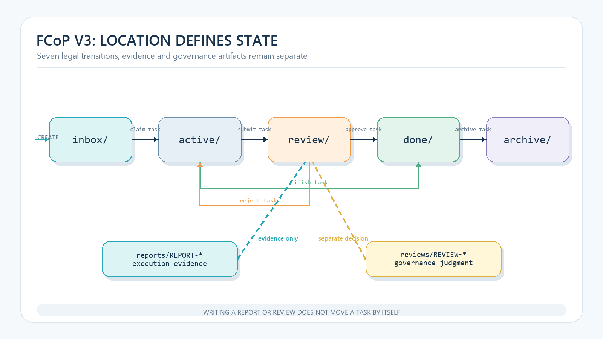
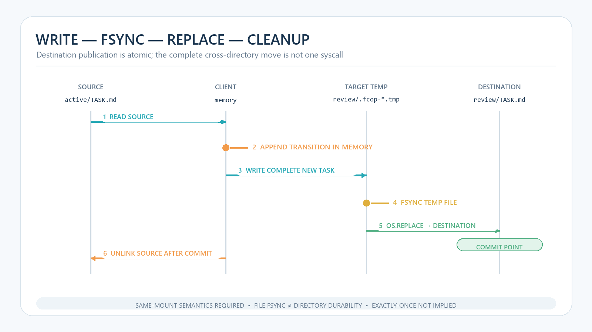

# Files, Paths, and Events: Implementing and Testing the FCoP State Machine


> FCoP is not just a directory watcher. A working implementation must preserve four contracts at once: artifact identity, path-addressed state, transition evidence, and atomic publication.

**Series map:** read [the governance argument](/en/engineering/2026-08-18-files-first-multi-agent-governance) first if you are still deciding why files are a useful starting point. After this protocol implementation, continue with [the Cursor operating guide](/en/digital-employee/2026-08-18-cursor-ai-development-team).

Suppose an agent changes `status` to `done` inside a task while the file remains in `active/`. A dashboard trusts the field, a scheduler trusts the directory, and a reviewer sees only a success log. The system now has three answers and no authoritative current fact.

The common mistake in file-based coordination is to treat “written to disk” as “protocol complete.” What must actually be implemented is a state machine: which artifacts may enter, which location is authoritative, who may perform each transition, what evidence a transition leaves, and what a crash can expose.

The [FCoP v3 specification](https://github.com/joinwell52-AI/FCoP/blob/a859e6747fe6e5e2d686e0114c77774726d7f748/spec/fcop-v3-spec.md) states the model compactly: files carry the protocol, location defines state, and events record history. The following is the smallest useful implementation of that idea.

## Contract 1: artifact identity

FCoP defines four IPC envelopes: `TASK`, `REPORT`, `ISSUE`, and `REVIEW`. Their identity semantics differ: `TASK` and `REPORT` use sender-to-recipient routing, `ISSUE` identifies its reporter, and `REVIEW` binds to the subject under review. For example:

```text
TASK-20260818-001-PM-to-DEV.md
REPORT-20260818-002-DEV-to-PM.md
ISSUE-20260818-003-QA.md
```

A review is attached to its subject rather than masquerading as another routed message:

```text
REVIEW-20260818-004-QA-on-report-002.md
```

The body should repeat fields that a schema can validate:

```yaml
---
protocol: fcop
version: 3
type: TASK
sender: PM
recipient: DEV
priority: P1
subject: Implement CSV export and tests
task_id: TASK-20260818-001-PM-to-DEV
date: 2026-08-18T15:00:00+08:00
---
```

At minimum, validate the filename prefix against `type`, match `task_id` to the filename stem when that optional field is present, require legal sender and recipient values, parse timestamps, and reject obvious cycles in `ref_task`/`parent` relationships. Filename structure improves routing and early error detection; it is not a replacement for authorization or a complete business schema.

## Contract 2: path-addressed lifecycle state

The current FCoP lifecycle has five locations:

```text
_lifecycle/inbox
_lifecycle/active
_lifecycle/review
_lifecycle/done
_lifecycle/archive
```



*Figure 1: The path defines the TASK's current state. A REPORT is execution evidence and a governance REVIEW is a separate judgment; neither moves the TASK by itself.*

The dashed lines are not automatic transitions. A REPORT is execution evidence and a governance REVIEW is a separate judgment; neither can move a TASK to `done/` by itself.

A minimal transition table is:

| Operation | From | To | Principal responsibility |
| --- | --- | --- | --- |
| create/write | external | inbox | creator |
| claim | inbox | active | worker or lifecycle governor |
| submit | active | review | worker |
| finish | active | done | authorized terminal actor |
| approve | review | done | reviewer or leader |
| reject | review | active | reviewer or leader |
| archive | done | archive | ADMIN or leader |

Location should be the authoritative lifecycle fact. A body-level status can be derived or retained for compatibility, but it must not establish a second competing state machine.

> **A `status: done` field is not lifecycle state. Path is the authoritative present; compressing location and transition history into one field destroys the review trail.**

The [3.2.5 release note](https://github.com/joinwell52-AI/FCoP/blob/a859e6747fe6e5e2d686e0114c77774726d7f748/docs/releases/3.2.5.md) also sharpens role boundaries: a worker reports and stops; ADMIN or a leader performs archival. “I finished my work” and “the system has accepted and closed the work” are different claims.

## Contract 3: event evidence

Moving an old file updates a path but does not explain history. FCoP v3 therefore keeps events in the TASK front matter as an append-only `transitions:` array:

```yaml
transitions:
  - at: 2026-08-18T15:18:43+08:00
    from: active
    to: review
    by: DEV-01
    tool: submit_task
    note: REPORT-20260818-002-DEV-to-PM
```

The five required fields are `at`, `from`, `to`, `by`, and `tool`; `note` and `supersedes` are optional. Because the transition travels inside the TASK, it does not need a separate event ID to identify its subject. An auditor can compare the current path with the latest transition and flag an artifact in `review/` whose trace still ends in `active`.

Current state and history should cross-check one another, not duplicate the same mutable field.

## Contract 4: atomic publication

For a new TASK, do not write directly to the final path. Append the creation transition in memory, write the complete text to a temporary file in the destination directory, fsync it, and replace the final inbox path.

A state transition must not rename first and append an event later. The current implementation reads the source TASK, appends the transition in memory, writes the complete new TASK into a temporary file inside the destination directory, fsyncs it, replaces the destination path, and only then removes the source.

```python
def transition(source, target_stage, event):
    require_legal_edge(source, target_stage, event.tool)
    require_same_mount(source, target_stage)
    old_text = read(source)
    new_text = append_to_transitions(old_text, event)
    tmp = unique_temp_in(target_stage)
    write_all(tmp, new_text)
    fsync_file(tmp)
    os.replace(tmp, destination_in(target_stage, source.name))
    unlink_source_after_commit(source)
```



*Figure 2: `os.replace` is the destination publication point. Source cleanup follows, so the complete cross-directory operation is not one syscall.*

[POSIX.1-2024 `rename`](https://pubs.opengroup.org/onlinepubs/9799919799/functions/rename.html) specifies an atomic rename action under its defined conditions and exposes `EXDEV` for cross-filesystem cases. The [POSIX rationale](https://pubs.opengroup.org/onlinepubs/9799919799/xrat/V4_xbd_chap01.html) is equally important: directory operations may be atomic and serializable without being durable on storage.

The replace commit point prevents an observer from reading a partial new TASK at the destination and puts the destination path and new transition in the same file. It does not imply that:

- exactly one worker automatically wins a claim;
- data is durable after every crash;
- a network filesystem behaves like a local disk;
- the workflow is deadlock-free; or
- a task executes exactly once.

Claim contention needs an explicit winner model or single-writer governor. Repeated effects require idempotency keys. Recovery requires reconciling paths and events. None of these properties follows from the word “atomic.”

## Lifecycle review and governance REVIEW are orthogonal

FCoP uses “review” in two deliberately separate ways:

- `_lifecycle/review/` means that a task is awaiting review;
- `reviews/REVIEW-*` is an artifact containing a reviewer’s judgment.

A task can enter the review location before a valid REVIEW exists. A REVIEW artifact may reject rather than approve. FCoP conformance does not automatically bind the two chains. A host may add stricter checks for subject identity, reviewer authority, and references from high-risk approval actions, but that is a governance extension rather than a default protocol requirement.

The extra artifact preserves accountability: lifecycle code owns location, while a reviewer owns the judgment.

## Test invariants, not just successful moves

For this article, two FCoP lifecycle test files were rerun:

```text
python -m pytest \
  tests/test_lifecycle/test_atomic.py \
  tests/test_lifecycle/test_project_v3_writes.py -q
```

The result was `22 passed in 0.89s`. This is a local result for two files at the cited commit, not a full-suite result, performance benchmark, or proof of distributed behavior. Actual coverage and proposed follow-up tests must remain separate.

**Covered by the 22 tests:** creation in `inbox`, a creation transition, rejection of path separators and invalid event arguments, `inbox → active`, transition evidence in the destination, temporary-file cleanup, rejection of skipped stages and wrong tools, a full happy path, missing-source handling, project-level lifecycle flow, idempotent archival, cross-bucket lookup, and v2 compatibility.

**Recommended identity and governance additions:** complete filename/front-matter schema validation, REVIEW subject and decision checks, governance permissions, and explicit worker archive denial.

**Recommended fault and concurrency additions:** crash during temporary writing, destination commit followed by source-cleanup failure, concurrent claimants, duplicate reports and idempotency, permission errors, full disks, missing directories, and `EXDEV`.

Happy-path tests show that code runs. Fault tests show what the protocol protects.

## The state machine is only the coordination kernel

A usable system usually adds a schema validator, lifecycle governor, recovery scanner, permission adapter, searchable view, and runtime adapter. The runtime adapter—not FCoP—calls models and tools, owns sandboxes, and executes tests.

[ADR-0038](https://github.com/joinwell52-AI/FCoP/blob/a859e6747fe6e5e2d686e0114c77774726d7f748/adr/ADR-0038-fcop-boundary-charter.md) makes that boundary explicit: FCoP describes, externalizes, and coordinates work; it does not execute or globally orchestrate it. Keeping that boundary narrow prevents a file protocol from becoming another inseparable platform.

## Four contracts make the state inspectable

A file state machine is useful only if it can always answer: what artifact is this, where is it now, how did it get here, and could an observer have seen a partial version?

Artifact identity, path state, event evidence, and atomic publication answer those questions. Authorization, idempotency, and recovery complete the minimum coordination kernel.

The evidence in this article does not establish network-filesystem behavior, high-contention claims, cross-machine consistency, or exactly-once execution. Those are not gaps to fill with architecture slogans. They are failure models to turn into tests.

With testable transitions and a defined commit point in place, the next problem is operational: connecting the protocol to everyday development without turning multiple agents into unrelated chat windows. Continue with [Running an AI Development Team in Cursor: From Requirement to Testable Delivery](/en/digital-employee/2026-08-18-cursor-ai-development-team).

## Sources

- [FCoP v3 specification](https://github.com/joinwell52-AI/FCoP/blob/a859e6747fe6e5e2d686e0114c77774726d7f748/spec/fcop-v3-spec.md)
- [FCoP 3.2.5 release notes](https://github.com/joinwell52-AI/FCoP/blob/a859e6747fe6e5e2d686e0114c77774726d7f748/docs/releases/3.2.5.md)
- [FCoP lifecycle tests](https://github.com/joinwell52-AI/FCoP/tree/a859e6747fe6e5e2d686e0114c77774726d7f748/tests/test_lifecycle)
- [POSIX.1-2024 rename](https://pubs.opengroup.org/onlinepubs/9799919799/functions/rename.html)
- [POSIX Base Definitions rationale](https://pubs.opengroup.org/onlinepubs/9799919799/xrat/V4_xbd_chap01.html)
- [ADR-0038: FCoP Boundary Charter](https://github.com/joinwell52-AI/FCoP/blob/a859e6747fe6e5e2d686e0114c77774726d7f748/adr/ADR-0038-fcop-boundary-charter.md)
