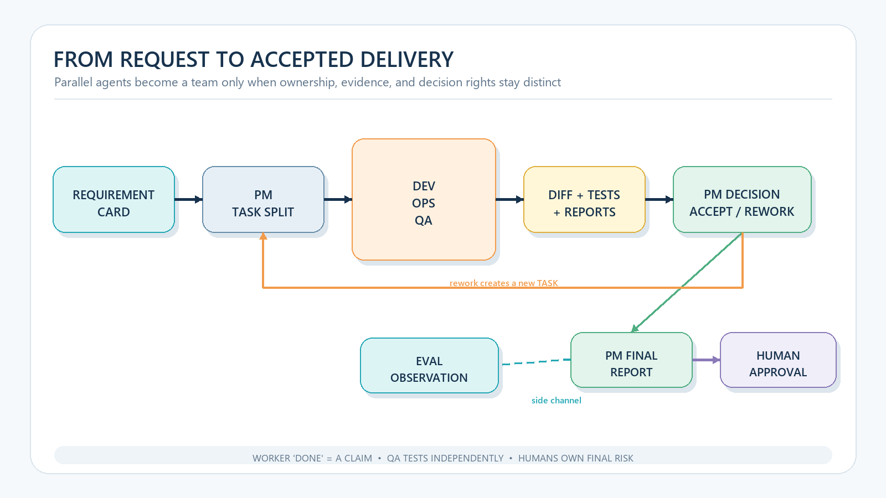

# Running an AI Development Team in Cursor: From Requirement to Testable Delivery


> Four Agent windows produce four parallel conversations. An AI development team begins only when those agents share role contracts, durable artifacts, independent acceptance, and a human release decision.

**Reading dependency:** this is the operating guide in a three-part series. Read [the governance argument](/en/engineering/2026-08-18-files-first-multi-agent-governance) for the shared work ledger, and [the protocol implementation](/en/engineering/2026-08-18-fcop-file-state-machine) for path state, transitions, and atomic publication.

Send the same feature request to four Cursor Agents. Ask one to implement it, another to write tests, a third to check runtime behavior, and a fourth to review the code. The windows become busy. Soon, each says the work is complete.

The likely failure is not a difficult algorithm. It is coordination drift. Development changed an interface while testing used the old one. Operations verified a startup path that no longer exists. The reviewer read the implementer’s summary instead of the actual diff and failing cases. Parallelism amplified ambiguity.

This guide has a narrower goal than building an “autonomous company.” Research Center has already argued that [a worker cannot accept its own completion claim](/en/digital-employee/2026-08-05-verifiable-completion), and its CodeFlowMu case study showed why [roles, fact sources, and decision authority must remain separate](/en/engineering/2026-08-06-codeflowmu-multi-agent-fact-checking). This article turns those existing governance conclusions into a Cursor operating manual. It combines Cursor’s planning, editing, terminal, and diff-review surfaces with the role and artifact model used by CodeFlowMu-open and FCoP.

## First decide whether the work needs a team

A small fix, one-file edit, or direct question is usually cheaper with one agent. Multiple roles start to help when a task has at least two of these properties:

- implementation, testing, runtime, or deployment responsibilities must be separated;
- another role must independently evaluate the result;
- work spans several sessions or a long period;
- failure should become formal rework rather than another chat reply; or
- a human must approve a risky transition.

[Anthropic’s engineering guidance](https://www.anthropic.com/engineering/building-effective-agents) distinguishes single agents from orchestrator-worker and evaluator-optimizer workflows and recommends matching complexity to the problem. Agent count is not the first team metric. A better question is whether every unit of work has one owner, a defined artifact, and an independent completion condition.

## Roles are decision boundaries, not personas

The public [CodeFlowMu-open](https://github.com/joinwell52-AI/CodeFlowMu-open/blob/ed5634c718b9e238c44bb70851020c9793546fe6/README.md) design uses PM, DEV, OPS, and QA roles, along with an independent EVAL step, FCoP artifacts, PC/PWA views, and human approval. The role names matter only because they allocate authority.

> **Roles in multi-agent work are not dramatic prompt personas. They exist to allocate decision rights that other roles must not silently assume.**

| Role | Owns | Must not substitute for |
| --- | --- | --- |
| PM | requirement clarity, task boundaries, dependencies, acceptance, rework | DEV’s technical evidence or QA’s release judgment |
| DEV | implementation, local verification, change report | final approval or unilateral acceptance changes |
| OPS | installation, startup, configuration, logs, runtime boundaries | functional correctness |
| QA | acceptance tests, regression checks, independent QA REPORT | a paraphrase of DEV’s test report or an EVAL role |
| EVAL | independent quality and risk observation after PM’s final REPORT | lifecycle mutation or PM/ADMIN approval |

One person may supervise every role, and the same model may serve different roles in separate sessions. The artifacts and decisions should still remain distinct. A worker report is not a review verdict; local tests are not a release approval.

## Step 1: turn a request into an acceptance card

[Cursor Plan Mode](https://cursor.com/docs/agent/plan-mode) researches the codebase, asks clarifying questions, and produces a reviewable implementation plan. A plan is useful, but a team still needs a testable contract. Before assigning work, the PM should write something like:

```markdown
# Requirement: Export failed records as CSV

## User outcome
A user can export the currently filtered failures and open the result
in a spreadsheet application.

## In scope
- Add a CSV export action and download behavior
- Reuse the current filters
- Preserve Chinese text, commas, quotes, and line breaks

## Out of scope
- No Excel format
- No backend query redesign
- No list-page redesign

## Acceptance
1. Exports work for 0, 1, and 1,000 records.
2. Chinese and special characters open correctly in Excel/LibreOffice.
3. Only currently filtered records are present.
4. Existing list tests do not regress.
5. The diff contains no unrelated refactor.

## Required evidence
- changed-file list
- test commands and results
- sample CSV containing special characters
- known limitations
```

“Add CSV export” names a feature. The card names an outcome that another party can judge. If an agent cannot determine when to stop from the card, it is not ready for assignment.

## Step 2: assign responsibility with separate TASKs

Do not paste the whole request into every session and hope the agents coordinate. Create related tasks:

```text
TASK-001  PM → DEV  Implement export and unit tests
TASK-002  PM → OPS  Verify build, startup, and download path
TASK-003  PM → QA   Test all five acceptance criteria independently
```

Each task references the same requirement but has its own scope, dependencies, and acceptance conditions. QA should depend on DEV’s report and a testable build. OPS owns runtime evidence rather than feature semantics.

FCoP filenames and front matter can preserve sender, recipient, parent, priority, and time. Lifecycle paths show whether a task is waiting, active, or under review. The supervisor can inspect the workspace before opening four conversation histories.



*Figure 1: A worker's `done` is only a completion claim. Independent testing, PM acceptance or rework, side-channel EVAL observation, and human approval remain distinct responsibilities.*

## Step 3: execute in Cursor, but keep evidence outside chat

[Cursor Agent tools](https://cursor.com/docs/agent/overview#tools) include code search, file editing, and terminal access. Those tools should produce environmental evidence, not just a narrative of actions.

A minimum DEV sequence is:

1. restate scope and exclusions; raise an ISSUE before guessing;
2. inspect relevant code and existing tests;
3. implement the smallest coherent change;
4. run targeted tests, then related regression tests;
5. inspect the diff and remove unrelated changes;
6. write a REPORT with changes, commands, results, evidence paths, and risks; and
7. submit for review rather than self-archiving.

```markdown
# REPORT: TASK-001

- Change: added `exportFailuresCsv` and a list-page export action
- Target tests: `pnpm test export-csv` — 12 passed
- Regression: `pnpm test failures-list` — 28 passed
- Sample: `artifacts/failures-special-chars.csv`
- Not verified: Safari iOS download behavior
- Diff: 3 files, no unrelated refactor
```

Cursor checkpoints are useful for undoing agent changes, but the [official documentation](https://cursor.com/docs/agent/overview#checkpoints) says they are stored separately from Git and should be used only to undo Agent changes. Durable evidence still belongs in Git diffs, test output, and project artifacts.

## Step 4: make OPS and QA verify different facts

OPS should not repeat unit tests. It verifies whether dependencies install, the project builds, the supported startup path works, logs expose failures, and configuration requires manual steps.

QA starts from the requirement rather than trusting the DEV report. It should cover:

- the normal filtering and export path;
- zero records, special characters, and a large result;
- download or permission failures;
- existing list behavior; and
- unrelated changes in the diff.

[Cursor's reviewing and testing guidance](https://cursor.com/learn/reviewing-testing) recommends watching changes in the diff view and warns that AI-generated code may look correct—even compile and pass existing tests—while still missing edge cases or security issues. That is a review surface, not a review standard. QA should submit criterion-by-criterion evidence in a QA REPORT. PM or a governance role then accepts, creates rework, or escalates. If the decision is written as an FCoP REVIEW, the on-disk enum is `approved`, `rejected`, `needs_changes`, `abstained`, or `needs_human`—not an editorial PASS/NEEDS REVISION/REJECT label.

EVAL is a separate side channel. The current [CodeFlowMu-open release and initialization boundary](https://github.com/joinwell52-AI/CodeFlowMu-open/blob/ed5634c718b9e238c44bb70851020c9793546fe6/docs/open/release-and-initialization.md) says PM’s final `status=done` REPORT triggers an independent EVAL observation. EVAL does not mutate lifecycle state or replace PM/ADMIN acceptance.

## Step 5: turn rejection into a better task

Continue the CSV example. If QA finds that Chinese text is still garbled in Excel, do not send DEV a chat message saying “try again.” Make the failure a traceable rework cycle:

1. the QA REPORT names the failed acceptance condition and preserves reproduction evidence;
2. PM records `needs_changes` in a REVIEW or acceptance record and opens an ISSUE when needed;
3. PM distinguishes implementation error from specification omission;
4. PM creates a child rework TASK;
5. the new task narrows scope and adds the missing example; and
6. the fix passes through independent validation again.

This history lets a later review distinguish model failure from a management decision that was never written down.

## Step 6: approve only from an evidence packet

The human approver does not have to redo every test. They should receive a compact packet containing:

- the requirement and current scope;
- the three task states;
- DEV and OPS reports;
- QA REPORT;
- PM’s acceptance or rework decision;
- an independent EVAL observation after PM’s final REPORT, when available;
- the actual diff;
- test commands and results; and
- unverified risks and rollback instructions.

One question filters many false completions: **If I merge now, what environmental fact am I relying on, and where do I recover if it fails?**

> **A worker saying “done” is a completion claim, not a delivery. Delivery begins when independent environmental evidence and an authorized review accept that claim.**

The CodeFlowMu-open PC/PWA surfaces can index team state, but the UI should not become the source of truth. Evidence remains on disk, in Git, and in the test environment. Claims about the open edition must also respect its documented [edition boundary](https://github.com/joinwell52-AI/CodeFlowMu-open/blob/ed5634c718b9e238c44bb70851020c9793546fe6/docs/open/edition-boundary.md); private production features and roadmap items do not belong in an open-edition tutorial.

## A minimum one-day run

You can test the method without deploying a complete platform:

| Time | Action | Artifact |
| --- | --- | --- |
| 09:00 | Choose a feature that fits in 2–4 hours | acceptance card |
| 09:20 | Split DEV, OPS, and QA responsibilities | three TASKs |
| 09:30 | Implement and run targeted tests | diff + DEV REPORT |
| 11:00 | Verify build and startup from a clean entry point | OPS REPORT |
| 11:30 | Test the acceptance criteria independently | QA REPORT |
| 12:00 | Resolve rejection or submit PM’s final result | rework TASK or PM REPORT |
| 12:10 | Observe the final result independently | EVAL observation |
| 12:20 | Inspect diff, evidence, and risk | human approve/reject |

Measure four things on the first run:

1. How many problems came from unclear requirements rather than coding ability?
2. How many report claims linked directly to environmental evidence?
3. Did QA find anything missing from DEV’s self-test?
4. Did rejection create a clearer, traceable next action?

Those results say more about team effectiveness than concurrent agent count.

## Keep governance proportional to risk

The workflow has costs. On tiny tasks, artifacts can cost more than they save. If every role shares the same context, “independent” review may be self-confirmation. Over-specified acceptance can make agents optimize the checklist while missing the user outcome. Automatically approving every gate turns human oversight into ceremony.

Scale governance with risk: one agent plus diff review for small fixes; PM and QA for cross-module features; OPS, independent EVAL, and explicit human gates for deployment, security, or data changes.

## From multiple windows to accepted delivery

An AI development team in Cursor is not four agents talking at once. It operationalizes an existing governance conclusion: PM owns task clarity, DEV owns implementation evidence, OPS owns the runtime path, QA owns independent testing, EVAL observes quality and risk from the side, and a human owns final risk.

Cursor supplies planning, tools, diff review, and checkpoints. CodeFlowMu-open and FCoP supply one way to organize roles and durable artifacts. Together, they do not create an unsupervised company. They create a more useful capability: **a request can become traceable work, a completion claim can be independently tested, and a failure can become a clearer next task.**

That is the first outcome a one-person AI team should pursue.

If you entered the series here, return to [the governance article](/en/engineering/2026-08-18-files-first-multi-agent-governance) to understand the shared ledger, then use [the state-machine article](/en/engineering/2026-08-18-fcop-file-state-machine) to verify path state, atomic publication, and test invariants. Together, the three pieces explain why to govern this way, how the protocol behaves, and how a team delivers.

## Sources

- [Cursor Plan Mode](https://cursor.com/docs/agent/plan-mode)
- [Cursor Agent tools](https://cursor.com/docs/agent/overview#tools)
- [Cursor reviewing and testing](https://cursor.com/learn/reviewing-testing)
- [Cursor Checkpoints](https://cursor.com/docs/agent/overview#checkpoints)
- [Anthropic, Building Effective Agents](https://www.anthropic.com/engineering/building-effective-agents)
- [CodeFlowMu-open README](https://github.com/joinwell52-AI/CodeFlowMu-open/blob/ed5634c718b9e238c44bb70851020c9793546fe6/README.md)
- [CodeFlowMu-open edition boundary](https://github.com/joinwell52-AI/CodeFlowMu-open/blob/ed5634c718b9e238c44bb70851020c9793546fe6/docs/open/edition-boundary.md)
- [CodeFlowMu-open release and initialization boundary](https://github.com/joinwell52-AI/CodeFlowMu-open/blob/ed5634c718b9e238c44bb70851020c9793546fe6/docs/open/release-and-initialization.md)
- [FCoP v3 specification](https://github.com/joinwell52-AI/FCoP/blob/a859e6747fe6e5e2d686e0114c77774726d7f748/spec/fcop-v3-spec.md)
