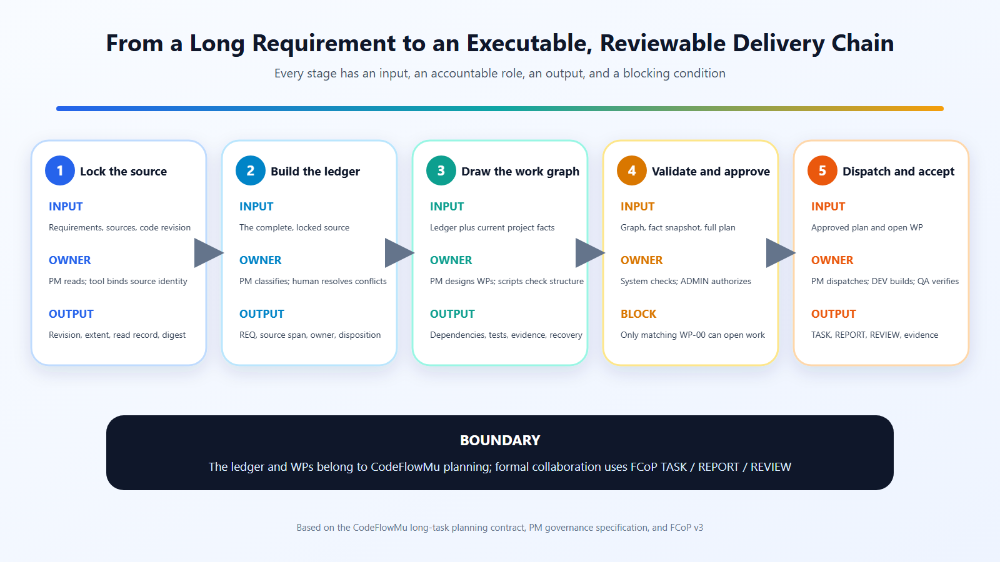

# How Do You Turn a 20,000-Word Requirement into a Task Graph an Agent Team Can Execute?


## In ten seconds

Do not ask an AI team to turn a long requirement into a polished summary. Turn it into a construction plan in which every requirement has an owner, an acceptance check, a dependency, evidence, and a recovery path.

The method has three controls: preserve a read record that reaches the final line, turn requirements into accountable work cards, and require a version-bound human decision before the first card opens. A source change invalidates the old approval.

Imagine a specification that says: add mobile approvals to a local AI development team; preserve the existing task protocol; do not expand publication authority in the open edition; support Windows; provide rollback; and complete a security review before release.

If you hand the entire document to an agent, the easiest output is a polished summary. A summary tends to preserve *what to build* while losing three things that decide whether the work is governable: which sentence is mandatory, which claim depends on the current repository, and which action must stop for a human decision.

Cursor's official Plan Mode starts complex work in the right place: research the repository, clarify requirements, create an editable plan, and wait for approval. A 20,000-word taskbook, however, needs more than a longer Markdown checklist. It needs a reviewable compilation pipeline.

> **Long-horizon planning is not compression. It is the compilation of natural language into traceable, testable, and decidable engineering artifacts.**



*Figure 1. Each stage names its input, accountable role, output, and blocking condition. The ledger and work packages belong to CodeFlowMu planning; formal collaboration then uses FCoP TASK, REPORT, and REVIEW artifacts. Sources: CodeFlowMu long-task planning contract, PM planning-governance specification, and FCoP v3.*

## Prove that the read record covers the input

The first output should be a source record: version, byte digest, line count, read time, whether EOF was reached, and the attachments and external references used by the document.

This mechanical step catches a practical failure. A truncated input may retain “mobile approval” while dropping “publication authority must not change” and “Windows regression is required” from the final pages. Every later plan can be coherent and still be based on an incomplete source. Reaching the final line proves coverage of the read record, not model understanding; the ledger and acceptance checks still have to prove that each requirement was used correctly.

[TMPA Core S1.0](https://joinwell52-ai.github.io/joinwell52/en/publications/tmpa-core-specification-s1.0) treats provenance, identity, references, and reconstructable history as governed behavior. CodeFlowMu's current [long-horizon planning contract](https://github.com/joinwell52-AI/CodeFlowMu-open/blob/ed5634c718b9e238c44bb70851020c9793546fe6/skills/pm-long-horizon-planning/references/planning-model-contract.md) goes further by recording the source path, version, SHA-256, line count, complete read ranges, and references. That is a project method, not an industry standard, but it turns “I read it” into an inspectable fact.

## Build a Requirement Ledger before scheduling work packages

After complete ingestion, extract every actionable statement into a ledger. A minimal row contains:

| Field | Purpose | Example |
|---|---|---|
| `REQ-ID` | Stable identity | `REQ-0042` |
| Source location | Return to the exact wording | Lines 318–325 |
| Kind | Must / goal / current fact / estimate / assumption / authority boundary | Authority boundary |
| Normalized requirement | One testable sentence | The open edition must not own PWA publication authority |
| Acceptor | Who may decide | ADMIN |
| Downstream mapping | WP, gate, test, evidence | WP-07 / Gate-C / T-18 / E-09 |

The kind is not decoration. A must is not a goal. “A Gateway already exists” is a snapshot, not a promise. “Finish in three days” is an estimate, not an acceptance criterion. “An administrator is always online” is merely an assumption, and possibly a bad one.

When all of these are flattened into a `description` field, a later agent can turn aspirations into current facts, estimates into commands, and authority boundaries into ordinary tasks without noticing.

## Resolve conflict before drawing dependencies

Long taskbooks are often assembled over time. One section says the phone can publish; a newer appendix says publication authority must remain external. One requirement asks for offline approval while another requires every decision to check the current revision.

Treat conflicts in three classes:

1. Wording differences that can be normalized, such as “work package” and “WP.”
2. Conflicts that current repository evidence can settle; record the conclusion and the observation time.
3. Contradictions that require human authority; preserve both quotations, the impact, and the options, then stop automatic compilation.

[TMPA Architecture Paper A1.0](https://joinwell52-ai.github.io/joinwell52/en/publications/tmpa-architecture-paper-a1.0) requires a governance reader to preserve conflicts rather than erase them to manufacture a clean state. Planning needs the same discipline. A contradiction that needs a decision must not disappear under more confident prose.

## Compile REQ into WP; do not rename the table of contents

A work package is not a section heading. It must answer at least nine questions:

- Which requirements does it satisfy?
- What inspectable artifact does it produce?
- Who writes, who accepts, and who only observes?
- Which WPs does it depend on, and why?
- What are its entry and exit conditions?
- Which tests must run?
- Where is the evidence stored?
- Where does recovery resume after failure?
- Which action requires a human gate?

For “add mobile approval without changing publication authority,” a small graph might be:

```text
REQ-0042 Authority boundary
   ├── WP-02 Freeze the current publication-authority facts
   ├── WP-05 Define mobile write actions
   │      └── WP-08 Enforce revision + reason + idempotency
   └── WP-09 Open-edition boundary regression

REQ-0048 Windows regression
   └── WP-10 Windows binding, reconnect, and revoke tests

WP-02 ──┐
WP-05 ──┼──> Gate-C Security and authority review ──> WP-11 Release candidate
WP-09 ──┘
```

This diagram combines requirement coverage and execution dependency. Only the latter belongs in the DAG. Two packages referencing the same requirement do not automatically have to be serial.

## Derive the budget from the graph

A common anti-pattern is to announce “seven days” and squeeze every WP into it. Reverse the order: estimate each package, assign roles and exclusive resources, record non-parallel constraints, then calculate total work, daily capacity, and the critical path.

Administrator wait time, external API cooldown, queue delays, and human restart time are not agent-effective days. Parallelism is not free either. Two agents modifying the same primary carrier may directly violate the single-writer boundary.

The useful result is not a pretty Gantt chart. It is an explainable schedule: if Gate-C slips by one day, which packages become blocked? If WP-09 fails, do we rework only the mobile boundary, or return to the authority model?

## Deterministic validation checks structure; humans authorize exposure

CodeFlowMu's current [Planning Gate contract](https://github.com/joinwell52-AI/CodeFlowMu-open/blob/ed5634c718b9e238c44bb70851020c9793546fe6/skills/pm-long-horizon-planning/references/planning-gate-contract.md) separates artifact status, validation status, planning-gate status, and dispatch scope. The validator checks the source digest, coverage, cycles, budgets, resource collisions, placeholders, recovery contracts, and dependencies on superseded revisions. Yet `validation_status=passed` does not mean “start execution.”

An administrator decision is bound to the current revision, body digest, and validation digest. Change the body and the prior approval becomes stale. Even a valid approval opens only `WP-00`, not the entire graph.

> **Validation asks whether the plan is internally coherent. Approval asks whether we accept the risk of exposing the next boundary of this exact revision.**

TMPA Core similarly separates observed state from acceptance authority. Executors, validators, and approvers may read the same persistent artifact, but an executor's success claim must not upgrade itself into final authorization.

## What FCoP and CodeFlowMu each own

The [FCoP v3 specification](https://github.com/joinwell52-AI/FCoP/blob/a859e6747fe6e5e2d686e0114c77774726d7f748/spec/fcop-v3-spec.md) defines collaboration artifacts, path-based state, and event history. It lets TASK, REPORT, ISSUE, and REVIEW records be inspected across tools. It does not compute a critical path, start model sessions, or decide when to dispatch the next WP.

CodeFlowMu is the engineering rail: PM planning, Runtime dispatch, model sessions, gates, recovery, and PC/PWA surfaces. Collapsing the two turns the protocol into a mythical all-purpose platform and removes testable responsibility from the Runtime.

## A minimum preflight checklist

Before an agent team starts a long task, check:

- Was the source read to EOF and bound to a version, SHA, and line count?
- Does every mandatory statement have a stable REQ-ID and source location?
- Are current facts, goals, estimates, assumptions, and authority boundaries separated?
- Does each REQ map to the necessary combination of WP, gate, test, and evidence?
- Are contradictions and unknowns preserved instead of silently decided by the model?
- Is the WP graph acyclic, with budget and critical path derived bottom-up?
- Does each WP have a writer, acceptor, failure result, and recovery entry?
- Is the validation digest bound to the exact body digest?
- Is human approval bound to the current revision and invalidated by changes?
- Is only the first approved execution boundary open?

This machinery has a cost. A familiar three-line fix does not need a full ledger and DAG; Cursor's own guidance says quick or familiar work may start directly. The method is for cross-module, long-running, multi-agent work with authority and recovery boundaries.

It is not a success guarantee either. [E2EDevBench](https://arxiv.org/abs/2511.04064) shows that end-to-end software work can fail during planning, execution, and verification. Our compilation pipeline is an engineering response to traceability and governance gaps; it has not been shown to eliminate model misunderstanding, context compression, or handoff loss.

What it changes is failure diagnosis. Instead of ending with “the agent misunderstood,” we can locate a missed REQ, an unresolved contradiction, an uncovered WP, a wrong dependency, a bypassed gate, or missing evidence. For a team of agents expected to work over time, that diagnostic power is already a substantial engineering result.

## Primary sources

- [TMPA Architecture Paper A1.0](https://joinwell52-ai.github.io/joinwell52/en/publications/tmpa-architecture-paper-a1.0)
- [TMPA Core Specification S1.0](https://joinwell52-ai.github.io/joinwell52/en/publications/tmpa-core-specification-s1.0)
- [Implementation Case I1.0](https://joinwell52-ai.github.io/joinwell52/en/publications/implementation-case-i1.0)
- [FCoP v3 specification](https://github.com/joinwell52-AI/FCoP/blob/a859e6747fe6e5e2d686e0114c77774726d7f748/spec/fcop-v3-spec.md)
- [Cursor Plan Mode](https://cursor.com/blog/plan-mode)
- [E2EDevBench](https://arxiv.org/abs/2511.04064)
