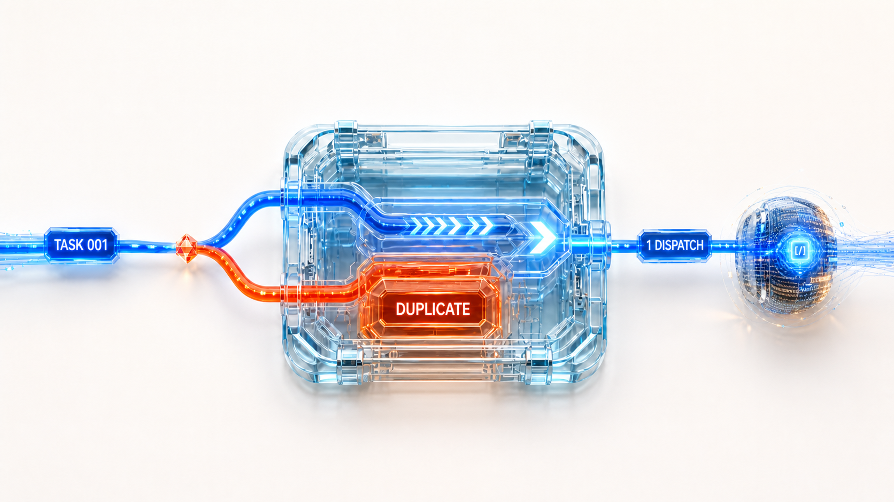
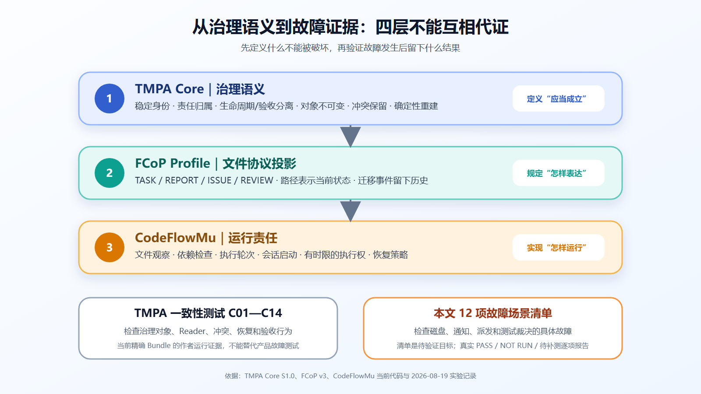

# 别被“全绿演示”骗了：怎样用故障注入，测出一个真正靠谱的 AI Agent 调度系统？



## 10 秒看懂

核心方法：**不要按“页面是否跑通”组织测试，要按“一条不能被破坏的铁律 × 一个故障插入位置 × 一个可检查结果”组织测试。**

读完本文，你可以直接带走六条防御铁律、磁盘/通知/派发/测试裁决四类故障注入方法，以及一张 12 项故障场景清单。它们可以直接改写成你自己 Agent 调度系统的测试计划；清单是待验证目标，不冒充已经全部执行的测试结果。

## 别再用“演示全绿”安慰自己：系统经得起这三次意外吗？

许多多 Agent 演示看起来都很顺：放入任务单，AI 领取，输出报告，界面亮起绿色勾。

真正把系统放到长期运行环境，不需要复杂攻击，三种普通意外就足以暴露可靠性问题。

### 事故一：文件只写了一半，进程突然被杀

系统正在把新任务写入磁盘，刚写到第 50 行就崩溃。重启后，它会把半截文件当成合法任务强行读取，还是能识别未完成写入、保留旧版本并清理临时文件？

如果没有明确的提交边界，一个“写文件”动作可能把原本可用的任务直接变成损坏文件。

### 事故二：同一条通知来了两次，系统派出两个 AI

文件监控器因为系统抖动，连续两次报告“任务已就绪”；与此同时，周期扫描又发现了同一张任务单。

系统可以观察三次，但业务上只能派发一次。否则两次昂贵模型调用会同时修改同一份代码，最后谁也说不清哪一份结果才有效。

### 事故三：测试根本没运行，界面却只剩一个红叉或绿勾

环境漏装了一个软件包，核心派发测试在导入阶段就失败，真正的测试一条也没有执行。

这种情况既不是“功能测试通过”，也不能直接证明“产品逻辑失败”。诚实的系统必须单独报告：**未执行——环境不完整。**

> **测试多 Agent 系统，不要只问“正常流程跑通了吗”，要问“故障插在任何一步时，系统还知不知道当前事实、未完成动作和下一位有权处理的人”。**

## 10 秒看懂测试方法

可靠性测试可以压缩成一个公式：

```text
一条不能被破坏的铁律
× 一个故障插入位置
× 一个可以检查的最终结果
= 一项真正有价值的可靠性测试
```

例如：

```text
铁律：同一任务只能有一个当前状态
故障：文件移动成功后、旧位置删除前，进程崩溃
结果：重启后必须报告“双位置冲突”，不能偷偷任选一个
```

页面点了几次、动画是否流畅，都不是这里的测试单位。测试单位是：**哪条铁律，在什么故障下，最后怎样判定。**

## 先写死六条防御铁律

无论系统用什么语言、数据库或文件格式实现，至少先把下面六条写成自动断言。

### 铁律一：任务身份证绝不能重号

两个不同工作不能共用同一个任务编号。如果磁盘上出现重名任务，系统必须报警并保留两个来源，绝不能让后读到的文件覆盖先读到的文件。

### 铁律二：状态不能“人格分裂”

同一个任务不能同时被系统当成“进行中”和“等待审核”。如果它同时出现在两个状态目录，测试应判定为冲突并保留现场，不能由文件扫描顺序随便挑一个。

### 铁律三：历史账本只能追加，不能涂改

任务被驳回、执行失败、重新派发、最终接受，都要像银行流水一样留下记录。修改任务正文不能顺手抹掉过去发生过的失败。

### 铁律四：每次模型调用都必须能追责

任何一次模型会话都必须能反查：对应哪一版任务、是第几次执行、由哪个 Agent 领取、锁定期到什么时候、为什么允许启动。

这里的“执行轮次”用于区分第一次运行、普通重试和修复后重试；“锁定期”表示某个 Agent 在一段时间内拥有这次执行权，超时后系统才能进入明确的回收或重新分配流程。

### 铁律五：没拿到通行证，绝不开工

前置任务没完成、人类审批没通过、目标 Agent 仍在忙，系统即使收到唤醒通知也不能提前启动新会话。

“收到了通知”和“满足开工条件”是两件事。通知只能触发重新检查，不能直接成为派工命令。

### 铁律六：崩溃重启后，绝不靠猜

重启后只能根据磁盘上的任务、执行轮次、会话记录、报告和失败记录判断继续、重试、返工还是停止。系统不能因为“模型大概已经做了什么”就盲目再派一个新任务。

## 为什么“把任务写进文件”还远远不够？

看到这里，读者很容易产生一个合理疑问：不就是把任务和报告写成 Markdown，再放进几个状态目录吗？为什么还需要一套 TMPA 治理模型？

因为文件只是一种存储载体，本身不会产生治理语义。它不能自动回答：两个同名文件谁是真的；任务进入 `done` 是否等于业务验收；执行者能不能审查自己；两份冲突报告应该保留哪一份；进程重启后哪些事实可以被重新建立。

[TMPA 核心规范 S1.0](https://joinwell52-ai.github.io/joinwell52/zh/publications/tmpa-core-specification-s1.0)的正式中文语义是“文本化多智能体流程架构”。它是供应商中立的治理 Core，可以投影到文件、数据库行、对象存储或事件，并不规定必须使用文件系统。本文讨论的这套工程栈，选择通过 FCoP 把 TMPA 的治理语义投影为人和机器都能读取的协作文件，再由 CodeFlowMu 负责运行和调度。

TMPA 在这里提供五个关键支点。

### 支点一：身份不是文件名看起来不同，而是对象可以稳定归属

TMPA 要求治理对象具有稳定 ID、创建者、责任角色、写者流、序号、来源和类型化引用。两个来源如果声明同一个对象 ID，却包含不同的规范内容，不能按扫描顺序让后者覆盖前者；它们必须作为冲突候选同时保留。

FCoP 再把这种要求落到 TASK、REPORT、ISSUE、REVIEW 等文件及其引用关系上。文件摘要可以帮助检查内容完整性，但摘要不是“不可伪造身份”，更不能替代创建者和权限验证。

这就是“任务身份证绝不能重号”的理论来源。

### 支点二：生命周期状态与业务验收必须分开

TMPA 要求每个 Profile 明确有限状态、合法迁移、角色权限和前置条件。非法或未经授权的迁移不能改变权威状态，而且违规尝试必须保持可见。

但 TMPA 并没有规定生命周期必须是有向无环图。驳回后重新执行本来就可能形成合法回路。真正需要禁止的是 Profile 明确禁止的依赖环，以及同一时刻互相冲突的状态证据。

更重要的是，任务位于终态或写着 `done`，都不能自动建立业务完成。执行者的完成声明、独立复核和有权角色的验收是三个不同对象。

FCoP 用路径表达当前生命周期位置；TMPA 则解释为什么“路径状态”和“业务接受”不能混成一个绿色勾。

### 支点三：已发布对象不能被改写，历史必须能够重建

TMPA 要求已发布治理对象保持不变。纠错不能偷偷修改旧对象，而要创建新的取代、拒绝、限定或解决对象。当前治理状态应从有效对象、迁移和 Profile 规则中重建，而不是简单选择修改时间最新的文件。

FCoP 在文件 Profile 中进一步要求状态迁移留下追加事件。Git 可以保存版本历史并帮助调查，但 Git 提交本身不等于 TMPA 所要求的完整治理历史：对象身份、权限、引用和验收语义仍要由 Profile 与 Reader 验证。

这就是“历史账本只能追加，不能涂改”的准确边界。

### 支点四：冲突必须保留，不能用概率偷偷抹平

TMPA 的 Reader 使用“有效、无效、未确定”三值判断，并把证据不足、互相矛盾或需要隔离的结果明确呈现为 partial、disputed 或 quarantined 等视图。

因此，同一任务同时出现于两个状态位置，或两个角色给出互不兼容的有效复核时，系统不能因为某个文件更新更晚就任选一个继续。它必须保留来源，输出冲突，并等待新的授权解决对象。

这也是故障注入必须检查的结果：我们测的不是系统能不能“尽快恢复绿色”，而是它能不能在不知道时诚实地说不知道。

### 支点五：恢复依靠持久证据，不依靠上一位 Agent 的隐藏记忆

TMPA 要求一个全新的 Reader 能从持久治理证据重建责任、生命周期、未解决依赖、失败与恢复关系，不得依赖前任 Agent 的隐藏思维过程。缺失的执行上下文必须报告为缺失，不能靠猜测补齐。

这不意味着 CodeFlowMu 整个运行系统“完全无状态”，也不保证任意副作用都能恰好执行一次。会话、锁定期、进程和外部服务仍有自己的运行状态。工程目标是把足以作出下一步治理判断的事实外置并持久化，让重启后可以选择继续、重试、返工或停下，而不是盲目再派一个 Agent。

因此，四层关系应当这样理解：

```text
【治理层】TMPA Core
    定义身份、责任、生命周期、验收、冲突保留与确定性重建
        │
        ▼
【协议层】FCoP Profile
    将治理语义投影为 TASK / REPORT / ISSUE / REVIEW、路径状态与迁移事件
        │
        ▼
【运行层】CodeFlowMu
    观察文件、检查依赖、管理执行轮次与会话、派发 Agent、实施门禁与恢复策略
        │
        ▼
【验证层】一致性测试 + 故障注入
    TMPA C01—C14 检查治理行为；本文 12 项清单检查具体运行故障
```

最后一层必须分账。TMPA S1.0 自己规定了 C01—C14 一致性行为；本文后面的 12 项则是面向 CodeFlowMu 运行故障的工程清单，两者不是同一套测试。12 项也不是“已经全部通过”的宣传数字：本轮真正执行的有界结果会在后文逐项列出，尚未覆盖的派发崩溃窗口仍明确标为补测目标。



*图 1：TMPA 定义什么应当成立，FCoP 规定怎样表达，CodeFlowMu 实现怎样运行；TMPA C01—C14 一致性证据与本文 12 项产品故障场景不能互相代证。来源：TMPA Core S1.0、FCoP v3、CodeFlowMu 当前代码与 2026-08-19 实验记录。*

## 第一类故障：把错误塞进每一次磁盘提交

比较安全的文件更新通常分三步：

1. 先写入一个独立临时文件；
2. 确认内容已经写完；
3. 用一次名称替换，把新文件切换成正式版本。

名称替换可以作为“新版本正式生效”的提交点，但不能被夸大成万能保证：跨磁盘位置未必原子；文件内容刷新不等于目录变化在突然断电后一定持久；Windows 上的文件占用、杀毒软件和路径短暂消失都可能让操作失败；文件替换成功也不等于下游业务只执行一次。

测试夹具应能把错误插入每个步骤之间：

```text
固定随机种子：42017
初始状态：任务 001 位于“进行中”
故障点：临时文件写完后，替换前
模拟错误：连续两次“文件被占用”，第三次成功
随后动作：重启运行系统
验收：正式任务可读；只有一个当前状态；重试次数有上限；临时垃圾可清理
```

2026 年 8 月 19 日，我们在当前 CodeFlowMu 工作树上重跑了[原子写入专项测试](https://github.com/joinwell52-AI/CodeFlowMu-open/blob/ed5634c718b9e238c44bb70851020c9793546fe6/packages/codeflowmu-runtime/src/_internal/__tests__/atomic-write.test.ts)，结果是 **9 项执行、9 项通过**。它证明的是当前环境中的临时文件、名称替换和有限重试分支，不证明突然断电后的目录持久性、任意网络文件系统或业务“绝不重复”。

## 第二类故障：重复通知和漏通知必须一起测

文件监控器不是事实源。它只是在说：“可能有东西变了，请重新读取磁盘事实。”

一组有效测试应同时制造两种情况：

- **重复通知：**同一文件连续触发两次监控事件，周期扫描又发现一次；允许重复观察，不允许产生第二次业务派发。
- **完全漏通知：**不发送任何实时事件，只运行周期扫描；持久任务最终仍要被发现。

如果重复通知会启动两个 Agent，说明系统缺少防重复业务标记；如果漏一次通知就永远看不见任务，说明性能优化已经偷偷变成唯一入口。

这里真正要检查的不是“监控器触发几次”，而是：同一任务版本是否只形成一个有效执行轮次，历史里是否能解释所有重复观察。

## 第三类故障：在“准备派工”和“会话启动”之间拔掉电源

派发不是一个瞬间动作，至少包含：

1. 保存“准备把哪一版任务交给谁”的执行轮次；
2. 为目标 Agent 建立有时限的执行锁；
3. 启动模型会话；
4. 保存真实会话编号，或写入明确失败。

CodeFlowMu 当前的[派发记录存储](https://github.com/joinwell52-AI/CodeFlowMu-open/blob/ed5634c718b9e238c44bb70851020c9793546fe6/packages/codeflowmu-runtime/src/scheduler/DispatchAttemptStore.ts)保存“已提供、已领取、运行中、已报告、已结束”等状态，以及任务、执行轮次、锁定期、会话编号和防重复标记。

但现有派发测试主要覆盖可信来源、未知来源、依赖阻塞、重复等待记录、人工放行和会话启动；它还没有直接注入下面两个崩溃窗口：

- 执行轮次已保存，会话尚未启动；
- 会话已经启动，真实会话编号尚未保存。

所以本文把这两个场景列为**必须补测的目标**，不把它们写成当前已经验证的能力。

更现实的工程目标也不是神话式的“绝不重复”。对于推送代码、调用外部接口等副作用，应采用：可能重试一次、业务动作带防重复标记、重复结果可见、恢复时有人可以裁决。

## 第四类故障：测试系统也可能说谎

本轮重跑记录比“全绿截图”更有价值，因为它同时出现了通过、未执行和真实失败。完整命令、环境、退出码和原始输出保存在[专项实验记录](./02-experiment-run-log.md)。

| 测试入口 | 真正执行了几项 | 结果 | 应怎样解释 |
|---|---:|---|---|
| 原子写入 | 9 | 9 项通过 | 只证明当前专项分支 |
| 局域网地址选择 | 5 | 5 项通过 | 只证明地址选择规则 |
| 长任务规划 | 0 | 未执行 | 缺少软件包，导入阶段停止 |
| 两阶段派发 | 0 | 未执行 | 缺少 Cursor 开发包，导入阶段停止 |
| 开放版手机发布边界 | 1 | 1 项失败 | 新旧错误码合同不一致，责任尚待裁决 |

两个“未执行”入口的命令退出码确实是 1，测试运行器也把“整个测试文件加载失败”显示成一个失败项。但真正的业务测试体一条都没开始，所以证据裁决必须写成“未执行”，而不是偷偷算成产品功能失败。

手机发布边界测试则不同：它真正执行了，并在错误码断言处失败。当前实现返回“发布权限在外部”，测试仍期待旧的“开放版禁用发布”错误码。测试发现了合同漂移，却无权替产品负责人决定哪一个合同才是正式版本。

> **可信测试不仅要抓产品错误，还要分清环境缺口、测试陈旧和真正的行为失败。**

## 可以直接照抄的 12 项故障清单

| # | 故障场景 | 最低验收结果 |
|---|---|---|
| 1 | 两个来源使用同一任务编号 | 报冲突，不覆盖 |
| 2 | 同一任务同时出现在两个状态目录 | 保留现场，不任选 |
| 3 | 写临时文件时崩溃 | 正式版本仍可读 |
| 4 | 文件连续被占用或短暂消失 | 有限重试，最终失败可见 |
| 5 | 同一监控事件重复到达 | 不产生第二次业务派发 |
| 6 | 实时监控完全漏掉事件 | 周期扫描最终发现任务 |
| 7 | 目标 Agent 仍在忙 | 不重复派工，写明等待原因 |
| 8 | 前置任务或人工审批未完成 | 不启动模型会话 |
| 9 | 保存执行轮次后崩溃 | 重启能看见“有轮次、无会话” |
| 10 | 会话启动后、编号保存前崩溃 | 不盲目启动第二个执行者 |
| 11 | 同一执行报告被重复提交 | 历史可见，不自动升级为验收通过 |
| 12 | 测试依赖缺失 | 明确显示“未执行”及环境证据 |

这 12 项只是从演示走向工程测试的起点，不是认证套件。压力、性能、长时间运行、安全、跨平台、跨文件系统和真实断电实验仍然需要单独完成。

[FoundationDB 的公开测试资料](https://apple.github.io/foundationdb/testing.html)展示了一条成熟路线：用可重放的随机种子和故障注入，把极少出现的并发交错变成能够重复的实验。它的结果不能替 CodeFlowMu 背书，但方法值得借鉴：探索可以很广，失败复现必须很窄。

测试一个基于文件协作的 Agent 调度系统，不是为了证明“文件天然可靠”。真正要证明的是：文件、通知、进程和 AI 都可能出错时，系统仍然能说清当前事实、尚未完成的动作，以及接下来谁有权处理。

## 主要来源

- [TMPA 核心规范 S1.0](https://joinwell52-ai.github.io/joinwell52/zh/publications/tmpa-core-specification-s1.0)
- [TMPA 架构论文 A1.0](https://joinwell52-ai.github.io/joinwell52/zh/publications/tmpa-architecture-paper-a1.0)
- [TMPA 实施案例 I1.0](https://joinwell52-ai.github.io/joinwell52/zh/publications/implementation-case-i1.0)
- [FCoP v3 协作规范](https://github.com/joinwell52-AI/FCoP/blob/a859e6747fe6e5e2d686e0114c77774726d7f748/spec/fcop-v3-spec.md)
- [CodeFlowMu 原子写入测试](https://github.com/joinwell52-AI/CodeFlowMu-open/blob/ed5634c718b9e238c44bb70851020c9793546fe6/packages/codeflowmu-runtime/src/_internal/__tests__/atomic-write.test.ts)
- [CodeFlowMu 派发记录存储](https://github.com/joinwell52-AI/CodeFlowMu-open/blob/ed5634c718b9e238c44bb70851020c9793546fe6/packages/codeflowmu-runtime/src/scheduler/DispatchAttemptStore.ts)
- [POSIX rename 规范](https://pubs.opengroup.org/onlinepubs/9799919799/functions/rename.html)
- [FoundationDB：模拟与测试](https://apple.github.io/foundationdb/testing.html)
