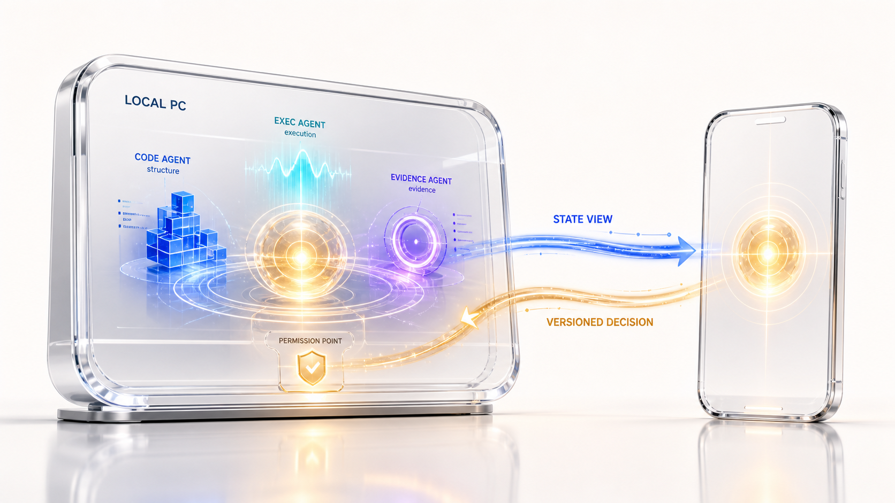
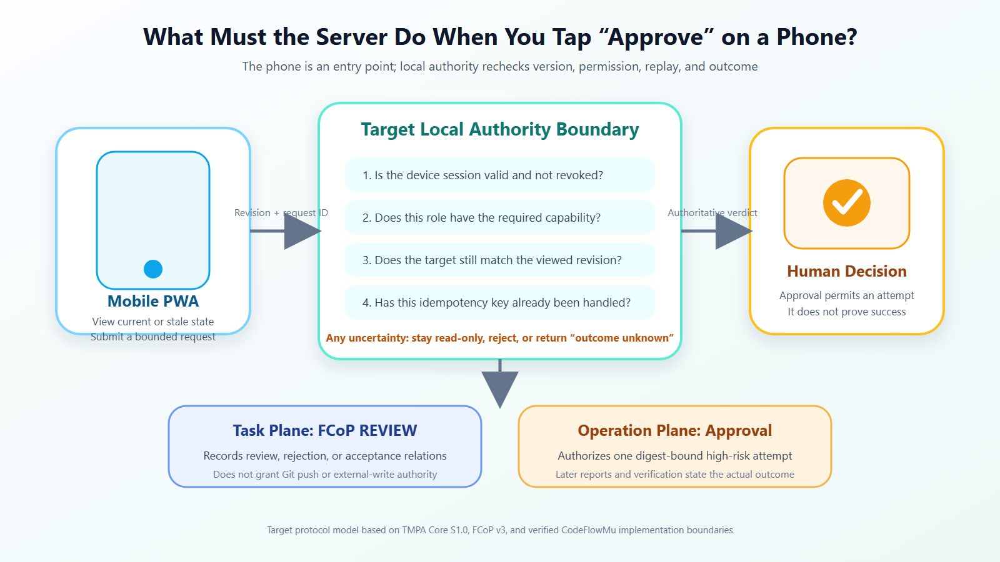

# How Do You Stay in Control of an AI Team After Leaving Your Computer? A Two-Plane Design for Local Execution and Mobile Control



## In ten seconds

The computer keeps execution and authoritative facts. The phone provides a constrained view and a small decision surface. Every mobile action returns to the latest server-side version for authority, version, and duplicate-request checks.

At 7 p.m., a refactor is still running on a computer at home. DEV has submitted changes, OPS is running integration tests, and QA has just found a failure. The human is on a train. What the phone needs is not a miniature IDE. It needs three answers: what happened, which decision requires me, and whether a weak connection can execute my action twice.

The most dangerous design is a second task database inside the phone app. PC and PWA quickly acquire separate truths: the local task is in review while the cached phone still says active; an offline approval targets an old revision and is later replayed against new work.

A cleaner boundary separates an execution plane from a control plane.

> **The PC Runtime owns execution and durable facts. The PWA observes those same facts and sends a small set of human decisions back with version, reason, and an idempotency key—a unique request number that prevents repeated taps from creating repeated decisions.**

## A PWA is not a second Runtime

The [W3C Web App Manifest](https://www.w3.org/TR/appmanifest/) provides installation metadata, start URLs, and application scope. [Service Workers](https://www.w3.org/TR/service-workers/) provide event-driven network mediation and caching. Browsers may terminate a service worker and restart it when an event arrives. That is useful for an offline shell, caching, and notifications; it is not a reliable process for a model session that runs for hours.

The first system boundary should therefore be explicit:

```text
PC / Execution & Fact Plane              Mobile / Bound Control Plane
┌───────────────────────────┐            ┌──────────────────────────┐
│ CodeFlowMu Runtime        │            │ PWA                      │
│ - Watch / dispatch        │            │ - Team status            │
│ - Model sessions          │<--API/SSE--│ - Task / report detail    │
│ - Tests / evidence        │            │ - Approval with reason    │
│ - FCoP work artifacts     │            │ - Device / link status    │
└─────────────┬─────────────┘            └────────────┬─────────────┘
              │ authoritative files                   │ no second task DB
              v                                       │
      TASK / REPORT / REVIEW / events <───────────────┘
```

FCoP remains a protocol in this design: it defines work artifacts, path-based state, and event history. CodeFlowMu is the engineering rail that runs agents, observes files, starts sessions, and exposes PC/PWA services. PWA behavior must not be advertised as a capability of the protocol.

## What the phone minimally needs to show

A useful control plane is not measured by page count. A minimum product can have six surfaces:

1. **Team status:** which roles are idle, busy, blocked, or offline, with an observation time.
2. **Task state and hierarchy:** current task, parent/child relations, revision, location, and blocking reason.
3. **Reports and evidence:** who asserted what, whether tests are PASS/FAIL/NOT RUN, and where evidence lives.
4. **Pending decisions:** objects awaiting approve, reject, pause, or rework authority.
5. **Activity:** append-only meaningful events, rather than treating chat bubbles as a state machine.
6. **Device status:** bound devices, last seen, session expiry, and LAN/Gateway reachability.

Every surface must answer, “Which authoritative record produced this value?” If the list comes from a file reader, details from a separate database replica, and notifications from in-memory events, the three will eventually disagree about one task.

[TMPA Architecture Paper A1.0](https://joinwell52-ai.github.io/joinwell52/en/publications/tmpa-architecture-paper-a1.0) calls for a stable primary carrier for governed work. Multiple writers use separate asynchronous streams that a deterministic Reader aggregates. Applied to mobile control, this does not require “files as the only database.” It requires every cache and index to remain an explicitly derived view rather than quietly acquiring primary authority.

## Binding is a device lifecycle, not a permanent QR code

The current CodeFlowMu [binding store](https://github.com/joinwell52-AI/CodeFlowMu-open/blob/ed5634c718b9e238c44bb70851020c9793546fe6/codeflowmu-shell/src/mobile/mobileBindStore.ts) separates a short-lived pending binding from durable device identity. The durable device record stores a session-token hash. To return the same result for a repeated browser request, an in-process completion record retains the original session token while that record remains in memory. Eligibility to replay the first result ends after ten minutes; the expired record is removed lazily when that binding ID is accessed again, not by a timer at the ten-minute mark. That tradeoff belongs in the threat model; it must not be simplified to “the system only stores hashes.” The presence of code is not a security certification.

A stricter target binding contract should include the following. The current ten-minute idempotent replay window is an intentional compatibility policy, not strict single use:

1. The PC generates a short-lived, single-use entry.
2. Confirmation atomically consumes the pending token; a same-token network retry returns the same result only within a bounded window, while wrong, conflicting, or expired tokens are rejected.
3. The server issues an expiring, revocable device session.
4. The client stores only required credentials; logs, screenshots, and URLs do not echo them.
5. The PC can list, disable, and rotate devices.
6. High-risk actions may require fresh authentication rather than a browsing session.

Binding links, QR codes, session tokens, real task bodies, and chat messages do not belong in public screenshots, Git, or ordinary debug logs. “Do not leak this” in a prompt is not a security boundary; Core S1.0's separation of role authority applies to UI actions too.

## A mobile approval is not a `status` edit

The dangerous request is simply “task 1 is approved.” A tunnel drops the connection, the phone retries three times, and meanwhile the task changes. The server now has repeated approval writes with no proof of which version the user saw.

A safer target protocol sends an object ID, observed version fingerprint, decision, non-empty reason, and unique request number. This is an architectural example, not a claim about a published CodeFlowMu API or an already connected mobile Planning Gate.

Suppose QA writes a failed report on the PC and the phone displays “rework decision required.” When an administrator taps approve-rework, the client should submit the object ID, observed revision, decision enum, non-empty reason, idempotency key, and client time. The server re-reads canonical state, validates authority and revision, appends the decision, and returns a new server version.

Weak networks require fail-closed behavior: when version, authority, or outcome is uncertain, the system does not proceed.

- If the revision changed, reject the old decision and require a reread.
- If an idempotency key is replayed, return the first result without appending another decision.
- If the request times out, display “outcome unknown,” not success.
- Approval means the Runtime may attempt work; it does not mean execution completed.
- Execution still returns through REPORT, tests, and independent review evidence.

[TMPA Core S1.0](https://joinwell52-ai.github.io/joinwell52/en/publications/tmpa-core-specification-s1.0) separates execution claims, validation results, and acceptance decisions. Mobile UI transports human authority into the same governance chain; convenience does not permit those roles to collapse.



*Figure 1. This is the target decision boundary, not a claim about the current mobile API. The phone remains an entry point; the authoritative service should recheck device session, role capability, target revision, and idempotency. FCoP REVIEW and Operation Approval remain separate planes. Basis: TMPA Core S1.0, FCoP v3, and the verified boundaries of current CodeFlowMu device and operation-approval implementations.*

## LAN and Gateway are reachability paths, not fact sources

On the same network, a phone may connect directly to the PC service. Away from home, a constrained Gateway may relay requests and events. The paths change reachability. They must not change the authoritative source of TASK, REPORT, approval, and device state.

On 2026-08-19, we reran the current CodeFlowMu [LAN-address test file](https://github.com/joinwell52-AI/CodeFlowMu-open/blob/ed5634c718b9e238c44bb70851020c9793546fe6/codeflowmu-shell/src/__tests__/lanNetwork.test.ts): **5 tests passed**. Exact commands, environment, exit codes, and raw output are preserved in the [experiment run log](./02-experiment-run-log.md). That supports a limited address-selection implementation claim. It does not establish public reachability, NAT behavior, TLS, Gateway longevity, or end-to-end mobile security.

The current open-edition implementation still keeps remote mobile publication read-only/external, but this run found that current permission semantics and an older regression test no longer agree. Exact error identifiers belong in the experiment record, not the article's main narrative. The general lesson is stronger: **authority must align across backend enforcement, user-facing permission language, and regression tests**, or the phone may display a capability that does not exist. A test detects drift; product authority must decide the contract and synchronize all three surfaces.

## Weak networks and caches: stale views may be readable; stale decisions must not execute

A PWA may cache its shell and the most recent read-only snapshot, but the page must display data version, server time, and connection state. A practical policy is:

- Offline users may read a task explicitly labeled “as of 19:02.”
- The client does not cache an approval token that can be replayed unconditionally.
- Reconnection performs version reconciliation before enabling write buttons.
- Server events trigger incremental refresh, while full reconciliation repairs missed events.
- An old client, incompatible schema, or uncertain authority forces read-only mode.

This direction is consistent with local-first research on local ownership, offline availability, and cross-device coordination. That paper does not validate our implementation. CodeFlowMu still needs end-to-end experiments for real weak networks, clock skew, cache corruption, device revocation, and Gateway failures.

## A 15-point acceptance checklist

**Facts and display**

- List and detail views resolve to the same canonical artifact and revision.
- Cached views show observation time instead of impersonating real-time state.
- REPORT, REVIEW, decision, and execution state are not compressed into one `done` value.
- Full reconciliation repairs missed real-time events.

**Binding and authority**

- The pending binding token expires and is consumed once; bounded idempotent replay returns only the same result, and the token cannot be recovered from logs.
- Device sessions can expire, rotate, and be revoked.
- The server rechecks roles for high-risk actions instead of trusting visible buttons.
- A PWA screen does not confer external publication authority on the open edition.

**Mobile writes**

- Every decision carries object ID, current revision, decision, reason, and idempotency key.
- A changed revision makes the stale decision fail closed.
- Timeout produces “unknown,” never client-declared success.
- Approval and execution success are displayed separately.

**Network and privacy**

- LAN and Gateway use the same fact and authority services.
- Weak network, disconnect, repeated request, server restart, and device revocation have regression coverage.
- Public screenshots, repositories, telemetry, and ordinary logs exclude QR codes, binding URLs, tokens, and real task text.

A cloud Runtime is another valid architecture. If tasks execute in a remote sandbox, the phone may directly control that cloud authority. This article addresses the failure and trust model of a local agent team; it does not argue that all agents must run on a PC.

For a local system, the best mobile client is not the one with the most features. It is the one that lets a human leave the desk, see the same facts, make a small number of authorized decisions, and refuse to manufacture a second truth when network and version are uncertain.

## How TMPA, FCoP, CodeFlowMu, and Mobile divide responsibility

These names describe four layers, not four competing products.

1. **TMPA Core defines governance semantics.** It specifies stable work carriers, role responsibility, lifecycle state, independent acceptance, conflict preservation, and deterministic reconstruction. A stable primary carrier is the stable reference point for governed work; TMPA does not declare that every system must use a PC or local disk. Its crucial boundary here is that an execution report is a fact claim, while acceptance is a decision made by an authorized role.
2. **FCoP projects collaboration into files.** It defines TASK, REPORT, ISSUE, REVIEW, lifecycle locations, and transition events that people and tools can inspect. It does not choose a LAN address, issue device credentials, draw the mobile UI, or own an agent session.
3. **CodeFlowMu is the running engineering system.** In the local deployment discussed here, the project root, Runtime, and server-side readers form the authoritative execution plane. CodeFlowMu runs agents and tests, checks dependencies and permissions, manages devices, and distinguishes task review from operation approval. That local authority is a CodeFlowMu deployment choice, not a universal TMPA requirement.
4. **CodeFlowMu Mobile PWA is a constrained remote surface.** It displays server-derived facts and returns a small set of human requests to the same authority. It may cache a stale view, but it does not become a second Runtime or bypass server-side checks.

Under the target decision contract described in this article, tapping Approve would send the target, observed revision, reason, and idempotency key. The authoritative service would then recheck the device session, role capability, current revision, and prior use of the request key. Current public CodeFlowMu code proves narrower pieces: device-session checks and a separate Operation Approval service whose server creates an action ID for a digest-bound attempt. It does not prove that the existing mobile route already accepts and enforces this client-supplied revision/idempotency contract. A future task-review path may record a decision in the applicable REVIEW chain; a high-risk Git or external-write action remains a separate operation approval. Later REPORT and verification evidence still determine what actually happened.

In one line: **TMPA defines the governance semantics, FCoP defines the collaboration artifacts, CodeFlowMu owns local execution and authority checks, and the phone remains a bounded remote entry point.**

## Primary sources

- [TMPA Architecture Paper A1.0](https://joinwell52-ai.github.io/joinwell52/en/publications/tmpa-architecture-paper-a1.0)
- [TMPA Core Specification S1.0](https://joinwell52-ai.github.io/joinwell52/en/publications/tmpa-core-specification-s1.0)
- [Implementation Case I1.0](https://joinwell52-ai.github.io/joinwell52/en/publications/implementation-case-i1.0)
- [CodeFlowMu Open](https://github.com/joinwell52-AI/CodeFlowMu-open)
- [W3C Web App Manifest](https://www.w3.org/TR/appmanifest/)
- [W3C Service Workers](https://www.w3.org/TR/service-workers/)
- [Local-first software paper](https://martin.kleppmann.com/2019/10/23/local-first-at-onward.html)
