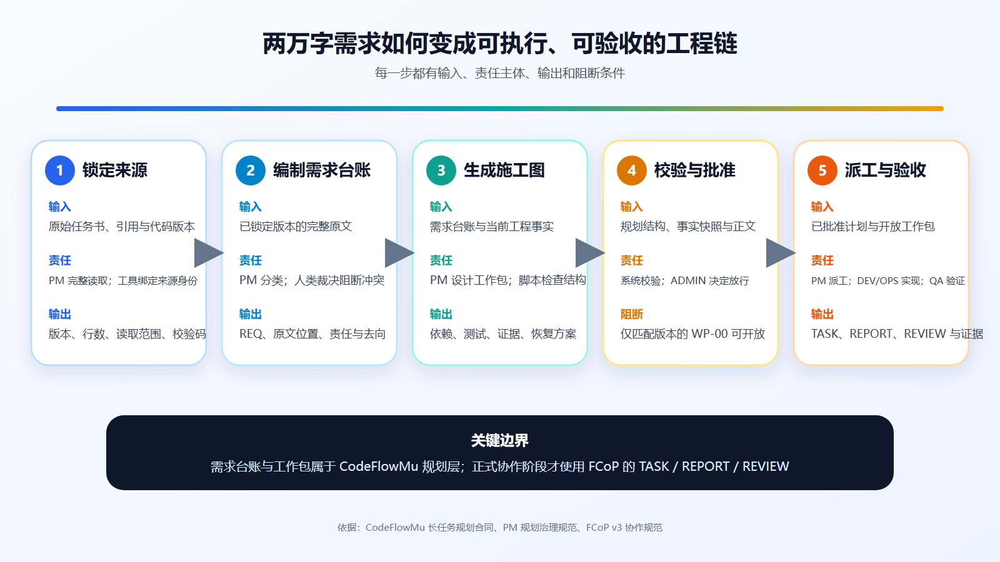
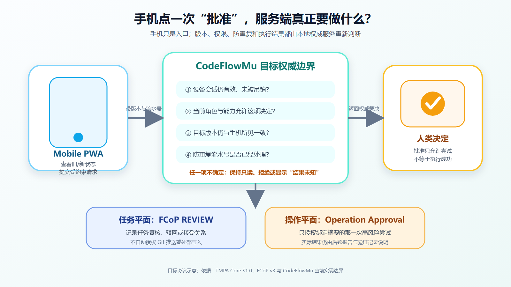

# 2026-08-19 三篇双语文章图文预览

状态：候选完成，等待用户确认完整图文包。未经确认不得发布。

## 1. 两万字需求，怎样拆成 AI 团队能落地的施工图？

- [中文完整稿](./02-article-1-taskbook-to-task-graph.zh.md)
- [English full article](./02-article-1-taskbook-to-task-graph.en.md)

## 2. 别被“全绿演示”骗了：怎样用故障注入，测出一个真正靠谱的 AI Agent 调度系统？

- [中文完整稿](./02-article-2-runtime-testing.zh.md)
- [English full article](./02-article-2-runtime-testing.en.md)

## 3. 人离开电脑后，怎样继续掌握 AI 团队？本地运行与手机控制面的双端设计

- [中文完整稿](./02-article-3-local-runtime-mobile-control.zh.md)
- [English full article](./02-article-3-local-runtime-mobile-control.en.md)

## 验收记录

- [题图成功经验与冻结记录](./03-cover-success-review.md)
- [视觉终审](./03-visual-review.md)
- [全局视觉标准](../../editorial/EDITORIAL-VISUAL-STANDARD.md)
