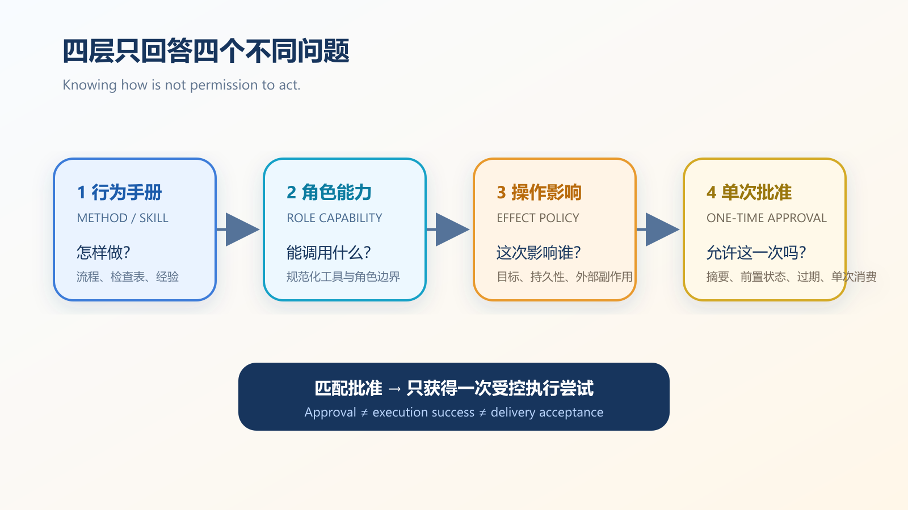

# An AI Agent’s Skill Is Not Its Permission: Why “Knows How” Must Stay Separate from “May Do”


Give an AI agent a deployment manual, a terminal, and file-writing tools. It can now build, test, and deploy. Does that mean it may push code toward production? Of course not. The dangerous configuration error is to treat “knows how” as “has been authorized”: a release that was supposed to wait for review can enter the deployment path simply because the relevant tool is visible.

The remedy is not a longer prompt. Execution authority needs four independent gates: a playbook describes how to work, role capability decides which tool may be called, operation policy inspects the real target and side effects, and human approval releases one exact action. This article turns those gates into an implementation and audit checklist.

```text
How to work       → playbook
What may be called → role capability
What this call affects → operation policy
Whether it may happen → explicit approval
```



*Figure 1. Four separate authority responsibilities. Source: author synthesis from the pinned CodeFlowMu implementation and MCP/NIST boundaries; this is not a universal FCoP or MCP field format.*

The practical question is simple: did the agent merely learn a method, or did the system actually grant authority for this action?

## A playbook describes behavior, not authority

A playbook is the right place for a workflow, checklist, or role-specific method. A developer playbook might say: locate the call site, make a narrow patch, run the relevant tests, and explain the evidence. That improves execution discipline. It does not grant write access.

This article uses the open-source multi-agent governance runtime CodeFlowMu as its engineering case. CodeFlowMu represents this layer as Agent Playbook Skills. Its [`SkillContextRouter`](https://github.com/joinwell52-AI/CodeFlowMu-open/blob/ed5634c718b9e238c44bb70851020c9793546fe6/packages/codeflowmu-runtime/src/skills/SkillContextRouter.ts) selects playbooks from role, intent, and task signals. Ordinary tasks receive a small matched set instead of the entire catalog. Governed product-planning tasks are an explicit exception: they load the required minimum set, so it would be inaccurate to claim that the router always loads at most three skills.

The separation yields two benefits. Irrelevant guidance does not consume every prompt, and the runtime can record why a playbook was selected. But the boundary remains firm:

> Auto-loaded guidance is neither execution authorization nor evidence that execution succeeded.

A prompt can tell an agent to test before committing. It cannot prove a test ran, and it cannot authorize a remote push.

## A role capability allows a class of calls

The next layer is the callable tool set. CodeFlowMu canonicalizes a tool identifier and checks whether the current role owns that capability.

The public implementation distinguishes, for example, between workers that may read coordination artifacts and submit reports, project managers that may create downstream tasks, administrators that own approval and archive operations, and evaluators whose native tools are limited to reads.

These roles are not theatrical prompt personas. They allocate decision rights that prompt text should not be able to rewrite.

The comment on [`RoleToolCapabilityGate`](https://github.com/joinwell52-AI/CodeFlowMu-open/blob/ed5634c718b9e238c44bb70851020c9793546fe6/packages/codeflowmu-runtime/src/registry/RoleToolCapabilityGate.ts) is deliberately narrow: it is an exact role/tool gate and does not inspect command text or effects.

Consider two calls:

```text
write_file("D:/project-a/src/app.ts")
write_file("D:/another-project/secrets.txt")
```

The tool name is identical. The first target may be inside the active task boundary; the second escapes the project. A tool allowlist cannot distinguish them.

The role gate can answer “may this role initiate this kind of call?” It cannot answer “are these parameters and their real-world effects acceptable?”

## Operation policy must inspect targets and effects

Risk lives in arguments. A useful operation policy needs to determine whether the call reads, writes, deletes, publishes, or controls a process; whether its target is inside the active project; whether it changes persistent state; whether it writes to an external system; whether it changes governance or privilege; and whether the effect is reversible.

CodeFlowMu’s [`UnifiedOperationPolicy`](https://github.com/joinwell52-AI/CodeFlowMu-open/blob/ed5634c718b9e238c44bb70851020c9793546fe6/packages/codeflowmu-runtime/src/approval/UnifiedOperationPolicy.ts) constructs operation facts and then returns one of two routes: allow, or require approval. A role’s possession of `write_file` does not automatically authorize a cross-project write or a mutation of formal governance artifacts.

The external standards point in the same direction. MCP is an open protocol for connecting model applications to tools and data. Its [security and trust guidance](https://modelcontextprotocol.io/specification/2025-03-26/index) warns that tools create arbitrary data-access and code-execution paths, and that tool descriptions and annotations should not be trusted by default. Hosts need consent and authorization controls. The [MCP authorization specification](https://modelcontextprotocol.io/specification/2025-06-18/basic/authorization) separately defines HTTP authorization, resource binding, insufficient permissions, and token protections.

Those documents establish that connectivity is not authorization. They do not define CodeFlowMu’s role matrix or decide whether a local path crosses the active project boundary. That remains an application-runtime responsibility.

## Approval should bind one operation, not create a permanent pass

“Allow terminal” is too broad to be a safe approval record. The decision should bind a specific actor, task, tool, target, effect set, and operation fingerprint:

```yaml
actor: DEV-01
task: TASK-042
tool: write_file
target: D:/project-a/src/app.ts
operation: write
effects:
  persistent: true
  external: false
fingerprint: sha256:...
```

This is an explanatory projection of the CodeFlowMu implementation, not an MCP or FCoP standard schema. The principle matters more than the field names: if the arguments change, an old approval must not authorize a different action.

The current `UnifiedOperationPolicy` can prepare an approval request with a target, effects, and an operation fingerprint, and it declares an original-agent retry strategy. Approval still means only “this attempt is allowed.” A remote system can reject it, the network can fail, and tests can still fail. Execution evidence must establish the outcome.

### Approval must bind the world that was reviewed

An argument fingerprint is not enough. After an administrator approves a write to `app.ts` but before execution, another process may change the file. A minimum approval contract should bind the actor, role, task, project, tool, full arguments, canonical target, a pre-state digest such as Git HEAD or a file hash, an expiry, and a random one-use execution credential.

CodeFlowMu’s current `OperationApprovalService` has a request digest, expiry, random one-time execution token, and available/consumed authorization state. Thirteen additional targeted service tests passed for expiry, invalid tokens, stale requests, and concurrent single consumption. A specialized workspace adapter can include Git HEAD and file snapshots, but that does not establish uniform pre-state binding across every tool path. The supported conclusion is narrower: expiry and single consumption have executable evidence; TOCTOU protection still requires executor-by-executor verification.

There need not be a field literally named `nonce`. A random single-use execution token supplies replay resistance. A network retry should preserve the same request identity; changed parameters or pre-state require a new approval.

### These gates are not an operating-system sandbox

Role capability resembles coarse RBAC, while operation policy resembles attribute- and effect-aware authorization. MCP connects tools but does not replace either layer. None of them substitutes for a low-privilege process, filesystem controls, egress restrictions, or a container sandbox.

Static path and command parsing also has limits. Wrappers, symlinks, composed shell expressions, and runtime-generated targets can defeat lexical assumptions. High-risk work should use controlled executors plus system-level confinement. The tests in this article do not establish a general CodeFlowMu container sandbox or resistance to arbitrary command obfuscation.

NIST SP 800-171 Rev. 3 supplies a broader security basis. Least privilege applies to users and processes acting for users; privileged functions should be restricted and logged. It is not an agent-specific architecture, but it reinforces the separation between assigning privilege, invoking privilege, and auditing what happened.

## Where TMPA, FCoP, and CodeFlowMu fit

The three project names are easy to confuse, so the responsibilities should be stated before using them as shorthand:

| Layer | Owns | Does not own |
|---|---|---|
| TMPA, the governance model | roles, authority, separation of duties, evidence and acceptance boundaries | tool registration or process execution |
| FCoP, the file coordination protocol | task, report, issue, and review envelopes and lifecycle facts | host authorization for terminal commands |
| CodeFlowMu, the runtime product | playbook routing, capability checks, operation policy, approval routing, and agent execution | automatic conversion of an attempt into business success |

In short: TMPA defines the governance semantics, FCoP defines shared coordination artifacts, and CodeFlowMu enforces runtime decisions.

## What 35 targeted passing tests establish—and what they do not

For this article, we checked out CodeFlowMu Open commit `ed5634c718b9e238c44bb70851020c9793546fe6` in an isolated worktree. The playbook, tool-mount, role-capability, and operation-policy sets passed **22 of 22** tests. A targeted approval-service set passed **13 of 13**, for **35 passing tests** in total.

The tests cover unrelated chat loading no playbooks; Chinese and English task signals routing to research playbooks; role-specific routing; same-project writes being allowed while cross-project writes are approval-routed; formal governance mutations being approval-routed; an evaluator being denied a write capability; approval expiry and invalid tokens; stale request digests; concurrent single consumption; and a resumed original-agent session consuming one matching authorization.

The run also exposed a limit that belongs in the public article. The older `MCPInjector` stub records proposed mounts but starts no subprocess. `mode='live'` deliberately throws a not-implemented error. This article therefore does not present it as a live dynamic MCP mounting system. The evidence supports context routing, role capability checks, and operation policy—not every planned MCP lifecycle feature.

Passing 35 targeted tests is not a penetration test or third-party security certification. The runs do not establish uniform file-snapshot binding, complex command parsing, symlink resistance, container isolation, or arbitrary third-party MCP safety. Dependency installation also reported six audit findings that require separate review. A green functional suite should not be repackaged as a supply-chain security conclusion.

## Three regression cases worth keeping

### Guidance must not grant authority

Load a code-fix playbook for a QA role without granting write tools. The role may produce a recommendation, but it must not land a patch.

### One tool, two targets, two decisions

Have a developer write once inside the active project and once into a neighboring project. The second call must not reuse the first decision merely because the tool name matches.

### Approval must not become completion

Approve a remote publication attempt, then make the remote service fail. The approval remains “authorized,” execution becomes “failed,” and the task must not become accepted.

## A practical review checklist

For every agent capability, ask:

1. Where is the method stored, and when is it loaded?
2. Which roles can see and call the tool?
3. Are aliases reduced to one canonical tool identifier?
4. Who resolves paths, URLs, repositories, and target objects in the arguments?
5. How are cross-project writes, external effects, deletion, publication, and governance changes escalated?
6. Does approval bind the task, target, and operation fingerprint?
7. Can an approved operation fail without the task becoming complete?
8. Are playbook selection, denial, approval, and execution recorded separately?

The following is target audit logic, not a current CodeFlowMu API:

```text
role cannot call tool                       → deny
target or effects cannot be resolved        → stop or use a controlled executor
bounded low-risk action                     → allow an attempt
approval required                           → bind request digest, pre-state, and expiry
expired, consumed, or changed pre-state     → invalidate old approval
exact approval match                        → consume once, execute under confinement, record evidence
execution fails                             → remain failed; authorization is not completion
```

A small read-only assistant may combine implementation components, but it should preserve these semantic distinctions. Otherwise, as the system grows, it will lose the ability to answer a basic governance question: did this action occur because the agent had learned a method, or because the organization had authorized it?

## Conclusion

Skills package method. Tools expose execution. Capabilities allocate role authority. Approval decides a specific risk. The four concepts are related, but none substitutes for another.

> Knowing how proves that an agent has a method. Only a valid role capability, an acceptable effect evaluation, and a matching approval give it an opportunity to execute this action.

This architecture does not make the model smarter. It preserves control when the model’s judgment is wrong.

## Primary sources

1. [Model Context Protocol: Security and Trust & Safety](https://modelcontextprotocol.io/specification/2025-03-26/index)
2. [Model Context Protocol: Authorization](https://modelcontextprotocol.io/specification/2025-06-18/basic/authorization)
3. [NIST SP 800-171 Rev. 3](https://nvlpubs.nist.gov/nistpubs/SpecialPublications/800-171r3/NIST.SP.800-171r3.html)
4. [CodeFlowMu SkillContextRouter, pinned commit](https://github.com/joinwell52-AI/CodeFlowMu-open/blob/ed5634c718b9e238c44bb70851020c9793546fe6/packages/codeflowmu-runtime/src/skills/SkillContextRouter.ts)
5. [CodeFlowMu RoleToolCapabilityGate, pinned commit](https://github.com/joinwell52-AI/CodeFlowMu-open/blob/ed5634c718b9e238c44bb70851020c9793546fe6/packages/codeflowmu-runtime/src/registry/RoleToolCapabilityGate.ts)
6. [CodeFlowMu UnifiedOperationPolicy, pinned commit](https://github.com/joinwell52-AI/CodeFlowMu-open/blob/ed5634c718b9e238c44bb70851020c9793546fe6/packages/codeflowmu-runtime/src/approval/UnifiedOperationPolicy.ts)
7. [CodeFlowMu OperationApprovalService, pinned commit](https://github.com/joinwell52-AI/CodeFlowMu-open/blob/ed5634c718b9e238c44bb70851020c9793546fe6/packages/codeflowmu-runtime/src/approval/OperationApprovalService.ts)
8. [CodeFlowMu WorkspaceOperationApproval, pinned commit](https://github.com/joinwell52-AI/CodeFlowMu-open/blob/ed5634c718b9e238c44bb70851020c9793546fe6/packages/codeflowmu-runtime/src/approval/WorkspaceOperationApproval.ts)
9. [TMPA Core Specification S1.0, pinned commit](https://github.com/joinwell52-AI/joinwell52/blob/ae27de71b1a8809c2bd69acedc1482570d55a322/docs/public/releases/tmpa/v1.0/artifacts/tmpa-core-specification-s1.0-zh.md)
10. [FCoP v3 Chinese specification, pinned commit](https://github.com/joinwell52-AI/FCoP/blob/a859e6747fe6e5e2d686e0114c77774726d7f748/spec/fcop-v3-spec.zh.md)

Accessed 2026-08-20.
