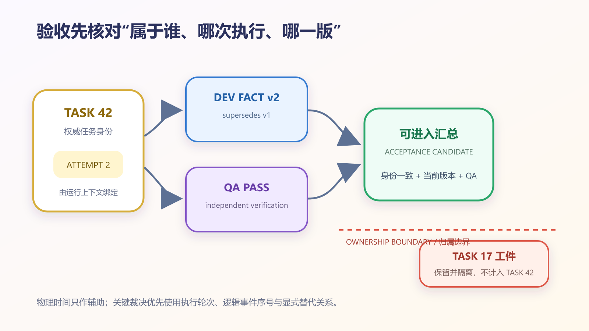

# AI 团队同时交回三份报告，怎样保证验收没有串账？


开发、测试和运维三个 AI 智能体几乎同时交回报告。三份报告都说成功，系统也顺利生成“开发完成、测试通过、部署正常”的总结；但测试验收的是返工前版本，运维报告属于另一个任务，开发报告又写错了任务编号。系统没有漏掉任何文件，却拼出了一笔从未发生过的交付。

解决办法不是再让模型猜一次正文，而是把展示和验收分开：界面可以尽力帮助挂树，真正进入验收的报告必须拥有唯一、可验证的任务归属，并明确属于哪次执行。本文会给出身份门禁、报告版本状态和汇总检查清单；只要归属仍有歧义，系统就应停止，而不是替人猜一个最像的答案。

## 报告存在，不等于报告属于这项任务

多 Agent 系统常用四种简便办法归档报告：

1. 挂到同一聊天线程；
2. 挂到最近创建的任务；
3. 根据正文中出现的任务编号匹配；
4. 根据发送角色匹配，例如 DEV 报告挂到最近的开发任务。

这些办法适合帮助界面整理，却都不能单独支撑验收。

同一线程里可能连续出现两个根任务；返工报告会提到被驳回的旧任务；正文可能同时描述父任务与子任务；迟到的旧报告也可能在新任务创建后才被文件监听器发现。

如果系统在这些情况中“挑一个最像的”，它得到的只是概率较高的挂树，不是确定的证据归属。

## 一份报告至少需要四张身份证

在 CodeFlowMu 的当前实现中，报告归属涉及四类信息：

| 身份 | 作用 | 典型错误 |
|---|---|---|
| 报告文件身份 | 表明报告本身是哪次回执 | 文件名序号与实际任务不符 |
| `task_id` | 声明直接工作所有者 | 仍指向返工前任务 |
| `parent_task_id` | 表明报告在任务树上的父节点 | 报告被挂到根任务而不是具体子任务 |
| `references` | 保存相关任务和历史引用 | 把“提到过”误当成“直接属于” |

这里最重要的区别是：**直接所有者和相关引用不是一回事。**

假设开发 Agent 在 `TASK-042-REWORK-01` 上返工。报告可以在 `references` 中保留旧的 `TASK-042`，说明为什么返工；但直接 `task_id` 应指向当前返工任务。若系统只扫描引用，旧任务就可能“偷走”新报告。

## 关键回执需要硬门，而不是相似度

CodeFlowMu 为一个关键 DEV 回执场景实现了严格的三字段检查。[`reportAttribution.ts`](https://github.com/joinwell52-AI/CodeFlowMu-open/blob/ed5634c718b9e238c44bb70851020c9793546fe6/packages/codeflowmu-runtime/src/pm/reportAttribution.ts) 会比较：

```text
REPORT 文件名推断的 TASK 编号
        ==
frontmatter.task_id
        ==
references[0]
```

例如：

```yaml
filename: REPORT-20260820-042-DEV-to-PM.md
task_id: TASK-20260820-042
references:
  - TASK-20260820-042
```

三处一致，归因门才通过。若文件名是 `REPORT-...-043`，但 `task_id` 和引用仍是 `TASK-...-042`，系统会返回归因失败，而不是选择两个字段中的“多数”。缺少 `task_id` 或首个引用也会失败。

必须说明：这是 CodeFlowMu 当前某个关键 DEV 验收路径的应用级硬门，不是 FCoP 对所有 REPORT、所有角色和所有文件名的普遍规则。FCoP 定义 REPORT 信封和引用能力；具体项目可以在宿主 Runtime 中增加更严格的归因合同。

这道门只能排除“三处互相矛盾”，不能排除“三处一致地写错”。模型若复制了旧报告模板，可能在文件名、`task_id` 和首个引用中填入同一个旧任务，静态检查仍会通过。三字段一致因此是必要条件，不是任务归属的充分证明。

更强的目标设计是：智能体只提交报告正文和执行证据，权威元数据由运行系统根据当前会话注入。文件名、任务编号、父任务、执行轮次和逻辑序号不由模型自由书写；运行系统再把封包后的完整工件交给归因门复核。当前 CodeFlowMu 的三字段门已经能发现明显错配，但本文没有证据证明所有报告入口都统一采用了这种“运行系统封包”流程，所以这部分明确作为下一步合同，而不是现成功能。



*图 1：报告从身份、执行轮次、版本替代到 QA 验证的归属链。运行系统注入全部权威元数据仍是目标合同；图中没有把它冒充当前全路径能力。*

## 为什么需要身份传播，但不能把 Trace 当验收

分布式系统已经遇到过类似问题。W3C [Trace Context](https://www.w3.org/TR/trace-context/) 用 `trace-id` 关联一条跨服务调用链；`parent-id` 是调用方为当前请求携带的上游操作标识，接收方创建下游请求时会用新的当前操作标识继续传播。OpenTelemetry 的[追踪 API](https://opentelemetry.io/docs/specs/otel/trace/api/)规定每个 span 最多有一个父 span，父子操作共享 TraceId，从而构成因果树。

这为 Agent 报告提供一个重要启发：任务身份和父关系必须随着工作传递，不能等报告回来以后再靠正文猜。

但类比到这里必须停止。Trace 能说明两次操作在同一调用链中，不证明输出内容正确；span 正常结束也不代表业务验收通过。Agent 报告同样需要把“关联到了哪个任务”和“是否满足任务合同”分开。

```text
身份关联正确
      ≠
报告内容真实
      ≠
测试角色已验证
      ≠
业务已经接受
```

## 展示挂树可以尽力，验收门禁不能猜

CodeFlowMu 的 [`reportParenting.ts`](https://github.com/joinwell52-AI/CodeFlowMu-open/blob/ed5634c718b9e238c44bb70851020c9793546fe6/packages/codeflowmu-runtime/src/ledger/reportParenting.ts) 需要面对现实世界的不完整旧数据。它优先使用显式 `source_task_id` 或 `task_id`；缺失时，还会参考 `references`、文件名序号、正文重合和最近开放任务，帮助把报告展示在合理位置。

这种“最佳努力”对账本界面很有价值：历史数据不至于全部变成孤儿。

但如果把同一启发式直接用于自动验收，就会出现风险。正文相似可能因为两个任务都修改同一模块；最近任务可能只是刚好创建得晚；同一角色可能并行处理多个任务。

因此需要两条不同的结果：

```text
display_parent = best_effort_match(...)
acceptance_owner = deterministic_contract_or_undetermined(...)
```

前者可以标记“推测挂载”并允许人工修正；后者只能返回明确唯一所有者，或者 `undetermined`。不确定不是系统失败，而是阻止串账的有效结果。

## 同一线程出现两个根任务时，线程不能当父亲

真实协作中，一个聊天线程可能先处理缺陷 A，稍后又加入独立需求 B。若所有报告只带同一个 `thread_key`，旧的最终报告可能被新任务误用。

当前 `reportParenting.ts` 会在同一线程存在多个 ADMIN 根任务时按 lineage 和任务前缀分桶。只有引用或父链能唯一指向某个根时，报告才进入该桶；否则留在孤立区域，而不是挂到“线程中的第一个根任务”。

这条规则解决的是账本重建，不保证所有历史文件都能自动恢复。缺少身份的旧报告可能需要人工裁决。系统不应为了让界面更整齐而伪造确定性。

## 同一任务交两次报告，必须明确哪一份有效

任务编号相同，不代表两份报告可以互相覆盖。开发智能体第一次提交失败报告，修复后又提交成功报告时，系统至少需要执行轮次、报告自身身份、前一版本引用，以及明确的“替代了哪一份”关系。旧报告继续保留，但不再作为当前完成证据。

CodeFlowMu 当前账本已经识别 `submission_attempt`、`revision_of`、`supersedes` 和 `superseded_by` 等字段；汇总门也会排除标记为无效或已被替代的报告。这些是版本治理的可用零件，却不能证明每个报告入口都会自动递增执行轮次、并发提交一定得到唯一裁决。生产系统仍应把报告版本写成显式状态机：

```text
attempt-1 / report-v1 / failed
          └─ superseded_by → report-v2
attempt-2 / report-v2 / candidate
          └─ verified_by   → qa-report-v2
```

覆盖原文件会抹掉失败历史；按“最新时间”自动获胜又会受时钟漂移影响。更稳妥的做法是用任务事件序号或执行轮次建立因果顺序，再由明确的替代关系决定哪份报告进入验收。

## 报告归属通过以后，还不能生成最终总结

即使开发报告已经正确挂到任务，项目经理也不能立刻宣布完成。CodeFlowMu 的 [`PmSummaryGate`](https://github.com/joinwell52-AI/CodeFlowMu-open/blob/ed5634c718b9e238c44bb70851020c9793546fe6/packages/codeflowmu-runtime/src/pm/PmSummaryGate.ts) 还会检查：

- 下游子任务是否已经进入结算状态；
- 是否存在有效的 worker-to-PM 报告；
- 报告是否晚于对应任务创建；
- 产品任务是否具备要求的 QA 报告；
- QA 是否给出 PASS；
- 需要浏览器验证时是否存在浏览器证据；
- 是否已经存在一份有效的最终总结。

因此，“诊断列表为空”不能替代归因通过，“开发报告存在”不能替代 QA 通过，“PM 写了总结”也不能替代管理员或业务负责人的最终接受。

这正是 TMPA 中事实与接受分离的工程意义：执行者提交事实，验证者检查事实，有权角色决定是否接受。三者不能由同一份报告中的 `status: done` 合并。

这里还要收紧“晚于”的含义。当前汇总代码优先读取工件中的显式创建时间；部分兼容分支会参考账本时间或文件修改时间。Git 同步、解压、跨设备复制和本机时钟漂移都可能改变这些时间，因此物理时间只能作为辅助证据。涉及返工、重复提交和跨设备同步时，应优先比较由运行系统产生的事件序号、执行轮次和明确替代关系。

## 44 个测试覆盖了哪些串账路径

本次写作在独立工作树固定 CodeFlowMu Open commit `ed5634c718b9e238c44bb70851020c9793546fe6`，重新运行报告挂树、归因和最终汇总测试，结果为 **44/44 通过**。

测试包含：

- 文件名指向任务 003，而 `task_id` 与引用指向 002：拒绝；
- 缺少 `task_id` 或引用：拒绝；
- 三字段一致：通过；
- 返工报告显式指向当前任务，即使引用提到旧任务，也保持当前所有者；
- 同一线程两个根任务，旧 PM 最终报告不能挂到新根；
- 迟到报告早于子任务创建：不视为有效交付；
- QA 报告缺失或 FAIL：阻止最终总结；
- QA 未提供要求的浏览器证据：阻止总结；
- diagnostics 为零但报告归因失败：整体验收仍失败。

测试同时证明辅助挂树确实包含正文和最近任务回退。因此本文不会把 CodeFlowMu 描述成“所有历史报告都只靠三字段决定”。准确边界是：账本展示兼容不完整数据；关键验收路径使用更严格合同。

当前 44 项没有覆盖“三字段一致但共同指向错误任务”。该场景是根据门禁逻辑得到的反例，也是下一轮应新增的故障测试，不能写成已经通过的用例。

## 六个值得复制的失败用例

### 编号错配

报告文件名、显式任务编号和首个引用中任意一处不同。期望：归因失败，保留原文件，不自动改名覆盖现场。

### 三处一致地写错

从旧模板复制报告，让文件名、`task_id` 和首个引用都指向同一个错误任务。期望：若元数据不是由运行系统注入，就不能仅凭三字段一致进入验收；至少还要核对当前会话、执行轮次或签发上下文。

### 旧报告迟到

报告创建时间早于目标子任务，却在监听器重启后才被发现。期望：可以展示为历史孤儿，不满足当前任务的有效报告条件。

### 同一任务重复提交

同一任务先后出现失败和成功报告。期望：保留两份工件，用执行轮次和 `supersedes` 关系选择候选；禁止覆盖旧文件，也禁止只按文件修改时间决定胜者。

### 同线程多根

同一 `thread_key` 下存在两个独立根任务，报告只提供 thread。期望：`undetermined`，不得挂到第一个或最新根。

### QA 缺失或失败

开发报告正确、代码也存在，但必需 QA 报告缺失或 verdict 为 FAIL。期望：不生成成功总结，下游发布保持阻塞。

## 报告创建与汇总清单

报告创建时：

1. 在领取任务时就把任务身份、父任务和执行轮次放入运行上下文；
2. 智能体只提交正文与证据，文件名和权威元数据由 Runtime 封包注入；
3. 直接所有者放在固定字段，历史相关项放在引用列表；
4. 记录发送角色、执行轮次、逻辑事件序号和创建时间；
5. 对返工创建新尝试身份，用 `supersedes` 指向被替代报告，并保留旧任务引用。

报告摄入时：

6. 先解析显式身份，再考虑辅助匹配；
7. 多个候选同分时返回不确定，不随机选择；
8. 保留原始文件、解析结果和冲突原因；
9. 展示推测挂树时明确标注“未用于验收”。

最终汇总前：

10. 优先用执行轮次、事件序号和替代关系核对报告新旧；物理时间只作辅助；
11. 核对角色、任务所有者和必需证据；
12. QA 缺失、失败或证据不足时阻止成功总结；
13. 把执行事实、验证裁决和业务接受保存为不同记录。

## 限制与待验证问题

三字段一致可以排除一类明显串账，却不能证明报告正文真实，也不能阻止模型三处一致地引用错误任务。运行系统封包可以显著缩小这类错误面，但当前资料不足以证明所有 CodeFlowMu 报告入口都已执行该合同。

正文匹配算法也没有误挂率基准；本文不主张它适合验收。跨仓库、跨组织的任务身份还需要命名空间或全局身份，单纯日期和三位序号可能碰撞。

44 个测试来自第一方固定提交，不是外部审计。下一步应加入随机生成的任务树、三处一致但上下文错误、同任务多执行轮次、报告乱序、重复监听事件、时钟漂移和跨重启重建测试，量化 `undetermined`、误挂和漏挂比例。

## 结论

多 Agent 协作最危险的错误不一定是报告丢失，而是报告存在、内容也合理，却被算进了错误任务。

> 展示系统可以努力帮人找到报告；验收系统没有权力在归属不清时替人猜。

让任务身份和父关系随执行传递，让关键报告通过确定性归因门，让 QA 和最终接受继续保持独立。这样，三份报告才能形成三条可审查证据，而不是被拼成一笔看似完整的假交付。

## 主要来源

1. [W3C Trace Context](https://www.w3.org/TR/trace-context/)
2. [OpenTelemetry Tracing API](https://opentelemetry.io/docs/specs/otel/trace/api/)
3. [FCoP v3 中文规范，固定提交](https://github.com/joinwell52-AI/FCoP/blob/a859e6747fe6e5e2d686e0114c77774726d7f748/spec/fcop-v3-spec.zh.md)
4. [CodeFlowMu reportAttribution 固定提交](https://github.com/joinwell52-AI/CodeFlowMu-open/blob/ed5634c718b9e238c44bb70851020c9793546fe6/packages/codeflowmu-runtime/src/pm/reportAttribution.ts)
5. [CodeFlowMu reportParenting 固定提交](https://github.com/joinwell52-AI/CodeFlowMu-open/blob/ed5634c718b9e238c44bb70851020c9793546fe6/packages/codeflowmu-runtime/src/ledger/reportParenting.ts)
6. [CodeFlowMu PmSummaryGate 固定提交](https://github.com/joinwell52-AI/CodeFlowMu-open/blob/ed5634c718b9e238c44bb70851020c9793546fe6/packages/codeflowmu-runtime/src/pm/PmSummaryGate.ts)
7. [CodeFlowMu LedgerBuilder 固定提交](https://github.com/joinwell52-AI/CodeFlowMu-open/blob/ed5634c718b9e238c44bb70851020c9793546fe6/packages/codeflowmu-runtime/src/ledger/LedgerBuilder.ts)
8. [TMPA 核心规范 S1.0，固定提交](https://github.com/joinwell52-AI/joinwell52/blob/ae27de71b1a8809c2bd69acedc1482570d55a322/docs/public/releases/tmpa/v1.0/artifacts/tmpa-core-specification-s1.0-zh.md)

访问日期：2026-08-20。
