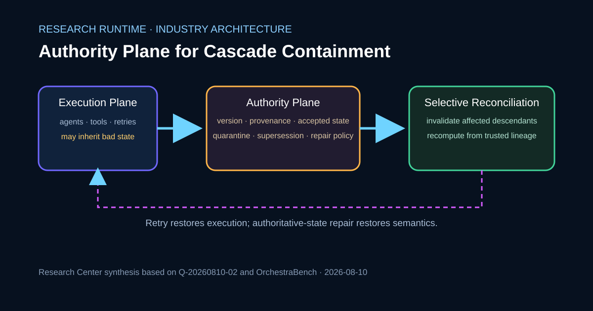

# 多 Agent 恢复需要权威状态平面，而不是盲目重试

多 Agent 工作流发生故障时，“重试”和“修复”并不是同一件事。瞬态工具故障可以通过再次执行恢复可用性；如果每一次新尝试仍然消费同一份已经污染的状态，那么重试不会产生语义修复。

## 题图

## 摘要

**核心判断是：语义级恢复需要独立的 Authority Plane，明确哪些状态已经接受、哪些已经过期、隔离或被替代。** Agent 可以负责诊断、比较、生成修复方案，但不应该让同一个推理上下文同时承担“判断真相”和“决定修复规则”两种角色，尤其当上下文本身可能已经被污染时。

本次完成的 Reading Result 以 OrchestraBench 为受控证据。它最强的 LLM 遏制条件明确提供 Trusted Upstream State；去掉这个信号后，Latent Recovery 明显下降到接近基线。因此可以复用的结论是 **Trusted-state Reconciliation**，而不是“LLM 可以自主自愈多 Agent 级联故障”。

## 来源

Production 只消费同日 Research Object `Q-20260810-02`，并仅使用已完成 Reading Result 核对引用和证据边界。一手来源是 OrchestraBench 预印本。

- arXiv：https://arxiv.org/abs/2608.05263
- 全文：https://arxiv.org/html/2608.05263v1

## 观察

论文将瞬态 Tool Fault 与 Latent Semantic/Context Fault 分开评估。在受控分阶段计算中，Blind Retry 能够恢复可重试的工具故障；对于上下文污染、冲突输出等潜在语义故障，如果底层坏状态仍然存在，重试只是在重新传播同一个错误。

深度实验进一步显示，Latent Fault 会随着流水线加深扩大 Cascade Radius。更关键的是，Policy-conditioned LLM 条件给 Router 显式提供 Trusted Upstream Value，并允许它发现和纠正异常；去掉 Trusted Upstream 的消融后，Latent Recovery 明显下降。论文作者也明确提醒，这属于 Trusted-state Self-correction Probe，而不是 Autonomous Routing 的生产部署估计。

## 比较

| 恢复机制 | 改变了什么 | 最适合 | 语义污染风险 | 证据状态 |
|---|---|---|---|---|
| Blind Retry | 基本保留原状态，重新执行 | 瞬态/可重试工具故障 | 坏状态仍是权威时风险高 | OrchestraBench 基线机制 |
| 无 Trusted Upstream 的 LLM Repair | 增加模型推理，但没有独立 Truth Signal | 某些诊断可能改善 | 模型必须从可能污染的上下文中推断真相 | 消融结果在测试结构中接近基线 |
| Trusted-state Repair | 增加外部正确性/参考信号 | 受控实验中的潜在语义修复 | Authority Signal 有效时显著降低 | 论文报告的强恢复条件 |
| Authority-plane Reconciliation | Research Center 架构方案：版本化 Provenance、Accepted State、Invalidation 与 Selective Recompute | 长生命周期生产工作流 | 取决于权威信号质量和冲突治理 | 架构推论，不是论文实测结果 |

前三行对应论文和 Reading Result；第四行是 Research Center 的架构综合。

## 讨论

可靠编排需要把 **Reasoning Plane** 和 **Authority Plane** 分开。Agent 可以解释、比较、规划和修复，但“哪一版状态是真正被接受的”应通过独立控制面表示，例如 Versioned Checkpoint、经过验证的 Business Fact、已批准的人工决定、Immutable Event Log Position，或者其他带明确 Provenance 的状态源。

这也要求把 Retry Policy 和 Semantic Repair Policy 分开。Transport Retry 解决的是“同一个操作再做一次能否成功”；Semantic Repair 解决的是“哪一份状态错了、哪一份状态才有权威、哪些下游产物需要失效”。两者混在一起，就会出现对污染上下文反复重算却无法真正修复的问题。

在分支工作流中，Cascade Impact 也不能只用线性距离衡量。生产系统应通过 Provenance Edge 记录每个下游产物消费了哪一版上游状态，恢复时才能只失效受影响的 Descendant，而不是重跑整个图。

## 工程影响

对数字员工，应为长期任务保留权威工作状态 Checkpoint，尤其是人工审批和外部验证过的 Business Fact。发现语义不一致后，应先回到 Trusted Checkpoint 完成 Reconciliation，再重跑下游步骤。

对 CodeFlowMu，应给 Workflow Node 增加显式 State Version 与 Provenance 字段，并要求下游 Output 声明自己消费的 Upstream Version。Transient Tool/Transport Failure 的 Retry Policy 与 Semantic/Context Failure 的 Repair Policy 应彻底分开，同时记录 Invalidated Descendant，使恢复范围可观察。

对 TMPA，受控 Benchmark 可以作为 Evidence/Custody/Provenance 研究输入，但不能把一个 Benchmark 的 Trusted-state Probe 直接升级为协议强制要求。

## 边界与不确定性

OrchestraBench 的核心实验是受控机制探针，不是完整企业级多 Agent 部署测量。部分领域验证只是给相同计算结构换了业务语义，并非真正的端到端业务系统。最强遏制条件具有信息优势，因为 Trusted State 被显式提供。真实生产环境中的权威信号本身也可能过期、冲突或被污染，因此 Authority Plane 同样需要自己的治理机制。

## 后续工作

下一步应继续回答：不同数字员工岗位中什么证据可以成为 Authoritative State；多个权威 Checkpoint 冲突时如何裁决；Provenance 如何覆盖 Branching DAG、异步工作与补偿流程；以及 Attribution + Repair 的成本与 Rollback、人工升级相比是否可接受。

## 可视化说明

题图是 Research Center 架构综合，用来分离 Execution/Retry、Authoritative-state Reconciliation 和 Selective Downstream Invalidation；没有把定性机制转换成无来源的评分。

## 参考资料

1. OrchestraBench，arXiv 预印本 `2608.05263`：https://arxiv.org/abs/2608.05263
2. OrchestraBench 全文：https://arxiv.org/html/2608.05263v1
3. Research Center Research Object：`research/analysis/Q-20260810-02-authoritative-state-containment.md`
4. Research Center Reading Result：`research/reading/Q-20260810-02-trusted-state-cascade-containment.md`

> Editing status：Production Candidate 通过。Trusted-state 假设、消融解释、Retry/Repair 区分、局限与双语证据边界均已检查；尚未发布。
