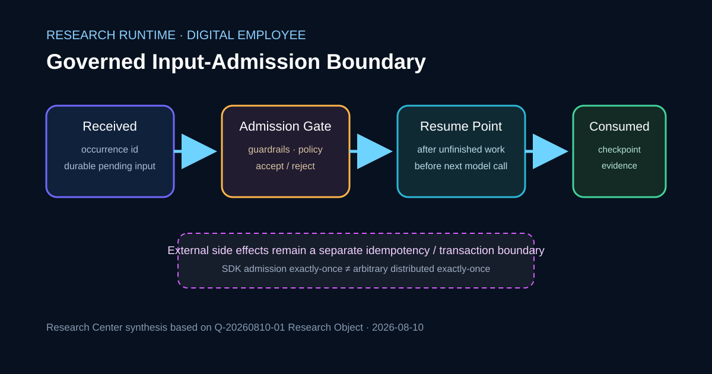

# Resumable Digital Employees Need a Governed Input-Admission Boundary

A Digital Employee that can pause, accept operator input, resume after process boundaries and continue tool work needs more than persistent chat history. It needs an explicit boundary that determines when a newly received input becomes authoritative for the run.

## Cover

## Summary

**The central judgment is that late operator input should be governed as an admission event, not appended as ordinary conversation text.** The same occurrence must be durably identifiable, validated before admission, attached to a deterministic resume point and linked to evidence showing whether it was merely received, admitted or consumed.

The merged OpenAI Agents Python implementation examined in the completed Reading Result provides concrete evidence for this distinction inside SDK-owned run state. It does not establish distributed exactly-once behavior for arbitrary external tools, so business side effects still need separate idempotency or transaction controls.

## Source

Production consumes the same-day Research Object `Q-20260810-01` and uses its completed Reading Result only to verify citations and evidence boundaries. The primary evidence is OpenAI Agents Python issue #4323, merged PR #4325 and commit `7bf73afa47ac48c1efb599d0b1505cee994e74f5`.

- Issue: https://github.com/openai/openai-agents-python/issues/4323
- Merged PR: https://github.com/openai/openai-agents-python/pull/4325
- Implementation commit: https://github.com/openai/openai-agents-python/commit/7bf73afa47ac48c1efb599d0b1505cee994e74f5

## Observation

The repository implementation keeps pending input outside the active model/tool step until the next model-call admission boundary. The Reading Result records that pending input survives `RunState` serialization, carries a generated occurrence identifier, and is admitted only after unfinished work has reached the appropriate resume boundary. Input guardrails run before the next model call, and rejected input remains recoverable instead of being silently consumed.

The same evidence also shows the ownership limit. The SDK can preserve exactly-once admission and conversation bookkeeping under its own state model, but that is not a guarantee that an arbitrary external tool side effect executes exactly once across crashes, retries or distributed workers.

## Comparison

| Input model | Durable occurrence identity | Admission point | Policy check | Consumption evidence | External side-effect guarantee |
|---|---|---|---|---|---|
| Append directly to chat/history | Often absent | Implicit | Easy to blur with execution | Hard to distinguish receipt from use | None implied |
| Start a new run with the same Session | New run boundary | New run start | Supported by new-run flow | Session history is durable, but resumed-run identity changes | None implied |
| Durable pending input in resumed `RunState` | Explicit `input_id` occurrence | Before the next model call after unfinished work | Guardrails before admission | Pending/current-step and accepted progress are checkpointed | SDK scope only |
| Governed Digital Employee admission ledger | Research Center proposal | Explicit state transition | Policy decision recorded as evidence | Received → Pending → Admitted/Rejected → Consumed | Requires separate tool idempotency/transaction key |

The first three rows summarize documented or implemented mechanisms from the cited sources. The fourth is a Research Center engineering proposal derived from the Research Object, not a claim that the cited SDK already implements an enterprise admission ledger.

## Discussion

Content equality is not occurrence equality. Two identical operator messages can be two valid actions, while one occurrence replayed twice after restart must not become two admissions. A durable occurrence identifier therefore matters more than comparing input text.

The admission boundary also determines where policy belongs. If guardrails run after new input has already mutated authoritative run state, recovery becomes ambiguous: was the input accepted and then rejected, or never accepted at all? A governed runtime should make that transition explicit and append-only.

Finally, resume correctness and side-effect correctness must remain separate. Checkpointing a completed tool call can prevent the model layer from casually replaying it, but an external business system still needs its own idempotency key, transaction identifier or compensating policy if the host can fail between local and remote commits.

## Engineering impact

For Digital Employee runtimes, introduce an Input Admission Ledger containing occurrence id, received-at, admitted-at, guardrail decision, consuming run/step and final disposition. Surface at least `Received`, `Pending Admission`, `Admitted`, `Rejected/Recoverable` and `Consumed` as distinguishable states.

For CodeFlowMu, keep worker/run checkpoints separate from operator input until an explicit admission transition. Propagate the admission occurrence id into side-effecting tool calls where retry after resume is possible, and expose admission/checkpoint events on the operation timeline.

For TMPA, this mechanism is useful engineering evidence for custody and admission semantics, but one SDK implementation is not sufficient evidence for a protocol-level change.

## Boundaries and uncertainty

The evidence establishes intended behavior and merged regression coverage in OpenAI Agents Python. It does not establish distributed exactly-once execution under arbitrary storage failures, cross-host races or uncoordinated external systems. The feature is not a thread-safe live injection channel into an already-running model/tool call, and arbitrary conversation replacement or compaction is outside its stated scope.

## Future work

A product-level Digital Employee runtime should test crash points between receipt, admission, checkpoint persistence and external side effects. It should also define how superseded or withdrawn pending input remains auditable, and whether occurrence identity must propagate to every downstream tool or only to calls with external effects.

## Visualization note

The cover visual is a Research Center architecture synthesis. It separates receipt, policy admission, deterministic resume and consumption evidence, with an explicit side-effect boundary rather than presenting a vendor diagram or invented metric.

## References

1. OpenAI, `openai-agents-python`, Issue #4323, durable input requirements and acceptance cases: https://github.com/openai/openai-agents-python/issues/4323
2. OpenAI, `openai-agents-python`, PR #4325, merged durable pending-input implementation: https://github.com/openai/openai-agents-python/pull/4325
3. OpenAI, `openai-agents-python`, commit `7bf73afa47ac48c1efb599d0b1505cee994e74f5`: https://github.com/openai/openai-agents-python/commit/7bf73afa47ac48c1efb599d0b1505cee994e74f5
4. Research Center Research Object: `research/analysis/Q-20260810-01-governed-input-admission.md`
5. Research Center Reading Result: `research/reading/Q-20260810-01-durable-runstate-pending-input.md`

> Editing status: PASS for Production Candidate. Facts, SDK scope, external-side-effect boundary, bilingual structure and evidence traceability checked; not published.
