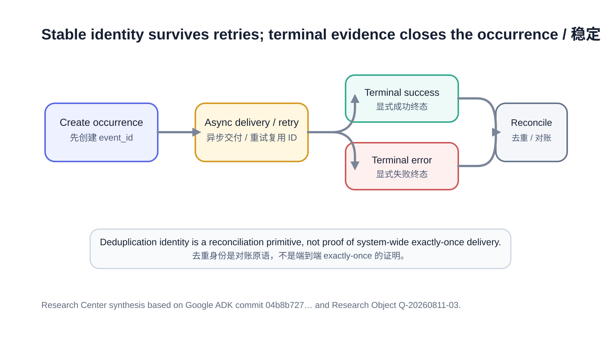

# Agent Operations Need Durable Identity and Explicit Terminal Evidence

Distributed agent systems often confuse three different properties: “this logical occurrence has an identity,” “the transport did not duplicate a row,” and “the business operation executed exactly once.” They are not equivalent. A durable occurrence ID is primarily a reconciliation primitive; terminal evidence is what closes the logical execution.

## Summary

A merged Google ADK analytics change creates a stable `event_id` before asynchronous delivery, reuses that same ID across retries, introduces an opt-in committed-stream mode with explicit offsets, and adds explicit terminal metadata for final LLM responses and workflow-node success/error events.

The same implementation also documents the limits of its guarantee: duplicate physical rows remain possible in the default path, committed-stream recovery can still drop rows under retry exhaustion, offset conflict or stream-rotation failure, and offset/desynchronization state shown in the implementation is process-local rather than demonstrated as restart-safe.

The Research Center judgment is therefore precise: **allocate durable occurrence identity before asynchronous handoff, reuse it across retries, and emit typed terminal evidence tied to the same logical execution. Do not call that end-to-end exactly-once unless every layer that owns the guarantee can prove it.**

## Source

The primary source is merged Google ADK implementation commit `04b8b72709f6d17b503cf674c8ac1b89798f655e`:

- https://github.com/google/adk-python/commit/04b8b72709f6d17b503cf674c8ac1b89798f655e

The same-day Reading Result records the writer state machine, retry behavior, offset-conflict handling, drop boundaries, final-only LLM termination metadata and explicit `NODE_OUTPUT` / `NODE_ERROR` evidence.

## Observation

The implementation assigns `event_id` when an analytics row is created, before it enters the asynchronous write path. Because retries resend the same row, the same occurrence identity survives ambiguous transport retries. In the default mode this does not prevent duplicate physical rows; it makes them identifiable for query-time deduplication.

The optional committed-stream mode adds explicit offsets and local conflict handling. Ambiguous retries can be confirmed when an occupied offset follows a locally ambiguous send, but an unexpected occupied offset marks the stream desynchronized. Rotation failure and backoff are deliberately bounded, and the implementation explicitly documents row-loss cases rather than claiming a lossless system.

Terminal evidence is also made more explicit. Final LLM finish metadata is emitted only on the final response row, while workflow nodes can emit dedicated `NODE_OUTPUT` and `NODE_ERROR` events with run/node identity. Progressive telemetry and terminal outcome are therefore separate evidence classes.

*Figure 1. A logical identity is created before asynchronous handoff and reused across retries; explicit success or failure evidence closes that same logical execution. Source: Research Center synthesis based on the cited primary sources.*

## Comparison

| Mechanism | What it improves | What remains unproven | Evidence class |
|---|---|---|---|
| Stable `event_id` before enqueue | Retry/duplicate reconciliation | Storage-level exactly-once | Merged implementation + tests |
| Reuse same ID on retry | Logical occurrence continuity | External side-effect idempotency | Merged implementation + tests |
| Committed stream + offsets | Narrows ambiguous duplicate behavior in one live writer | Restart-safe, lossless delivery | Merged implementation; explicit loss boundaries |
| Typed terminal events | Queryable success/error closure | Semantic completeness of every business outcome | Merged implementation + tests |
| Drop/conflict counters | Makes ambiguity visible | Automatic business recovery | Implementation + Research Center interpretation |

## Discussion

Identity and guarantee scope must remain separate. A unique event ID does not stop a downstream sink from receiving two physical copies; it only lets consumers recognize that the copies represent the same logical occurrence. Similarly, a transport that deduplicates analytics rows cannot prove that an external tool call or business transaction ran exactly once.

This matters for Runtime governance. If one task is retried after a timeout, the retry should preserve the logical occurrence identity while generating additional physical delivery-attempt evidence. The terminal event should name the same occurrence ID and clearly state success, failure, cancellation or externally handed-off outcome.

A quiet stream is not sufficient evidence either. If rows may be dropped during conflict recovery, the runtime needs positive terminal evidence plus ambiguity/drop counters. Absence of an error row cannot be treated as proof that nothing failed.

## Engineering Impact

For Digital Employees, create one durable occurrence ID before a work item, tool call or connector action crosses an asynchronous boundary. Preserve it across retry and recovery. Emit explicit terminal success, failure, cancellation and external-handoff events rather than inferring closure from silence.

For CodeFlowMu, add stable event IDs to Runtime timeline, report and evidence records, but keep physical delivery identity separate from logical occurrence identity. Retry-exhausted, offset-conflict, duplicate and dropped-event counters should be retained as governance evidence even if a later recovery succeeds.

For TMPA, the implementation is useful evidence for append-only provenance and explicit terminal-state semantics, but a single analytics plugin cannot establish end-to-end exactly-once guarantees for protocol-level claims.

## Boundaries and uncertainty

The selected implementation explicitly does not establish lossless delivery under all failures. Durable offset reconstruction after process restart is not demonstrated. The analytics `event_id` identifies emitted analytics occurrences, not arbitrary external business actions. `NODE_OUTPUT` / `NODE_ERROR` improve observability but do not prove every workflow node emits a semantically complete business result.

## Future Work

Agent runtimes should define an identity hierarchy that connects Runtime task, worker claim, tool/action attempt and emitted evidence without conflating them. Restart recovery should specify how durable occurrence identity interacts with local offset or retry state, and operational policy should define when duplicate/conflict/drop counters trigger alerting, quarantine or governed re-execution.

## Visualization note

The header cover uses one persistent identity marker passing through disruption into a terminal evidence chamber. The figure embedded in the Observation section explains identity creation, retry reuse, explicit terminal success/error and downstream reconciliation. Both are Research Center originals and contain no invented quantitative data.

## References

1. Google, `adk-python`, merged analytics implementation commit `04b8b72709f6d17b503cf674c8ac1b89798f655e`: https://github.com/google/adk-python/commit/04b8b72709f6d17b503cf674c8ac1b89798f655e
2. Research Center Research Object: `research/analysis/Q-20260811-03-event-identity-terminal-evidence.md`
3. Research Center Reading Result: `research/reading/Q-20260811-03-durable-event-identity-terminal-evidence.md`

> Editing status: PASS for Production Candidate. Implementation facts, guarantee scope, failure boundaries, bilingual structure and no-publication boundary checked; not published.
