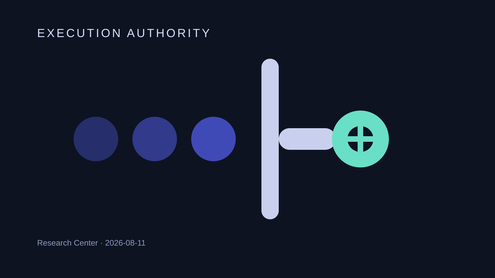
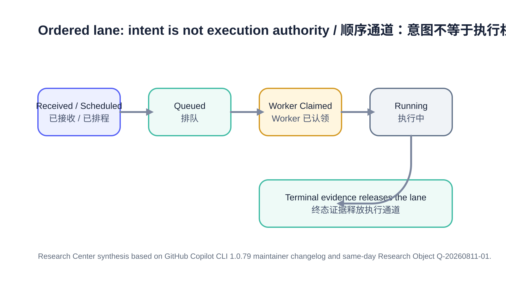

# Digital Employees Need an Explicit Execution-Authority Boundary

A timer firing, a user request arriving, or a queue entry existing does not mean a Digital Employee is authorized to begin side effects. The central runtime problem is therefore not only scheduling; it is deciding when received intent becomes **execution authority**.

## Cover

## Figure

## Summary

GitHub Copilot CLI 1.0.79 documents a useful boundary: prompts, shell commands and supported slash commands can arrive while a local-session task is already running, but they are queued and execute in order after the current task finishes. The same release separately supports multiple concurrent sessions. That combination is important: ordering is preserved inside an explicit execution identity, while concurrency is introduced by creating separate identities rather than by allowing hidden overlap inside one lane.

The Research Center judgment is stronger than “use a queue.” A production Digital Employee runtime should model at least `Received/Scheduled → Queued → Claimed → Running → Terminal`. The transition to **Claimed** is the authority boundary. A scheduler wake is demand; a worker claim is permission to execute.

## Source

The primary source is the maintainer-published GitHub Copilot CLI 1.0.79 changelog commit dated 2026-08-10:

- https://github.com/github/copilot-cli/commit/ef627e1baad937d3c8da45f8a5541c6fc3c97b6a

Production consumes only the completed same-day Research Object `Q-20260811-01` and its Reading Result. The changelog establishes released behavior but does not disclose the internal queue data structure or durable persistence semantics.

## Observation

The release documents three related mechanisms. First, new local-session work may be queued while current work continues; arrival and execution are therefore separate events. Second, multiple concurrent sessions are supported, so ordering is bounded by session identity rather than presented as one global queue. Third, MCP and language-server startup failures caused by the sandbox are turned into bounded failures instead of indefinite stalls, and `/sandbox policy` exposes effective policy rather than only configured intent.

Together these mechanisms point to a runtime discipline: one lane should have one current authority holder, blocking dependencies need bounded failure, and operators need evidence of the policy that was actually applied.

## Comparison

| Runtime fact | What it proves | What it does **not** prove | Evidence class |
|---|---|---|---|
| Timer fired / request arrived | Work exists | Permission to mutate state | Research Center interpretation from documented queue behavior |
| Item is queued | Work has an ordered position | Worker ownership or live progress | Documented behavior + interpretation |
| Worker explicitly claimed item | One execution identity owns the lane | Business success | Research Center architecture proposal |
| Running | Claimed work is active under a lease | Completion or freshness forever | Research Center architecture proposal |
| Terminal evidence | Lane can be released under a governed rule | Exactly-once external side effects | Research Center architecture proposal |
| Multiple sessions | Explicit concurrency boundaries exist | Global resource arbitration | Documented capability; arbitration unknown |

## Discussion

The dangerous design is to overload `Running`. If a scheduler changes a task to Running before any worker has actually claimed it, an operations page can display “working” while no execution is happening. The inverse is equally dangerous: if a later timer starts another task because its scheduled time has arrived, two nominal stages can run concurrently even though the earlier stage has not closed.

A safer model separates facts. `Wake Received` records that a scheduled trigger actually fired. `Queued` records pending intent. `Worker Claimed` records execution authority. `Running` is a renewable execution lease. A typed terminal state closes the lane and permits the next due item to be considered.

Concurrency should sit above this model, not inside it. Separate sessions, workers or workspaces can each own deterministic local ordering. Cross-lane side effects then require an explicit synchronization or custody contract rather than accidental overlap.

## Engineering Impact

For Digital Employee platforms, persist scheduler receipts and worker claims independently. Treat a scheduled time as a wake signal only. The Process Manager should grant one ordered lane at a time unless a separate execution identity has been explicitly created.

For CodeFlowMu, task arrival from ADMIN/PM and a scheduled Runtime wake should remain queue facts. The UI should show `Scheduled/Received`, `Waiting`, `Claimed`, `Running` and terminal states separately so an execution slot cannot masquerade as live worker progress. Startup dependencies such as MCP initialization should have bounded leases and explicit failure evidence.

For TMPA, the mechanism is useful evidence for distinguishing intent, custody, execution authority and terminal evidence, but one product changelog does not justify a protocol-level queue or persistence rule by itself.

## Boundaries and uncertainty

The source does not establish queue durability across restart, queue capacity, priority, starvation behavior, deduplication or failed-item semantics. It also does not define resource arbitration between concurrent sessions. Therefore the Research Center adopts the **ordering principle**, not an unsupported claim that Copilot CLI already provides restart-safe or exactly-once queue processing.

## Future Work

A product-grade runtime should test crash points between wake receipt, queue persistence, worker claim, tool start and terminal evidence. It should also define which terminal states release the next item after cancellation or partial external side effects, and whether execution authority belongs to one employee-wide lane or multiple role/workspace-scoped lanes.

## Visualization note

The cover uses a language-light gate metaphor that remains recognizable at thumbnail scale. The separate figure carries the ordered state model and bilingual labels. Both are Research Center originals; no vendor artwork or invented quantitative data is used.

## References

1. GitHub, Copilot CLI 1.0.79 maintainer changelog commit `ef627e1baad937d3c8da45f8a5541c6fc3c97b6a`, 2026-08-10: https://github.com/github/copilot-cli/commit/ef627e1baad937d3c8da45f8a5541c6fc3c97b6a
2. Research Center Research Object: `research/analysis/Q-20260811-01-execution-authority-ordered-work.md`
3. Research Center Reading Result: `research/reading/Q-20260811-01-ordered-local-work-queue.md`

> Editing status: PASS for Production Candidate. Facts, evidence boundary, terminology, bilingual structure and publication boundary checked; not published.
