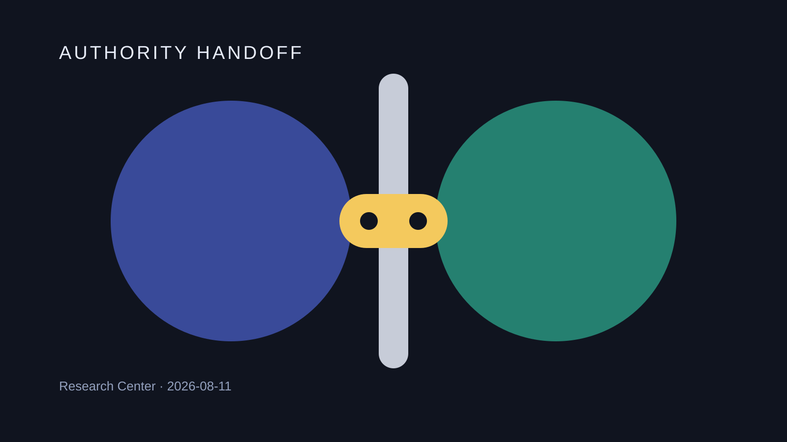
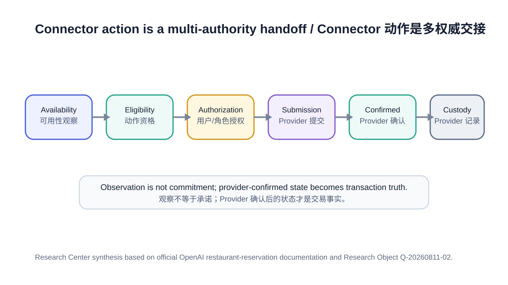

# 连接器动作需要受治理的权威交接

Agent 可以看到一个实时机会，却不一定拥有完成后续交易的权威。ChatGPT 的餐厅预约能力把这个边界展示得很清楚：推荐、实时可用性、动作资格、预约提交和最终预约记录，可能属于不同阶段，甚至属于不同系统。

## 题图

## 解释图

## 摘要

OpenAI 官方文档说明，ChatGPT 可以展示来自受支持第三方 Provider 的餐厅预约可用时间；只有当餐厅能够匹配到受支持的预约列表时，才会出现 Reserve 动作。进入预约流程后，用户仍然可以检查和修改人数、日期、时间等信息，然后再提交。预约完成后，第三方 Provider 才是确认、修改、取消以及账户问题的权威记录系统。

Research Center 的判断是：Connector Action 应当建模为**权威交接**，而不是一个 `tool_call -> success` 状态。一个可治理的动作生命周期至少应该区分：`Availability Observation → Action Eligibility → Authorization → Provider Submission → Provider-confirmed Outcome → External Custody`。

## 来源

主要一手证据来自 OpenAI 官方文档：

- ChatGPT Release Notes：https://help.openai.com/en/articles/6825453-chatgpt-release-notes
- ChatGPT Search Help：https://help.openai.com/en/articles/9237897-chatgpt-search

同日 Reading Result 记录了 2026-08-10 的预约能力更新，以及 Reserve Button、用户确认、Provider 确认和预约后归属边界。本次 Production 不推断官方没有披露的 Connector Protocol 或 API Guarantee。

## 观察

已记录的产品行为把“推荐”和“动作”分开。一个餐厅可以值得推荐，但如果 ChatGPT 无法把它匹配到受支持的预约 Provider，就不会出现 Reserve 动作。因此 Recommendation Eligibility 与 Action Eligibility 是不同状态。

可用时间本身也是时效性观察。官方文档明确提醒 Availability 会变化，所以显示一个时间槽并不等于已经形成持久承诺。

当 Reserve 可用时，用户进入预约流程，并可以在提交前调整信息。预约完成之后，ChatGPT 不保存预约作为权威记录；后续确认、修改、取消以及 Provider Account 问题都由外部预约 Provider 负责。

产品入口本身也是执行策略的一部分。官方说明该能力适用于受支持的 ChatGPT Surface，同时明确排除 ChatGPT Work。这说明是否可执行不仅由模型能力决定，还受到 Product Surface、Region、Identity 和 Provider Match 等政策输入约束。

## 比较

| 阶段 | 权威问题 | 典型权威主体 | 证据类型 |
|---|---|---|---|
| Availability Observation | “现在能看到这个时间吗？” | Reservation Provider 数据，经 ChatGPT 展示 | 官方产品文档 |
| Action Eligibility | “这个结果能否出现 Reserve？” | Product / Provider Match + Surface Policy | 官方文档 |
| Authorization | “是否允许提交这个预约？” | 用户确认或显式角色策略 | 官方用户流程 + Research Center 泛化 |
| Provider Submission | “请求是否真正发送给 Provider？” | Connector / Provider Boundary | Research Center 架构模型；协议未公开 |
| Provider-confirmed Outcome | “Provider 是否接受交易？” | Reservation Provider | 官方确认与支持边界 |
| Post-booking Custody | “之后由谁修改或取消？” | Reservation Provider | 官方文档 |

## 讨论

当 Connector Platform 把每一个成功的 Tool Return 都当成业务结果时，系统很容易产生错误语义。工具可以返回当前 Availability，却没有完成任何预约；它可以打开预约动作，但用户还没有授权提交；它可以提交请求，但 Provider 还没有确认接受；即使预约已完成，后续生命周期也可能已经转移到外部系统。

因此需要两组治理机制。第一，每一个有副作用的 Skill 都应该公开 Machine-readable Authority Descriptor：Observe、Propose、Submit 和 Lifecycle-manage 是四种不同能力。第二，每一个跨系统动作都应该产生 Handoff Receipt，至少记录 Provider Identity、内部 Occurrence ID、提交参数、Provider Confirmation/Error Reference 和当前 Custody Owner。

System of Record 的边界也应该直接体现在 UI 中。`Available`、`Actionable`、`Submitted`、`Confirmed` 不能被压缩成同一个“成功”标记。

## 工程影响

对于数字员工，所有副作用型 Connector Skill 应明确声明它属于 Read-only、Proposal-only、Submit-capable，还是能够管理后续生命周期。进入 Provider Submission 的边界必须由人类确认或显式 Role Policy 控制。

对于 CodeFlowMu，外部 Connector Action 应表现为受治理的 TASK / Tool Transition，而不是普通 Tool Return Text。内部 Task ID 与外部 Provider Transaction ID 应分开保存，Runtime Timeline 应区分 Candidate、Actionable、Submitted、Confirmed 等状态，避免把“看到机会”误认为“已经完成动作”。

对于 TMPA，这一案例是 Authority Transfer、Custody 与 Cross-system Evidence 的有效工程研究输入，但当前产品文档没有给出可以直接标准化的通用 Connector Protocol。

## 边界与不确定性

官方资料没有披露 Connector API、Authentication Model、Cache Strategy、Freshness SLA、Duplicate-submit Protection、Payment/Deposit Handling、Provider Login Flow 或 Consistency Guarantee。因此当前证据能够建立的是用户可见的权威边界，而不是完整交易协议。

## 后续研究

通用 Agent Runtime 需要定义一份最小 Handoff Receipt，并明确在真正提交之前如何重新验证已变旧的 Availability；当一个 Business 被多个 Provider 同时表示时，也需要定义本次动作的权威 Provider 选择规则。对于数字员工，还需要明确哪些岗位可以自主 Proposal、Submit、Modify 或 Cancel，哪些动作必须由人类确认。

## 可视化说明

题图使用“两侧权威域 + 单一交易 Token 穿越边界”的编辑性隐喻；正文解释图再单独呈现完整六阶段权威交接。两张图均为 Research Center 原创，不包含人为制造的量化数据。

## 参考资料

1. OpenAI，ChatGPT Release Notes，2026-08-10 餐厅预约可用性更新：https://help.openai.com/en/articles/6825453-chatgpt-release-notes
2. OpenAI，ChatGPT Search Help，Reserve 动作与预约流程说明：https://help.openai.com/en/articles/9237897-chatgpt-search
3. Research Center Research Object：`research/analysis/Q-20260811-02-connector-action-handoff.md`
4. Research Center Reading Result：`research/reading/Q-20260811-02-restaurant-reservation-action-handoff.md`

> Editing status: PASS for Production Candidate。Vendor Fact、Research Center Inference、Authority Boundary、双语结构与未发布边界已检查；当前仍未发布。
