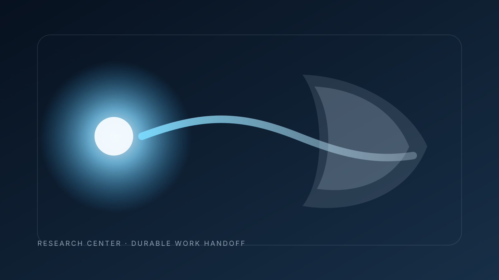

# 接受不等于持久化：持久 Agent 工作缺失的交接状态

工作队列常被当成“尚未完成工作的持久事实源”。但当 Runtime 在**执行接受**之后、而不是在**持久化完成**之后删除队列项时，这个假设就不再成立。所选实现变更明确暴露了这一区别：排队用户输入在 Core 接受其成为新一轮输入或转向输入时完成准入，随后队列项被删除；后续持久化发生在这个准入边界之后。［证据基础：`research/analysis/Q-20260812-01-acceptance-persistence-handoff.md`］

## 交接真正要回答的问题

关键不是“更早接受”是否一定优于“等持久化后再接受”，而是：**每一次确认究竟证明了什么事实？**

现有证据支持一个有边界的答案。Core 接受说明执行权已经转移到 Runtime；队列项删除因此表示“这项工作已被执行层接管”。它并不等于所有下游状态已经持久化，也不等于重启安全，更不等于端到端 Exactly-once。来源同时明确保留了外部副作用幂等、完整崩溃恢复等未被建立的能力边界。

这对长期运行的数字员工或 Agent Runtime 很重要，因为故障不会只发生在整齐的组件边界上。客户端可能在工作已被接受、但后续持久证据尚未形成时超时；进程可能在队列所有权已经释放后重启；下游 Hook 也可能在准入之后停止工作，却不把原队列项恢复回来。这些情况都不能再被解释成“工作从未被接受”。

## 两种确认，代表两种事实

如果系统把准入绑定在持久化之后，确认时通常拥有更强的持久交接点，但代价是准入延迟和失败语义与存储绑定得更紧。

如果系统把准入绑定在执行接受时刻，执行权边界更早，也更贴近 Core 真正承担责任的时点。但此时系统必须另外回答：**如果接受之后立刻发生故障，什么证据能够跨重启保留下来？**

因此，两种事件回答的是两个不同问题：

- **已接受：**现在由谁承担执行责任？
- **已持久记录：**发生重启或对账时，哪些证据仍然存在？

把这两个状态压成一个状态，会隐藏它们之间的歧义窗口，而歧义重试、重复执行争议和恢复错误往往就发生在这里。

## 歧义从哪里出现

假设客户端提交了一项排队工作，随后没有收到明确响应。如果队列项仍在，重试逻辑通常还能根据队列所有权判断下一步。如果 Core 已经接受并删除该项，队列就不再是“是否可以安全重放”的权威事实源。

此时 Runtime 需要另一个可核验状态。否则，客户端和调度器可能只知道“队列里已经没有这项工作”，却不知道这一次已接受的执行实例究竟完成、停止，还是需要恢复对账。

所以，“队列为空”不能升级解释成“工作已安全完成”。它只能建立更窄的事实：在所选实现路径中，队列所有权已经结束。任何更强的结论都会超出证据范围。

## 受治理的交接应该暴露什么

更稳健的持久架构应把交接暴露为至少两个独立状态转换。一种值得验证的设计假设，是在彻底放弃队列所有权之前或同时，持久化一条**已接受实例回执**，并为该次工作保留稳定的实例身份。

这条回执本身不会自动带来 Exactly-once。它的价值是让恢复逻辑拥有一个可以对账的持久对象。系统随后可以区分“已接受但尚未形成后续持久进度”“已接受且已持久记录”以及最终终态，而不必用一个状态代表所有事实。

由此可以得到三条一般工程要求：

1. 调度器与工作队列应分别暴露需求、执行接受和持久恢复证据；
2. 队列所有权转移后，重试策略必须明确新的权威状态来源；
3. 对存在歧义的重试，在声称可安全重放之前，应有稳定实例身份或对账证据。

这些是基于已观察交接语义形成的架构建议，不是来源已经实现的功能。

## 证据边界

当前证据只覆盖一个发生变更的排队用户消息路径及其测试，并不能定义通用 Agent 队列协议，也不包含独立故障注入研究；它没有建立跨重启去重，也没有建立任意外部副作用回滚。

对于把持久存储明确作为交接权威的系统，在准入前等待持久化仍可能是正确选择。对于天然可重放的工作，独立持久回执也未必值得其状态成本。真正需要避免的，不是选择某一个边界，而是让一个边界静默替代另一个边界的含义。

## Runtime 仍然必须回答的问题

在能够声称拥有完整恢复模型之前，至少还有三个问题没有解决：接受之后、后续持久化之前发生故障时，谁是驱动重放的权威状态？跨进程重启后，什么样的工作实例身份能够支撑歧义重试？已经被接受、但随后被下游 Hook 停止的工作，是否应拥有独立的持久终态？

因此，目前最稳妥、也最有工程价值的结论是：**执行接受可以先于持久完成证据转移执行权，而 Runtime 应把这两个事实分别建模和观测。**
